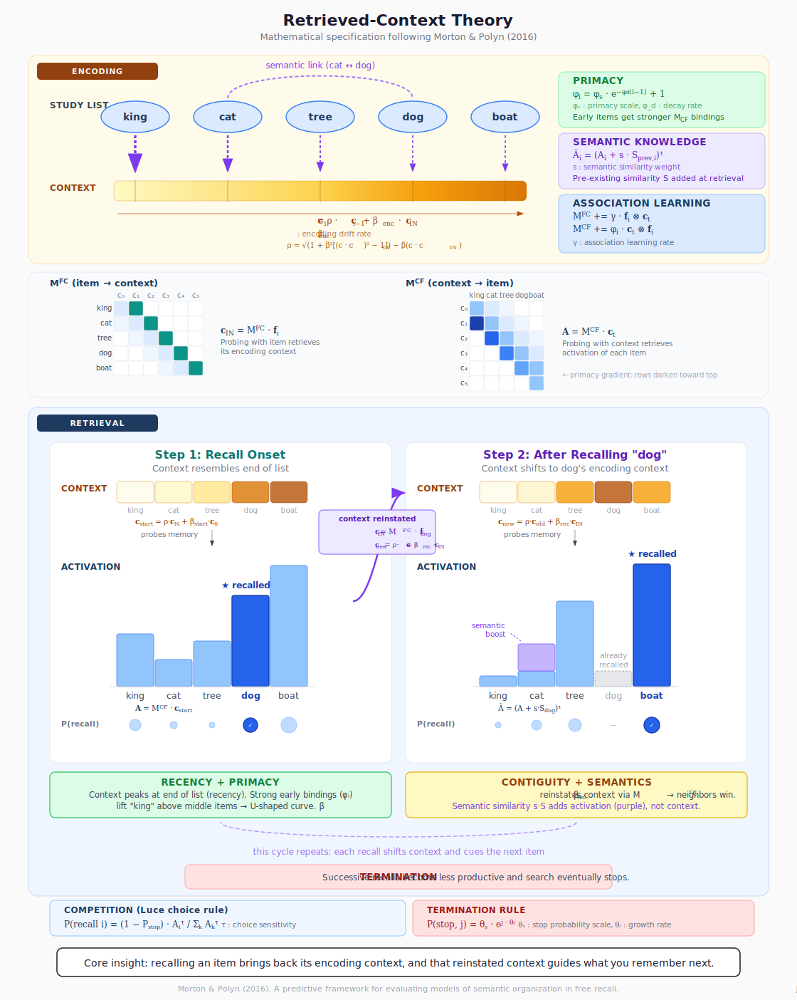

Recently (as part of prep for upcoming talks), I've been exploring AI tools' ability to help develop and iterate scientific diagrams so they're visually appealing and genuinely informative instead of just a pretty (or ugly) blob of shapes/text. I think I've found an approach that works around as well as, say, using an LLM to explore different ways to word a paragraph. Here's an explanation of the CMR model as presented in Morton & Polyn (2016) that I made while exploring:

{width="100%"}

Three tricks seem to make steady iteration feasible enough to actually save time/effort.

First, you can have LLMs primarily develop diagrams in the SVG format as opposed to PNG or other pixel-based formats. Unlike pixel-based formats, SVG uses a text-based syntax called XML to specify locations and other features of a set of objects to build a figure. This means LLMs can read and modify SVG files like code to change features based on your prompts. Current models seem to finally be really good at that.

Second, if your LLM is both multimodal and can execute code, you can have it render these SVGs as normal pixelated images (like PNGs) to then visually review and iteratively refine layout and other issues without you having to chime in yourself! This often (though not always) saves you the trouble of having to enumerate issues like these to the LLM and improves accuracy a lot.

Finally, a key feature of the SVG format compared to other formats is that SVG files are easy to clean up or repurpose manually. SVG files can be imported into software like Inkscape (open source), Adobe Illustrator (proprietary), or PowerPoint (proprietary) to then be given additional changes manually, including to details like text, shape size, positioning, and so on. You can also just open the `.svg` file in a text editor and hand-edit the XML directly --- adjust a coordinate, change a color, fix a label. Interestingly, plotting libraries like ggplot and matplotlib can also save figures as SVG, making them also editable by these AI and human means to clarify the lessons readers should take from them (such as by adding additional labels or highlighting specific elements).

There are of course many ways to generate diagrams with AI. Google's Nano Banana Pro tool in particular is considered state-of-the-art for image generation at the moment and has been advertised as a useful tool to visualize scientific information, especially in their NotebookLM tool. But I personally think two problems with this and similar tools are that 1) it's tough to make precise changes to the images when they inevitably don't match exactly what you want to convey (besides giving the AI a follow-up prompt), and 2) despite progress, the images still tend to exhibit visual signatures of AI generation that can be distracting or off-putting. An SVG-based loop seems to sidestep both these issues, achieving a similar level of steerability as you get from iterating on text where you can choose to take or leave parts of model outputs that you find good and true.
