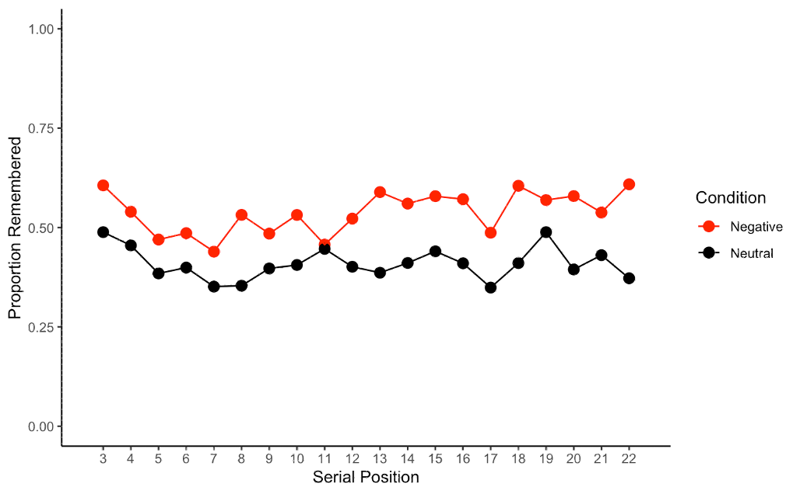
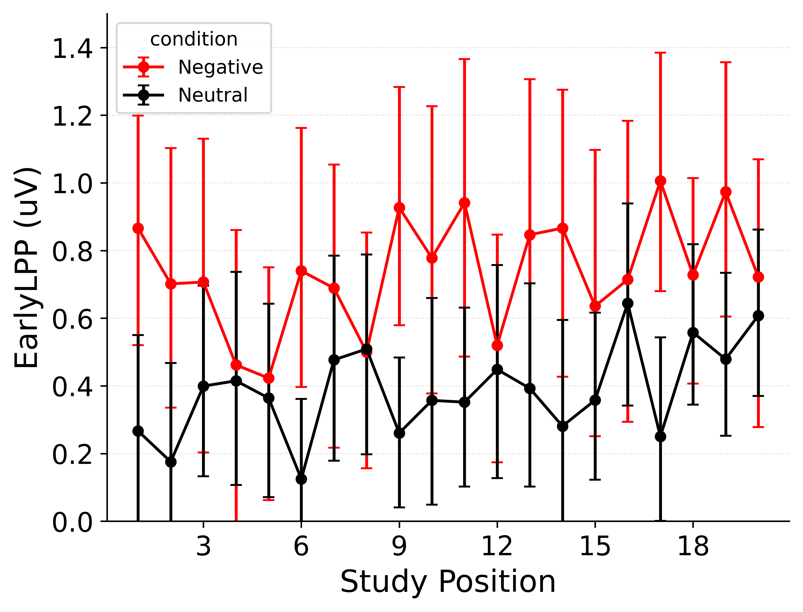
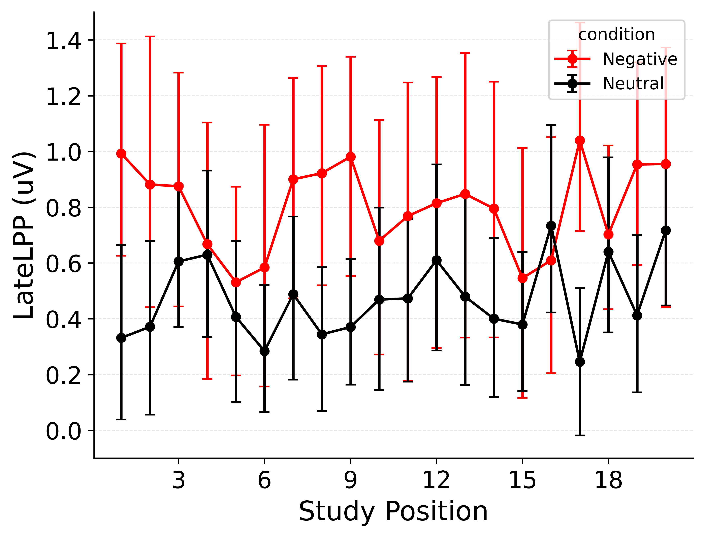

This document records our progress and key decisions as we build a brain-based version of eCMR using EEG data from Zarubin et al. (2020).

Prior analyses of the dataset provide two anchors. First, emotionally negative items are recalled more often than neutral items. Second, early LPP amplitudes during study predict subsequent recall of emotional items but not neutral items. These findings describe patterns relating neural signals and emotion to performance but do not in themselves explain how neural signals could mechanistically drive recall.

Computational neurocognitive modeling can bridge this gap.
These models formalize mechanistic hypotheses about how brain signals interact with cognitive processes to produce behavior.
From there, we can simulate how different mechanisms produce different behavioral patterns and score each model by how well it explains observed data.
When a model fits well, it provides a proof of concept that the proposed mechanisms can produce the observed behavior.
When a model fails to fit, it rules out the proposed mechanisms as insufficient explanations.
Differences in model fit can also adjudicate between competing theories.

Our present evaluation adapts LPP inputs within the retrieved-context framework of eCMR (Talmi et al, 2019), where learned item–context associations drive recall dynamics.
In this framework, emotional items bind to emotion-specific context features and attract more attention, increasing their odds of retrieval later.
We compare accounts of how LPPs modulate these processes.
By forcing LPP signals to operate through the model's internal dynamics and then evaluating how well the model fits observed recall data, we test not only whether LPPs correlate with recall but whether they drive recall through specific cognitive mechanisms.

## Data Preparation

The primary analysis table is `Single_Trial_Behavioural_and_EEG_Data_Z.csv` (`Z:\Talmi lab space\Archive\Secondary_Data_Analysis_Zarubin_From_Robin\Manuscript\files from robin nov24\`).
That table is identical across available copies in the lab server but omits study events lacking reliable EEG measures.
To restore those events, we merged it with the behavioral log `All_Included_Subjects.csv` (`Z:\Talmi lab space\Archive\Secondary_Data_Analysis_Zarubin_From_Robin\Data\Behaviour\Behaviour_csv_files\`), which contains recall status for every non‑buffer item but no LPP scores.
Prior to merging, we verified that recalled/not‑recalled labels are consistent across sources (e.g., no item marked "recalled" in the EEG file is marked "not recalled" in the behavioral log).

The merged dataset contains 6,840 study events from 342 list trials, with 20 analyzable items per list after trimming the two buffer positions.
Of these events, 371 (5.42%) lack EEG measurements.
Missingness is similar across valence conditions: negative lists contribute 125 of 2,266 events (5.52%; mean 0.37 ± 0.65 items missing per trial) and neutral lists contribute 246 of 4,574 events (5.38%; mean 0.72 ± 0.93 items missing per trial).
Overall, 202 of 342 lists (59.1%) include at least one missing LPP value; among affected lists, 1.84 ± 1.01 items are missing (median 2; maximum 6).
Across participants, missing exposure ranges from 2 to 19 items (3.9–10% of each person's 180 study events), making imputation methodologically substantive.

LPP amplitudes are imputed hierarchically.
For any study event still missing an LPP value after merging, the fill value is the participant's mean for items of the same emotion within the same trial.
This preserves within‑person, within‑trial, and emotion‑specific structure and avoids borrowing information across trials or valence conditions.

Each original list contained 22 items, but the first two positions were designated as primacy buffers to prevent primacy from confounding emotion–memory effects.
Those buffer items were excluded upstream, and their recall status is not recorded in the available materials.
Because the buffers cannot be recovered, lists are analyzed as 20‑item sequences.

The dataset records whether each item was recalled but not recall order.
Consequently, model fitting uses loss functions defined over the recalled set per trial rather than over output sequences.
This is accomodated in our likelihood-based evaluation by focusing on the probability assigned to the observed recalled set rather than the sequence in which items were recalled.

## Benchmarks

These checks do two things.
They verify that data preparation worked.
They also set clear targets for model development.
Unless noted, error bars show 95% bootstrapped confidence intervals across participants.
We may switch to hierarchical (subject and trial level) confidence intervals later to better account for data structure.

```{=html}
<!-- 
#TODO: switch to hierarchical confidence intervals over subjects *and* trials.
-->
```

### The Emotional Enhancement of Memory

The main behavioral phenomenon we address is the emotional enhancement of memory (EEM): emotionally negative items are recalled more often than neutral items.
We primarily benchmark EEM using a categorized serial position curve (Category-SPC).
For each study position (1–20), we compute the recall rate separately for emotional and neutral items.
We find that emotional items are recalled more often than neutral items across nearly all study positions, replicating prior findings.
This same analysis appears in the "Meeting with Nathaniel Daw" slides on the lab drive, providing a basis for validating our data preparation.

::: {#fig-reference_catspc layout-ncol="2"}



Recall rate by study position and item type from reference materials (LEFT) and from the present dataset (RIGHT).
:::

### Higher Late Positive Potential (LPP) for Emotional Items

A key neural benchmark is that LPP amplitudes are higher for emotional items than for neutral items.
We visualize this pattern by plotting LPP amplitudes as a function of study position and item type.
We draw separate plots for Early LPP (400–700 ms) and Late LPP (700–1,000 ms).
We find that both Early and Late LPP vary with emotionality across positions.
This result suggests that LPP amplitudes may be able to decode item type within neurally informed models even when item type is not explicitly provided.
However, error bars are large and mean values swing widely across positions, so the signal certainly does not perfectly differentiate emotional and neutral items (unless our labeling of item type is itself noisy).

::: {#fig-cat_lpp_spc layout-ncol="2"}




LPP amplitude by study position and item type for Early LPP (LEFT) and Late LPP (RIGHT).
:::

### LPP Predicts Subsequent Recall for Emotional Items but Not Neutral Items

Finally, we benchmark the relationship between LPP amplitudes and subsequent recall.


## Appendix: Additional Analyses

