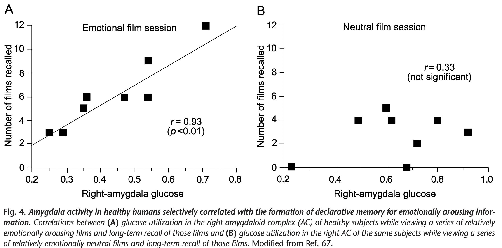

# Is the Amygdala a Locus Viewpoint of “Conditioned Fear”? Some Questions and Caveats

Brain focused literature review?

> Considerable evidence suggests that the amygdala is not a site of long-term explicit or declarative memory storage, but serves to influence memory-storage processes in other brain regions, such as the hippocampus, striatum and neocortex.

> Human-subject studies confirm the prediction of animal work that the amygdala is involved with the formation of enhanced declarative memory for emotionally arousing events.

> Some psychological accounts suggest that emotional events are better remembered because they are novel, focus attention, or are often rehearsed. Such hypotheses have failed fully to account for the experimental findings.

This is a pretty interesting claim.
I'd like to see more details on why these hypotheses have failed to account for the findings.
Maybe a dissociation between arousal and attentional consequences for memory?
Cites a whole book, so harder to track down.

> Other accounts focus on emotional responses learned through Pavlovian conditioning, and much is known about brain processes mediating the expression of fear3,4. However, explanations based solely on Pavlovian conditioning of emotional responses are likely to be insufficient because emotionally influenced memories generally involve declarative knowledge and are not restricted to evocation of learned emotional responses. Furthermore, Pavlovian conditioning can be dissociated from declarative-memory formation.

Sure, I'm interested in emotional *episodic* memory. The link between episodic memory and Pavlovian conditioning is interesting though. Not really a target of my projects anyway though.

> The evidence summarized here supports the view that specific hormonal and brain systems activated by emotional arousal regulate long-term memory storage.

Sure, that would differentiate emotional memory from other effects on memory like attention and rehearsal. But it still seem possible that emotion enacts its effects on memory through attention and rehearsal.

> An impressively broad array of experimental evidence either directly supports, or is consistent with the hypothesis that stress-hormone systems and the AC are key components of an endogenous memory modulating system. Generally inactive in unemotional learning situations, this system is activated during and after an emotionally arousing event and appears to regulate declarative-memory storage processes in other brain regions (Fig. 5). This mechanism aids in the selection of long-term memories on which, according to William James, our mental ship rides.

Vague about behavioral consequences.

Key idea not necessarily embraced by CMR: "Long-term memories are not made instantaneously: they consolidate over time after learning."

The broad idea is that "the adrenal hormones adrenaline and
corticosterone" both aid immediate response to stressful events (it's important to clarify how if they might have memory consequences) and also "enhance declarative memory of the arousing experience".

"adrenaline enhanced memory only when administered shortly after training, that is, at the time when it would normally be released by the aversive stimulation (footshock) used in the training." (Key to note that this is citing another paper.)

That's interesting, and seems like the inverse of the tetris effect where visuo-spatial tasks after an arousing experience diminishes its likely to become consolidated as an intrusive memory.

How would these ideas be fit into a retrieved-context model? Initial thought is that it could be something to do with persistence of features in context. Maybe emotional experiences persist longer in context, leading to broader associations? This is a possible explanation of how emotional memories are more accessible, but not for why differences in features of post-encoding events would affect accessibility. 

One idea is that strong distraction specifically clears out context in a way control conditions don't. If learning occurs at regular timesteps or event transitions, the faster context drifts out the details of an emotional event, the weaker and less accessible the memory. So we propose that emotional events persist longer in context, and that distraction countervails this persistence. We would predict a similar disruption of neutral memories if this were it, too. As a corrollary, we maybe expect emotional memories to be the most robust if participants are left alone to ruminate after an emotional event.

Still, key thing highlighted in this paper that seems echoes later is that experiences *after* an emotional event can affect its consolidation via hormonal mechanisms unique to emotional events. Jury still out on whether the phenomenon can nonetheless be addressed in terms of attention or rehearsal or "persistence in context" or whatever.