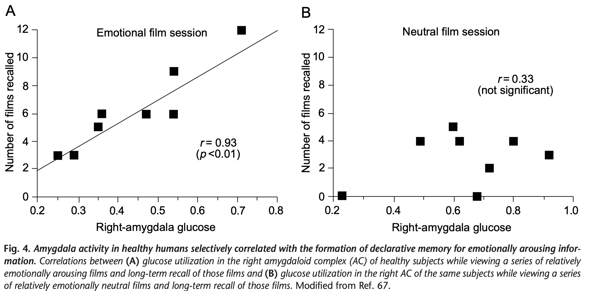

# CahillMcGaugh1999

Brain focused literature review? 

Considerable evidence suggests that the amygdala is not a site of long-term explicit or declarative memory storage, but serves to influence memory-storage processes in other brain regions, such as the hippocampus, striatum and neocortex. Human-subject studies confirm the prediction of animal work that the amygdala is involved with the formation of enhanced declarative memory for emotionally arousing events.

Some psychological accounts suggest that emotional events are better remembered because they are novel, focus attention, or are often rehearsed. Such hypotheses have failed fully to account for the experimental findings.

> This is a pretty interesting claim. I'd like to see more details on why these hypotheses have failed to account for the findings. Maybe a dissociation between arousal and attentional consequences for memory? Cites a whole book, so harder to track down.

Other accounts focus on emotional responses learned through Pavlovian conditioning, and much is known about brain processes mediating the expression of fear3,4. However, explanations based solely on Pavlovian conditioning of emotional responses are likely to be insufficient because emotionally influenced memories generally involve declarative knowledge and are not restricted to evocation of learned emotional responses. Furthermore, Pavlovian conditioning can be dissociated from declarative-memory formation.

> This is useful and very understandable logic. But it doesn't necessarily provide a unique cognitive explanation. It merely suggests that underlying systems for linking emotions to memories could be different for behavioral responses vs declarative memories.

The evidence summarized here supports the view that specific hormonal and brain systems activated by emotional arousal regulate long-term memory storage.

> But how? Or is the claim simply that there are mechanisms based in the amygdala and specific to the enhancement of declarative memory by emotional arousal?

An impressively broad array of experimental evidence either directly supports, or is consistent with
the hypothesis that stress-hormone systems and the AC are key components of an endogenous memory
modulating system. Generally inactive in unemotional learning situations, this system is activated during and after an emotionally arousing event and appears to regulate declarative-memory storage processes in other brain regions (Fig. 5). This mechanism aids in the selection of long-term memories on which, according to William James, our mental ship rides.