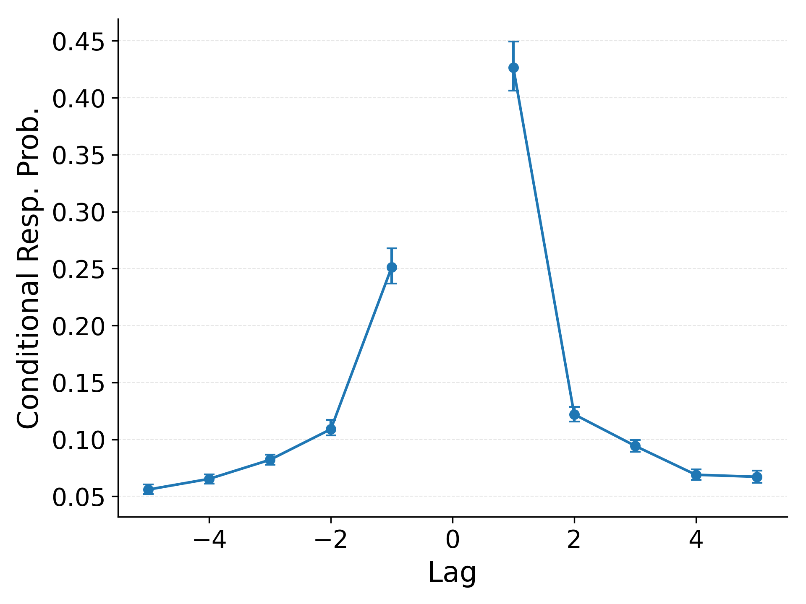
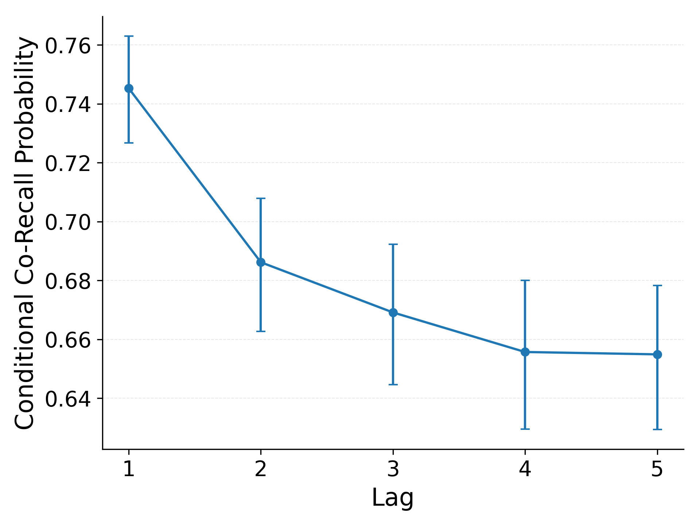
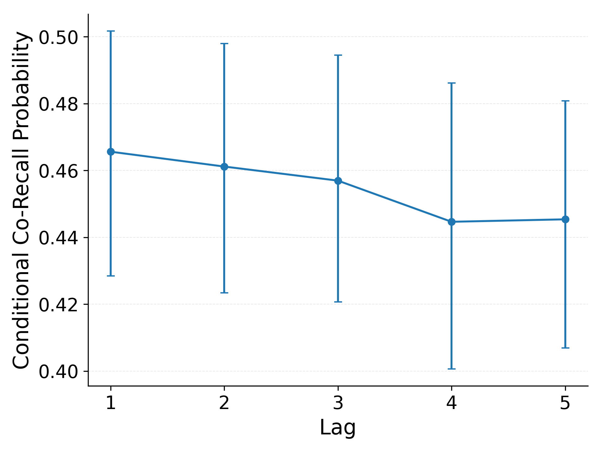

This document records our progress and key decisions as we build a brain-based version of eCMR using EEG data from Zarubin et al. (2020).

Prior analyses provide two anchors. First, emotionally negative items are recalled more often than neutral items. Second, late positive potential (LPP) amplitudes during study predict later recall for emotional items but not neutral items. These patterns relate brain signals and emotion to performance but do not specify mechanisms that generate recall.

We address this with computational neurocognitive models that formalize hypotheses about how LPPs interact with attention and context binding at encoding.
We simulate trials and score models by the likelihood they assign to the full recalled set on each list, asking how probable the observed data are under each mechanism as specified. 
Good fits provide evidence that a mechanism can produce the behavior; poor fits indicate the specification is insufficient.

Our evaluation instantiates these hypotheses within the retrieved-context framework of eCMR (Talmi et al., 2019), where item–context associations guide recall. 
Emotional items bind more strongly to emotion-specific context and attract more attention, increasing their odds of retrieval. 
We compare ways LPPs could modulate these processes and assess which specification renders the observed recalled sets most probable, moving beyond correlation toward mechanism.

## Data Preparation

The primary analysis table is `Single_Trial_Behavioural_and_EEG_Data_Z.csv` (`Z:\Talmi lab space\Archive\Secondary_Data_Analysis_Zarubin_From_Robin\Manuscript\files from robin nov24\`).
That table, identical across server copies, omits study events that lack reliable EEG measurements.
To restore those events, we merged it with the behavioral log `All_Included_Subjects.csv` (`Z:\Talmi lab space\Archive\Secondary_Data_Analysis_Zarubin_From_Robin\Data\Behaviour\Behaviour_csv_files\`). This log contains no LPP scores but records recall status for all study events beyond a primacy buffer of the first two items per list.
Recall data for buffer items were excluded by the original authors to avoid confounding primacy effects with emotion–memory effects.
Unfortunately, recall data for buffer items cannot be recovered; accordingly, lists are analyzed as 20‑item sequences, despite originally being 22 items long.

Before merging, we verified label consistency across sources, confirming there were no conflicts in recalled versus not-recalled designations.
The merged dataset comprises 6,840 study events from 342 list trials with 20 analyzable items per list.
Of these events, 371 (5.42%) lack EEG measurements.
Missingness is comparable across valence conditions: negative lists contribute 125 of 2,266 events (5.52%; mean 0.37 ± 0.65 items missing per trial) and neutral lists contribute 246 of 4,574 events (5.38%; mean 0.72 ± 0.93 items missing per trial).
Overall, 202 of 342 lists (59.1%) include at least one missing LPP value; among affected lists, 1.84 ± 1.01 items are missing (median 2; maximum 6).
Across participants, missing exposure ranges from 2 to 19 items (3.9–10% of each person's 180 study events), so imputation methodologically substantive.

LPP amplitudes are imputed using within-person, within-trial emotion-matched means.
For any study event still missing an LPP value after merging, we fill that participant's average for items of the same emotion within the same trial.
This preserves within‑person, within‑trial, and emotion‑specific structure and avoids borrowing information across trials or valence conditions.

The dataset indicates which items were recalled but not their order. 
Accordingly, model fitting must use loss functions defined over the recalled set per trial, and our likelihood-based evaluation scores models by the probability they assign to the observed recalled sets rather than to output sequences.
Similarly, analyses of recall structure cannot use standard measures like lag-CRP that require output order; we therefore develop an order-agnostic alternatives with similar interpretive goals.

## Benchmark Analyses

These benchmarks both define concrete targets for model development and verify that data preparation preserved known effects.
Unless noted, error bars show 95% bootstrap confidence intervals across participants.

<!--#TODO: We may switch to hierarchical (subject and trial level) confidence intervals later to better account for data structure.-->

### Emotional Items Are Recalled More Often

The central behavioral pattern is the emotional enhancement of memory (EEM): emotionally negative items are recalled more often than neutral items.
We benchmark EEM with a categorized serial position curve (Category-SPC).
For each study position (1–20), we tabulate recall rates separately for emotional and neutral items.
Emotional items are recalled more often across all study positions, replicating the reference analysis used in the Daw meeting slides and confirming our data pipeline.
Effect summary: mean recall difference (emotional – neutral), averaged across positions = 0.125, 95% CI [0.090, 0.162]; positions with emotional > neutral = 20/20.

::: {#fig-reference_catspc layout-ncol="2"}

Recall rate by study position and item type from reference materials (LEFT) and from the present dataset (RIGHT).
:::

### LPP Is Higher for Emotional Items

We examine LPP amplitudes by study position and item type, separately for Early LPP (400–700 ms) and Late LPP (700–1,000 ms). 
In both windows, mean LPPs are higher for emotional items than for neutral items across positions. 
However, variability is large and position-wise means fluctuate, so distributions overlap substantially; this motivates treating LPP and item type as distinct signals.
Effect summary: mean Early-LPP difference (emotional − neutral) across positions = 0.405 µV, 95% CI [0.280, 0.516]; Late-LPP difference = 0.354 µV, 95% CI [0.219, 0.484]; standardized difference (Cohen's d_Early, d_Late) = 0.23, 0.18.

::: {#fig-cat_lpp_spc layout-ncol="2"}

LPP by study position and item type. Early window (LEFT), Late window (RIGHT).
:::

### LPP Predicts Recall More Strongly for Emotional Items

To relate LPP to behavior, we plot LPP by study position and recall status, drawing separate plots by item type and LPP window [@fig-cat_lpp_by_recall_split].
The clearest separation is in the Early window for emotional items: recalled emotional items show higher Early LPPs than unrecalled emotional items. 
For neutral items, the recalled vs unrecalled difference is small. 
Thus, Early LPP is clearly related to recall for emotional items, whereas any effect for neutral items is small and not statistically reliable.
Effect summary: EEarly-LPP difference (recalled − unrecalled) for emotional items = 0.43 µV, 95% CI [0.27, 0.58]; for neutral items the corresponding estimate is 0.10 µV, 95% CI [−0.07, 0.28], consistent with at most a weak effect.
Late-window differences (emotional, neutral) are smaller: 0.20 µV [0.04, 0.38] and 0.03 µV [−0.14, 0.20], respectively.

::: {#fig-cat_lpp_by_recall_split layout-ncol="2"}

LPP by recall status and item type: Early LPP (TOP row) and Late LPP (BOTTOM row), split by NEGATIVE items (LEFT) and NEUTRAL items (RIGHT).
:::

In @fig-cat_lpp_by_recall, we superimpose Early-LPP curves to highlight joint structure.
Recalled emotional items have the highest Early LPPs.
Unrecalled emotional items overlap with both recalled and unrecalled neutral items.
Two simple linking stories are inconsistent with this pattern.
First, if LPP simply reflected item type, recalled and unrecalled items of the same type would have similar LPPs; instead, recall status clearly separates Early LPP within the emotional condition. 
Second, if LPP simply reflected recall probability, recalled items across item types would align; instead, recalled emotional items have higher LPPs than recalled neutral items.
Neither pattern holds, indicating an interation between LPP and item type.

::: {#fig-cat_lpp_by_recall }

Early LPP by recall status and item type. CIs omitted for clarity; data pooled across participants.
:::

Finally, we summarize Early-LPP contrasts with mean differences and 95% confidence intervals in @fig-early-lpp-contrasts.
The pairwise contrasts underscore that Early LPP peaks only when both emotion and later recall line up. 
Recalled emotional items sit significantly above every other group, and unrecalled emotional items are elevated relative to unrecalled neutral items. 
In contrast, recalled vs unrecalled neutral items do not differ reliably.
Together, these contrasts indicate that Early LPP is not well described as a pure "emotion tag" (since recall status matters within item type) or a pure "recall tag" (since item type matters within recall status). Instead, Early LPP reflects both item type and subsequent recall, with the largest elevations for recalled emotional items.

:::{#fig-early-lpp-contrasts}

| Contrast | Δ Early LPP (µV) | 95% CI (µV) | Note |
| --- | --- | --- | --- |
| E\_recalled – E\_unrecalled | 0.43 | [0.27, 0.57] | sig. |
| E\_recalled – N\_recalled | 0.55 | [0.37, 0.71] | sig. |
| E\_recalled – N\_unrecalled | 0.64 | [0.50, 0.80] | sig. |
| E\_unrecalled – N\_recalled | 0.12 | [-0.08, 0.31] | n.s. |
| E\_unrecalled – N\_unrecalled | 0.22 | [0.06, 0.36] | sig. |
| N\_recalled – N\_unrecalled | 0.10 | [-0.07, 0.28] | n.s. |

Early LPP contrasts (mean ΔµV with 95% CIs).
:::

<!-- TODO: add another figure that shows cat_lpp_by_recall pooled across item types? -->

#### Statistical Cross-Check
Prior work using generalized mixed-effects models provides an alternative perspective on these relationships.
@fig-reference_gmm predicts recall via a logistic link from condition (emotional vs. neutral), Early LPP, and their interaction.
It shows significant main effects of both factors and a significant interaction.
This aligns with the plots: a baseline recall advantage for emotional items, an additional boost from early LPP, and a stronger LPP effect for emotional items than for neutral items.

::: {#fig-reference_gmm}

Description of a generalized mixed effects model predicting recall as a function of condition, earlyLPP, and their interaction.
:::

### Recall Sets Show Limited Temporal Clustering

Classic work on free recall shows that successive recalls tend to come from nearby study positions, a temporal contiguity effect. 
Standard analyses quantify this with the lag-conditional response probability (lag-CRP), which requires recall order. 
Because recall order is unavailable in the present EEG dataset, we developed an order-agnostic alternative that asks a closely related question: given that a studied item was recalled, how likely is it that items at nearby study positions were also recalled?

For each list, each recalled item at position $i$, and each absolute lag $d = 1,\dots,19$, we examine the item at position $(i+d)$ (when it exists) and estimate the conditional co-recall probability,

$$
\text{CoRec}(d) = P(r_{i+d}=1 \mid r_i=1,\ |j-i|=d),
$$

as the probability that the item at lag $d$ is recalled given that the reference item at position $i$ is recalled. Averaging $\text{CoRec}(d)$ across lists yields an order-agnostic temporal contiguity curve that parallels the lag-CRP but does not require output sequences.

To validate this measure, we first applied it to a dataset where recall order is available. 
For this comparison we used a subset of PEERS [@healey2014memory]: 126 participants aged 17–30 completed 112 trials in which they studied lists of 16 unique words and then immediately recalled them. Words were sampled without replacement from the Toronto Word Pool [@friendly1982toronto], a set of high-frequency nouns, adjectives, and verbs with low interitem similarity. 
The left panel of @fig-peers_lagcrp_condcorec shows the standard lag-CRP for this dataset, with a strong contiguity effect: recall transitions are most likely at lag +1, somewhat less likely at lag −1, and fall off rapidly for larger $|lag|$. 
The right panel shows the corresponding conditional co-recall curve $\text{CoRec}(d)$, collapsed over lag sign. 
Conditional co-recall is highest for short lags and decreases steadily with distance, closely mirroring the lag-CRP gradient despite ignoring recall order. 
These results confirm that the conditional co-recall analysis is sensitive to temporal contiguity when it is present.

::: {#fig-peers_lagcrp_condcorec layout-ncol="2"}

Standard lag-CRP (LEFT) and order-agnostic conditional co-recall by lag (RIGHT) for a subset of the PEERS dataset [@healey2014memory]. The conditional co-recall curve reproduces the short-lag advantage observed in the lag-CRP despite not using recall order information.
:::

We then applied the same conditional co-recall analysis to the Zarubin EEG dataset. 
As shown in @fig-zarubin_condcorec_by_lag, the conditional co-recall curve is nearly flat: items at lag 1 are only slightly more likely to be recalled than items at lags 4–5, and the difference is small relative to the bootstrap confidence intervals.
In contrast to the PEERS subset, this paradigm therefore shows at most a weak temporal contiguity effect in recall sets, and provides only limited constraint on the temporal-context dynamics in our models.

::: {#fig-zarubin_condcorec_by_lag}

Order-agnostic conditional co-recall by lag for the Zarubin EEG dataset. Conditional co-recall probabilities vary little with lag, indicating weak temporal clustering of recalled items in this paradigm.
:::

### Implications for Model Development

Taken together, these benchmarks place clear constraints on any mechanistic account of how LPP relates to emotion and memory.
Item type and LPP must be treated as distinct inputs whose effects interact: emotional items enjoy a baseline recall advantage (EEM), and Early LPP further modulates recall likelihood, with a much stronger association for emotional items than for neutral items.
The mixed-effects cross-check confirms this pattern, showing main effects of condition and Early LPP as well as a significant interaction.

In particular, @fig-cat_lpp_by_recall and @fig-cat_lpp_by_recall_split argue against two simple linking hypotheses about how LPP relates to item type and recall.
The first is that LPP is essentially an emotion index: emotional items have higher LPPs, and this graded “emotion strength” drives their recall advantage.
We do observe higher average LPPs for emotional than neutral items, but distributions overlap substantially.
Moreover, if LPP simply encoded item type, recalled and unrecalled items of the same type should show similar LPPs.
Instead, within both emotional and neutral items, LPPs split by recall status diverge, and unrecalled emotional items overlap strongly with both recalled and unrecalled neutral items.

A second simple hypothesis is that LPP is essentially a recall index: items with higher LPPs are more likely to be recalled, regardless of item type.
If that were the case, recalled items across types should have similar LPPs, and unrecalled items across types should likewise align.
This also does not hold: within each recall status, emotional and neutral items differ in LPP, with recalled emotional items showing the highest values.
Rather than cleanly tracking emotion alone or recall alone, LPP amplitude depends on both item type and subsequent recall, with a stronger predictive relationship for emotional items.
In modeling terms, this motivates treating item type and LPP as distinct, interacting influences on recall: models that collapse LPP into a pure "emotion strength" signal or a pure "recall strength" signal risk mispredicting either unrecalled emotional items or recalled neutral items.

Our conditional co-recall analysis is the only benchmark that directly targets temporal context.
When validated on a standard free-recall dataset (PEERS), the same measure produces a steep contiguity gradient that closely tracks the lag-CRP, which confirms that it is sensitive to temporal clustering when such clustering is strong.
In the Zarubin EEG dataset, by contrast, the conditional co-recall curve is nearly flat, and any short-lag advantage is small compared to what is observed in classic free-recall paradigms.
This pattern indicates that temporal clustering, if present in this task, is much weaker than in standard free recall and is unlikely to be the main determinant of which items are recalled.
This outcome does not necessarily surprise given the task design, which includes strong semantic and emotional clustering forces that can compete with and overshadow temporal context effects.
We therefore do not use these data to draw detailed conclusions about how temporal context evolves or about how LPP modulates temporal-context dynamics.

Within this setting, the role of modeling is to bridge the gap between these descriptive relationships and a cue-dependent, competitive retrieval process.
The mixed-effects model tells us that recall varies approximately linearly with item type, LPP, and their interaction, but it does not specify how these predictors should enter an encoding rule or how they propagate through retrieved-context dynamics to shape recall sets.
In the next section, we use an eCMR-style model to ask whether simple encoding rules that combine emotion and LPP can reproduce the observed benchmarks once they are embedded in a full retrieval process.
In particular, we will test whether a linear learning-rate rule with Emotion, LPP, and their interaction remains compatible with the behavioral and EEG constraints when run through eCMR.
We also test whether the observed LPP × emotion pattern can be captured by main-effect LPP terms together with nonlinear competitive dynamics, or instead requires an explicit interaction term at encoding.
Finally, we show that models omitting LPP, emotion, or both fail to reproduce the observed recall sets and key benchmarks, confirming that both signals are necessary to explain the data in this framework.
We then discuss these results and their theoretical implications in the final section, highlighting limitations and directions for future work.

## 

## Appendix

### LPP by Item Type and Recall Status

::: {#fig-amplitude_by_cat_by_recalled}

LPP by time, recall status, and item type.
:::

### Recall Rate by Early LPP

This analysis is deprecated. 
It binned items by LPP amplitude within item category and plotted recall rates per bin to check whether LPP predicts recall beyond the emotional/neutral label. Bins were defined by percentiles of the pooled LPP distribution, and results were shown separately for Early LPP (400–700 ms) and Late LPP (700–1,000 ms). 
LPP values were the provided z‑normalized amplitudes computed per electrode and trial by subtracting the −200–0 ms baseline and dividing by the baseline SD (so values are on a mean‑0, SD‑1 scale). 
An earlier plotting bug set a participant’s bin value to zero when they contributed no items to that bin, which biased sparse bins downward; this has been fixed by excluding empty participant–bin cells from the proportion and confidence‑interval calculations. 
The reference figure displays lines predicted by a generalized mixed‑effects model of recall as a function of LPP and item category, whereas the current plot shows empirical proportions within bins; the two approaches diverge most at distribution tails where data are sparse.

As seen in @fig-cat_recall_by_early_lpp, recall rates rise with Early LPP for emotional items and are comparatively flatter for neutral items.
Observations were distributed unevenly across bins (see count panels in @fig-cat_recall_by_lpp_counts).
Because there are more neutral than emotional items overall, neutral items appear more frequently in every LPP bin. 
However, since recall rates are proportions within bin, this does not bias the curves.
Still, wide intervals at extreme LPP values reflect very low occupancy in those bins (and thus high uncertainty about recall rates there).

::: {#fig-cat_recall_by_early_lpp layout-ncol="2"}

Recall rate by Early LPP amplitude and item type in reference materials (LEFT) and in the present dataset (RIGHT).
:::

We deprecate this analysis because binning introduces instability and comparability problems: tail bins above roughly 4.86 and below −3.25 contain few observations, global percentile bins balance totals but not per‑category counts, and bin‑edge choices can change the apparent trend without changing the underlying data. 
Rather than redefine or stabilize the binning procedure, we opt to retire it.
For inference and model development we instead rely on unbinned methods (generalized mixed‑effects models and likelihood‑based evaluation of full recalled sets) and on visualizations that condition on recall status without binning (e.g., @fig-cat_lpp_by_recall_split).
The plots are retained only as qualitative checks against the reference analysis.

::: {#fig-cat_recall_by_lpp_counts layout-ncol="2"}

Counts of observations per bin for Early LPP (LEFT) and Late LPP (RIGHT).
:::
