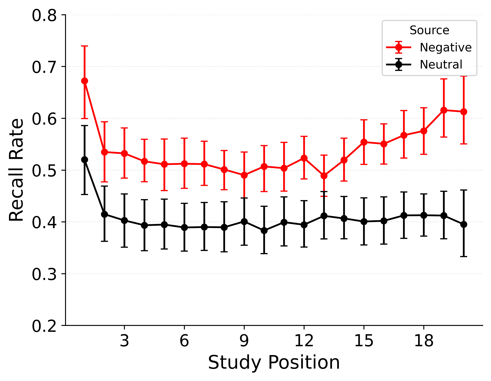
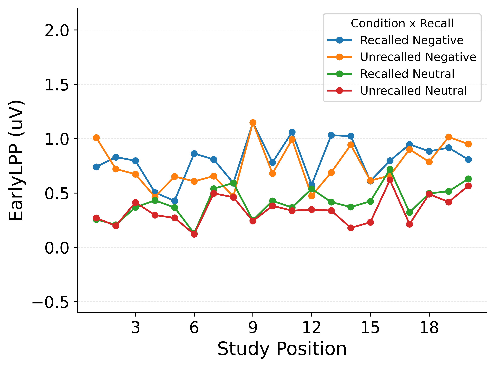
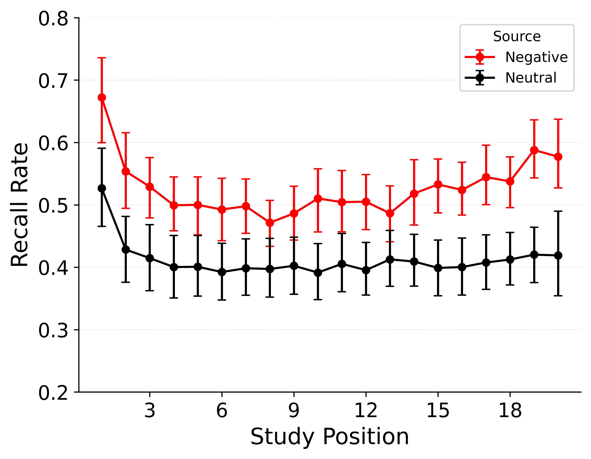
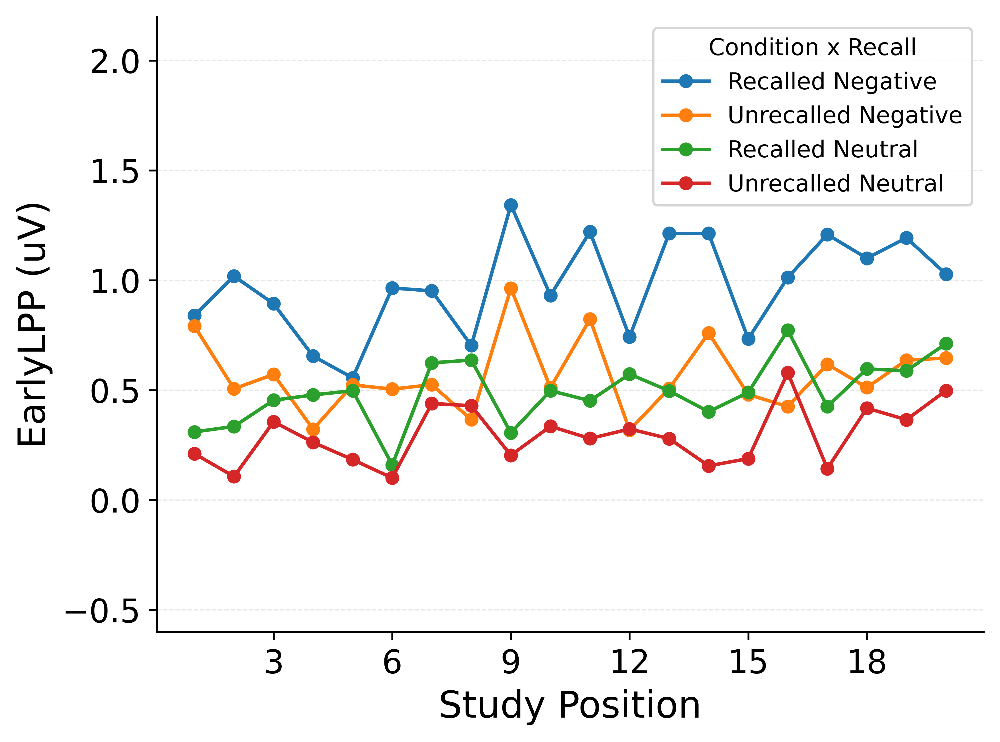
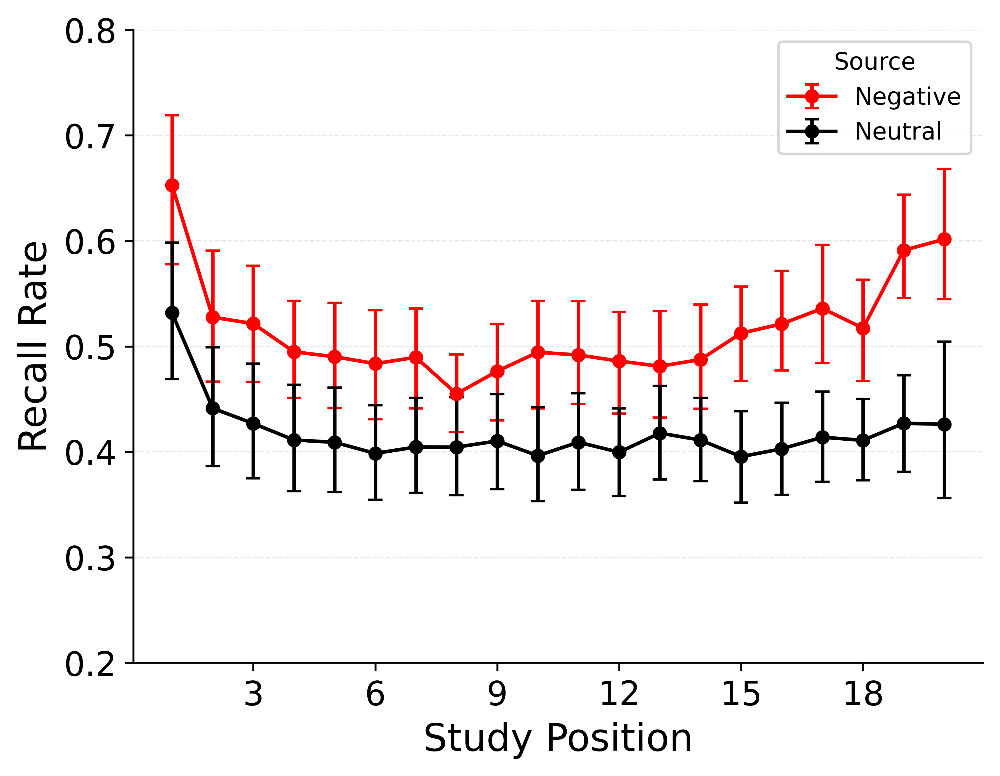
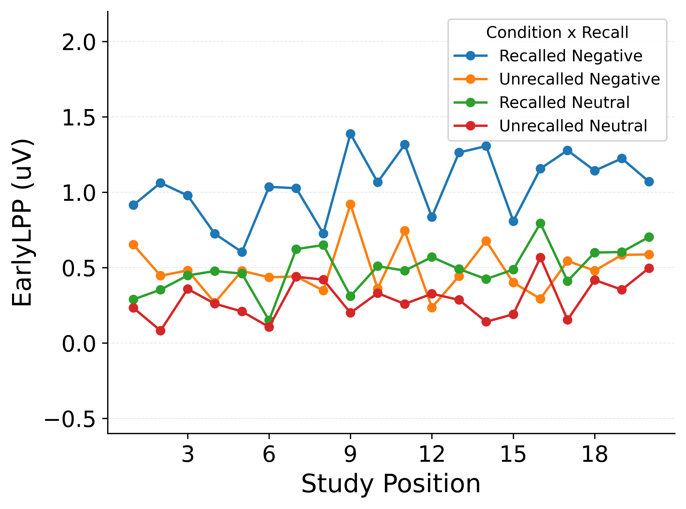

# Formal Modeling

Taken together, these benchmarks place clear constraints on any mechanistic account of how LPP relates to emotion and memory.
Item type and LPP must be treated as distinct inputs whose effects interact: emotional items enjoy a baseline recall advantage (EEM), and Early LPP further modulates recall likelihood, with a much stronger association for emotional items than for neutral items.
The mixed-effects cross-check confirms this pattern, showing main effects of condition and Early LPP as well as a significant interaction.

These constraints motivate treating item type and LPP as interacting influences on encoding or retrieval while keeping temporal context effects modest in scope.
The mixed-effects cross-check supports this view (main effects plus interaction) but does not specify how the predictors should enter an encoding rule or propagate through retrieved-context dynamics to shape recall sets.

In the next section, we focus on three closely related eCMR variants that directly address whether LPP adds explanatory value beyond emotion labels and whether that value differs by item type.
We compare an emotion-only model (no LPP input), a model with a single LPP slope shared across items, and a model with an additional LPP slope for emotional items.
These comparisons test whether LPP contributes incremental information about recall sets and whether the GMM-style interaction requires an explicit emotion-dependent term or can arise from retrieved-context dynamics.

## eCMR Specification

We use a connectionist CMR architecture with a temporal context and implement emotion and LPP as modulators of learning strength rather than a separate emotional context state.
This simplified eCMR is appropriate here because the dataset provides no recall-order scaffold to validate an explicit emotional context trajectory.
It also yields a cleaner comparison across emotion-only, LPP main-effects, and LPP interaction models by placing LPP in a common learning pathway rather than different loci for neutral versus emotional items.
We denote temporal context as $c^T$, with item features $f_i$.
The matrix $M^{FC}$ binds item features to temporal context, and $M^{CF}$ binds temporal context to item features.

| Symbol | Name | Description |
|------------------------|------------------------|------------------------|
| $c^T$ | temporal context | Recency-weighted summary of prior items. |
| $f_i$ | item features | One-hot representation of item $i$. |
| $M^{FC}$ | item-to-temporal-context memory | Feature-to-context associations. |
| $M^{CF}$ | context-to-item memory | Temporal context cueing item features. |
| $\beta_{enc}$ | encoding drift rate | Integration rate of temporal context during encoding. |
| $\beta_{start}$ | start drift rate | Start-list context integration at recall onset. |
| $\beta_{rec}$ | recall drift rate | Integration rate of temporal context during recall. |
| $\alpha$ | shared support | Uniform pre-experimental support in $M^{CF}$. |
| $\delta$ | item support | Self-support in $M^{CF}$. |
| $\gamma$ | learning rate | Feature-to-context learning rate in $M^{FC}$. |
| $\phi_s$ | primacy scale | Initial boost to $M^{CF}$ learning. |
| $\phi_d$ | primacy decay | Decay rate of the primacy boost. |
| $\tau_c$ | choice sensitivity | Exponent for Luce-style competition. |
| $\phi_{emot}$ | emotional learning boost | Value is $\phi_{emot}$ for emotional items and 0 for neutral items. |
| $L_i$ | centered Early LPP | List-centered Early LPP for item $i$. |
| $\kappa_L$ | LPP main scale | Slope for LPP main effect. |
| $\lambda_L$ | LPP main threshold | Centering offset for the LPP main effect. |
| $\kappa_{EL}$ | LPP interaction scale | Slope for LPP-by-emotion interaction. |
| $\lambda_{EL}$ | LPP interaction threshold | Centering offset for the interaction term. |

: Parameters and structures specifying eCMR. {#tbl-ecmr-parameters}

CMR initializes $M^{FC}$ and $M^{CF}$ with pre-experimental associations.

$$
M^{FC}_{pre(ij)} =
\begin{cases}
1 - \gamma & \text{if } i=j \\
0 & \text{if } i \neq j
\end{cases}
$$

$$
M^{CF}_{pre(ij)} =
\begin{cases}
\delta & \text{if } i=j \\
\alpha & \text{if } i \neq j
\end{cases}
$$

Here, $\gamma$ scales the ratio of new feature-to-context associations formed during the experiment to pre-experimental item–context links.
The parameters $\delta$ and $\alpha$ set pre-experimental self-support and shared support in context-to-feature memory, respectively.
During encoding, temporal contextual input is retrieved as $c^{IN}_i = M^{FC} f_i$ and normalized to unit length.
Temporal context updates according to:

$$
c^T_i = \rho_i c^T_{i-1} + \beta_{enc} c^{IN}_i
$$

$$
\rho_i = \sqrt{1 + \beta_{enc}^2\left[\left(c^T_{i-1} \cdot c^{IN}_i\right)^2 - 1\right]} - \beta_{enc}\left(c^T_{i-1} \cdot c^{IN}_i\right)
$$

Here, $\beta_{enc}$ sets the drift rate of temporal context during encoding and $\rho_i$ normalizes the context vector.
Feature-to-context learning uses a Hebbian update:

$$
\Delta M^{FC}_{ij} = \gamma f_i c^T_j
$$

This update uses $\gamma$ as the feature-to-context learning rate.
Primacy is implemented by scaling the temporal context-to-feature learning rate:

$$
\phi_i = \phi_s e^{-\phi_d(i-1)} + 1
$$

Here, $\phi_s$ sets the initial primacy boost and $\phi_d$ controls its decay across serial positions.
Learning strength is defined as:

$$
g_i = \phi_{emot,i} + \phi_i
$$

Here, $\phi_{emot,i}$ equals $\phi_{emot}$ for emotional items and 0 for neutral items.
The primacy term $\phi_i$ enters additively to capture an independent primacy contribution to learning strength.
Context-to-feature learning uses the learning strength $g_i$:

$$
\Delta M^{CF}_{ij} = g_i c^T_j f_i
$$

This update uses $g_i$ to bind items in $M^{CF}$.
At the start of recall, temporal context is shifted toward the pre-list state:

$$
c^T_{start} = \rho_{N+1} c^T_N + \beta_{start} c^T_0
$$

Here, $\beta_{start}$ controls how much start-list context is reinstated at retrieval onset.
At each recall step, temporal context cues item activations:

$$
A = M^{CF} c^T
$$ At each recall step, the probability of recalling item $i$ is:

$$
P(i) = \frac{A_i^{\tau_c}}{\sum_k A_k^{\tau_c}}
$$

Here, $\tau_c$ controls the sharpness of the Luce-style competition over item activations.
We omit an explicit termination mechanism here, consistent with our focus on recalled items rather than stopping decisions.
When an item is recalled, its temporal context is reinstated via $M^{FC}$ and integrated with $\beta_{rec}$, and the process iterates.
Here, $\beta_{rec}$ sets the drift rate of temporal context during recall.

## Model Variants

The mixed-effects analyses show that recall varies systematically with item type, Early LPP, and their interaction: emotional items have higher recall overall, and LPP is strongly predictive of recall for emotional items but only weakly for neutral items.
These results characterize how recall depends on itemwise predictors, but they do not say how those predictors should enter an encoding rule, nor whether the same linear form can be used inside a cue-dependent, competitive retrieval model.
In a retrieved-context framework, recall probabilities are not set directly by "emotion + LPP" terms; they emerge from how learning rates and trace features shape context, activation, and competition among items.
We therefore test whether a GMM-aligned encoding rule remains consistent with observed recall sets once it is passed through eCMR dynamics.
We also evaluate that rule by the likelihood assigned to observed recall sets, not just by marginal recall probabilities.
We therefore compare three eCMR variants that differ only in how LPP enters the encoding rule: an emotion-only model with no LPP term, a model with a single LPP slope shared across items, and a model with separate LPP slopes for emotional and neutral items (the direct GMM analogue).

Even an emotion-only model might appear to reproduce LPP-recall patterns if LPP covaries with factors the model already uses (position, list condition, semantic similarity), so it provides a baseline test of whether LPP adds information beyond emotion labels.
Similarly, even a single-slope LPP model might capture the interaction pattern if retrieved-context dynamics generate nonlinear competition that amplifies small LPP effects for emotional items into larger recall differences.
The single-slope model tests whether any LPP contribution is general rather than emotion-specific, while the separate-slope model tests whether the GMM-style interaction requires an explicit emotion-dependent term.
Together, these comparisons address the core question without introducing additional structural variants.

We implement the three variants by constraining the learning strength $g_i$ used in $\Delta M^{CF}_{ij}$.
Let $e_i$ be an indicator that equals 1 for emotional items and 0 for neutral items.
In the emotion-only model, LPP effects are removed by setting $\kappa_L = 0$ and $\kappa_{EL} = 0$, yielding:

$$
g_i = \phi_{emot,i} + \phi_i
$$

In the main-effect model, the interaction term is removed by setting $\kappa_{EL} = 0$, yielding:

$$
g_i = \phi_{emot,i} + \phi_i + \kappa_L (L_i - \lambda_L)
$$

Here, $\kappa_L$ and $\lambda_L$ define a single LPP slope and centering applied uniformly across items.
In the separate-slope model, both LPP terms are allowed, yielding:

$$
g_i = \phi_{emot,i} + \phi_i + \kappa_L (L_i - \lambda_L) + \kappa_{EL} (L_i - \lambda_{EL}) e_i
$$

Here, $\kappa_{EL}$ and $\lambda_{EL}$ allow an additional LPP slope for emotional items beyond the shared LPP term.
In implementation, negative values of $g_i$ are clamped to 0 in all variants.

## Fitting Objective: Set Likelihood

Our modeling goal is to explain which specific items are recalled on each trial, given their position, emotionality, and LPP, rather than only the average recall rates summarized in serial-position curves.
Accordingly, we fit models by maximizing the likelihood of the observed recall data under each parameter setting.
Three factors shape how we define this likelihood.
First, models like CMR and eCMR naturally predict recall sequences, but our data only say whether each item was recalled.
This forces us to score models on how well they predict the *set* of recalled items on each list.
Second, the first two items of each list were removed from the data to reduce primacy confounds in the emotion analyses.
This omission removes some information about how context evolved early in the list; for the present purposes, we ignore the missing buffer items and treat each list as a 20-item sequence.
Third, we do not score termination events in the loss function.
We evaluate models only on the identities of recalled items, not on their ability to predict when recall stops or how many items are produced.
Because the dataset does not encode explicit termination decisions and our question targets which items are recalled, we treat stopping policy as out of scope for fitting.

In a standard likelihood analysis with full recall order, we would compute, for each trial, the probability that the model generates the exact observed recall sequence, and then maximize the product of those probabilities across trials.
Here we replace the sequence with the unordered set of recalled items.
Let $S_t$ denote the set of items recalled on trial $t$, and let $r$ range over recall sequences that produce the same set $S_t$ (possibly with different orders).
We define the *set likelihood* as

$$
P(S_t \mid \theta) = \sum_{r:\, r\ \text{yields}\ S_t} P(r \mid \theta),
$$

where $\theta$ are the model parameters.
For each list and parameter setting, this quantity assigns higher probability to sets that are frequently produced by the model’s cue-dependent, competitive retrieval dynamics, regardless of the order in which items are recalled.

Evaluating this sum exactly is infeasible for lists with many recalled items, because the number of sequences that yield a given set grows rapidly with set size.
We therefore approximate $P(S_t \mid \theta)$ with a Monte Carlo estimate based on permutations of the observed set.
For each trial, we sample a fixed number of random permutations of $S_t$, treat each permutation as a possible recall sequence, and compute its probability under the model.
Averaging these probabilities over permutations yields an unbiased estimate of the set likelihood for that trial.
We then sum log likelihoods across trials for each participant and choose parameter values that maximize this approximate set-based log likelihood.

We maximize the objective with differential evolution [@storn1997differential].
Because differential evolution is stochastic, we run three independent optimizations per participant and model variant and retain the best-performing fit.
For model comparison, we compute per-subject AIC values and summarize mean $\Delta$AIC with t-based 95% confidence intervals, alongside AIC weights and winner ratios.

We also simulate each fitted model variant on the same list structure participants experienced, using per-subject fitted parameters, and analyze the simulated datasets with the same benchmark plots.
In simulation, we generate recall sequences only up to the observed number of recalls for each trial.
This means simulations are evaluated on the sequence of recalled items, not on the total number of recalls.
Matching the observed recall count keeps the benchmark comparison focused on item selection rather than differences in stopping policy.
By comparing empirical and simulated curves, we assess whether a model that fits trial-level recall sets also reproduces hallmark free-recall benchmarks.
Because additional parameters can improve likelihoods by construction, these benchmark fits provide a qualitative check on model plausibility alongside AIC-based comparisons.

This approach uses trial-level information about which items were recalled on which lists and respects the full generative structure of eCMR: the same parameters that govern encoding and cue-dependent retrieval are used both to generate recall sets and to score their likelihood.
It also aligns with our substantive aims.
The neurally informed extensions are intended to explain *which* emotional items are more likely to be recalled as a function of their LPP values, not to change the overall magnitude of the emotional enhancement of memory summarized by the Category-SPC.
A loss function that evaluates models directly on the recalled sets is therefore more sensitive to the LPP-dependent mechanisms we wish to test.

For comparison, an alternative is to fit models by minimizing mean squared error between summary statistics (for example, between the empirical Category-SPC and the Category-SPC produced by simulations).
This summary-statistic MSE approach is simple and effective for testing whether a model reproduces coarse patterns such as overall position effects and the average recall advantage for emotional over neutral items.
However, it discards trial-level structure and is relatively insensitive to mechanisms that rearrange *which* items within a condition are recalled without changing average rates.
It ignores patterns in data that are not explicitly targeted by the chosen summary statistics, potentially allowing models to fit benchmarks while mispredicting other aspects of the data.
In contrast, the set-likelihood approach evaluates models on their ability to reproduce the full recalled sets, eliminating these deficiencies and providing a more stringent test of mechanistic hypotheses.
Our primary questions directly address the effects of item-level variation in LPP and emotion on recall, so we prioritize a loss function that is sensitive to these item-level patterns.
We thus rely on the set-likelihood framework for the fits and model comparisons reported below.

## Model Comparison

We first summarize model comparison outcomes from the set-likelihood fits.
We then evaluate how each fitted model reproduces benchmark patterns in simulations that mirror the study lists and observed output lengths.
All reported fits use the best solution out of three independent optimization runs per participant.

The Emotion + LPP (interaction) model provides the best fit by all comparison metrics.
Relative to Emotion + LPP (main effects), its mean $\Delta$AIC is -1.12 with a 95% t-based confidence interval of \[-2.11, -0.13\].
Relative to Emotion-only, its mean $\Delta$AIC is -3.98 with a 95% t-based confidence interval of \[-5.71, -2.25\].
Emotion + LPP (main effects) also improves over Emotion-only, with mean $\Delta$AIC of -2.86 \[ -4.14, -1.57 \].
AIC weights place essentially all mass on the interaction model, with the other two near zero.
Winner ratios tell the same story, favoring the interaction model for roughly 0.66 of subjects against main effects and 0.82 against Emotion-only, and favoring main effects for roughly 0.74 against Emotion-only.
Together these results indicate that adding an interaction provides a modest but consistent improvement over main effects, and both LPP models outperform Emotion-only.
Estimated parameters are broadly similar across variants, so the key evidence comes from relative fit metrics and benchmark patterns rather than large shifts in fitted values.

@tbl-talmi-parameter-estimates reports mean parameter estimates with 95% t-based confidence intervals.
Termination parameters are omitted because the fitting procedure does not include a stopping mechanism.

| Parameter | Emotion + LPP (main effects) | Emotion + LPP (interaction) | Emotion-only |
|------------------|------------------|------------------|------------------|
| fitness | 210.26 +/- 16.34 | 209.65 +/- 16.24 | 211.74 +/- 16.38 |
| encoding drift rate | 0.61 +/- 0.11 | 0.65 +/- 0.11 | 0.62 +/- 0.11 |
| start drift rate | 0.37 +/- 0.13 | 0.36 +/- 0.13 | 0.40 +/- 0.14 |
| recall drift rate | 0.49 +/- 0.12 | 0.56 +/- 0.13 | 0.47 +/- 0.13 |
| shared support | 40.74 +/- 11.52 | 35.02 +/- 11.32 | 42.56 +/- 11.07 |
| item support | 45.36 +/- 10.79 | 47.20 +/- 11.63 | 52.40 +/- 10.85 |
| learning rate | 0.51 +/- 0.12 | 0.47 +/- 0.13 | 0.55 +/- 0.11 |
| primacy scale | 18.43 +/- 8.30 | 37.07 +/- 11.06 | 16.68 +/- 8.45 |
| primacy decay | 48.94 +/- 9.90 | 45.74 +/- 10.83 | 39.34 +/- 9.43 |
| choice sensitivity | 37.24 +/- 11.43 | 20.87 +/- 9.77 | 37.12 +/- 10.10 |
| emotion scale | 6.77 +/- 0.88 | 4.91 +/- 0.81 | 4.43 +/- 1.02 |
| lpp main scale | 23.21 +/- 10.50 | 39.53 +/- 12.91 | 0.00 +/- 0.00 |
| lpp main threshold | 0.95 +/- 1.10 | 0.84 +/- 0.98 | 0.00 +/- 0.00 |
| lpp inter scale | 0.00 +/- 0.00 | 53.95 +/- 11.17 | 0.00 +/- 0.00 |
| lpp inter threshold | 0.00 +/- 0.00 | -0.90 +/- 0.98 | 0.00 +/- 0.00 |

: Parameter estimates and fit summaries for TalmiEEG model variants (mean +/- 95% t-based CI across participants). {#tbl-talmi-parameter-estimates tbl-colwidths="\[34,22,22,22\]"}

@tbl-talmi-delta-aic reports pairwise delta AIC values used in the comparisons above.

|   | Emotion + LPP (main effects) | Emotion + LPP (interaction) | Emotion-only |
|------------------|------------------|------------------|------------------|
| Emotion + LPP (main effects) | NA | 1.12 \[0.13, 2.11\] | -2.86 \[-4.14, -1.57\] |
| Emotion + LPP (interaction) | -1.12 \[-2.11, -0.13\] | NA | -3.98 \[-5.71, -2.25\] |
| Emotion-only | 2.86 \[1.57, 4.14\] | 3.98 \[2.25, 5.71\] | NA |

: Pairwise delta AIC (row minus column; mean \[95% t-based CI\]). {#tbl-talmi-delta-aic tbl-colwidths="\[34,22,22,22\]"}

## Benchmark Fits

We next inspect simulated benchmark patterns for each fitted model variant.
We first show the empirical benchmarks that the simulations aim to reproduce in @fig-data_benchmarks.
Each model figure then pairs the Category-SPC with the combined cat_lpp_by_recall plot to show whether a model captures both overall category structure and the LPP–recall association.

::: {#fig-data_benchmarks layout-ncol="2"}

Empirical benchmarks for model evaluation.
Left: Category-SPC for negative (red) and neutral (black) items, with bootstrapped 95% CIs across participants.
Right: Early LPP by recall status and item type, with lines following the legend labels (recalled/unrecalled negative and recalled/unrecalled neutral) and CIs omitted for clarity.
:::

::: {#fig-eeg_emotion_only_fits layout-ncol="2"}

Simulated benchmarks for the Emotion-only model.
Left: Category-SPC from simulations using per-subject fitted parameters, with negative (red) and neutral (black) lines and bootstrapped 95% CIs across subjects.
Right: Early LPP by recall status from the same simulations, with lines following the legend labels (recalled/unrecalled negative and recalled/unrecalled neutral) and CIs omitted.
:::

::: {#fig-eeg_main_effects_fits layout-ncol="2"}

Simulated benchmarks for the Emotion + LPP (main effects) model.
Left: Category-SPC from simulations using per-subject fitted parameters, with negative (red) and neutral (black) lines and bootstrapped 95% CIs across subjects.
Right: Early LPP by recall status from the same simulations, with lines following the legend labels (recalled/unrecalled negative and recalled/unrecalled neutral) and CIs omitted.
:::

::: {#fig-eeg_main_effects_plus_interaction_fits layout-ncol="2"}

Simulated benchmarks for the Emotion + LPP (interaction) model.
Left: Category-SPC from simulations using per-subject fitted parameters, with negative (red) and neutral (black) lines and bootstrapped 95% CIs across subjects.
Right: Early LPP by recall status from the same simulations, with lines following the legend labels (recalled/unrecalled negative and recalled/unrecalled neutral) and CIs omitted.
:::

In the Emotion-only simulations, the model captures much of the emotional enhancement of memory in the Category-SPC but shows little separation between recalled and unrecalled negative items in Early LPP. This pattern indicates that emotion labels alone can reproduce the overall category advantage without explaining LPP-linked recall differences.
In the Emotion + LPP (main effects) simulations, the model fits both summary statistics but assigns a larger recalled–unrecalled difference for neutral items and a smaller difference for negative items.
This pattern suggests that a single LPP slope captures the overall association while misallocating the emotion-specific separation.
In the Emotion + LPP (interaction) simulations, the Category-SPC preserves emotional enhancement of memory and the Early LPP panel shows a clearer emotion-dependent separation between recalled and unrecalled items.
Together these benchmarks indicate that combining emotion and LPP with an interaction provides the most faithful account of both the category-level advantage and the emotion-specific LPP–recall pattern.