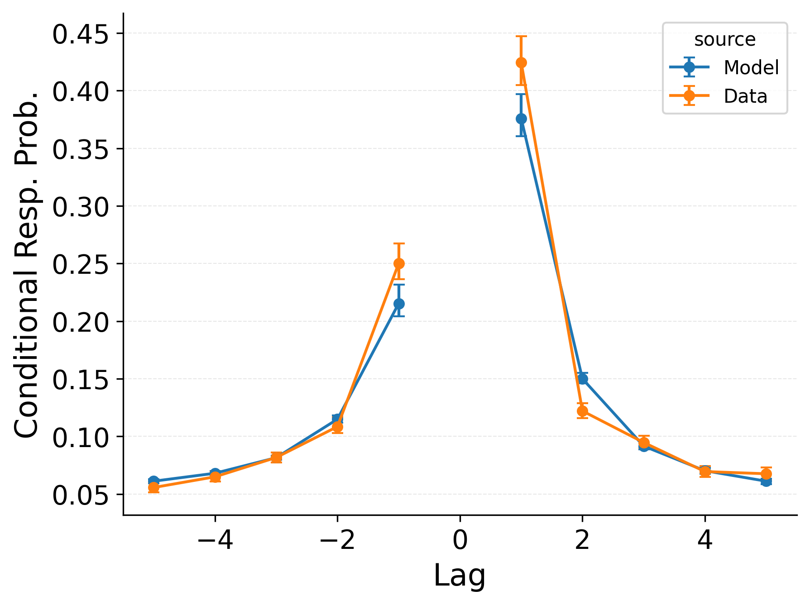

---
format:
  pdf:
    header-includes:
    - |
        \setcounter{figure}{0}
    bibliography: references.bib
    suppress-bibliography: true
    geometry: [landscape, margin=0.1in]
    pagestyle: empty
    include-before-body:
      - text: |
          \vspace*{\fill}   % stretch space at top
    include-after-body:
      - text: |
          \vspace*{\fill}   % stretch space at bottom
---

::: {#fig-cmr layout-ncol="3"}

Summary statistic fits of the baseline CMR model to PEERS data.
**Left**: probability of recall initiation by serial position.
**Middle**: conditional response probability as a function of lag.
**Right**: recall probability by serial position.
:::

<!-- **Alt Text**.
Three side-by-side plots comparing human free-recall data to the CMR model. Left: Recall-initiation probabilities by study position show a strong recency peak (last item) and a smaller primacy peak (first item); model follows the same U-shape. Middle: Lag-CRP curve is forward-skewed, with the highest transition at +1; model tracks this asymmetry. Right: Overall recall accuracy by study position forms a shallow U across the 16 positions; model slightly underestimates primacy and final-item recall but captures the general trend. -->