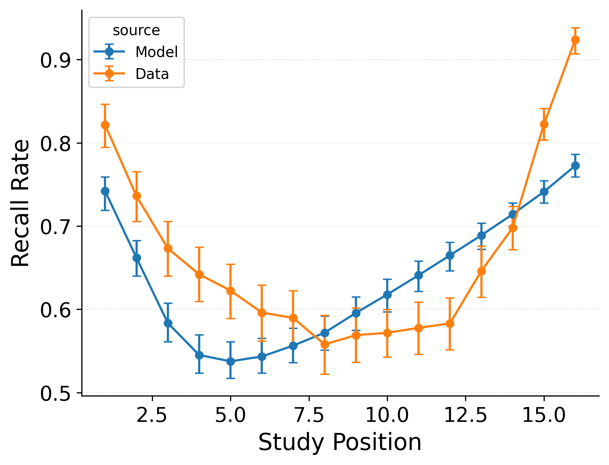

---
format:
  pdf:
    header-includes:
    - |
        \setcounter{figure}{3}
    bibliography: references.bib
    suppress-bibliography: true
    geometry: [margin=0.2in, centering, vcentering]
    pagestyle: empty
---

::: {#fig-fitlagcrp layout-ncol="3"}

Summary statistic fits of models to the PEERS free recall dataset [@healey2014memory].
**Top**: CRU with free pre-experimental context-to-feature memory ($\alpha$, $\delta$), primacy gradient ($\phi_\text{s}$, $\phi_\text{d}$), and start context integration rate ($\beta_\text{start}$) parameters.
**Middle**: CRU with free item-to-context learning rate ($\gamma$), primacy gradient ($\phi_\text{s}$, $\phi_\text{d}$), and start context integration rate ($\beta_\text{start}$) parameters.
**Bottom**: CRU with free item-to-context learning rate ($\gamma$), pre-experimental context-to-feature memory ($\alpha$, $\delta$), primacy gradient ($\phi_\text{s}$, $\phi_\text{d}$), and start context integration rate ($\beta_\text{start}$) parameters -- equivalent to CMR.
**Left**: Probability of starting recall by serial position.
**Left**: Probability of starting recall by serial position.
**Middle**: Conditional response probability as a function of lag.
**Right**: Recall probability by serial position.
:::

<!-- **Alt Text**.
Nine mini-plots arranged in a 3 × 3 grid compare *model* (blue) to *human data* (orange) for three increasingly complex CRU/CMR variants. Rows (top -> bottom) show, respectively: (1) CRU + pre-experimental support + primacy gradient, (2) CRU + feature-to-context learning + primacy gradient, (3) Full CMR (all mechanisms enabled). Columns (left -> right) display three benchmark statistics for 16-word free-recall lists. Left column: Recall-initiation curve. Y: probability the first recall comes from each study position. High right-end values illustrate the recency effect (participants often start with the last-studied word), whereas smaller left-end bumps reflect primacy (some start with the first word). Middle column: Lag-conditional response probability (lag-CRP). X: positional lag between successive recalls; Y: conditional probability. The sharp forward spike at +1 and the gentler backward spike at -1 indicate a short-lag contiguity bias; people tend to move to temporally adjacent items, more so forward than backward. Right column: Serial-position curve (SPC). Y: overall recall rate for each study position. The U-shape reprises primacy (higher accuracy for early items) and recency (late-item advantage after a dip in the middle). Error bars show ±1 SE. Progressing down the rows shows that adding each CMR mechanism successively narrows the gap between model curves and orange data points: the forward and backward peaks in the lag-CRP grow taller, and the SPC's early-item accuracy rises, demonstrating better fits to primacy, recency, and short-lag phenomena. -->
