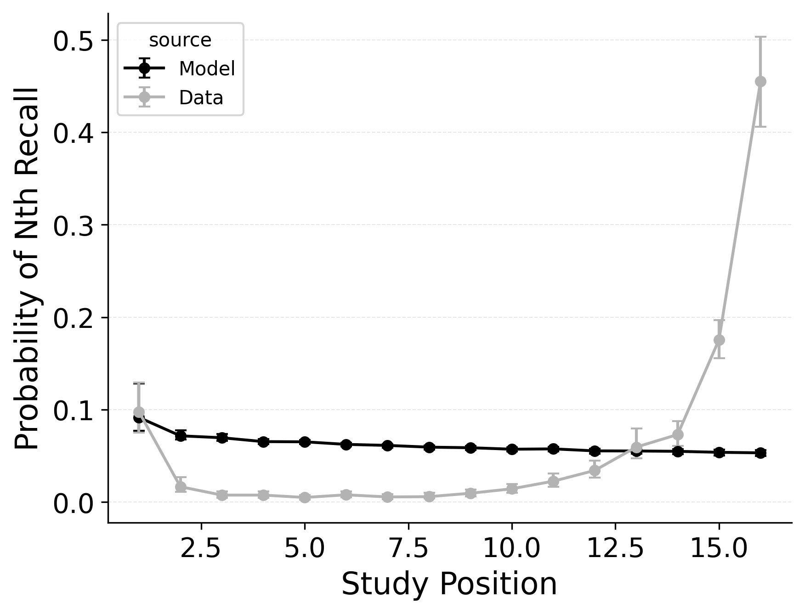
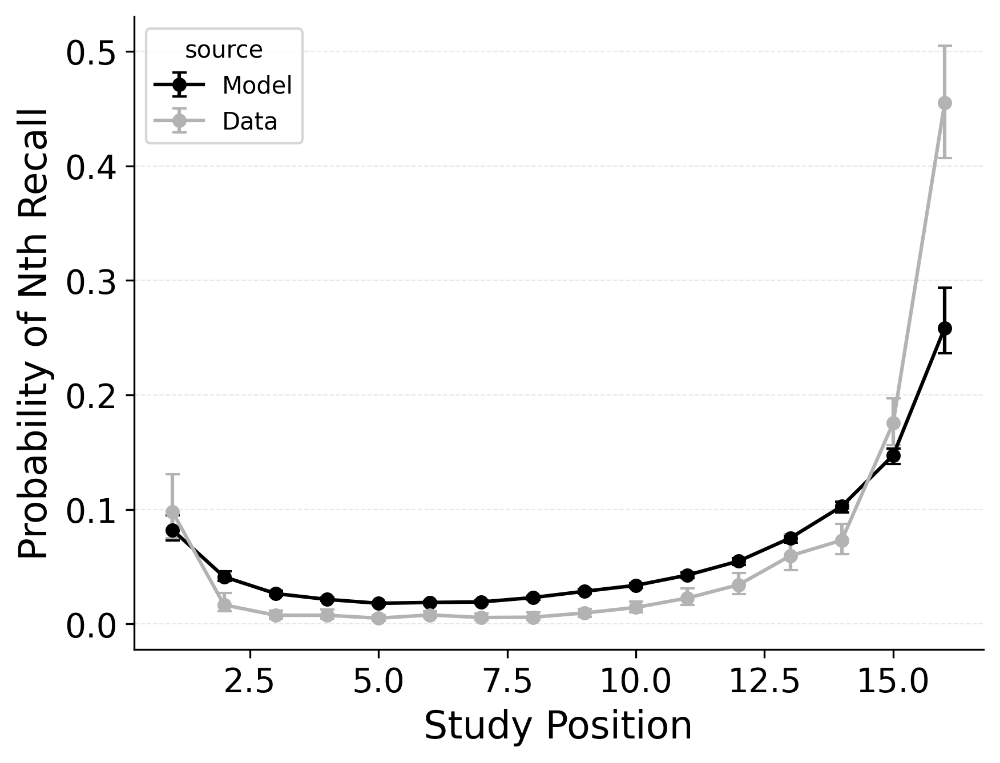
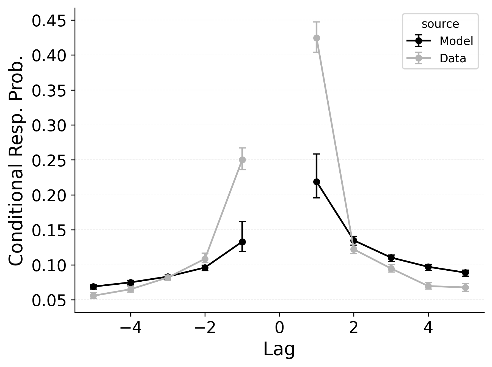

---
format:
  pdf:
    header-includes:
    - |
        \setcounter{figure}{1}
    bibliography: references.bib
    suppress-bibliography: true
    geometry: [margin=0.2in, centering, vcentering]
    pagestyle: empty
---

::: {#fig-initiation layout-ncol="3"}

Summary statistic fits of baseline CRU (**Top**), CRU with free start context integration rate $\beta_\text{start}$ (**Middle**), and CRU freeing both start context integration rate ($\beta_\text{start}$) and primacy gradient ($\phi_\text{s}$ and $\phi_\text{d}$) parameters (**Bottom**) to PEERS free recall data.
**Left**: probability of recall initiation by serial position.
**Middle**: conditional response probability as a function of lag.
**Right**: recall probability by serial position.
:::

<!-- **Alt Text**.
A comparison of three CRU variants against empirical free-recall patterns. Rows index by model variants: Top: baseline CRU; middle: CRU with a free start-context integration rate ($\beta_\text{start}$); bottom: CRU with both $\beta_\text{start}$ and an associative primacy gradient ($\phi_\text{s}$ and $\phi_\text{d}$). Columns index summary measures. First-recall curve (left column): probability that recall begins with each serial position. A steep rise at the end marks the recency effect (late items recalled first); a smaller peak at the start marks the primacy effect (early items sometimes recalled first). Lag-CRP (center column): probability of transitioning between recalled items separated by a given study lag. Tall bars at +1 show the forward short-lag preference; smaller bars at –1 show a smaller preference for backward short-lag transitions. Serial-position curve (right column): overall recall probability for each position—high at the start (primacy) and end (recency). Take-away: Freeing $\beta_\text{start}$ lets the model capture the strong recency start, while adding the primacy gradient boosts early-item recall and heightens ±1 lag peaks, bringing all three panels much closer to the data. -->