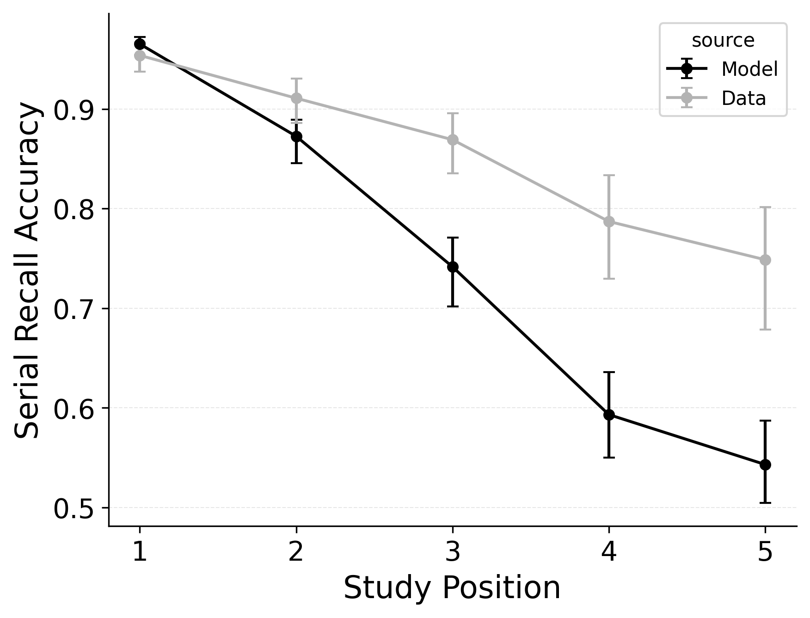
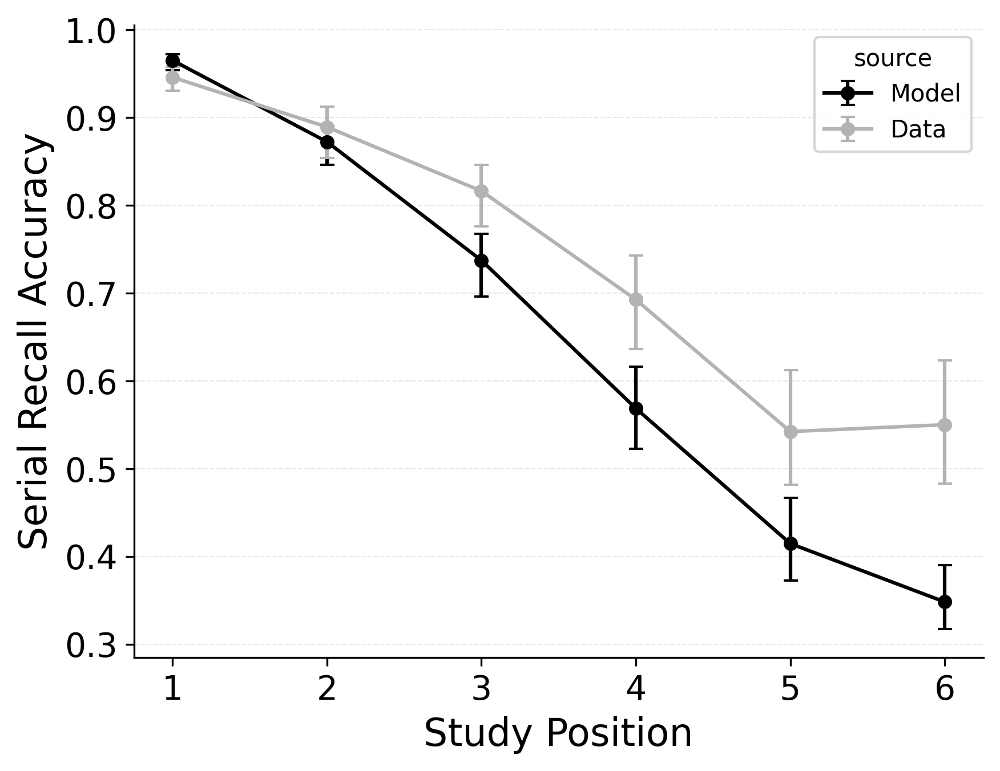
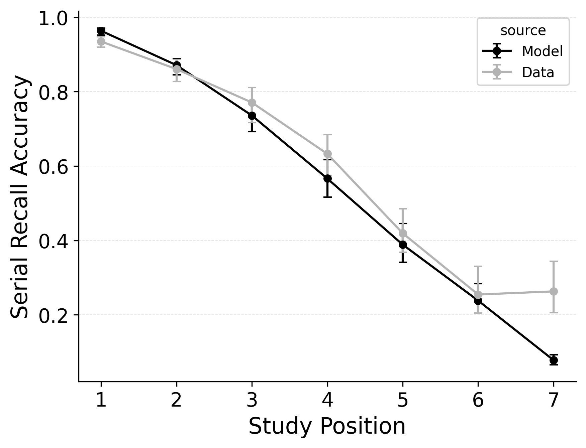
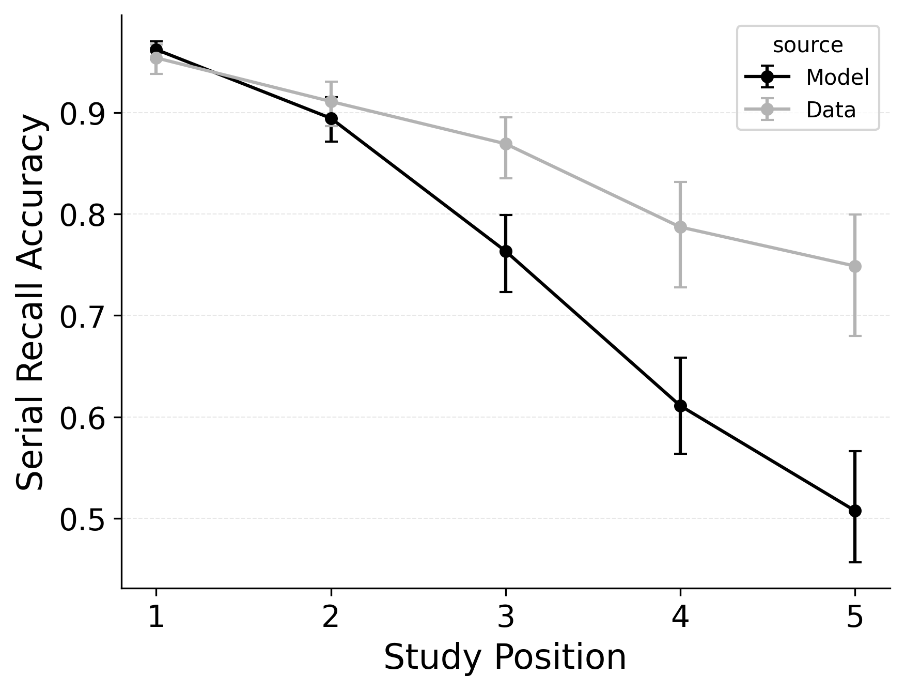
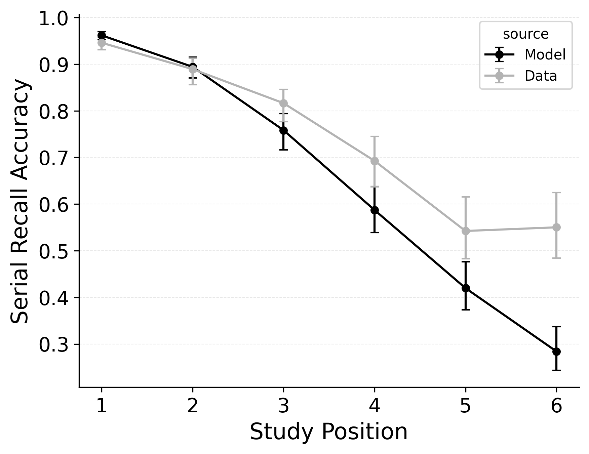
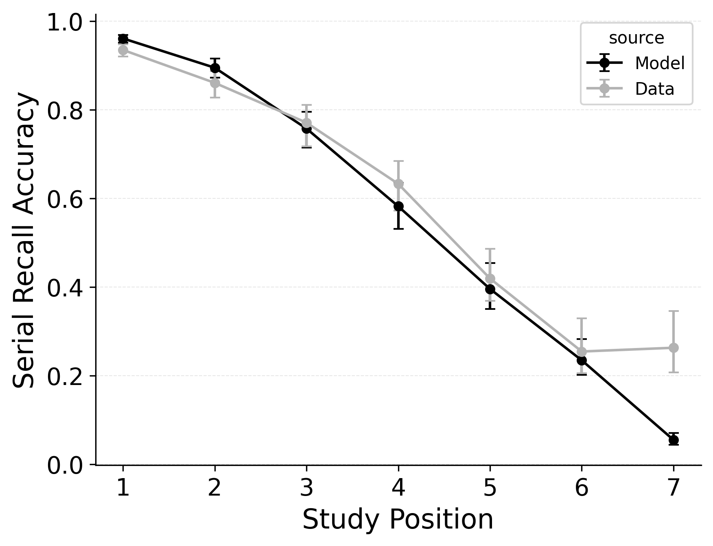
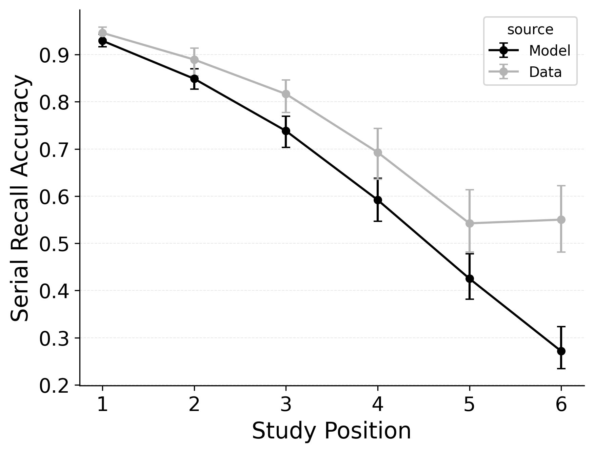

---
format:
  pdf:
    header-includes:
    - |
        \setcounter{figure}{6}
    bibliography: references.bib
    suppress-bibliography: true
    geometry: [margin=0.2in, centering, vcentering]
    pagestyle: empty
---

::: {#fig-serial-srac layout-ncol="3"}

Serial recall accuracy (SRAC) fits to @logan2021serial serial recall data for list lengths of 5 (**Left Column**), 6 (**Middle Column**), 7 (**Right Column**) of baseline CRU (**Top**), the best performing CRU variant with free pre-experimental context-to-feature memory ($\alpha$, $\delta$) and CMR-specific primacy gradient  ($\phi_\text{s}$, $\phi_\text{d}$) parameters (**Middle**), and CMR with its default position-based recall termination mechanism and CRU's item identification confusability mechanism (**Bottom**).
:::

<!-- **Alt Text**.
Nine‐panel line chart comparing observed versus model-predicted *serial recall accuracy* (SRAC). Columns correspond to list lengths 5 (left), 6 (middle), and 7 (right). Rows show, top to bottom: (1) baseline CRU; (2) best-performing CRU variant that adds CMR’s associative primacy gradient plus pre-experimental context–feature support; (3) CMR with its native position-based stop rule but augmented with CRU’s item-confusability mechanism. In every panel, study position (x-axis) runs from first to last list item; SRAC (y-axis) runs from 0.3–1.0. Greay lines with error bars plot human data; black lines plot model fits. All models capture the overall primacy gradient (higher accuracy for early study positions) but diverge in later positions: baseline CRU underestimates late-list accuracy, the hybrid CRU variant closes that gap, and the CMR-based model slightly overestimates mid-list accuracy for longer lists. -->
