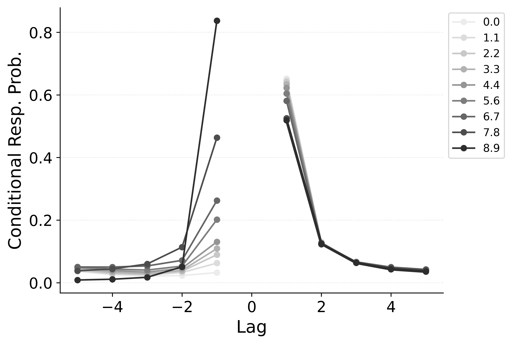

---
format:
  pdf:
    header-includes:
    - |
        \setcounter{figure}{4}
    bibliography: references.bib
    suppress-bibliography: true
    geometry: [landscape, margin=0.1in]   # page setup
    pagestyle: empty                      # no headers/footers
    include-before-body:
      text: |
        \vspace*{\fill}                   % elastic space at top
    include-after-body:
      text: |
        \vspace*{\fill}                   % elastic space at bottom
---

::: {#fig-shiftlearning layout-nrow="1"}

Simulation of the impact of shifting CMR's $\gamma$ (**Left**) and $\delta$ (**Right**) parameters on the conditional response probability as a function of lag for CMR.
Using parameters fit to @healey2014memory, the learning rate parameter $\gamma$ is shifted from 0 to 1 in increments of 0.1, and the item support parameter $\delta$ is shifted from 0 to 10 in increments of 1, with the color of the lines indicating the value of the parameter.
:::

<!-- **Alt Text**.
Two side-by-side line plots show how changing two CMR parameters alters the lag-conditional response probability (lag-CRP). The left plot varies the learning-rate parameter $\gamma$ from 0.0 (light gray) to 0.9 (dark gray / black) in 0.1 steps: larger $\gamma$ sharply boosts the probability of a +1 backward transition (lag –1) while slightly reducing the –3 to –5 lags. The right plot varies the self-support parameter $\delta$ from 0.0 (light gray) to 8.9 (dark gray / black) in unit steps: higher $\delta$ steepens both the forward +1 and backward –1 peaks while depressing longer-lag transitions. Each coloured line therefore traces how strengthening either parameter concentrates recall transitions around neighbouring items, with the legend listing the parameter values.  -->