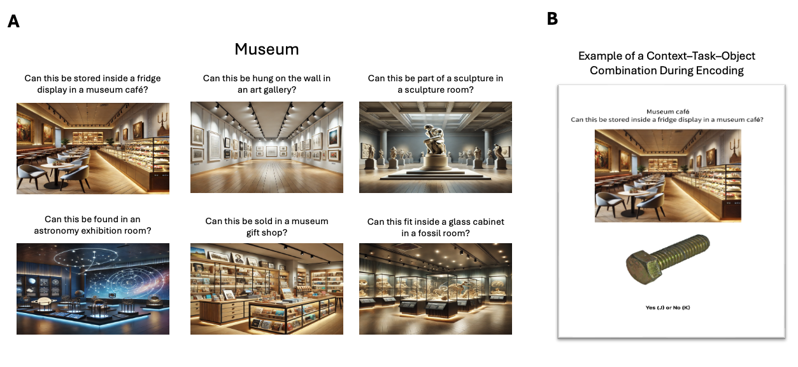
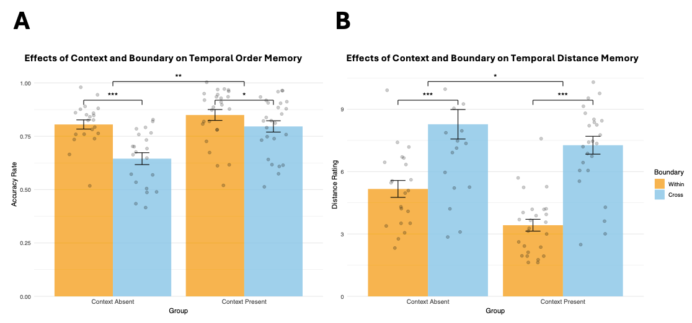

Although we perceive time as a continuous flow, our episodic memory is organized into discrete units.
According to Event Segmentation Theory, individuals maintain internal models of their surroundings to anticipate incoming information.
When a contextual shift occurs, these predictions become less accurate, leading to increased prediction error.
This increase in prediction error prompts the formation of an event boundary, segmenting continuous experience into distinct events [@reynolds2007computational; @zacks2007event].

Recent years have witnessed burgeoning interest in event segmentation.
Work in this area, frequently appearing in top-tier journals, spans large-scale behavioural experiments, naturalistic film-watching, neuroimaging, and clinical studies of memory fragmentation.

Its expansion across lifespan and clinical populations highlights event boundaries as fundamental units of human experience [@baldassano2017discovering; @benyakov2011constructing; @benyakov2018hippocampal; @clewett2020pupil; @mcclay2023dynamic; @reagh2020aging; @silva2025movie; @wyrobnik2022relation; @zacks2016effects].

Neural evidence suggests that these boundaries are associated with significant increases in hippocampal activity, particularly around the offsets of events in naturalistic stimuli [@benyakov2011constructing; @benyakov2018hippocampal].
Boundary processing also engages a broader cortical network (e.g., posterior medial cortex and angular gyrus).
These peaks in activity have been interpreted as reflecting a mechanism for encoding and updating event representations, which in turn shapes how information is stored and later retrieved from memory [@baldassano2017discovering].

It is reasonable to hypothesize that if boundaries trigger neural "updating" of the current event model, they would also produce measurable behavioural signatures.
Two established behavioural read-outs of event boundary perception are reduced temporal order memory accuracy and increased temporal distance ratings.
Specifically, pairs encoded across two consecutive events show lower order memory and higher distance ratings than pairs encoded within a single event.
[@bangert2020crossing; @clewett2020pupil; @dubrow2013influence; @heusser2018perceptual; @horner2016role; @lohnas2023neural; @pu2022event; @wang2022switching].
Temporal distance ratings are considered in this literature as time estimations, and higher ratings of cross-boundary pairs as evidence for subjective time dilation.

Retrieved context models offer a theoretical framework that can explain why event boundaries influence temporal memory.
Retrieved context models [TCM, CMR and SITH, @howard2015distributed; @howard2002distributed; @lohnas2015expanding; @polyn2009context] conceptualises context as a slowly drifting internal state to which items become bound during encoding.
In this framework, it is straightforward to simulate event boundaries as abrupt shifts of context state, which reduce context similarity across the boundary [@horner2016role].
Consistent with this account, Horner and colleagues modelled a spatial boundary as an increase in contextual drift during encoding when participants passed through a doorway.
This manipulation reproduced the within-event advantage in temporal order memory, such that participants were more likely to correctly select, among three choices, which item was encoded before or after the test probe when both probe and target were encoded in the same room.
In their retrieved-context simulations, within-room targets were easier to identify because they were more similar to the probe compared to the lures.
After a doorway transition, the probe and target share less similar context, making the correct option harder to distinguish from foils [@horner2016role].

Building on this framework, @lohnas2023neural found that event boundaries reduce the similarity of the neural temporal context representations between contiguously-encoded items.
During free recall, participants' neural activity reinstated encoding-phase temporal context, including the boundary-related disruption, suggesting that boundary effects at encoding propagate to retrieval and influence what people remember.
These results follow and extend those of DuBrow and Davachi [-@dubrow2013influence; -@dubrow2014temporal], who proposed that temporal memory decisions rely on reactivating intervening item representations that bridge the two tested items.
Taken together, according to this perspective event boundaries impair temporal order memory by weakening sequential links across the boundary during encoding and reducing the accessibility of bridging representations at retrieval.

Like changes in the external environment, changes in internal states may also signal event boundaries, while stable intenral states can provide a consistent "internal scaffolding" that binds sequential moments together.
For example, @clewett2020pupil found that stable physiological arousal during encoding, indexed by pupil size, can serve as an internal contextual state that supports memory integration.
Greater stability in arousal predicted better memory for the order of events and lower temporal distance ratings between them.
Additionally, work on emotional state dynamics suggests that valence changes, from neutral to negative, during encoding can likewise cause dilated temporal distance ratings [@wang2025emotional].
Collectively, these accounts characterise event boundary effects as due to encoding-related mechanisms that carry forward to influence retrieval.

Until now, retrieved context models have only been deployed to simulate the effects of event boundaries on encoding processes.
Nevertheless, since these models emphasize the retrieval processes, it is natural to wonder how retrieval processes modulate the effect of event boundaries on temporal memory.
Intriguingly, @wen2022retrieval reported that the degree of reinstatement of the encoding context was crucial to the direction of the effect of event boundaries on temporal order memory.
When participants studied objects presented within coloured frames, and the same frame colour was shown again around each object at test, temporal order memory was more accurate for cross-boundary than within-event pairs---a "flipped" effect relative to the classic event-boundary pattern.
The classic pattern was found when the object was presented without the colour frame that signalled in which event the item was encoded.

@wen2022retrieval pointed out that the flipped direction makes sense in everyday experience.
For instance, it won't be hard to remember walking from the meeting room to the kitchenette to refill a water bottle (cross-boundary), yet we may struggle to recall whether, during a meeting, we opened the slides before or after muting our microphone (within-event).
In daily life, we are unlikely to refill a water bottle in the meeting room; that action is naturally tied to the kitchenette.
We also do not usually bounce back and forth between these two places, so the meeting room and kitchenette stay distinct in memory.
These contexts are meaningful and overlap little, making the cross-boundary transition more memorable.
By contrast, laboratory paradigms typically operationalise event boundaries by repeatedly shifting task demands or perceptual features across trials, such as alternating orienting tasks, stimulus category, or stimulus features [@dubrow2014temporal; @heusser2018perceptual; @sols2017event].
For example, in DuBrow's seminal study [-@dubrow2013influence], participants alternated between judging objects as "indoor/outdoor" and faces as "female/male" across the sequence.
@wen2022retrieval moved beyond such repeating contexts by using distinct, non-recurring cues and reinstating them at retrieval, and suggested that these conditions will give rise to a "flipped" effect whenever participants are reminded of the encoding context during the test.
Nevertheless, in a crucial test of their hypothesis, in their Experiment 4 source memory did not influence temporal memory, casting doubt on their interpretation.
While their work hinted that event boundaries influence temporal memory differently outside the rarified conditions of laboratory experiments, it did not fully resolve the underlying mechanism.

Following up on @wen2022retrieval's proposal that event boundaries have a different impact when they are encountered in in the real world, we hypothesised that outside the artificial conditions of the lab people often infer temporal relations based on source memory, namely, by retrieving which contexts the tested items belonged to ("the microphone must have been in the meeting room"), and the order of those contexts ("I went to the kitchenette after the meeting").
Good source and source-order memory can allow people to base temporal order decisions on deduction and make accurate decisions about the temporal order of test items ("I must have refilled my water bottle after I muted the microphone").
It is possible that Wen and Egner did not observe significant effects of source memory on temporal memory because their manipulation still relied on relatively simple cues, such as the one-off orienting task cue and a non-repeating coloured frame around each object.
In paradigms that are even more ecologically valid, the influence of associative memory -- specifically, source and source-order memory -- may be more prominent.
To test this hypothesis, in Experiment 1 we conceptually replicated @wen2022retrieval's study using a more ecologically valid paradigm, drawing on @horner2016role.
We hypothesised that since we maintained the crucial element of their design -- non-repeating, and even more highly distinctive events, a "flipped" effect will emerge when the encoding context is re-presented at test.

To summarise, the research reported here set out to illuminate how event boundaries influence temporal memory in real-life situations.
We hypothesized that outside the lab, retrieval processes may overwhelm the effect of event boundaries on item-item association and associations between these items through shared temporal context, at encoding.
Experiment 1was designed as a conceptual replication of Wen and Egner's Experiment 4 but using even more distinct, unique events.
We failed to replicate their results, suggesting that the "flipped" effect is not due to the nature of events.
We also observed evidence for effects of source memory on temporal memory.
We followed these up in Experiment 2, now using the 'typical' memory test set-up where the encoded events are not re-presented to participants.
The results provided robust evidence that source memory and source order memory determine temporal order memory accuracy and temporal distance ratings.
Since these experiments relied on individual differences in associative memory, Experiment 3 manipulated associative memory by varying the number of events participants encoded.
This experiment showed that the "flipped effect" can be observed when associative memory is good.
Taken together, our study is first to show that retrieval processes determine the magnitude and direction of the effect of event boundaries on temporal memory in ecologically-valid situations.

## Experiment 1

### Method

We manipulated the availability of context during test and the nature of test items, using a 2 (present, absent) X 2 (within, between) mixed design, with the first factor tested between and the second within participants.
This experiment was pre-registered on the Open Science Framework (OSF): 10.17605/OSF.IO/MZ5W6.
We hypothesized that, when context is present at retrieval, participants would show better temporal order memory for items that cross an event boundary than for items encoded within the same event.
When context is absent at retrieval, we expected the opposite pattern: better temporal order memory for within-event pairs than for cross-boundary pairs.
In both context-present and context-absent conditions, we anticipated that cross-boundary pairs would be judged as temporally further apart than within-event pairs.

#### Participants

Sixty-two healthy young adults (28 females, 34 males), aged 18 to 44 years (M = 27.10, SD = 6.92), were recruited from the University of Cambridge's online participant pool, SONA.
Participants were compensated £10 per hour for their time.
Individuals with a history of mental health or neurological disorders, or those taking medications known to affect brain function, were excluded from participation.

Participants were randomly assigned to the context-present and context-absent groups.
However, due to participant dropout during recruitment, the final group sizes were uneven, resulting in 33 participants in the context-present group and 29 in the context-absent group.

Participant exclusion criteria included both preregistered and additional data quality checks.
The preregistered criteria specified the exclusion of participants whose temporal order memory accuracy was at or below chance level (≤ 50%) or who failed embedded attention checks.
To further ensure data quality, we additionally excluded participants whose temporal order accuracy rates or temporal distance judgments were more than 1.5 interquartile ranges above or below the sample mean.
Participants with a mean distance rating of zero were also removed, as this indicated non-engagement with the task.
A total of 15 participants were excluded: eight for performing at or below chance level on the temporal order memory task, five whose mean distance rating was 0, and two whose distance ratings were more than 1.5 interquartile ranges above or below the grand mean.

All procedures were approved by the University of Cambridge Psychology Research Ethics Committee.

#### Materials

A total of 252 neutral-coloured object images were selected from the O-Minds database (<https://github.com/DuncanLab/OMINDS>).
All images were pre-processed to appear as squares with a resolution of 500 × 500 pixels.
Additionally, 42 location images were generated using ChatGPT at a resolution of 525 × 407 pixels.
These images represented six locations in seven places: a museum, a park, a house, a university campus, a shopping mall, a gym, and a hotel.
For example, the museum locations comprised a café, art gallery, fossil room, astronomy exhibition room, gift shop, and sculpture room (@fig-1 A).

Each of the 42 location images was paired with one encoding question tailored to its specific context.
Event boundaries were created by changing the location image and its associated encoding question.
Questions targeted either the physical characteristics of objects (e.g., size, weight, or material) or their probabilistic or functional use (e.g., the likelihood of using the object in a particular location or in a specific way).
For each space, three questions were written for probabilistic use and three for physical characteristics.

Within each space, questions were written to avoid repetition in linguistic structure (e.g., no two questions used the same verb).
All questions were designed to produce a reasonable mix of "yes" and "no" responses, with at least 10% of each expected across participants.
Questions that appeared bizarre or emotionally evocative were excluded.
For example, for the museum café location, the encoding question was: "Can this be stored inside a fridge display in a museum café?"

#### Procedure

The experiment included seven rounds.
In each round participants took part in an encoding task, a distractor task, and two temporal memory tests.
The first round was considered practice and was not analysed.
In the final experimental round, the context-absent group completed a source memory test, and all participants then completed a context order test.
Specifically, repeated source and context order memory tests could encourage participants to rely more on contextual information, particularly in the context absent group, thereby reducing the impact of the context manipulation.
To minimize strategy changes across rounds, we restricted these tests to the final round.

##### Encoding task

In each round, participants encoded a list of objects.
Each list mimicked a visit to six locations in one place, for example, a museum.
In each of these locations, participants encoded six objects by answering the orienting question associated with that location.
Thus, each list consisted of 36 trials, in which participants encoded a combination of one location image, one object image, and its associated encoding question, displayed for 6 seconds.
The location image was presented centrally on the screen, with the object displayed below it, and the encoding question shown above (@fig-1 B).
Participants were asked to respond "yes" or "no" to each question related to the object--location pairing by pressing J for "Yes" or K for "No").
An *event* was defined as a sequence of consecutive images that shared the same location image and encoding question.
Since each encoding list contained six different location images and corresponding encoding questions, each list was divided into six events.

{#fig-1}

The presentation order of the seven places was randomized across participants, and within each list the order of the six locations belonging to that place was also randomized across participants.
For every list, six objects were randomly paired with each location image, yielding 36 location-object combinations that participants encoded during the study phase.

##### Distractor Task

Following the encoding phase, participants completed a 30-second distractor task designed to prevent rehearsal and eliminate potential working memory effects.
During this task, two nine-character alphanumeric strings (e.g., *m5y8p2q1b*) were presented sequentially for 15 seconds each, and participants were required to select the option displaying each string in reverse order.
After completing the distractor tasks, participants proceeded to the memory tests.

##### Memory tests

The first test was a temporal order memory test, in which participants were shown two images and asked to select the one that appeared earlier (@fig-2 C).
Next, they completed a temporal distance judgment test, where they estimated how many images had appeared between the two probe images (@fig-2 D).
During both temporal memory tests, participants in the context-present group were shown the objects with their associated location images and encoding question.
In contrast, participants in the context-absent group were shown only the object itself.
22 of the 36 objects participants encoded during the study phase were selected to form 11 object pairs for the test phase.
The object pairs fell into four conditions: (1) within-event, distance of 2; (2) within-event, distance of 3; (3) cross-boundary, distance of 2; and (4) cross-boundary, distance of 3.
In the within-event conditions, both items in a pair were encoded with the same question and location image.
In the cross-boundary conditions, the items were associated with different encoding questions and location images.
The distance refers to the number of objects that appeared between the two probe objects during encoding.
For example, a distance of 2 indicates that two object images appeared between the tested items, while a distance of 3 indicates three intervening images.
To avoid potential biases, boundary location images, the first images of each event, which typically require longer encoding times and are better remembered, were excluded from pair selection.
The remaining images were randomly selected to form item pairs for each condition (@fig-2 B).

![Structure of the experiment and task sequence. (**A**) List structure and illustration of within-event (orange lines) and cross-boundary (blue lines) pair selection. Probe pairs were separated by either two or three intervening items, with boundary items, the first item of every event, excluded from selection. (**B**) Example of the encoding task. Participants viewed object--location pairings with an accompanying question and responded "Yes" or "No." Within-event pairs were encoded with the same location image and question, whereas cross-boundary pairs were encoded with different location images and questions. (**C**) Example of the temporal order memory task for both context-present and context-absent conditions. (**D**) Example of the temporal distance memory task for both context-present and context-absent conditions. (**E**) Example of the source memory task. Participants in the context-absent group completed a source memory test by identifying the location image and question associated with each object. (**F**) Example of the context order memory task. Participants need to reconstruct the order of locations and questions.](figures/media/image2.png){#fig-2}

In the final experimental round, after the temporal order and distance tasks, participants completed one or two additional memory tests depending on their group assignment.
Those in the context-absent group completed a source memory test to assess their memory for the context associated with each object.
In each source memory trial, participants were shown an object along with the six location images and corresponding encoding questions from the final round (@fig-2 E).
The encoding question appeared above its respective location image.
Participants were required to identify which location image had been associated with the object.
The six location-question pairs were presented in random order.

After completing the previous tasks, both groups completed a context order test.
In this task, the six location-encoding question pairs from the final round were presented in random order, and participants were asked to reconstruct the order in which they originally appeared during encoding (@fig-2 F).
Following this, participants were asked to report the percentage of time they relied on contextual memory to make their temporal judgments.
All temporal memory tasks were self-paced, allowing participants to carefully assess their memory.

#### Data analysis

We pre-registered the analysis to examine how context and boundary conditions influence temporal order accuracy and temporal distance ratings using mixed-effects models implemented in the lme4 package in R.
The models included context (context-absent vs. context-present), boundary condition (within-event vs. cross-boundary), and their interaction as fixed effects, with participant entered as a random intercept.

We additionally pre-registered exploratory analyses involving source memory, which was assessed only in the context-absent group.
To examine the effects of source memory and boundary on accuracy and distance ratings, a mixed-effects model was fitted.
Source memory was categorized based on whether participants remembered neither, one, or both location-question pairs associated with the two displayed objects.
In this model, source memory (0 vs.1. vs.2) and boundary were entered as fixed effects, with participant as a random intercept.

We also examined the effect of objective distance (2 vs. 3), defined as the number of intervening items between the two tested items, on temporal distance ratings.
In this non-preregistered analysis, boundary, context, objective distance, and their interactions were entered as fixed effects, with participant included as a random intercept.

For all models, an ANOVA was performed to evaluate the significance of the fixed effects and their interactions.

### Results

All data analyses were conducted using R (version 4.3.1) within RStudio.

#### Temporal order memory

**Boundary and context.** The analysis revealed a significant main effect of boundary, *F*(1, 45) = 36.60, *p* \< .001, partial η² = 0.45, with higher accuracy for within-event trials (*M* = .83, *SD* = .38) than for cross-boundary trials (*M* = .73, *SD* = .45).
There was also a significant main effect of context, *F*(1, 45) = 9.30, *p* = .004, partial η² = 0.17, such that accuracy was higher in the context-present group (*M* = .82, *SD* = .38) compared to the context-absent group (*M* = .73, *SD* = .45).
In addition, a significant boundary x context interaction was observed, *F*(1, 45) = 9.09, *p* = .004, partial η² = 0.17.
Post hoc Tukey-adjusted comparisons revealed that in the context-absent condition, accuracy was significantly higher for within-event trials (*M* = .81, *SE* = .03) than cross-boundary trials (*M* = .65, *SE* = .03), *t*(45) = 6.09, *p* \< .001, *d* = 1.88.
In the context-present condition, the boundary effect was smaller but remained significant, with higher accuracy for within-event (*M* = .85, *SE* = .02) than cross-boundary trials (*M* = .79, *SE* = .02), *t*(52) = 2.27, *p* = .03, *d* = 0.63 (@fig-3 A).

**Source memory and boundary.** There was a significant main effect of source memory, *F*(2, 76) = 8.96, *p* \< .001, partial η² = 0.19.
Accuracy increased with the number of location images correctly remembered for the tested pairs.
The main effect of boundary was not significant, *F*(1, 76) = 1.58, *p* = .21, partial η² = 0.02, nor was the boundary x source memory interaction, *F*(2, 76) = 0.01, *p* \> .05, partial η² \< 0.001 (@fig-4 A).

#### Temporal distance judgements

**Boundary and context.** The analysis revealed a significant main effect of boundary, *F*(1, 45) = 138.15, *p* \< .001, partial η² = 0.75.
There was also a significant main effect of context, *F*(1, 45) = 9.30, *p* = .002, partial η² = 0.11.
The boundary x context interaction was not significant, *F*(1, 45) = 1.55, *p* \> .05, partial η² = 0.03 (@fig-3 B).

**Source memory and boundary.** The analysis revealed a significant main effect of boundary, *F*(1, 58.81) = 6.88, *p* = .01, partial η² = 0.10, replicating the effect reported above.
The main effect of source memory did not reach significance, *F*(2, 62.17) = 2.33, *p* \> .05, partial η² = 0.07.
The boundary x source memory interaction was also not significant, *F*(2, 58.65) = 2.47, *p* \> .05, partial η² = 0.08 (@fig-4 B).

**Objective distance.** Consistent with our other analyses, the model revealed a significant main effect of boundary, *F*(1, 135) = 41.41, *p* \< .001, a significant main effect of context, *F*(1, 45) = 8.94, *p* = .0045, and a non-significant boundary by context interaction, *F*(1, 135) = 10.88, *p* \> .05.
In contrast, there was no main effect of objective distance, *F*(1, 135) = 0.05, *p* \> .05, and objective distance did not interact with boundary or context (all ps ≥ .18).
The three-way interaction among boundary, context, and objective distance was also not significant, *F*(1, 135) = 0.34, *p* \> .05.

{#fig-3}

{#fig-4}

### Discussion

Despite enhancing the uniqueness and distinctiveness of our contexts, and strengthening item-context associations, we still observed the classic effect: temporal order memory was better for within-event than for cross-boundary events in both the context-present and context-absent groups.
This refuted our hypothesis and challenges the claim that providing distinct, unique context cues during retrieval can produce a flipped effect, such that the order of cross-boundary events is remembered better than that of within-event events [@wen2022retrieval, Experiments 1-4].

Our hypothesis was supported in the sense that when the context was present during retrieval, the boundary effect on temporal order memory was smaller.
This effect emerged because participants performed better on cross-boundary trials when the context was present compared to when it was absent.
We also found that temporal order memory improved when participants correctly remembered the contexts associated with more items in the pair.

Additionally, we replicated the classic temporal distance effect, with cross-boundary pairs judged as farther apart than within-event pairs.
Replicating @wen2022retrieval Experiment 3 and 4, retrieval context also shaped these judgments: participants in the context-absent condition gave larger distance ratings than those in the context-present condition.
By contrast with temporal memory measures, distance ratings were not significantly predicted by source memory, nor by the source memory x boundary interaction.
However, in a follow-up analysis restricted to trials in which participants correctly remembered both contexts, cross-boundary pairs were rated as farther apart than within-event pairs, suggesting that boundary structure exerts a stronger influence when contextual information is successfully retrieved.

We did not register a hypothesis related to objective distance ratings, but nevertheless expected to observe an effect on both measures, temporal order memory and temporal distance ratings.
Curiously, we observed that distance ratings were also insensitive to the number of intervening items, implying that objective distance contributed little under our task conditions.
This was surprising because it implied that boundary effect corresponded to an increase in perceived distance of roughly four items.
Within retrieved-context models, this magnitude is difficult to explain as a purely encoding-driven increase in context drift, because it would require a large acceleration relative to the drift associated with encoding an additional item.
Together, these results motivate a post-encoding account in which temporal distance judgments are biased by what participants can retrieve about item-context associations.
Experiment 2 therefore tested this post-encoding account more directly.

## Experiment 2

In Experiment 1 we limited ourselves to testing source memory only at the very end of the session to minimise strategy shifts in temporal inference across earlier rounds.
This design choice only allowed us to collect data on memory for items encoded in the final round.
However, to further examine how retrieval processes shape temporal memory, and whether perceived event structure can bias temporal judgments, it is useful to have more robust data on source memory, namely, associative memory for the context in which test probes were encoded, and on memory for context order.
Therefore, in Experiment 2 each encoding round was followed by a test of source and context order memory, a procedure previously employed by Wen and Egner [-@wen2022retrieval, Experiment 4].
The experiment was also preregistered on OSF (10.17605/OSF.IO/SYHTA).

Experiment 2 focused on the context-absent condition of Experiment 1.
This design choice was useful for our purposes because it permitted assessment of source memory for all test items, which cannot be meaningfully measured when the context is present at retrieval.
An additional benefit was the increased generalisability of our results, since the context-absent condition is the standard procedure in the event-segmentation literature.

Following Experiment 1, where better source memory was associated with more accurate temporal order memory, we hypothesized that this benefit depended on context order memory.
Because distance ratings in Experiment 1 depended on contextual cues at retrieval but not on objective distance at encoding, we also tested whether temporal distance judgments are biased by retrieval decisions.
We predicted that participants' temporal distance judgments depend not on what they encoded, but on what they retrieve, specifically whether they infer that the two items belonged to the same context (within-event) or different contexts (cross-boundary).
A natural prior to have based on simple environmental statistics that items that were encoded in different contexts were far apart from each other.
If participants deploy such a heuristic, source memory accuracy could influence temporal distance ratings.
Specifically, for pairs that were encoded in different contexts, we predicted shorter distance ratings when participants incorrectly judged them as having been encoded in the same context.
For pairs that were encoded in the same context, we predicted larger distance ratings when participants incorrectly judged them as having been encoded in different contexts.

### Method

In Experiment 2 we manipulated only one experimental factor -- the presence of boundary during the encoding of test items (within/between), using a within-participant design.
Experiment 2 was conducted as an fMRI study; however, the present paper focuses only on the behavioural results.
Analyses of the neural data will be reported separately.

#### Participants

Forty healthy adults (21 female, 19 male), aged 20-39 years (M = 25.93, SD = 4.70), were recruited through the University Medical Center Hamburg-Eppendorf participant database.
Participant exclusion followed preregistered criteria documented on the OSF (10.17605/OSF.IO/SYHTA).

#### Materials

In Study 2, the materials were the same as in Study 1, with two exceptions: the encoding questions were translated into German, and the location images were selected from Google Images.
The image set depicted the same six locations within each place as in Study 1.
All location images were preprocesses to a resolution of 1356 × 1089 pixels.

#### Procedure

We ran an fMRI version of the study.
The overall procedure was the same as the context-absent condition in Experiment 1, but we modified the timing and display format of both the encoding and temporal memory tasks.

##### Encoding task

During encoding, the object and location image were presented together for 4s, with a fixation cross displayed at the centre of the object.
The encoding question was displayed below the images only on the first encoding trial of each context; for the remaining five trials within that context, the question was not shown during the 4s object-location display.
Participants were instructed to maintain fixation on the central cross and view the images without moving their eyes, to minimise gaze-related noise in the RSA analyses.
This fixation requirement was waived on the first trial of each event, when a new context was introduced, so that participants could look at the location image and read the associated encoding question.
Each encoding trial then included a 2s blank screen, a 1s presentation of the question alone, a s blank screen, and a 0.5s fixation cross.

##### Memory tests

For the temporal memory task, each trial began with a 2s blank screen and a 1s fixation cross, followed by a 4s presentation of the image pair with a fixation cross between the two images.
After this 4s presentation, the image pair was shown again, and participants completed the temporal memory judgment in a self-paced response period.

Finally, after completing the temporal memory task in each round, participants additionally completed a source memory task and a context order memory task.

#### Data analysis

To test our preregistered hypothesis that source memory and context order memory jointly influence temporal order accuracy on cross-boundary trials, we fit a mixed-effects model with context order memory accuracy (accurate vs. inaccurate), source memory accuracy (0 vs. 1 vs. 2), and their interaction as fixed effects, with participant included as a random intercept.
This analysis was restricted to cross-boundary trials because remembering the order of contexts is only informative when the two items come from different contexts; for within-event trials, both items share the same context, so context-order memory is not defined and cannot contribute to the judgment.
Context order memory accuracy was defined as whether participants correctly remembered which of the two contexts associated with the tested items occurred first, based on their reconstruction of the context sequence in the context order memory task.

We also preregistered an analysis examining whether actual--retrieved boundary consistency, defined as the match between the actual boundary condition (within vs. cross) and the retrieved context relationship (within vs. cross), together with objective distance (2 vs. 3), predicts temporal distance judgments.
Finally, for completion, we repeated this analysis using temporal order memory.
This analysis was not registered.

### Results

#### Temporal order memory

**Actual--retrieved boundary consistency.** There are significant main effects for both retrieved boundary, *χ*²(1) = 10.24, *p* = .001, and actual boundary, *χ*²(1) = 10.77, *p* = .001, and a significant interaction between retrieved boundary and actual boundary, *χ*²(1) = 9.24, *p* = .002.
No other main effects or interactions, including those involving objective distance, reached statistical significance (all *p*s \> .60).
Post hoc pairwise comparisons (Tukey-adjusted) showed that temporal order memory was higher when participants retrieved context relationship matched the actual boundary condition.
Specifically, for item pairs that were encoded within-event, accuracy was higher when participants judged the pair as within-event rather than cross-boundary (*OR* = 3.21, *SE* = 0.34, *z* = 10.89, *p* \< .001).
Conversely, for item pairs that were encoded cross-boundary, accuracy was higher when participants judged the pair as cross-boundary rather than within-event (*OR* = 0.38, *SE* = 0.05, *z* = -8.07, *p* \< .001) (@fig-5 A).

**Context order memory and source memory.** The analysis revealed that neither the main effect of source memory, χ²(2) = 0.18, *p \> .05*, nor the main effect of context order memory, χ²(1) = 0.60, *p* \> .05, was statistically significant.
However, the interaction between source memory and context order memory was significant, χ²(2) = 36.74, *p* \< .001.
Tukey-adjusted post hoc comparisons showed that when participants incorrectly remembered the context order, temporal order memory accuracy did not differ across source-memory levels (all *p*s ≥ .911).
When context order memory was correct, accuracy did not differ between trials in which participants remembered 0 versus 1 context correctly (*OR* = 0.93, *SE* = 0.14, *z* = -0.49, *p* \> .05).
In contrast, trials in which participants remembered 2 contexts correctly differed from both 0-context trials (*OR* = 0.25, *SE* = 0.04, *z* = -8.80, *p* \< .001) and 1-context trials (*OR* = 0.27, *SE* = 0.03, *z* = -11.83, *p* \< .001) (@fig-6).

#### Temporal distance judgment

**Effect of retrieved boundary.** We found a significant main effect of retrieved boundary on temporal distance judgments, *F*(1, 5217.40) = 9.95, *p* = .002, partial η² = .0019.
When participants judged pairs as within-event, temporal distance ratings were lower than when they judged pairs as cross-boundary.
The main effects of actual boundary, *F*(1, 5213.50) = 1.44, *p* = .230, partial η² = .0003, and objective distance, *F*(1, 5212.70) = 0.00, *p* \> .05, partial η² \< .0001, were not significant.
Neither the interaction between retrieved boundary and actual boundary was not significant, *F*(1, 5217.20) = 3.28, *p* \> .05, partial η² = .0006, nor the other interactions (all *p*s ≥ .311; partial η²s ≤ .0002) (@fig-5 B).

{#fig-5}

{#fig-6}

### Discussion

Experiment 2 examined which factors influence temporal order memory when contextual cues are not available at retrieval.
By removing the contextual cues at test, participants had to rely on the information they could retrieve and could not rely on perceptual context cues -- the typical set-up in the temporal memory literature.

Consistent with our hypothesis, source memory supported temporal order judgments only when participants also remembered the order of the relevant contexts.
When participants misremembered context order, temporal order accuracy did not vary with the number of contexts remembered correctly, suggesting that reinstating the encoding context at test (operationalised here as accurate item-context memory) is not sufficient to support temporal order judgments when the context sequence itself is misrepresented.
When participants correctly remembered context order, temporal order accuracy was higher when they remembered both item contexts correctly than when they remembered only one or neither item context correctly, with no difference between the one- and neither-context cases.
This pattern suggests that temporal order judgments benefit most when participants can identify the contexts of both tested items and remember the order of those contexts.

We additionally found that temporal order memory improved when participants' retrieved boundary matched the true boundary condition.
For within-event pairs, accuracy increased when participants remembered that both items occurred in the same context.
For cross-boundary pairs, accuracy also increased when participants remembered that the items occurred in different contexts, but it additionally depended on remembering the order of the two contexts.
This asymmetry suggests that the classic within-event advantage is not solely a consequence of boundary encoding, but also reflects the greater retrieval demands of cross-boundary judgments: accurate performance on cross-boundary trials requires integrating item--context associations with a correct representation of context order, whereas within-event judgments can often be supported by context identity alone.

Strikingly, retrieved boundary, but not actual boundary, influenced temporal distance judgments.
Pairs judged as cross-boundary were rated as farther apart than pairs judged as within-event, supporting our hypothesis.
In contrast, actual boundary and objective distance did not affect temporal distance ratings.
This result suggests that temporal distance judgments can be driven more by inferences that are based on reconstructed context structure.
Temporal distance judgments here were more sensitive to participants' subjective belief about whether a boundary separated the items, than to the objective boundary condition at encoding.
Once this belief about the presence or absence of boundary is formed, it appeared to guide temporal distance judgments.
Indeed, a heuristic whereby items inferred to belong to different contexts are judged as having occurred further apart in time may be ecologically adaptive.

Taken together, these results show that temporal order memory depends on associative retrieval, but the relevant dependencies differ for within- and cross-boundary pairs.
For within-event pairs, temporal order judgments can often be supported by retrieving context identity and the associated item--context bindings.
For cross-boundary pairs, accurate temporal order judgments additionally require an accurate representation of context sequence structure, such that item--context information must be integrated with context-order memory.
In contrast, temporal distance judgments are more closely tied to subjective, reconstructed boundary representations than to the objective encoding structure.

## Experiment 3

Experiment 2 demonstrated that accurate temporal order memory depends jointly on item-context associations and memory for the order of the relevant contexts.
However, because context order memory was not experimentally controlled in Experiment 2, results could be due to pre-experimental individual differences.
In addition, administering the source and context order memory tasks after each round may have induced strategy shifts across rounds, increasing reliance on contextual information when making temporal judgments.
To address these limitations, Experiment 3 manipulated event structure by varying the number of contexts within each list (three vs. six).
We assumed that having only three, rather than six, contexts within each list would render context order easier to remember.
This time, we employed the context-present condition of Experiment 1 to better control item-context associations at retrieval and more directly test the contribution of context order memory to temporal memory.

The experiment was preregistered on OSF (10.17605/OSF.IO/6XVBF). We hypothesized that temporal order memory would differ by event structure.
In the 6-context condition, participants would show better temporal order memory for within-event pairs than for cross-boundary pairs.
In the 3-context condition, we expected the opposite pattern: better temporal order memory for cross-boundary pairs than for within-event pairs.
For temporal distance memory, we hypothesized that participants in both conditions would judge cross-boundary pairs as temporally further apart than within-event pairs.

### Method

#### Participants

Fifty-four healthy adults (24 female, 30 male), aged 21 to 45 years (M = 32.17, SD = 7.71), were recruited via Prolific and received £10 per hour for their participation.
Four participants were excluded from data analysis: three due to chance-level performance on the temporal order memory task, and one whose temporal distance ratings were more than 1.5 interquartile ranges above the sample mean.
All exclusion criteria followed preregistered guidelines documented on the OSF.

#### Materials

We used the same object images, location images, and randomisation rules as in Experiment 1 to construct the encoding lists but manipulated event structure by varying the number of contexts per list.
Two list types were created: six-context lists and three-context lists.
In both list types, each list was drawn from a single place category (museum, park, house, university campus, shopping mall, gym, or hotel), and the order of contexts within each list, as well as the order of lists, was fully randomized.

Six-context lists contained six events, each paired with six object images, as in Experiment 1.
Three-context lists contained three events randomly selected from the six possible events within the same place category; each paired with 12 object images.

Because three-context lists contained fewer events, the number of tested pairs was matched across list types.
Each list included eight tested pairs: two within-event and two cross-boundary pairs separated by two intervening items, and two within-event and two cross-boundary pairs separated by three intervening items.

#### Procedure

Experiment 3 included only the context-present condition, in which participants saw each object together with its associated location image and encoding question during the temporal memory tasks.
Participants were randomly assigned to either the three-context or six-context group.
In the three-context group, each encoding list comprised three events, whereas in the six-context group each list comprised six events.
All other procedures were identical to Experiment 1.

#### Data analysis

We pre-registered analyses testing whether temporal order accuracy and temporal distance ratings vary as a function of event structure and boundary type, using mixed-effects models.
Each model included event structure (three-context vs. six-context), boundary (within-event vs. cross-boundary), and their interaction as fixed effects, with participant included as a random intercept.
For all models, we used ANOVA to test the significance of fixed effects and their interactions.

### Results

#### Temporal order memory

**Boundary and event structure.** We found a significant boundary x event structure interaction, *F*(1, 49) = 50.70, *p* \< .001, partial η² = .51.
The main effect of boundary was marginal, *F*(1, 49) = 4.02, *p* = .050, partial η² = .08, and the main effect of event structure was not significant, *F*(1, 49) = 3.35, *p \> .05*, partial η² = .06.
Post hoc Tukey-adjusted comparisons indicated that the boundary effect differed across event structures.
In the 3-context group, accuracy was significantly higher for cross-boundary trials (*M* = .887, SE = .025) than within-event trials (*M* = .725, SE = .025), *t*(49) = -6.80, *p* \< .001, *d* = 1.82.
In contrast, in the 6-context group, accuracy was significantly higher for within-event trials (*M* = .792, SE = .027) than cross-boundary trials (*M* = .701, SE = .027), *t*(49) = 3.45, *p* = .001, *d* = 1.02 (@fig-7 A).

#### Temporal distance judgment

**Boundary and event structure.** The analysis showed a significant main effect of boundary on distance ratings, *F*(1, 49) = 118.60, *p* \< .001, partial η² = .71, replicated the finding from experiment 1.
There was also a significant main effect of event structure, *F*(1, 49) = 4.80, *p* = .033.
The boundary x event structure interaction was not significant, *F*(1, 49) = 2.76, *p \> .05*, partial η² = .05 (@fig-7 B).

{#fig-7}

### Discussion

In Experiment 3, we manipulated event structure by varying the number of contexts within each encoding list.
We observed the classic pattern in the 6-context group, with better temporal order memory for within-event than for cross-boundary pairs, but a flipped pattern in the 3-context group.
This pattern supports the suggestion that the effect of context on temporal order memory depends on participants' ability to remember the order of the contexts, challenging the claim that distinctive contextual reminders at retrieval are sufficient to reverse the boundary effect [@wen2022retrieval].

Our findings help interpret the intriguing results reported by @wen2022retrieval, which motivated the present research.
We conceptually replicated their "flipped effect" under context-present conditions.
In their Experiment 1, the flipped effect emerged when participants encoded three contexts with 10 items per context, with contexts defined by a combination of item type and encoding task.
In their Experiment 2, item type switched every 12 items, whereas the encoding task switched every 6 items; because encoding-task switches did not modulate performance, the flipped effect again emerged under a three-context structure with 12 items per context.
Using a combination of location cues and encoding questions to mark event boundaries, we showed that the flipped effect emerges when participants encode three contexts, but not when they encode six.
This pattern suggests that the flipped effect is not determined solely by the presence of context at retrieval or by event distinctiveness per se.
Instead, it may depend on participants' ability to remember the order of contexts, which is likely higher when only three contexts are encoded.
Based on the pattern of results reported here, we propose that the flipped effect observed in our Experiment 3 reflects relatively strong context order memory under the three-context condition.

For temporal distance judgments, we replicated both our prior experiments findings and the classic effect: cross-boundary pairs were perceived as farther apart in time than within-event pairs.
We also found that participants in the 3-context group tended to give larger temporal distance ratings than those in the 6-context group, an effect that would be difficult to attribute to encoding processes.

## General discussion

Across three experiments, we investigated the effect of retrieval processes on temporal memory.
We revisited two widely used behavioural markers of event segmentation: lower temporal order memory and higher temporal distance ratings for pairs that span an event boundary compared to pairs that occur within the same event.
Although these effects are often interpreted as direct consequences of boundary encoding [@bangert2020crossing; @clewett2020pupil; @lohnas2023neural], our results indicate that they depend strongly on associative memory at retrieval, in particular, memory for item-event bindings and memory for the order of events.
Based on the results reported here, we argue that behavioural "boundary effects" in temporal memory cannot be attributed solely to segmentation processes at encoding.

### Factors that govern the magnitude and direction of temporal order memory

Experiment 1 conceptually replicated and extended prior work using distinctive, non-repeating contexts and context-specific encoding questions intended to encourage rich item-context associations [@wen2022retrieval].
We used even more distinctive and unique event contexts and a more realistic cover story, inviting participants to imagine that they encounter objects within rooms of various attractions.
Despite this increased ecological validity, we observed the classic within-event advantage in temporal order memory in both the context-present and context-absent conditions.
While this finding aligns with the majority of the literature to date, our finding challenges the claim that providing distinctive, unique contextual information at retrieval is sufficient to reverse the classic boundary effect [@wen2022retrieval].
At the same time, our results supported the broader suggestion of Wen and Egner, because we also observed important effects of retrieval on behavioural markers of event boundaries.
Context availability at retrieval reliably modulated the magnitude of their temporal memory effects: when contextual information was present at test, temporal order memory accuracy on cross-boundary trials improved relative to the context-absent condition, decreasing the within-event advantage.
Additionally, temporal order memory was higher when participants remembered more of the contexts associated with tested items, suggesting that retrieval of item-context bindings provide cue for making temporal inference.
This raised the possibility that context reinstatement at retrieval would be most beneficial when participants can also remember how those contexts were ordered within the studied sequence.

Experiment 2 further examined the joint contribution of item-context associations and context order memory by removing contextual cues at test.
The results showed that item-context memory supported temporal order judgments only when participants also remembered the order of the events within which the items were encoded.
When event order memory was incorrect, temporal order accuracy did not vary with how many item contexts were remembered correctly.
When event order memory was correct, accuracy was highest when participants remembered the source of both items.
This suggests that accurate temporal judgments require a correct representation of the sequence of events; when that sequence is misrepresented, reinstating the encoding context provides limited support.
Additionally, temporal order accuracy was higher when participants' retrieved boundary matched the actual boundary condition, consistent with the view that accurate temporal inference requires retrieving the relevant contexts and that temporal order memory benefits when the reconstructed event structure aligns with the structure at encoding.

Experiment 3 directly tested the role of context order memory by re-presenting the encoding context at test and manipulating how easy it was to retrieve the order of events.
We manipulated the number of events per list, assuming that event order memory will be better when participants encode three rather than six events.
In the condition where event order memory was higher, we found a reversed boundary effect: participants who studied three events had better temporal order memory for cross-boundary than within- event pairs, whereas participants who studied six events showed the classic within-event advantage.
This dissociation indicates that the direction of the boundary effect is not fixed, but depends on how difficult it is to reconstruct the sequence of contexts.

It is striking that in Experiment 2, temporal order memory accuracy for cross-boundary pairs exceeded chance only when participants remembered both events in which the test probes were encoded as well as the order of events.
By contrast, once participants retrieve the source of two within-boundary items, since this is the same event for both items, event order memory can play no further role.
This asymmetry suggests that the classic within-event advantage could be due not to event segmentation at encoding, but to the extra retrieval demands of cross-boundary judgments.
While cross-boundary decisions depend on combining item--context bindings with event-order information, within-event decisions can be supported by source memory alone.
Consequently, factors that affect the availability or use of event-order information at test (e.g., the number of contexts, their distinctiveness, or the retrieval cues provided) can change the magnitude---and potentially the direction---of the observed "boundary effect," even without changes in segmentation at encoding.

### Factors that govern temporal distance ratings

Our temporal distance measure differed from most prior work, which typically uses coarse ordinal scales [e.g., 4-point ratings such as very close, close, far, very far; @clewett2020pupil; @ezzyat2014similarity; @wang2025emotional; @wang2022switching; @wen2022retrieval].
Instead, we used a 0-35 scale that matches the possible number of intervening items in our sequences, allowing direct comparison with the objective distance.
This aspect of the methodology made it possible for us to notice that in Experiment 1, temporal distance judgments were not sensitive to the objective number of intervening items, suggesting that participants did not rely strongly on a fine-grained representation of temporal lag.
By contrast, crossing an event boundary was perceived as roughly equivalent to inserting about four additional intervening items.
We were intrigued since in retrieved-context accounts the boundary is simulated as a drift of the temporal context [@horner2016role], and it would be inconceivable to simulate the drift as equivalent to the presentation of that many non-recallable items.

We followed up on this result in Experiment 2 and found that retrieved boundary representations played a central role: pairs judged as cross-boundary were rated as farther apart than those judged as within-event, regardless of the actual boundary condition.
This result aligned with the finding, in Experiment 1, that the higher temporal distance ratings for cross-boundary items only emerged when participants remembered both events in which both test probes were encoded.

This pattern is consistent with a retrieval-bias account in which temporal distance judgments are downstream from reconstructed event structure.
Believing that two items were separated by a boundary increased perceived distance, whereas encoded boundaries did not reliably determine subjective temporal distance.
The results of Experiment 3 agreed with this interpretation: participants who encoded longer events rated temporal distance as higher than those who encoded shorter events, even though the objective distances between test probes were the same in both conditions.
Overall, the results suggest that participants draw on a simple event structure heuristic that is based on the statistics of the natural environment: items that are randomly sampled from a long event or from two events are farther apart in time than two items from a short event.
Using this event structure as a cue for temporal distance ratings is therefore ecologically reasonable.

### Theoretical implications

In CMR (Context Maintenance and Retrieval) model, each item is encoded together with the internal context state present at study.
When an item is later retrieved, it reinstates this temporal context as well as associated source information (e.g., which encoding context it belonged to), and this reinstated context can then cue retrieval of other items encoded in similar contexts [@polyn2009context].
This model fits naturally onto paradigms like @horner2016role's, where a probe item is followed by multiple options and the decision can be framed as a competition: the option that shares the most similar contextual trace with the probe is most likely to be selected.
In our paradigm, however, participants do not choose between multiple candidates, so there is no explicit competition process that can "pick the best match" based on context similarity.
This highlights a limitation of an account that relies purely on context-similarity.
Although boundary-induced context shifts can explain why within-event items share more similar contextual traces than across-event items, the framework does not specify how people use retrieved context to make a temporal judgment when there are no alternatives to compare.
We therefore need an extension that formalises how retrieved context is converted into recency decisions in non-competitive tasks, and how reliance on context similarity versus context-order information changes depending on whether participants can recover the order of contexts in the studied sequence.

An item that is encoded very far after another item no longer carry information about the temporal context of the earlier item.
If event boundaries are simulated as increased temporal drift, as in previous work [@horner2016role], this situation is more likely for cross-boundary items compared to within-event items.
Without traces of the early item, computing representational similarity is unhelpful on its own for making recency judgements, leaving participants to guess the right answer randomly, unless they can retrieve both the original event and the order of events two items belong to.

While event boundaries can be simulated as increased temporal drift, events can also be simulated as unique source contexts, a context partition adjacent to the temporal context.
This usage is at the core of the CMR model [@polyn2009context] and explains why items that were encoded with the same orienting task (bigger/smaller thana shoe box vs. pleasantness judgements) are often clustered during free recall.
The source context of an event that directly follows a previous event will carry information about the first event, allowing participants to 'sort' the order of events, and successfully make a recency judgement.

In Experiment 2, test probes that were wrongly perceived as belonging to different events were not judged as being farther than those that were wrongly perceived as belonging to the same event.
This finding suggests that although retrieval heuristics may be influential, they may not fully account for the effect of event boundaries on temporal distance ratings.
Computing the similarity between the contexts associated with test probes could be an important clue.
Future studies can manipulate perceived context to test more rigorously whether objective boundaries still have an effect, as a CMR model would predict.

Taken together, our findings indicate that boundary effects on temporal memory are shaped by how well participants can retrieve item-context associations and the order of the relevant contexts.
While temporal order judgments appear to depend on integrating item-context bindings with an accurate representation of context sequence, temporal distance judgments appear to be more tightly linked to subjective perception of event relationship.
These findings imply that behavioural boundary effects in temporal memory should not be treated as markers of event segmentation at encoding.
Instead, they are more likely to reflect a mixture of segmentation, associative encoding, and the availability and use of contextual information at retrieval.
Future directions include conducting a study in which retrieval pairs are directly manipulated to induce wrong item-context associations, allowing us to test how post-retrieval factors influence temporal memory and to further clarify the cognitive processes underlying our perception of time.

## References