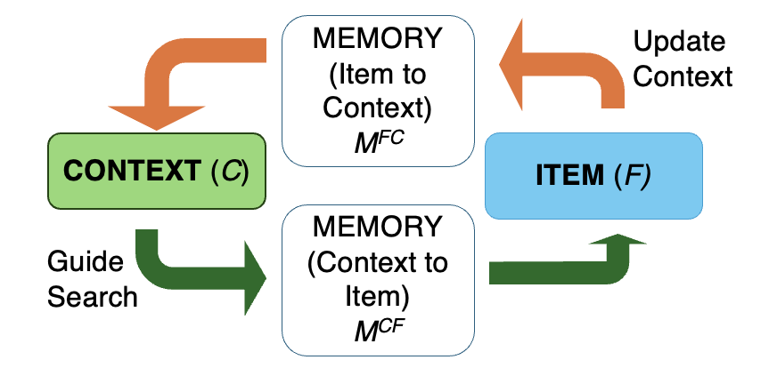
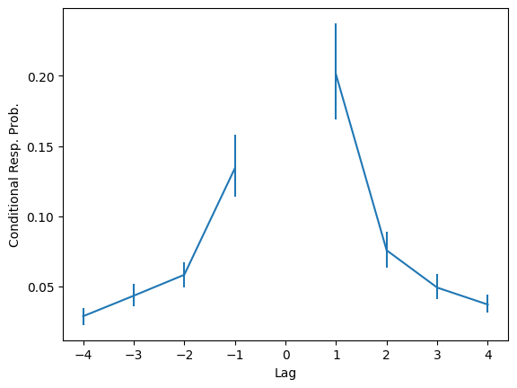
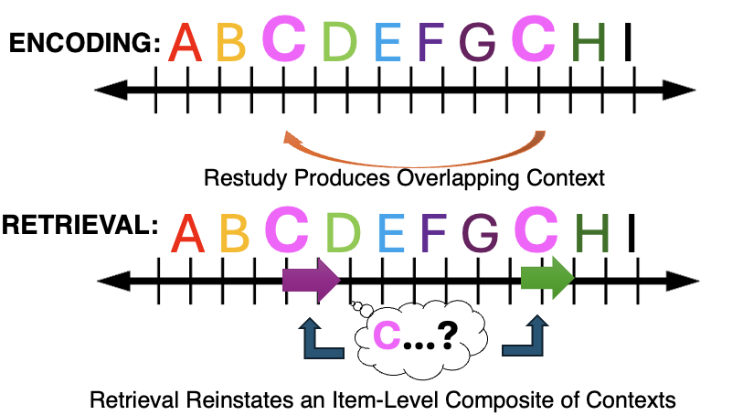

## The Challenge of Repeated Experience

:::: {.columns}

::: {.column width="35%"}
{width="100%"}

{width="100%"}
:::

::: {.column width="65%"}

**Your first visit**: cinnamon, fresh loaf, quiet counter

**Your visit a week later**: espresso, new cashier, different loaf

&nbsp;

Episodic memory faces two competing demands:

- **Integration** — partial cues retrieve relevant details
- **Differentiation** — details from one moment not confused with another
:::

::::

::: {.notes}
Imagine your neighborhood bakery. On Monday you walk in, smell cinnamon, and buy a fresh loaf. A week later you go back—now it's espresso in the air and a new cashier. A friend later asks about the place. Hopefully you can recall both visits without the details bleeding together. This illustrates two competing demands on memory: bridging across related experiences so partial cues retrieve what's relevant, and differentiating so one moment's details aren't confused with another's.
:::

## Studying Memory in the Lab

{fig-align="center" height="600"}

Item **D** appears twice — in serial recall, each occurrence must be followed by its **correct neighbor**

::: {.notes}
We study this in the lab with list learning. Participants study a sequence where the same item — say the letter D — appears twice: once early, once later. In serial recall, they reproduce the list in order. D has to be recalled twice, each time followed by the correct neighbor. If they mix up one neighbor for the other, that's a sign memory is blurring the two occurrences.
:::

## Retrieved-Context Theory {.smaller}

:::: {.columns}

::: {.column width="50%"}
{width="100%"}
:::

::: {.column width="50%"}
{width="100%"}
:::

::::

After recalling any item, people disproportionately recall **nearby items** — the **contiguity effect**

::: {.notes}
Retrieved-context models make detailed predictions about scenarios like these. The core idea: items and their temporal contexts are associated bidirectionally. Each time you study an item, its context is integrated into an evolving temporal representation weighted toward recent experience. At retrieval, recalling an item reinstates its associated context, which then cues the next recall.
:::

## Predictions for Repetition {.smaller}

{fig-align="center" height="700"}

The theory predicts **all associated contexts** are reinstated — serial recall with repetitions should be especially challenging

::: {.notes}
Retrieved-context theory sounds simple, but formalized in a complete model, it can make pretty exact predictions about scenarios that weren't even thought of when the theory was first devised. My research examines these predictions in new scenarios to refine ongoing theory and apply it in new ways. For my PhD thesis, I focused on the scenario I just described. Since the theory predicts that items call back all their associated contexts, it predicts that serial recall with repeated items should be especially challenging. Wrestling with the gap between that prediction and actual data helped me devise an improved version of the theory.
:::

## Emotional Memory and EEG

{fig-align="center" height="700"}

Negative emotional items are consistently better remembered (~50% vs ~40%)

::: {.notes}
Here in the emotional cognition lab, we extend retrieved-context theory by allowing emotion to tag context with special features and modulate encoding strength — emotional items reinstate similar contexts and form stronger context bindings, predicting clustered and improved recall. In one of my projects using EEG data, that's exactly what we saw in recall data for sequences containing neutral and emotional items. Negative items are consistently better remembered than neutral ones — roughly fifty versus forty percent across serial positions.
:::

## Neural Signals Predict Recall {.smaller}

{fig-align="center" height="650"}

For negative items: higher **EEG during study** predicts later recall

Model captures this via an **emotion x encoding-strength** interaction

::: {.notes}
Within negative items, items that are later recalled show higher late positive potential amplitude during encoding — a consistent separation across the list. We capture this with a neurocognitive model extension enforcing an emotion-by-encoding-strength interaction, improving the model's ability to predict recall from neural signals.
:::

## {.center}

::: {style="text-align: center; font-size: 1.15em;"}
### Intrusive Memories {.unnumbered}

After reminders of a distressing experience, playing **Tetris** reduces involuntary intrusive memories

. . .

But **voluntary** recall and recognition are largely **spared**

. . .

No existing account formally explains why
:::

::: {.notes}
In another project, I apply the framework to understand intrusive memories for traumatic experiences, a common symptom of PTSD, and an intervention that helps address it. After reminders of a distressing experience, playing Tetris reduces involuntary intrusive memories over following days. At the same time, voluntary recall and recognition are largely spared. No existing account formally explains why.
:::

## A Retrieved-Context Account {.smaller}

{fig-align="center" height="700"}

Reminders reinstate distressing context — **Tetris** creates competing memories that **interfere** with later intrusions

::: {.notes}
In my retrieved-context account, reminders reinstate the context of a distressing episode. Playing Tetris afterward associates that reinstated context with competing memories. When that context later becomes a retrieval cue, Tetris memories interfere and prevent intrusions.
:::

## {.center}

::: {style="text-align: center; font-size: 1.15em;"}

By simulating this in a formal model, we can test how well it matches the data and devise stronger interventions

. . .

**Memory models advance science — and a key part of what our lab is all about**
:::

::: {.notes}
By simulating this in a formal model, we can test how well it matches the data and devise stronger interventions that make patients' lives better. This is how memory models advance science, and a key part of what our lab is all about.
:::
