# Abstract

Repetition strengthens memories while tying each occurrence to an evolving temporal context.
The core idea of retrieved‑context theory (RCT) is that this evolution is item‑based: encoding or retrieval "calls back" and blends items' prior contexts into the ongoing state.
Such blending links occurrences across time, but also engenders associative interference by overlapping traces and diffusing retrieval across occurrences contexts.
Using matched control baselines, we identify patterns in free‑ and serial‑recall datasets contradicting this account:
(i) no elevated transitions between neighborhoods of different occurrences, 
(ii) biased transitions from repeated items toward first-occurrence neighbors, and 
(iii) preserved forward chaining in serial recall without cross-occurrence errors.
To limit interference and improve fits, we advance a modified framework where repetitions (a) reinstate unique, non-overlapping contextual features and (b) produce traces that compete for retrieval.
Episodic memory balances integration and specificity not through contextual blending, but rather differentiated competition.

# Introduction

Episodic memory -- our ability to recall events anchored to a unique time and place [@tulving1972episodic] -- is especially challenged by repeated and overlapping experience.
A flexible system must navigate two competing demands [@yassa2011pattern; @schlichting2015memory; @mcclelland1995complementary; @kumaran2012generalization].
It must integrate information across related experiences so partial cues in the present can retrieve relevant details from the past, yet it must also differentiate those experiences so one moment's details are not confused with those of another.
Failure on either front undermines adaptive behavior: without integration, experience stays isolated; without differentiation, experience blurs and we confuse the past.

The present work examines these dynamics in a list-learning paradigm across free and serial recall.
Participants study a single list in which a target word -- e.g., *canoe* -- appears twice, once early (position 5) and once later (position 15).
Each occurrence has its own temporal context: different immediate list neighbors flank the early and late *canoe*.
In serial recall, the correct output is unambiguous: *canoe* must be spoken twice, each time followed by the correct neighbor from its study position.
Frequently substituting a neighbor tied to the other occurrence would indicate that the two study moments were not kept fully apart in memory [@henson1996unchained; @kahana2000interresponse].
In free recall, order is unconstrained, but transitions remain diagnostic: frequent transitions between the neighborhoods of the two occurrences (in either direction) would indicate that recalling one occurrence tends to reinstate context associated with the other [@lohnas2014retrieved].
Across tasks, such transitions provide a behavioral portrait of how memory stores and reinstates contextual associations learned across occurrences.

Within this landscape, retrieved-context theory (RCT) provides a prominent overarching account of episodic memory search, especially its temporal organization in free recall [@howard2002distributed].
Implemented first in the Temporal Context Model and elaborated in models such as the Context Maintenance and Retrieval (CMR) [@polyn2009context] and Context Retrieval and Updating (CRU) [@logan2018automatic; @logan2021serial] frameworks, RCT emphasizes the interaction between studied items and a continuously evolving temporal context.
Each study or recall event blends associated features into a context state that evolves over time, leaving a recency‑weighted record.
At study, states of this dynamic temporal context are associated with items in memory; at retrieval, it serves as the primary cue, prioritizing items studied in similar contexts.
The theory's central claim is that retrieving an item reinstates its study context, and that this reinstated context guides what comes next.
In this work, we test this principle when the same item appears more than once in a list.
Across free and serial recall, we argue that contextual reinstatement is indexed to a particular occurrence rather than an item-level composite, motivating an episode-specific alternative we call Instance-CMR.

<!-- 
Across free and serial recall, we find retrieval remains tied to a single occurrence context rather than blending across repetitions, challenging item-level context reinstatement and motivating an instance-based alternative.
-->

## Repetition Within Retrieved-Context Theory

Earlier context theories treated background context as evolving largely independently of study events, so items were associated with whatever state happened to prevail [@estes1955statistical; @mensink1989model].
Retrieved-context theory departs from this view by allowing each item to reinstate contextual features specific to its study history, so retrieval actively reconstructs a cue rather than relying on a cue that has simply drifted forward in time [@howard2002distributed; @kahana2020computational].
This single change solves several puzzles at once [@howard2002distributed].
In free recall, it explains why successive recalls tend to move between nearby study positions with a forward tilt: each new context state retains features reinstated by earlier items, so recalling one item preferentially cues what followed it during study [@kahana1996associative; @howard2002distributed].
It also explains why these temporal regularities survive long distractors, because each recall refreshes the cue with retrieved study context rather than letting similarity decay as the cue drifts on [@sederberg2008context].
In serial recall, it captures the transposition gradient (errors cluster near the correct position) and the gradual learning of repeating sequences [@logan2018automatic; @logan2021serial; @lohnas2024retrieved].
In multi-list free recall, it has likewise been extended to account for graded prior-list intrusions, in which recall drifts to items from recent lists when list targeting is imperfect [@howard2008persistence; @lohnas2015expanding; @zaromb2006temporal].
These and other successes position item-based context reinstatement as a linchpin of RCT's explanatory power and motivate its application to repetition effects.

In this framework, repetition effects follow from two complementary consequences of encountering an item multiple times [@lohnas2014retrieved; @howard2002distributed].
One is contextual variability: each occurrence is stored with a new context, so the repeated item becomes accessible from multiple cues later [@bower1972coding; @glenberg1979component].
The other is associative study-phase retrieval: each occurrence can reinstate context from prior presentations of that item, linking separated moments in experience [@hintzman1975spacing]
Together, these mechanisms have been used to explain classic spacing effects and the superadditive benefits of repetition in free recall [@lohnas2014retrieved; @cepeda2006distributed; @benjamin2010distributed].
Closely related episodic-context accounts apply the same logic to explain the retrieval practice and testing effects [@whiffen2017episodic; @karpicke2014retrievalbased].

Despite the appeal and broad success of this account of episodic memory, the same mechanism that links occurrences of an item across time may also hamper access to occurrence-specific details.
If contextual features tied to *canoe* are blended across occurrences, a cue that activates neighbors of one occurrence will tend to activate neighbors of the other.
In RCT, item-driven context reinstatement can produce this blending at two stages.
At study, reinstating the item's context produces overlapping contextual states across occurrences, so cues for one region also contact the other.
At retrieval, the same process blends contextual features from all occurrences of the repeated item, creating a composite cue.
Either route implies that cues to one occurrence will also substantially cue the other, limiting selective retrieval and undermining differentiation across episodes.

Here, we argue that this prediction of associative interference between repeated occurrences is at odds with the empirical record in free and serial recall.
We derive and test three predictions that follow from item-based context reinstatement in retrieved-context models, using a refined position-matching control procedure that factors out baseline transition tendencies tied to serial position and list structure.
First, in free recall, transitions between the temporal neighbors of two occurrences of the same item should be elevated relative to controls [@lohnas2014retrieved].
Second, after recalling a repeated item, subsequent transitions should be more evenly split between the two occurrence regions than for position-matched control items.
Third, similarly in serial recall, recalling the first occurrence should frequently propel retrieval to the second occurrence's neighbors rather than to the correct forward neighbor.
Together, these patterns would indicate that each occurrence and retrieval of the same item reinstates an item-level composite of contextual features, blending details across episodes rather than selecting details specific to one.
Yet across multiple published datasets and analyses, the predicted elevations are not observed.
By contrast, simulations of a standard retrieved-context implementation (CMR) robustly produce these elevations under both free and serial recall dynamics.

This mismatch between model and data generalizes a constraint that has been clear in serial recall for decades, but has not been carried over to free recall or to evaluations of retrieved-context theory.
In serial recall, participants reliably distinguish repeated occurrences, producing the correct local neighbors for each occurrence and rarely substituting neighbors from the other [@henson1996unchained; @kahana2000interresponse].
This pattern helped rule out simple chaining accounts of sequential memory in which each item directly cues its immediate successor.
Our contribution is to extend the same logic across tasks and frameworks.
Prior work has suggested either that signatures of associative interference are in fact present in free recall or that retrieved-context models can avoid them via residual backward context in serial recall [@lohnas2014retrieved; @logan2021serial].
Our findings contradict both claims and put pressure on any account of episodic memory search in which item identity serves as the retrieval unit for contextual associations.

## Episode-Specific Reinstatement Within a Retrieved-Context Framework

::: {#fig-icmr-schematic}

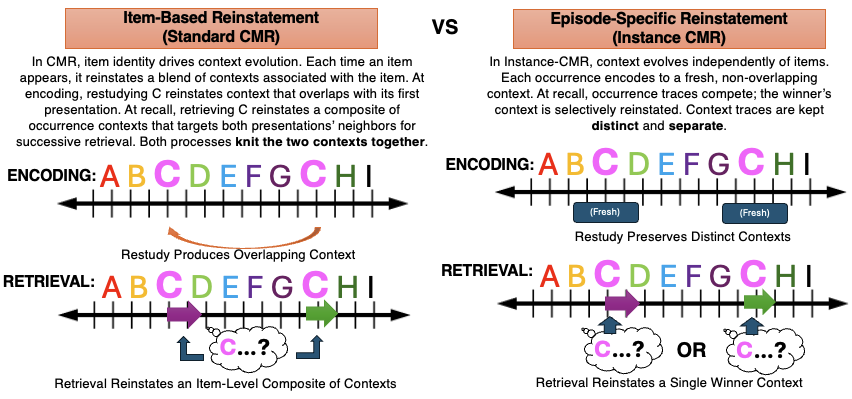

A schematic comparing standard CMR and our proposed episode-specific reformulation Instance-CMR in lists with item repetitions.
:::

How can retrieved-context models and similar frameworks be revised to resolve this mismatch?
We propose a three-part solution.
First, we provide an instance-based reformulation of one of the most prominent implementations of RCT, the Context Maintenance and Retrieval model (CMR) [@howard2002distributed; @polyn2009context].
In CMR, item--context associations are stored in composite weight matrices that map items to a single blended representation of contextual features across their occurrences.
When an item is retrieved, the model looks up and reinstates that composite with no additional selection step.
A contrasting multi-trace approach [@hintzman1984minerva] stores a separate trace for each study event and retrieves by global matching, so a cue elicits a similarity‑weighted blend over the traces it contacts.
In retrieved-context models, that perspective makes reinstatement a design choice: it can reinstate an item-level composite (recovering standard CMR behavior), construct a cue‑weighted blend over an item's occurrences, or become effectively dominated by a single occurrence when trace discrimination is strong.

Instance-based approaches have been effective in domains from category learning [@turner2019toward; @nosofsky2002exemplar; @stanton2002comparisons] to episodic and semantic memory [@cox2020similarity; @hintzman1988judgments; @jamieson2018instance; @shiffrin1997model].
However, aside from the Context Retrieval and Updating (CRU) model for serial-order memory [@logan2018automatic; @logan2021serial], they have played a limited role in retrieved-context modeling of episodic memory search.
The under-representation appears to reflect modeling tradition rather than a theoretical barrier.
The item-driven contextual reinstatement assumption that drives repetition effects in RCT is compatible with a multi-trace store as well as a composite one: even with separate traces per study event, a repeated item can still cue and reinstate an aggregate that blends across its trace set.
Work across domains also shows conditions under which composite and instance formulations become equivalent rather than distinct [@turner2019toward; @kelly2017memory; @ramsauer2020hopfield; @anderson1995introduction].
So whereas CMR's composite architecture converts occurrence-blending reinstatement into an architectural commitment, this work uses an instance-based reformulation to separate storage format from reinstatement dynamics and then ask what additional constraints are required for selective access across repeated occurrences.

If the model still treats item identity as the retrieval unit, then recalling a repeated item reinstates an item-level aggregate across its occurrences, and the interference prediction survives.
The second step is therefore to let occurrence traces, not item labels, compete for retrieval.
Context cues the occurrence traces; the most strongly supported trace drives contextual reinstatement; and the model reports the trace's item label.
This decouples what is retrieved from what is said and supports differentiated access to each occurrence's neighborhood.

However, this mechanism only helps if the occurrence contexts themselves remain distinct, which motivates the third change.
If context updating is item-driven, then a repetition reinstates features tied to the earlier occurrence, pulling the two occurrence contexts toward one another during study.
When occurrence contexts overlap, even cues matched to one occurrence will partially activate the other, producing interference.
So thirdly, we drive study-phase context evolution with unique occurrence or position features rather than item identity.
This keeps occurrence contexts distinct and makes temporal context a reliable marker of episode identity stored alongside item information.

These modifications together yield Instance-CMR, a reformulation of CMR that supports episode-specific contextual reinstatement.
Context evolves via item-independent inputs during study, so repeating a label does not pull the two occurrence contexts toward one another.
Each presentation leaves a separate memory trace with its own contextual associations, rather than contributing to a single item-addressed composite.
During retrieval, traces compete for activation based on their match to the current context cue, and only the winning trace reinstates its associated context while the model reports its item label.
Instance-CMR remains a retrieved-context model: context cues retrieval, and retrieved memories reinstate context to guide subsequent search.
The difference is that these dynamics are organized around study events rather than item-level aggregates, enabling selective access.
Item-independent contextual dynamics provide a disambiguated mental timeline of the past, placing related episodes at distinct points even as shared item features support access across them.
This episode-specific retrieved-context account of memory search reconciles the competing demands of integration and differentiation across repeated experience.

## Roadmap

This work proceeds as follows.
We first specify Instance-CMR and validate that it preserves established retrieved-context benchmarks and fits individual-subject free recall data in lists without item repetitions [@healey2014memory].
We then characterize and test three diagnostic predictions of occurrence blending derived from item-based context reinstatement, focusing on one free recall dataset and one serial recall dataset and summarizing replications across four additional datasets in supplementary analyses.
Next, we isolate CMR's study-phase retrieval mechanism in an ablation analysis, showing that it does not improve fits to spacing and repetition effects in free recall and can attenuate the spacing effect by reducing contextual variability across occurrences [@lohnas2014retrieved].
We then demonstrate how Instance-CMR, with item-independent context evolution and occurrence-specific retrieval, accounts for repeated-item transition patterns while preserving established retrieved-context phenomena.
Finally, we present an extension and set of simulations that probe remaining gaps between model and data and outline directions for future work.

Together, these results put pressure on any account of episodic memory search in which item identity serves as the retrieval unit for contextual associations.
Item identity can be shared across repeated occurrences, but temporal context must evolve independently of item identity to preserve access to occurrence-specific detail.

<!-- 
A visit to the neighborhood bakery illustrates the challenge.
On Monday you step inside, inhale warm cinnamon, and buy a fresh loaf. 
Ten days later you return and are greeted by the aroma of espresso and a new cashier. 
Weeks later, a friend's mention of "the bakery down the street" brings both visits to mind.
Both the loaf and the espresso come back, yet you may still know which purchase happened when.
Memory can connect the related episodes without collapsing their distinctive details. 
-->
<!-- 
In this work, we show that participants reliably differentiate occurrences in both tasks, placing sharper constraints on how search can integrate across repetition without blurring episode-specific detail. 
-->
<!-- 
Overall I'm inclined to preserve the basic structure of the section unless there's a really big reason not to. So yes I'd open with an overview paragraph where the key summary schematics happen and I introduce key symbols and provide a roadmap of the presentation. Then I get into the structure of the memory representations, focusing on highlighting the difference and parallels between instance-based and connectionist memories. Maybe I can do this mroe cohesively than I do in icmr.qmd by not separating sections, caring a little less about providing a compete presentation of standard CMR (referring readers to Morton & Polyn, 2016 to compensate). Then Encoding Dynamics then Retrieval dynamics, the first section focsed on the difference between episode/position code instead of item-based context reinstatement, and the second section focused on the difference between item- and trace- based retrieval. Then follow-up sections a) clarifying relationship to standard CMR, b) specifying variants and extension mechanisms specified by NoSPR and Reinf. How does this compare with your vision? 
-->

# Instance-CMR: An Episode-Specific Retrieved-Context Account of Memory Search

This presentation of Instance‑CMR aims to isolate the smallest set of changes needed for episode‑specific reinstatement within a retrieved‑context model.
We specify it by adapting the likelihood-based CMR framework developed for model evaluation by @kragel2015neural and @morton2016predictive.
This framework assigns trial-level probabilities to each recall, enabling likelihood-based fits to individual subjects.
We retain CMR's parameterization, its pre-experimental initialization, and its two associative memories, $M^{CF}$ and $M^{FC}$.
Our main representational change is that the feature layer indexes study events rather than item labels: each list position is treated as a distinct address, and the item presented at that position is stored as a label for later report.
In lists without item repetitions, this is essentially a relabeling; the consequences matter when the same item label maps to multiple study events.
Given that representation, Instance‑CMR differs from standard CMR in two respects that matter for repetition.
During study, context updating is driven by item-independent, position-indexed inputs rather than item-driven study-phase reinstatement.
During recall, competition and contextual reinstatement operate over study-event traces, and the retrieved trace's label determines the response.
Here we define the representations and walk through the study and recall dynamics.

<!-- TODO: schematic figure(s).
Key visual contrasts to include:
(1) Standard CMR: context → item → (composite) context reinstatement; repeated items imply composite reinstatement.
(2) Instance-CMR: context → trace → item label; the retrieved trace reinstates its own context (episode-specific).
(3) Task fork: free recall uses a positional stop hazard; serial recall uses an END trace that competes to terminate recall.
-->

| Symbol | Name | Description |
|-------------------|-------------------|----------------------------------|
| $C$ | temporal context | Recency-weighted context state that drifts during study and recall |
| $F$ | position features | Feature layer indexing study events (one unit per list position) |
| $M^{FC}$ | feature-to-context memory | Encoded feature-to-context associations |
| $M^{CF}$ | context-to-feature memory | Encoded context-to-feature associations |
| ${\beta}_{enc}$ | encoding drift rate | Rate of context drift during study |
| ${\beta}_{start}$ | start drift rate | Amount of start-list context retrieved at start of recall |
| ${\beta}_{rec}$ | recall drift rate | Rate of context drift during recall |
| ${\alpha}$ | shared support | Uniform pre-experimental support across positions in $M^{CF}$ |
| ${\delta}$ | self support | Pre-experimental self-association for each position in $M^{CF}$ |
| ${\gamma}$ | learning rate | Learning rate for updates to $M^{FC}$ |
| ${\phi}_{s}$ | primacy scale | Scaling of primacy gradient during learning in $M^{CF}$ |
| ${\phi}_{d}$ | primacy decay | Rate of decay of the primacy gradient |
| ${\theta}_{s}$ | stop probability scale | Baseline of the stopping process over outputs |
| ${\theta}_{r}$ | stop probability growth | Slope of the stopping process over outputs |
| ${\tau}_{c}$ | choice sensitivity | Exponential scaling of $M^{CF}$ activations in recall competition |

: Parameters and structures specifying Instance-CMR. {#tbl-cmr-parameters}

<!-- | ${\tau}_{f}$ | reinstatement sensitivity | Exponential scaling of trace-mixture weights in $M^{FC}$ reinstatement | -->

## Representations and Memory Architecture

Instance-CMR keeps the standard CMR separation between a temporal context layer $C$ and a feature layer $F$, but here $F$ indexes list positions rather than item identities.
Each study position $t$ is represented by a one-hot position code $f_t$, and the item presented at that position is stored as a label $w_t$ for later report.
Temporal context includes a start-of-list unit plus one unit per list position and is always normalized to unit length.

As in CMR, associative memory is split into $M^{FC}$ and $M^{CF}$.
Before study, $M^{FC}$ maps each position to its corresponding context unit (excluding the start-of-list unit) with weight $1-\gamma$,

$$
M^{FC}_{\text{pre}}(i,j) =
\begin{cases}
1-\gamma & \text{if } i=j \text{ and } i>0 \\
0 & \text{otherwise}
\end{cases}
$$ {#eq-1}

and $M^{CF}$ provides shared support $\alpha$ across positions with self-support $\delta$ on the diagonal, while the start-of-list unit has no pre-experimental associations,

$$
M^{CF}_{\text{pre}}(i,j) =
\begin{cases}
0 & \text{if } i=0 \\
\delta & \text{if } i=j \text{ and } i>0 \\
\alpha & \text{if } i>0, i\neq j
\end{cases}
$$ {#eq-2}

where $i$ indexes context units ($i=0$ is the start-of-list unit) and $j$ indexes positions.
This preserves the pre-experimental structure of the likelihood-based CMR specification while replacing item features with position features.

During study, $M^{FC}$ and $M^{CF}$ are updated by outer-product learning.
With position code $f_t$ and the pre-update context $c_{t-1}$, the updates are

$$
\Delta M^{FC} = \gamma\,f_t c_{t-1}^{\top}, \qquad
\Delta M^{CF} = \phi_t\,c_{t-1} f_t^{\top},
$$ {#eq-3}

where $\phi_t$ scales the primacy gradient at position $t$ [@sederberg2008context]:

$$
\phi_t = 1 + \phi_s \exp\{-\phi_d (t-1)\}.
$$ {#eq-4}

This is the standard likelihood-based CMR learning rule, applied here with position codes in place of item identities.

## Encoding Dynamics (Study)

At study position $t$, the model uses the position code $f_t$ to probe $M^{FC}$ and produce a context input $c^{\text{IN}}_t = M^{FC} f_t$.
Temporal context then integrates this input with the leaky, unit-length update rule

$$
c_t \;=\; \rho_t\,c_{t-1} \;+\; \beta_{\text{enc}}\,c^{\text{IN}}_t,
$$ {#eq-5}

with normalization

$$
\rho_t \;=\; \sqrt{1 + \beta_{\text{enc}}^2\bigl[(c_{t-1}\cdot c^{\text{IN}}_t)^2 - 1\bigr]}\;-\;\beta_{\text{enc}}(c_{t-1}\cdot c^{\text{IN}}_t),
$$ {#eq-6}

as in the likelihood-based CMR implementation [@morton2016predictive].
This preserves the CMR mechanism that binds each event to a gradually drifting context signal.

Because $c^{\text{IN}}_t$ is driven by position codes rather than item identity, repeating an item does not reinstate the context from its earlier occurrence during study [@lohnas2014retrieved].
The position code is what binds to context in memory, while the item label is recorded only for later report.
After updating context, the model applies the $M^{FC}$ and $M^{CF}$ learning rules above and marks the current position as recallable.

## Retrieval Dynamics (Recall)

At recall, the current context cue activates study positions through $M^{CF}$.
Let $\mathcal{R}$ be the set of recallable positions and let $a_t = (M^{CF}c)_t$ denote the activation for position $t\in\mathcal{R}$.
These activations are sharpened by the choice sensitivity parameter,

$$
s_t \;=\; a_t^{\tau_c},
$$ {#eq-7}

and pooled to item labels for the recall decision.
If $w_t$ is the word label stored at position $t$, then the probability of recalling item $w$ is

$$
P(w \mid c) \;=\; \frac{\sum_{t\in\mathcal{R}: w_t=w} s_t}{\sum_{k\in\mathcal{R}} s_k}.
$$ {#eq-8}

After item $w$ is reported, contextual reinstatement is computed as a mixture over the positions that carry that label.
The within-item weights follow directly from the recall supports,

$$
q_t \;=\; \frac{s_t}{\sum_{k: w_k=w} s_k},
$$ {#eq-9}

so reinstatement depends on the same choice sensitivity $\tau_c$ that shapes the recall distribution.
The context input for reinstatement is $c^{\text{IN}} = M^{FC}q$.
Context then updates by

$$
c_{\text{new}} \;=\; \rho\,c \;+\; \beta_{\text{rec}}\,c^{\text{IN}}.
$$ {#eq-10}

The mixture form resolves the ambiguity that a reported label does not uniquely identify which position trace was retrieved: it reinstates the expected context conditional on the observed label under the model’s own support distribution.

Recallability is tracked at the position level.
When repeated recalls are disallowed, all positions with the reported label are suppressed; when they are allowed, recallability is left unchanged, permitting multiple outputs of the same label.

## Task Implementations and Termination

The retrieval competition and reinstatement rules above are shared across tasks.
The only task-specific constraints we enforce are the termination rule and the allowance of repeated responses in serial-recall lists with repetitions.
Recall initiation follows the same mechanism in both tasks, with parameters fit separately within the shared dynamics.
We retain distinct termination mechanisms because stopping dynamics differ between free and serial recall, and each mechanism fits its own task better [@gunn2025bridging].
Otherwise, differences in performance between task domains are accounted for through parameter variation within the shared Instance-CMR architecture.

For free recall, we use the likelihood-friendly CMR-style termination rule in which stopping is a separate process from retrieval and depends only on output position $j$ (the number of recalls already produced) [@kragel2015neural; @morton2016predictive]:

$$
P(\text{stop}, j) \;=\; \theta_s\,e^{j\theta_r}.
$$ {#eq-11}

Conditional on continuing, the model samples an item label from $P(w \mid c)$.
This positional hazard captures flexible stopping without requiring termination to be mediated by the current contextual state.

For serial recall, we adopt the CRU-style context-based termination mechanism in which the end of the list is treated as an additional stored event that competes for retrieval [@logan2018automatic; @logan2021serial].
After study the model stores an additional END position associated with the terminal study context.
During recall, this END position is included in the same competition; if it is retrieved, the recall sequence terminates.
This makes termination depend on the evolving context cue and predicts termination to be most likely when context resembles the end-of-list state.
Repeated responses are allowed in serial-recall lists with repetitions so that all occurrences can be reported.

## Variants and Extensions

Although the main text focuses on Instance-CMR as the episode-specific account, later sections consider two targeted modifications to clarify which mechanisms matter.
One removes study-phase reinstatement from standard CMR to test whether that mechanism improves fits to spacing and repetition functions or instead introduces undesirable contextual overlap across occurrences.
The other strengthens the first-occurrence association at a repetition without reinstating its contextual features, preserving episode-specific encoding while probing whether additional strengthening is required to capture remaining gaps in repetition effects.
Together, these variants bound the contribution of study-phase reinstatement versus repetition-driven strengthening once episode-specific reinstatement is in place.
They also provide a compact bridge from the model specification to the later simulation sections.

# Methodological Framework

Our methodology isolates repetition-specific effects using a refined position-matching baseline and symmetric scoring.
We define the estimand and baseline, then summarize the datasets that anchor the free- and serial-recall analyses, noting which serve as primary tests and which provide supplementary checks.
Model-evaluation procedures and diagnostic analyses are introduced in their respective sections, where we apply this framework to behavioral data and simulations.

## Defining and Measuring Repetition Effects

What counts as a repetition effect?
It is tempting to say that any change in recall that follows multiple presentations of an item qualifies.
Yet that definition confounds two influences: (i) the ordinary consequences of exposing participants to additional study material and (ii) the special consequences of encountering the same material twice.
We reserve the term repetition effect for the second influence alone. 
Formally, it is the difference in recall performance that arises when a study event is a re-presentation of an earlier item rather than a novel item presented in the same serial positions.
This definition invokes a counterfactual baseline:
What would performance look like if the memory system processed the repetition in exactly the same way it would have processed a novel token, differing only in the arbitrary fact that the stimulus label is repeated?
The difference between that baseline and observed performance constitutes the repetition effect proper.

The baseline cannot be observed directly, so it must be estimated.
A common but flawed shortcut treats singletons in the same mixed lists as the baseline for repeaters.
That comparison is problematic because item repetitions in mixed lists impact memory for all items in the list, not just the repeated item itself.
They change rehearsal allocation, output competition, and contextual drift, disrupting characterization of performance in the absence of repetition [see @tulving1972inhibition; @ratcliff1990list].
This conflation can mimic repetition effects or mask genuine repetition benefits.

Following @lohnas2014retrieved, we instead estimate this baseline using position-matched control lists that mirror each mixed list in length and temporal structure.
For every mixed-list trial, we pair many control-list trials performed by the same participant that share the number of items, presentation schedule, instructions, and other relevant factors.
In each control list, we designate the items occupying the repeater's two positions $i$ and $j$ as a pseudo-repeater pair.
We then recompute the target statistic after relabeling those two positions as a single pseudo-item.
Repeating this resampling many times yields a null distribution under the no-special-status hypothesis -- the memory system treats the two positions as independent study events that differ only in label.

Building on this foundation, we clarify how recalls from the matched positions are scored.
Just as the two occurrences of "canoe" in a mixed list are analyzed as a single item, so too must the two matched positions in each control list be treated as a single pseudo-repeater.
Any analysis that ignores this identity relation in control lists mischaracterizes the null.
We therefore adopt a symmetric scoring rule: a recall from either matched position counts as a recall of the pseudo-repeater.
A second recall of either position is treated as a repeated recall of the same item and is normally excluded from transition tallies.
Alternative conventions -- e.g., scoring only one position, tallying the two positions independently, or requiring both positions to count -- lower the baseline and can inflate apparent repetition effects.
Such analytic choices, rather than psychological mechanisms, may explain discrepancies between our results and some prior reports.
We highlight some possible discrepancies in our re-analyses of published datasets.

Our procedure therefore combines (i) between-trial comparison to isolate repetition effects from list-composition effects, (ii) serial-position matching to preserve temporal structure, and (iii) explicitly symmetric scoring to preserve logical identity.
Comparing mixed lists to this matched, symmetric baseline isolates the estimand -- the counterfactual advantage or cost of being a repetition rather than a novel token in the same positions.
Applied below, the approach markedly attenuates or eliminates patterns previously labeled as repetition effects and yields a cleaner test bed for evaluating retrieved-context models.

## Datasets

We draw on multiple archival datasets spanning free and serial recall with within-list repetitions. Data from @lohnas2014retrieved serve as the primary free recall test bed because they include both mixed and control lists under identical procedures, enabling the matched-baseline estimation. Data from @logan2021serial Experiment 2 serve as the primary serial recall test bed because they isolate single repeats at short lags with tight list control. We also use @broitman2024neural and @lohnas2025temporal as complementary free recall checks and @kahana2000interresponse to cover longer lags and learning-to-criterion serial recall; these additional datasets provide robustness tests where noted.

Across 4 sessions, 35 subjects in @lohnas2014retrieved performed delayed free recall of 48 lists. Subjects encountered control lists with all once-presented items, pure massed lists with immediate repeats, pure spaced lists with repeats at lags 1-8 (lag is the number of intervening items), and mixed lists containing once-presented, massed, and spaced items; each session included three lists of each type and list order was randomized. Each list had 40 positions. Control lists contained 40 unique items, pure massed and pure spaced lists contained 20 repeated items occupying the 40 positions, and mixed lists contained 28 singletons and six repeated items. In pure spaced lists each lag 1-8 occurred equally often, and in mixed lists each lag 0-8 occurred exactly twice per session.

We include @broitman2024neural to test model predictions in a free recall setting that omits control lists, providing a complementary generalization check under high trial counts. Across 6 sessions, 52 participants performed delayed free recall with mixed lists. Each list contained 12 unique words, half presented once and half presented twice, yielding 18 total presentations per list. Repeat items were separated by at least three intervening presentations. The first presentation of a repeated item always occurred within the first 12 serial positions, and the second always occurred after position 6. Single items were distributed across all serial positions. Words were selected to minimize adjacent semantic similarity using Word Association Spaces, reducing confounds between temporal and semantic associations. In each session, participants completed 21 lists under a consistent study-then-recall procedure with a fixed post-encoding delay before recall. Control lists were not included in this experimental design, so we use this dataset for qualitative benchmarks and model comparisons that do not require matched-baseline estimation.

We also analyze @lohnas2025temporal (Experiments 1-2, pooled) as another free recall test bed with mixed lists and control lists, but with different constraints. Each participant completed a single remote session with 10 lists drawn from a 576-noun pool, constructed to minimize within-list semantic similarity (WAS constraints) and to balance concreteness, valence, and frequency across lists. Two lists were controls with 20 unique items, and eight were mixed lists with 19 unique items plus one word repeated once. The repeated word appeared in one of four configurations defined by first-occurrence position (6 or 7) crossed with spacing (5 or 6 intervening items), with each configuration used twice; list order and within-list order were randomized. Experiment 1 used delayed free recall with 20-item lists and a post-encoding distractor, whereas Experiment 2 used immediate free recall with 24-item lists and no distractor. Unless noted otherwise, we pool recall data across experiments while tracking an experiment indicator to assess robustness to the delay manipulation.

We use @logan2021serial Experiment 2 to evaluate repetition effects in serial recall under tightly controlled list structure and short lags. Twenty-four participants completed lists designed to test repetition effects in serial recall. Participants were recruited for self-reported typing speed of at least 40 WPM, with a mean of 76.74 WPM (SD 21.03) and mean accuracy of 93.66% (SD 2.77). All lists were six letters long and letters were sampled uniformly from the 26-letter English alphabet. There were 576 lists in total divided evenly across multiple task variants, and our analyses focus on the serial-recall subset. Within each task, 96 lists contained no repetitions and 96 lists contained a single repeated letter. For repeated lists, the lag between the two occurrences was 0, 1, 2, or 3 with 24 lists at each lag. Repeated items appeared in all possible positions with equal frequency for lags 1-3, and for lag 0 four positions were tested five times while one position was tested four times. Lists with and without repetitions were randomly interleaved. On each trial, the six-letter array was displayed simultaneously for 1000 ms, then removed, and participants typed the letters in order. A 1000-ms blank screen followed each response before the next trial.

We analyze @kahana2000interresponse to probe serial recall with a wider lag range and ensure generalization of our serial recall results across datasets. Twenty participants completed 12 sessions of serial recall. Each session comprised 36 lists built from randomly arranged consonants excluding "Y". Lists crossed three lengths (11, 12, 13) with two repetition conditions (no repeats vs one repeated consonant), six lists per cell. In repetition lists a single consonant was repeated with lag 0-5, and the first occurrence was never in the first two or last two positions. On each study-test cycle, consonants were shown one at a time for 1000 ms with a 250-ms interstimulus interval, followed by typed forward recall without backspace. Lists were re-presented and tested until participants achieved three consecutive perfect forward recalls, after which a single backward recall was administered. For the present analyses we use only the first forward recall immediately following the initial study presentation for each unique list. Backward recall trials and subsequent forward recalls used to reach criterion are excluded. We also do not analyze inter-response times. Assignment of consonants to list structures and the order of list conditions were separately randomized for each participant and session.

# Model Evaluation

We evaluate models using two complementary approaches: likelihood-based fitting and generative performance assessment.
Given an arbitrary parameter configuration and sequences of responses to predict, a model simulates encoding of each item presented in the corresponding study list in its respective order.
Then, beginning with the first item the participant recalled in the trial, the probability assigned by the model to the recall event is recorded.
Next, the model simulates retrieval of that item, and given its updated state is used to similarly predict the next event in the recall sequence - either retrieval of another item, or termination of recall - and so on until retrieval terminates.
The probability that the model assigns to each event in the recall sequence conditional on previous trial events are thus all recorded.
These recorded probabilities are then log-transformed and summed to obtain the log-likelihood of the entire sequence.
Across an entire dataset containing multiple trials, sequence log-likelihoods can be summed to obtain a log-likelihood of the entire dataset given the model and its parameters.
Lower negative log-likelihoods assigned to datasets by a model correspond to better effectiveness accounting for those datasets.

While quantitative model comparison helps measure relative evidence in favor of one model over another, tests of the ability of candidate models to produce specific effects from data can provide more direct evidence for or against a model's account of memory [@palminteri2017importance].
Failure to reproduce an effect that is well-established in the literature can effectively falsify a model, requiring new or modified models to account for the data.
To evaluate the generative performance of the CMR model and its variants, we will first fit model variants to applicable data using the likelihood-based evaluation and fitting techniques reviewed above.
Next, we will simulate data from the model using the fitted parameters and apply proposed analyses to the simulated data to measure the model's ability to predict the outcomes of these analyses.
The match between the model's predictions and the observed data quantifies the model's generative performance.

# Model Validation on Non-Repetition Lists

We first validate Instance-CMR on lists without item repetitions to show that the model preserves established retrieved-context benchmarks in the single-presentation regime. We use a subset of the PEERS dataset reported by @healey2014memory: 126 participants each studied 112 lists of 16 unique words followed by immediate free recall. The word lists were sampled for low semantic similarity from the Toronto Word Pool [@friendly1982toronto], providing a clean baseline for temporal organization.

We fit the model to individual-subject recall sequences using the likelihood procedure described above and then simulate recall with the fitted parameters. We summarize fits using three standard statistics that will recur throughout the paper. The serial position curve reports recall probability by study position and captures primacy and recency. The probability of first recall describes where recall begins. The lag-CRP measures the conditional probability of transitioning to an item at a given lag relative to the previous recall, indexing temporal contiguity.

Instance-CMR captures these benchmarks in the non-repetition lists, reproducing the primacy/recency profile, the tendency to initiate from late list positions, and the characteristic forward-leaning contiguity pattern. This provides a baseline validation that the model behaves like standard retrieved-context accounts in the single-presentation case before we test repetition-specific predictions.

::: {#fig-healey2014memory layout="[[1,1,1],[1,1,1]]"}
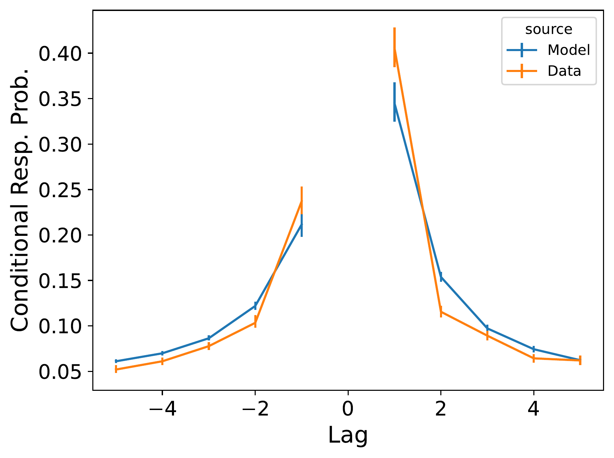
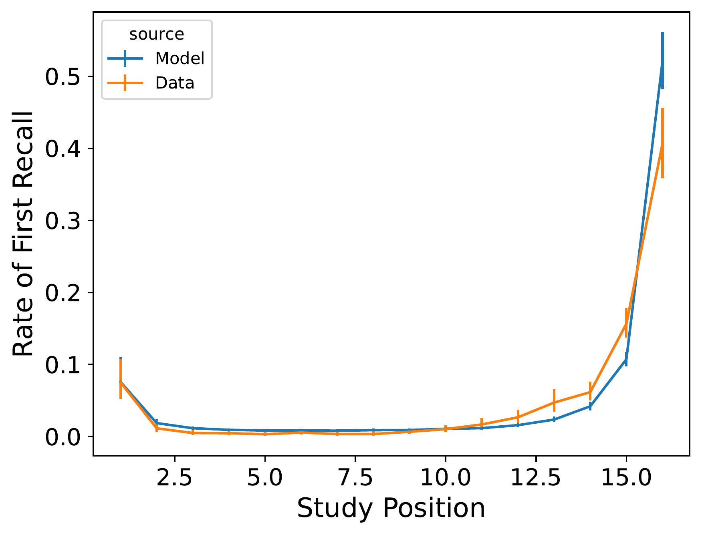
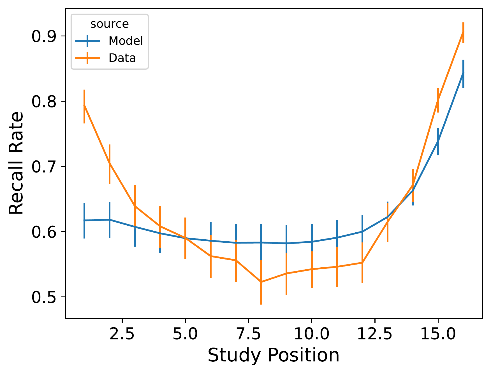

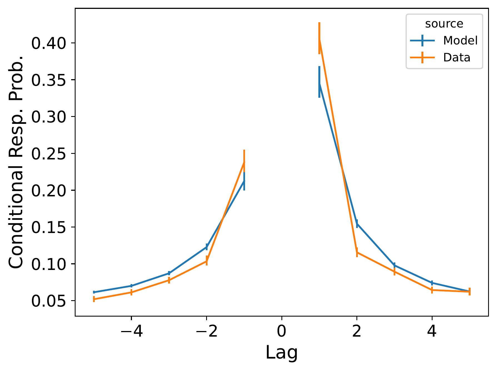
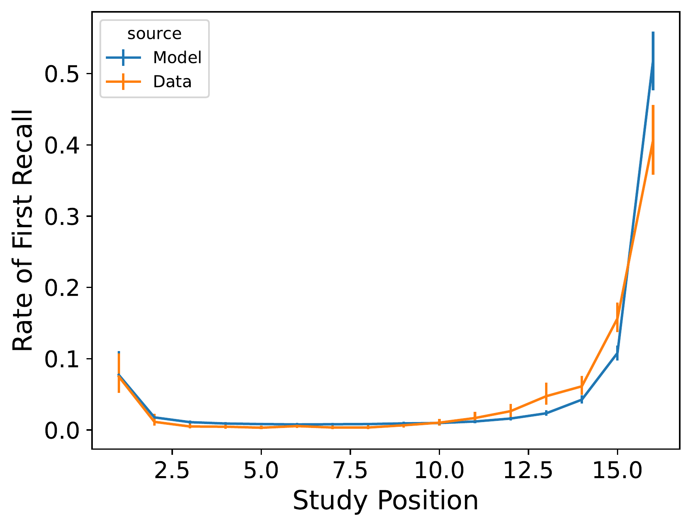

Summary statistic fits to @healey2014memory. Left: standard CMR. Right: Instance-CMR. Top: lag-CRP. Middle: probability of first recall. Bottom: serial position curve.
:::

# Reassessing Empirical Benchmarks Against CMR

Before turning to repetition-specific diagnostics, we verify that mixed and control lists are comparable once the matched, symmetric baseline is applied, and that standard CMR reproduces the benchmarks that any viable free-recall account must capture. 
Error bars for any figure reflect a bootstrapped 95% confidence interval over subject means, enabling statistical inference on the group level.
@fig-control_method shows serial-position curves (SPCs), lag-conditional response probabilities (lag-CRPs), and probabilities of first recall (PFRs) for mixed and control lists in @lohnas2014retrieved, plotted in raw form (left) and after baseline correction (right). 
In the raw SPCs, mixed lists appear to enjoy a mid-list advantage; after position matching and symmetric scoring this inflation vanishes, and SPCs from mixed and control lists are essentially indistinguishable. 
Small raw differences in the lag-CRP likewise disappear under the baseline, and the PFRs are virtually identical across conditions. 
With the basic benchmarks satisfied and no substantive differences between mixed and control lists once the baseline is applied, we can focus on analyses that more directly test the predictions of item-based context evolution.

Standard CMR broadly reproduces these benchmarks under the same scoring and similarly predicts limited differences between SPC, PFR, and lag-CRP outcomes across mixed and control lists(@fig-cmr_benchmarks). 
We therefore focus our evaluation on the specific predictions that arise from the model's treatment of repeated items.

::: {#fig-control_method layout="[[1,1], [1,1], [1,1]]"}

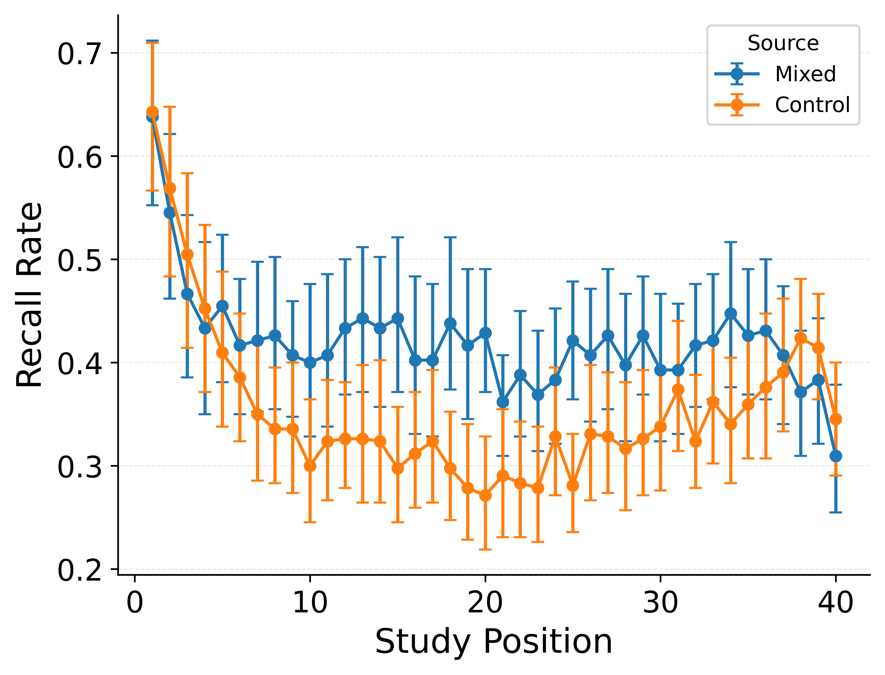

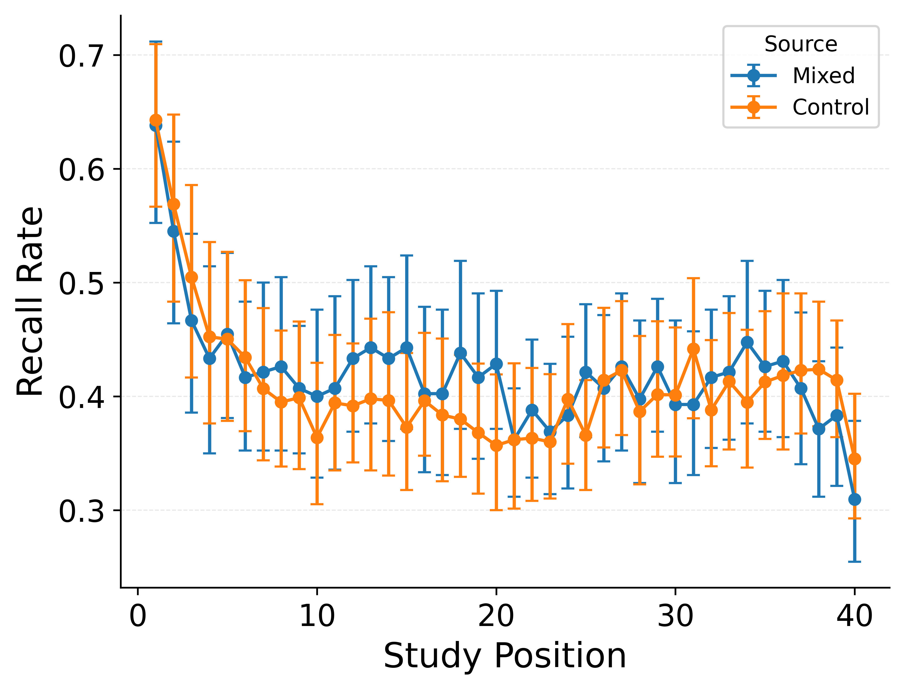

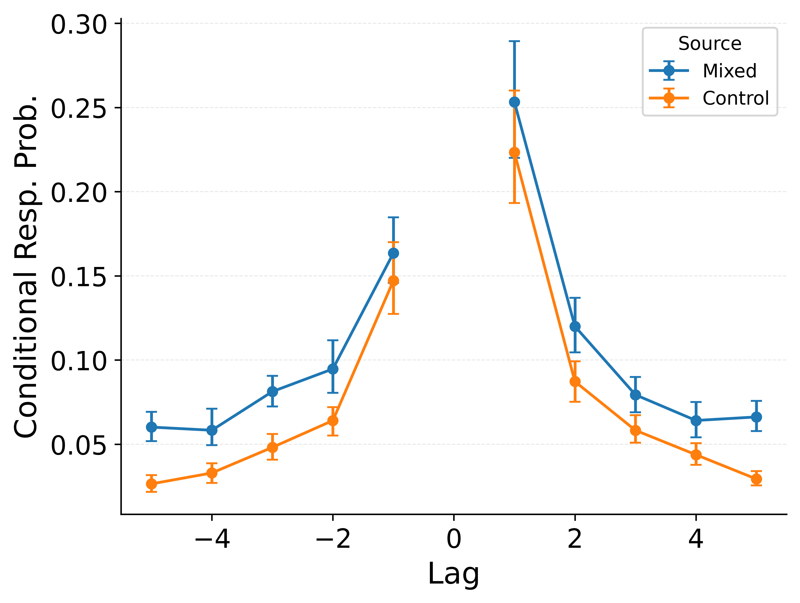

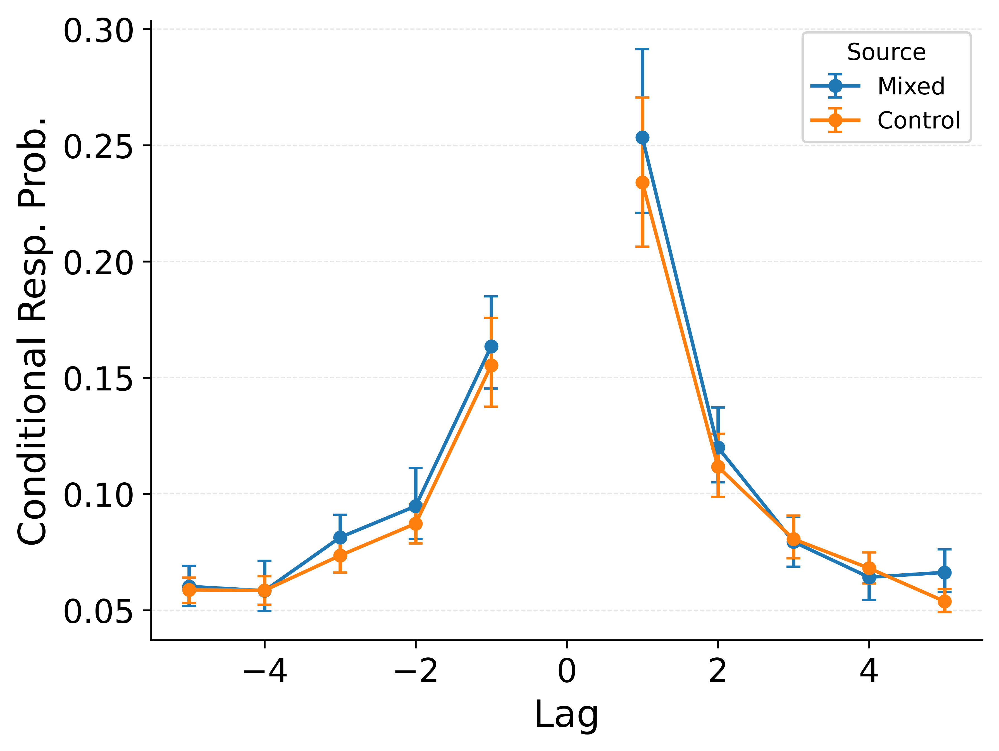

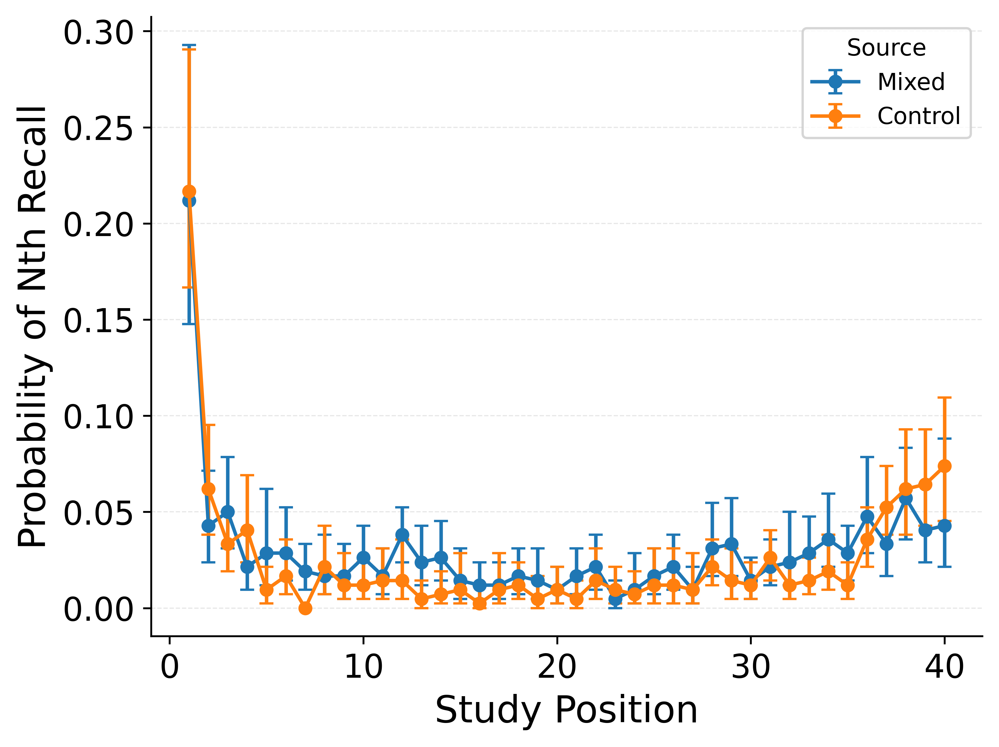

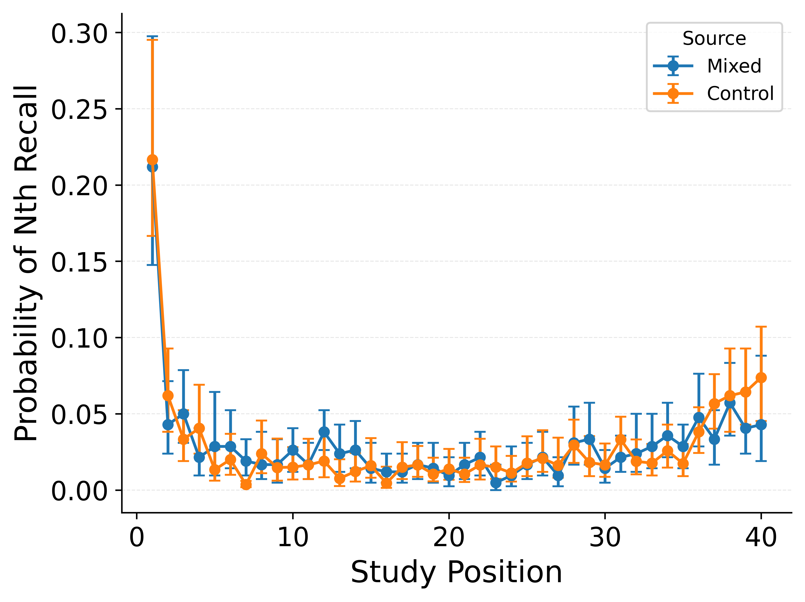

Raw (Left) vs control-corrected (Right) benchmark summary statistics for mixed vs control list trials from @lohnas2014retrieved. 
Top row: recall rate by serial position (serial position curve, SPC).
Second row: conditional response probability (CRP) by lag.
Third row: probability of first recall by serial position.
:::

::: {#fig-cmr_benchmarks layout="[[1,1],[1]]"}

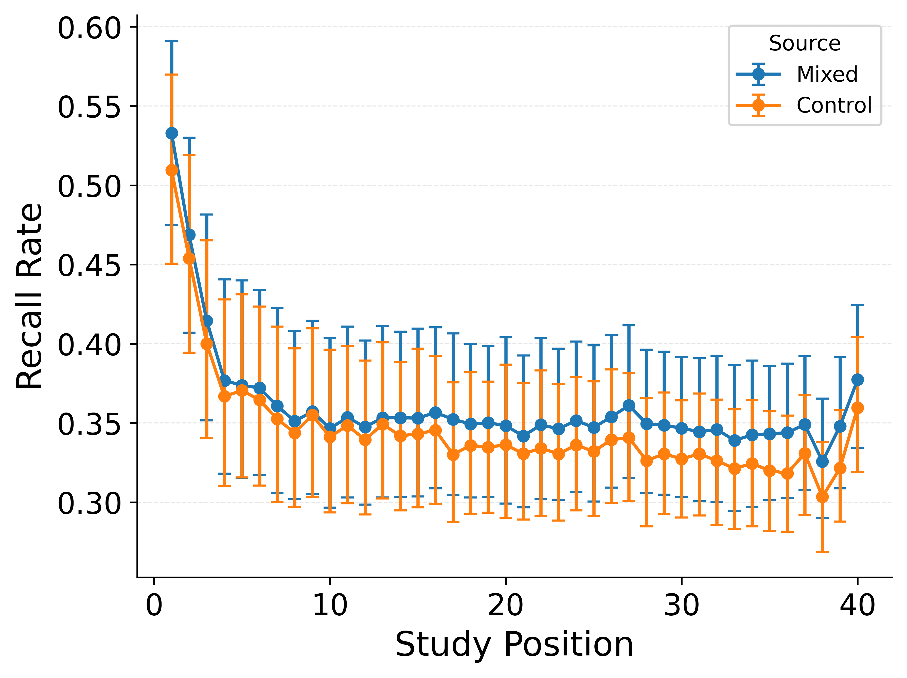

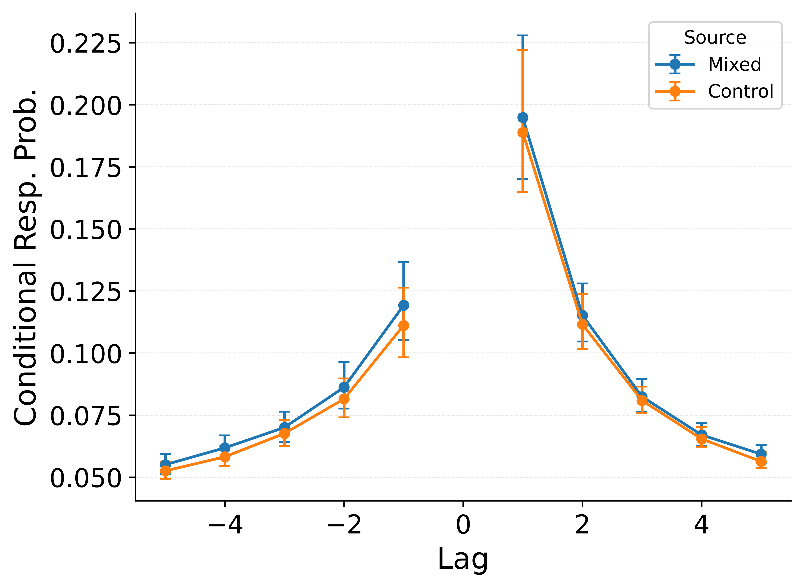

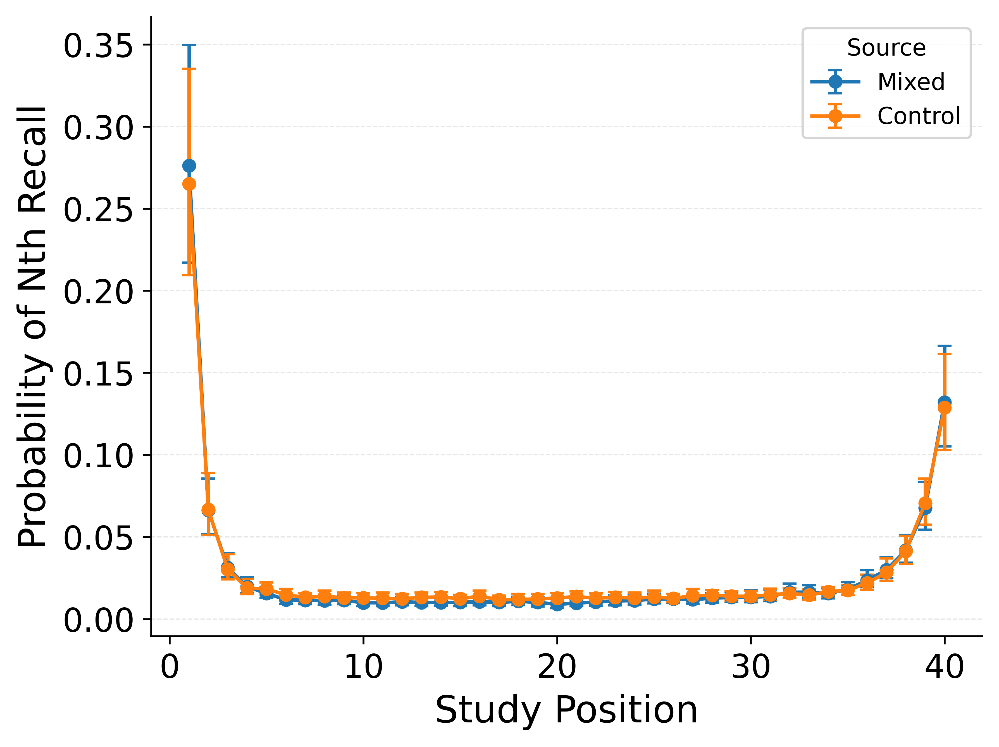

Standard CMR predictions for mixed and control list trials from trials from @lohnas2014retrieved, with symmetric scoring over matched serial positions of repeated items.
Left: recall rate by serial position (serial position curve, SPC).
Middle: conditional response probability (CRP) by lag.
Right: probability of first recall by serial position.
::: 

## The Spacing Effect

The spacing effect is classically understood as a repetition effect, and has been a central focus of research on memory for repeated experience [@cepeda2006distributed]
However, it applies even to pairs of distinct items, not just repeated items.
By measuring the probability of retrieving either of two study items during a free recall trial -- an analysis termed the "OR score" -- research often finds that pairs of spaced items were more likely to be recalled than pairs of massed items [@lohnas2011contextual].
Notably, in a phenomenon called "superadditivity", the mnemonic benefit of spacing is argued to be more pronounced for repeated items than for distinct items.
The probability of recalling an item repeated in a spaced fashion may be higher than the probability of recalling one of two distinct but similarly spaced items, violating statistical independence [@benjamin2010distributed].
Study-phase retrieval or other mechanisms specific to item repetitions are thought to complement contextual variability mechanisms to produce such superadditivity.

@fig-spacing displays the spacing function for mixed and control lists in @lohnas2014retrieved alongside fitted CMR simulations. 
In the data, the spacing function estimated from mixed lists appears steeper than the function derived from our position-matched, symmetric baseline (left panel of @fig-spacing).
Because the baseline equates list length, presentation schedule, and scoring opportunity, the slope difference cannot be attributed to serial-position or scoring artifacts; it suggests a repetition-specific boost over and above the spacing effect observed for equally spaced distinct items (i.e., a superadditive component).
Standard CMR, by contrast, reproduces the overall monotonic spacing advantage but shows no apparent corresponding slope separation between mixed and baseline conditions (right panel of @fig-spacing).
Thus, while CMR captures the basic memorability gain with increasing lag, it does not express the additional repetition-specific steepening present in the data.

::: {#fig-spacing layout="[[1,1]]"}

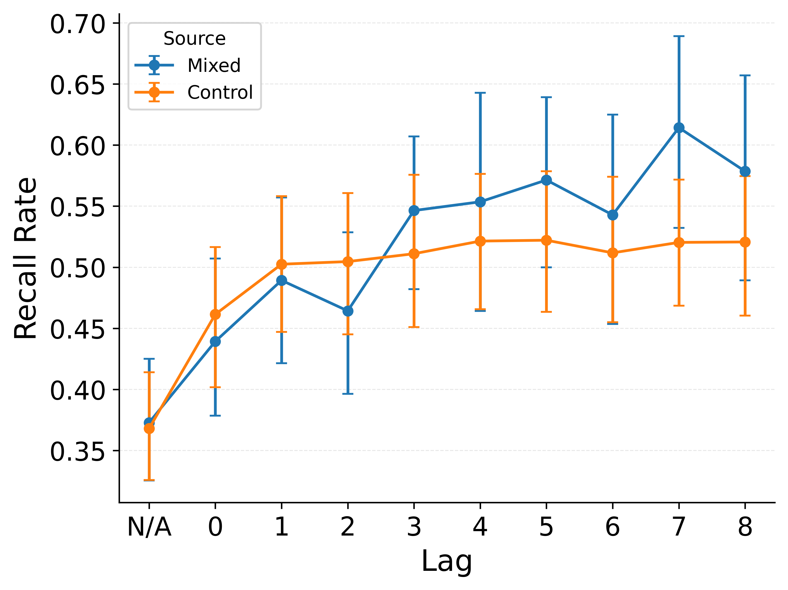

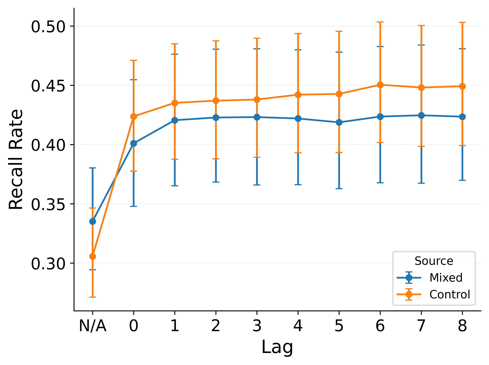

The spacing effect for mixed vs control list trials from @lohnas2014retrieved. Left: data, right: simulations of standard CMR fitted to the data.
:::

# Diagnostic Tests of Cross-Occurrence Associative Interference

## Analytic definitions

All analyses use the matched, symmetric baseline defined above.
For each mixed-list trial with a repeater at positions $i$ and $j$, we pair many control-list trials that match list length and presentation schedule; in each control list we designate $i$ and $j$ as a single pseudo-repeater and apply symmetric scoring.
Unless noted, conditional probabilities are computed over eligible transitions (targets exist and have not yet been recalled), aggregated within participant, and then averaged across participants.
Mixed–minus–baseline contrasts isolate the contribution of repetition structure.

### Repetition lag-CRP (outgoing)

::: {#fig-rep-crp-base layout="[[1, 1]]"}
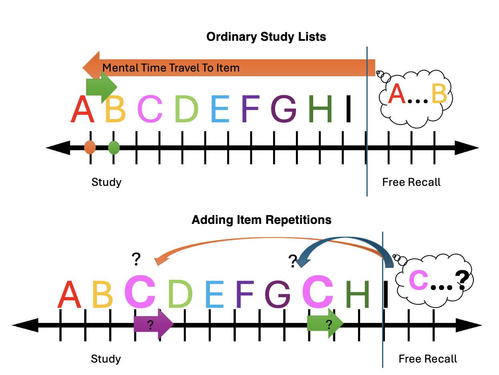{#fig-rep-crp-schematic}

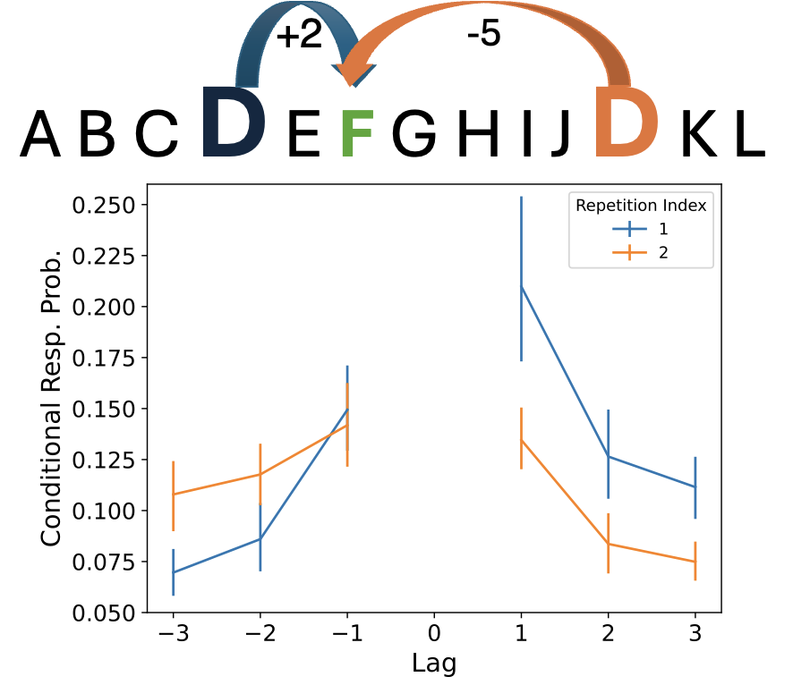{#fig-rep-crp-base}

**The repetition lag-CRP.** *A.* The lag-contiguity effect conceptualizes free-recall search as movement along a mental timeline, but repeated items occupy two positions on that timeline.
*B.* Extending the lag-CRP, we tabulate transitions from a recalled repeater relative to both its study positions.
Illustration from mixed lists in @lohnas2014retrieved.
:::

The goal is to test whether retrieving a repeater reinstates a composite of its occurrence-specific contexts (blending) or selectively routes through one occurrence (occurrence-specific access).
For every recall of a repeater with study positions $i$ and $j$ ($i<j$), we construct two centered lag-CRPs: one treating $i$ as the center and one treating $j$ as the center.
From the first-centered cue, a $+1$ transition is to position $i{+}1$; from the second-centered cue, a $+1$ transition is to position $j{+}1$.
Each centered curve gives the probability of the very next recall at each available lag, conditional on eligibility.

Interpretation proceeds by comparing mixed lists to the position-matched baseline.
Blending predicts that, relative to baseline, outgoing transitions will be *more balanced* across the two centers (reduced separation of first- vs second-centered curves) because both occurrence contexts contribute to the cue.
Occurrence-specific reinstatement predicts a *preserved or enlarged separation*, typically favoring the first occurrence (e.g., higher $+1$ from the first center than from the second).

### Repetition lag-CRP (incoming; "backward" variant)

This variant helps explore the extent to which any asymmetry in the outgoing analysis arises from how repeaters are cued versus how they cue what follows.
For every recall of a repeater, we look one step back to the immediately preceding recall and compute lags centered on the repeater's first and second study positions.
If the asymmetry is already present on incoming transitions, list context before the repeater tends to match one occurrence's neighborhood more than the other (a cue-driven effect).
If incoming curves show little asymmetry but outgoing curves do, the asymmetry is more likely due to how the repeater *reinstates* context.

Because this measure conditions on the event that a repeater is recalled, it helps separate how the search state approached the repeater from how the repeater redirects the next step.

### Cross-occurrence neighbor contiguity (free recall)

@lohnas2014retrieved introduced a neighbor-contiguity test for cross-occurrence blending: if the first-presentation context is reinstated at the second, neighborhoods around the two presentations become associatively linked.
They measured the probability of transitions from a $+1$ or $+2$ neighbor of one presentation to a $+1$ or $+2$ neighbor of the other, comparing mixed lists to position-matched controls.

We preserve that intuition but refine both baseline and readout.
First, the matched baseline uses symmetric scoring over the two matched positions, preserving their identity relation and avoiding inflation that arises when matched positions are tallied independently.
Second, we recast neighbor-contiguity as a *centered lag-CRP* triggered by a neighbor of one occurrence and centered on the other occurrence.
This reveals the full *shape* of cross-occurrence support rather than only neighbor-to-neighbor bins.

Let a repeater appear at $i$ and $j$ with $i<j$.
In the first-centered variant, triggers are recalls of $j{+}1$ or $j{+}2$; for each trigger we record the next recall and compute its lag relative to $i$, tabulating a lag-CRP centered on $i$ under the usual eligibility constraints.
The second-centered variant swaps roles, using $i{+}1$ or $i{+}2$ as triggers and centering lags on $j$.
For each variant we subtract the matched, symmetric baseline to obtain a mixed–minus–baseline curve.

Blending predicts above-baseline mass near the alternative occurrence's neighbors (e.g., elevated probability around $\ell=\pm1,\pm2$ with the typical forward skew), because the trigger in one neighborhood partially reinstates the other neighborhood's context.
Occurrence-specific access predicts that the centered curves in mixed lists overlay their baselines, indicating no selective elevation of cross-occurrence neighbors.

Re-expressing neighbor-contiguity this way provides a position-controlled contrast (via symmetric scoring) and a richer diagnostic: the magnitude and spread of the centered curve show whether cross-occurrence support is diffuse, localized, or absent.
Because the triggers are neighbors rather than the repeater itself, the analysis remains sensitive to blending that operates without requiring the repeated item to be recalled.

### Serial forward-chaining test (serial recall)

This test asks whether blended support at retrieval increases competition between continuations from the first versus second occurrence in serial report.
For repeated lists we focus on trials where participants have reported the list correctly through position $i$ (the first occurrence).
The correct continuation is the transition $i\rightarrow i{+}1$; the cross-occurrence competitor is $i\rightarrow j{+}1$.
We compute the probabilities of the correct chain and the cross-occurrence error, conditional on eligibility, and compare to matched pseudo-repeater positions in controls.
Blending predicts an elevated error rate to $j{+}1$ relative to baseline with a corresponding reduction in correct forward chaining.
Occurrence-specific reinstatement predicts no elevation of $i\rightarrow j{+}1$ errors relative to baseline and intact chaining through $i{+}1$.

We treat the matched control lists as the baseline for the error rate so that any elevation reflects cross-occurrence competition rather than serial-position structure.

## Cross-Occurrence Neighbor Transitions

This analysis tests whether repetition links the neighborhoods surrounding the two study positions of a repeated item. 
We use the centered lag-CRP recast described above, with triggers confined to forward neighbors (+1 or +2) of one occurrence and lags centered on the other occurrence, and we compare mixed lists to the matched, symmetric baseline.

We examine two symmetric variants, shown in the top row of @fig-neighbor_contiguity. In the **first→second** variant (left column), transitions are triggered by recalls of the forward neighbors of the first presentation (positions $i{+}1$ or $i{+}2$), and the lag-CRP is centered on the second presentation at $j$ (so $\ell=\text{next}-j$). 
In the **second→first** variant (right column), triggers are the forward neighbors of the second presentation ($j{+}1$ or $j{+}2$), and the lag-CRP is centered on the first presentation at $i$ (so $\ell=\text{next}-i$). 
As before, all probabilities condition on eligibility and the baseline uses position-matched control lists with symmetric scoring.

Because study-phase reinstatement pulls the two occurrence contexts together and retrieval reinstates a composite tied to the repeated item, CMR predicts elevated cross-occurrence neighbor transitions in *both* directions: after a trigger in one neighborhood, the next recall should be above baseline at the other neighborhood's immediate lags (typically with the usual forward skew). 
These predictions are confirmed in the simulations (bottom row of @fig-neighbor_contiguity), which show clear above-baseline mass near $\ell=\pm1,\pm2$ in both variants.

The data tell a different story. In both variants, mixed–minus–baseline curves show little to no elevation at the other occurrence's neighbors (top row of @fig-neighbor_contiguity). 
Thus, we do not see the predicted knitting of the two neighborhoods. 
However, there is a selective effect not anticipated by CMR: in the **first→second** variant (left), transitions to the *repeated item itself* (lag $=0$, conditional on availability) are elevated relative to baseline. 
This lag-0 bump does not appear in the **second→first** variant (right), nor do we observe the robust cross-neighbor boosts that CMR predicts in either direction.

The absence of above-baseline neighbor-to-neighbor transitions argues against a blended neighborhood linkage as the dominant consequence of repetition. The asymmetric lag-0 elevation—visible only when moving from the first occurrence's neighborhood toward the second—suggests that repetition can heighten access to the repeated item without knitting the two neighborhoods together. We return to this selective lag-0 effect when introducing the ICMR-Reinf variant, which replaces associative blending at study with reinforcement of the first-occurrence trace and better accommodates this pattern.

::: {#fig-neighbor_contiguity layout="[[1,1], [1,1]]"}

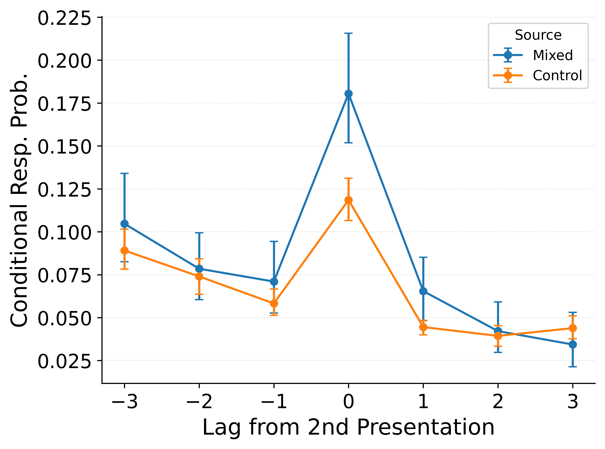

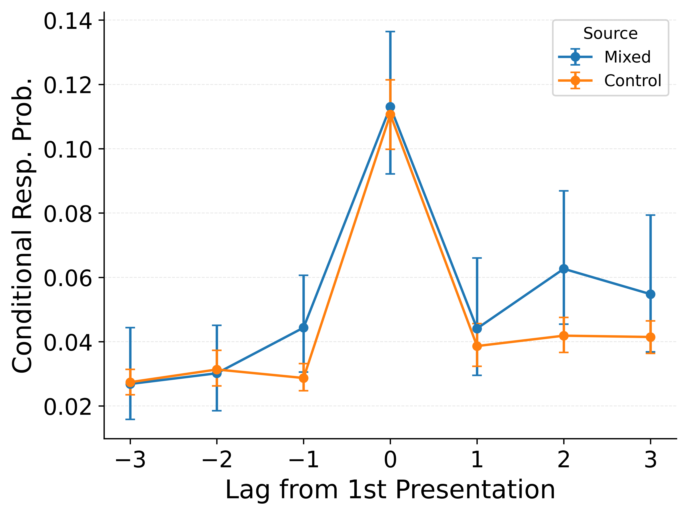

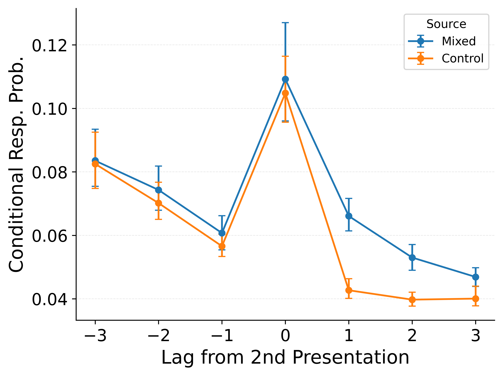

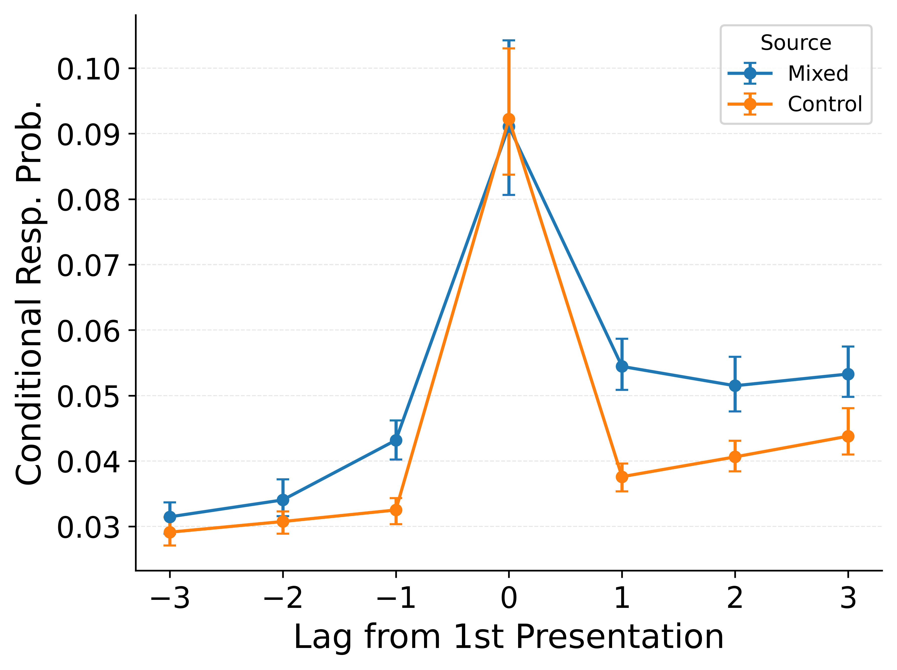

Cross-occurrence neighbor transitions as centered lag-CRPs (free recall). Top row (data), bottom row (CMR simulations). **Left column (first→second):** triggers are forward neighbors of the *first* presentation ($i{+}1,i{+}2$); lags are centered on the *second* presentation at $j$ (so $\ell=\text{next}-j$). **Right column (second→first):** triggers are forward neighbors of the *second* presentation ($j{+}1,j{+}2$); lags are centered on the *first* presentation at $i$ (so $\ell=\text{next}-i$). All curves plot mixed–minus–matched-control probabilities using the symmetric baseline. In the data, cross-occurrence neighbor bins (e.g., $\ell=\pm1,\pm2$) sit near baseline in both directions, with a selective elevation at $\ell=0$ (the repeater itself) only in the first→second case. Standard CMR predicts pronounced above-baseline peaks at the other occurrence's neighbors in both directions, consistent with associative blending. 
:::

## The Repetition Lag-CRP

The outgoing repetition lag-CRP quantifies how a recalled repeater cues subsequent recall from each occurrence's neighborhood (@fig-repetition_lag_crp).
In the data, transitions from the repeated item preferentially target neighbors of the item's first study position instead of neighbors of the second.
In particular, the $+1$ bin from the first-centered cue exceeds the $+1$ bin from the second-centered cue, and this separation is larger than in the position-matched baseline.

Our simulations of standard CMR (bottom row of @fig-repetition_lag_crp) demonstrate the opposite pattern, consistent with its prediction of cross-occurrence associative interference.
CMR makes it difficult to cue neighbors of an item's first occurrence without also cueing neighbors of the second occurrence.
Thus for recalled items presented at study positions $i$ and $j$, CMR predicts relatively balanced transition rates to positions $i{+}1$ and $j{+}1$ relative to the baseline.
This conflict isolates the problem: when the repeater is recalled, the model's item-based reinstatement routes through a composite of contexts, whereas people's recalls behave as if a single occurrence's context is (selectively) reinstated.

::: {#fig-repetition_lag_crp layout="[[1,1], [1,1]]"}

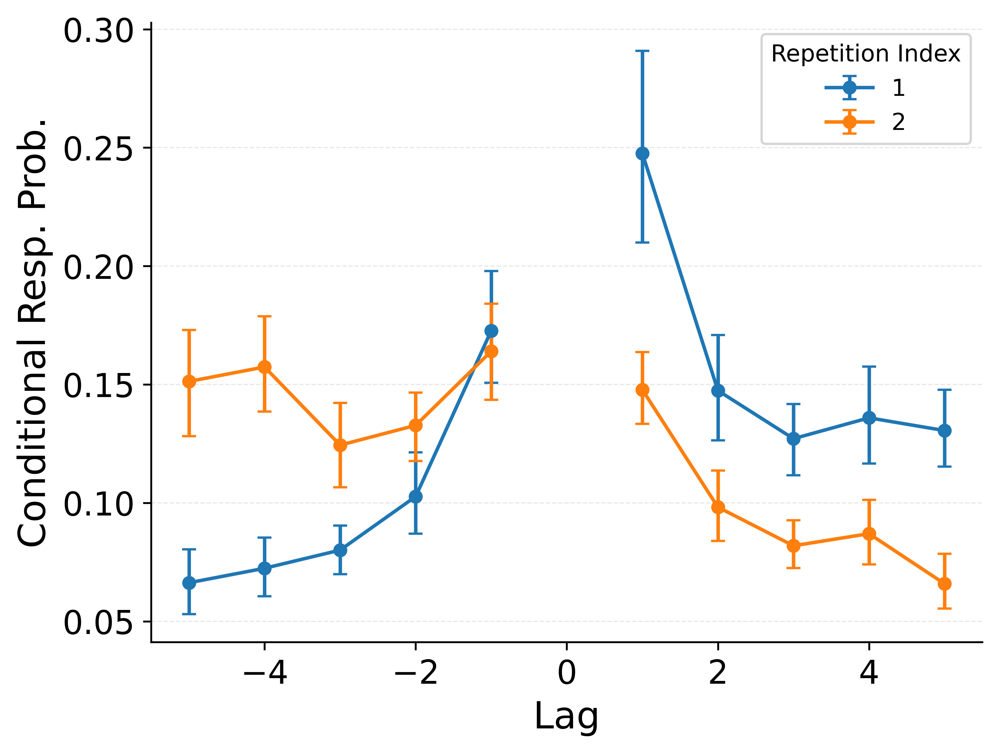

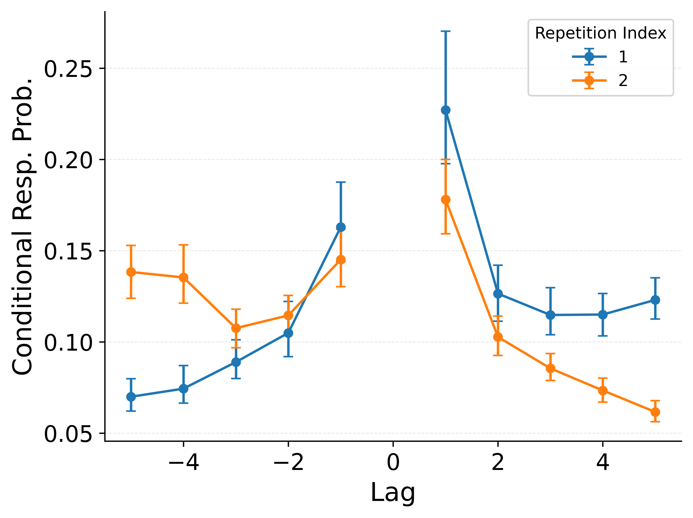

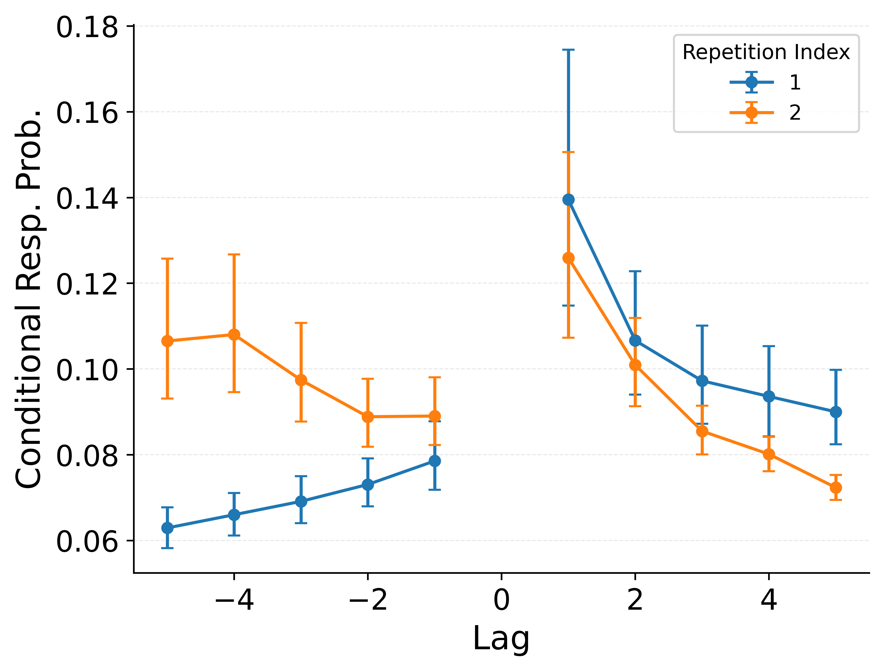

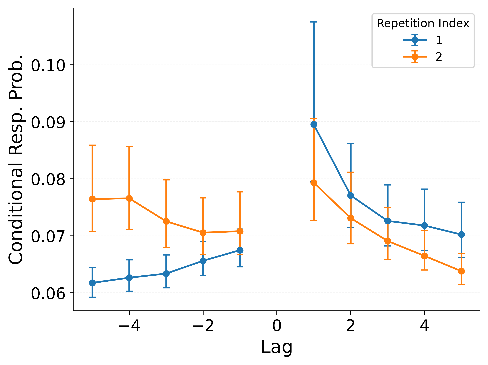

Repetition lag-CRP (outgoing): data vs CMR. Top row (data): mixed lists (left) and matched-control baseline (right), each showing two centered curves (first-centered vs second-centered). Bottom row (CMR): same for simulations. In data, separation (e.g., +1 bin) favors the first-occurrence neighborhood and is larger than in baseline; CMR predicts reduced separation (balanced access), consistent with blending.
:::

## Backward/Incoming Variant of the Repetition Lag-CRP

For each recall of a repeater, we look one step back to the item produced immediately before it and compute two centered lag-CRPs—one centered on the first presentation and one on the second—using the matched, symmetric baseline to control position effects. In the data (@fig-backward_rep_lag_crp, top row), arrivals at repeaters come disproportionately from the backward neighbor of the *first* presentation (from $i{-}1$ to $i$) compared with the backward neighbor of the second (from $j{-}1$ to $j$). The preference is strongest in mixed lists but is also evident in the position-matched baseline, indicating that it reflects general serial-order dynamics (e.g., forward contiguity and output competition) rather than repetition-specific knitting per se.

Standard CMR yields only a weak first-over-second advantage on these incoming transitions (@fig-backward_rep_lag_crp, bottom row), consistent with the model's tendency to aggregate support across a repeater's occurrences and thereby dilute approach biases. Practically, this pattern cautions that any first-over-second asymmetry seen *after* recalling a repeater (the outgoing analysis) may be partly inherited from how the search state approached the repeater; the mixed–minus–baseline contrast in the outgoing test is therefore the cleaner probe of repetition-specific reinstatement.

::: {#fig-backward_rep_lag_crp layout="[[1,1], [1,1]]"}

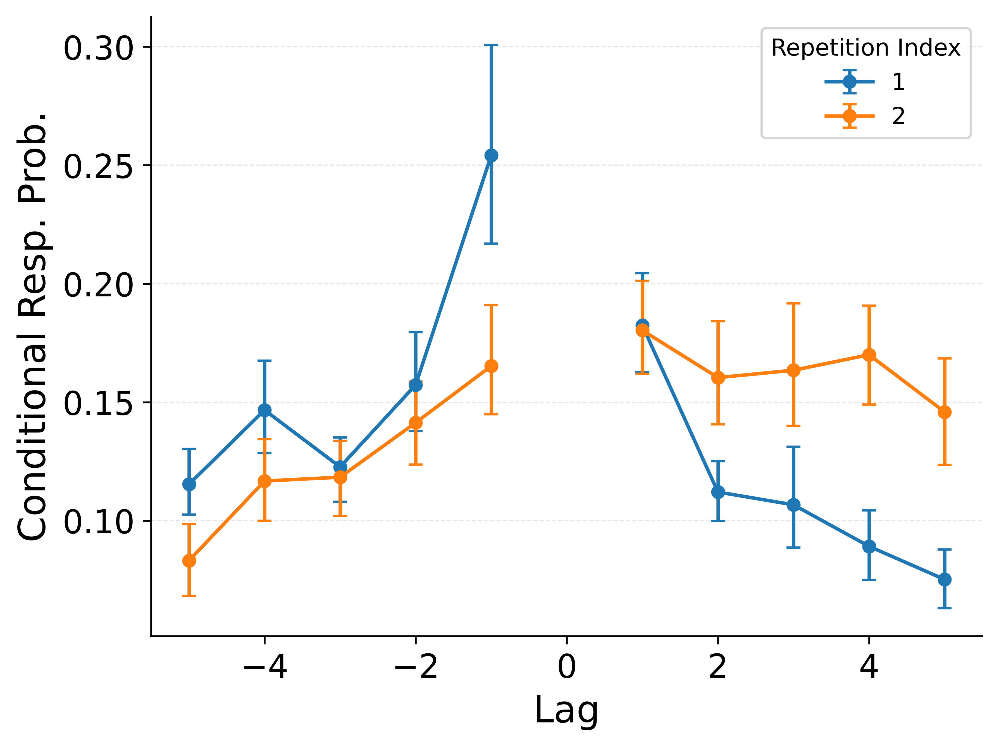

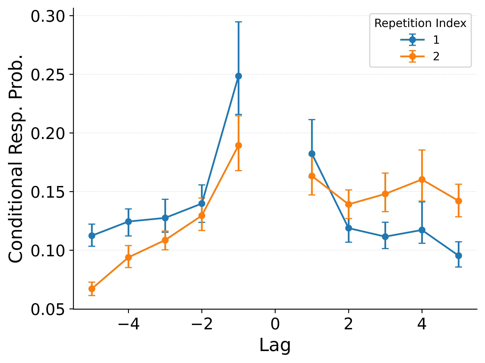

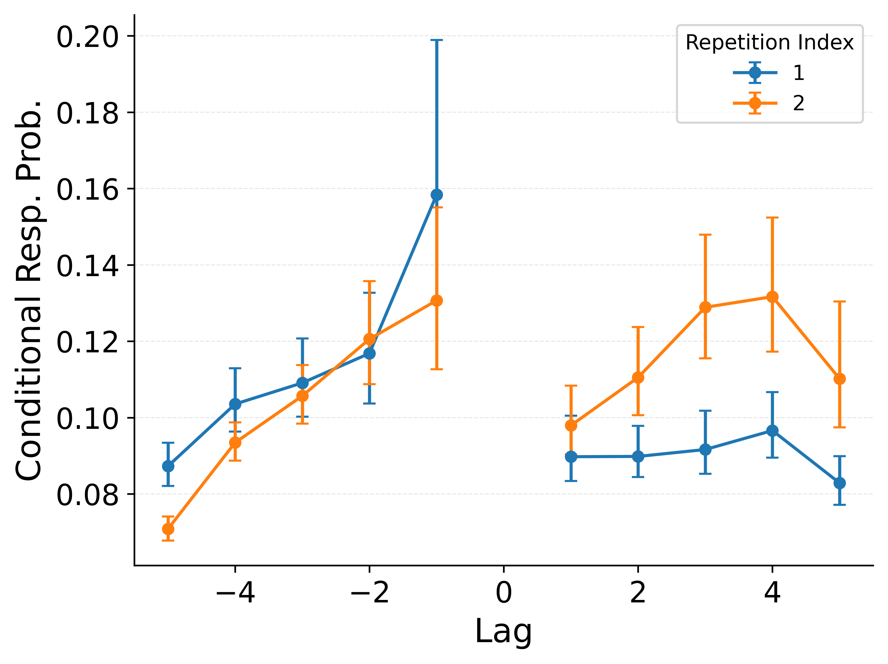

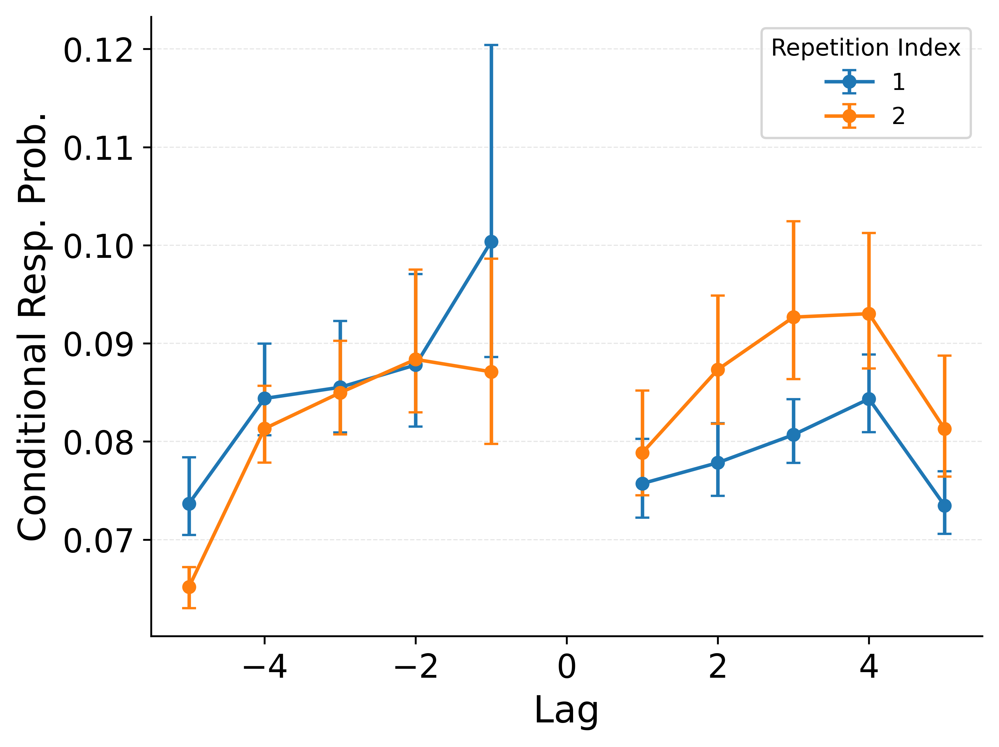

Repetition lag-CRP (incoming/backward): data vs CMR. Top row (data): mixed lists (left) and baseline (right) for transitions to repeated items. Bottom row (CMR): simulations. In data, transitions to repeated items are more frequently from the backward neighbor of the item's first presentation than from the second, especially in mixed lists but also in the position-matched baseline. By contrast, CMR predicts a weaker first-over-second advantage for incoming transitions.
:::

## Forward Chaining in Serial Recall

Serial recall provides a more stringent test of cross-occurrence competition. In the data from @logan2021serial and from @kahana2000interresponse (@fig-serial_rep_crp, top), after participants correctly type through the first occurrence at position $i$, continuations to $i{+}1$ remain strong, and erroneous continuations to the competing neighbor $j{+}1$ are rare and indistinguishable from the matched control baseline. That is, the second occurrence's neighborhood does not draw responses away from the correct forward chain.

In the bottom half of @fig-serial_rep_crp, simulations of standard CMR after fitting to each dataset predicts a measurable elevation of $i\!\rightarrow\!j{+}1$ errors relative to baseline, again reflecting blended support across occurrences. The absence of this cross-occurrence forward error in the data generalizes the non-interference finding from free recall to a serial-order task: whether the next step is unconstrained (free recall) or constrained (serial recall), occurrences behave as if support is routed through a single episode.

::: {#fig-serial_rep_crp layout="[[1,1],[1,1]]"}

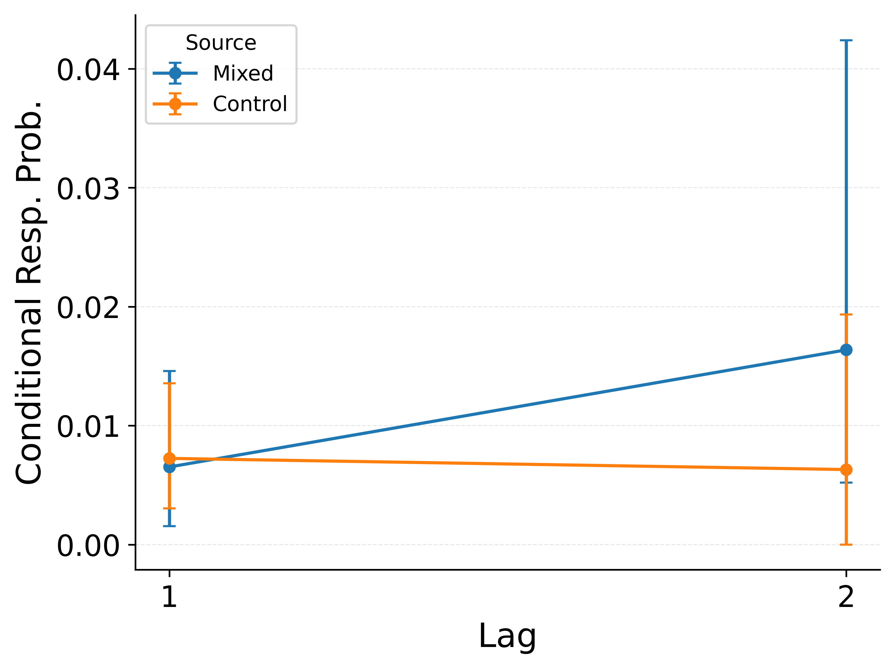

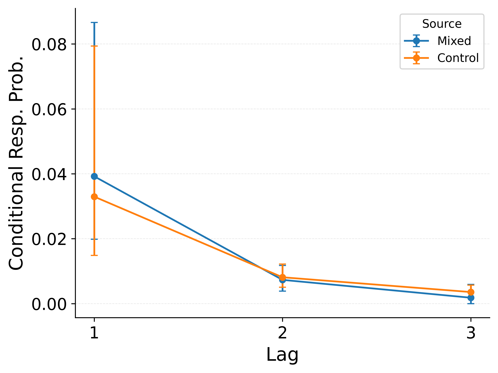

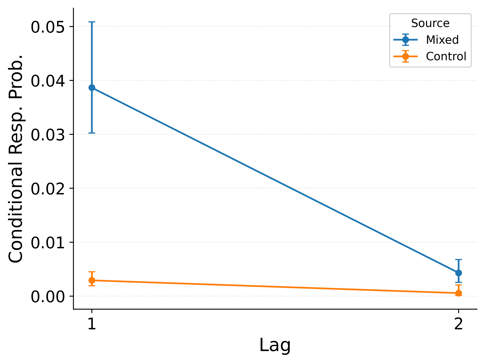

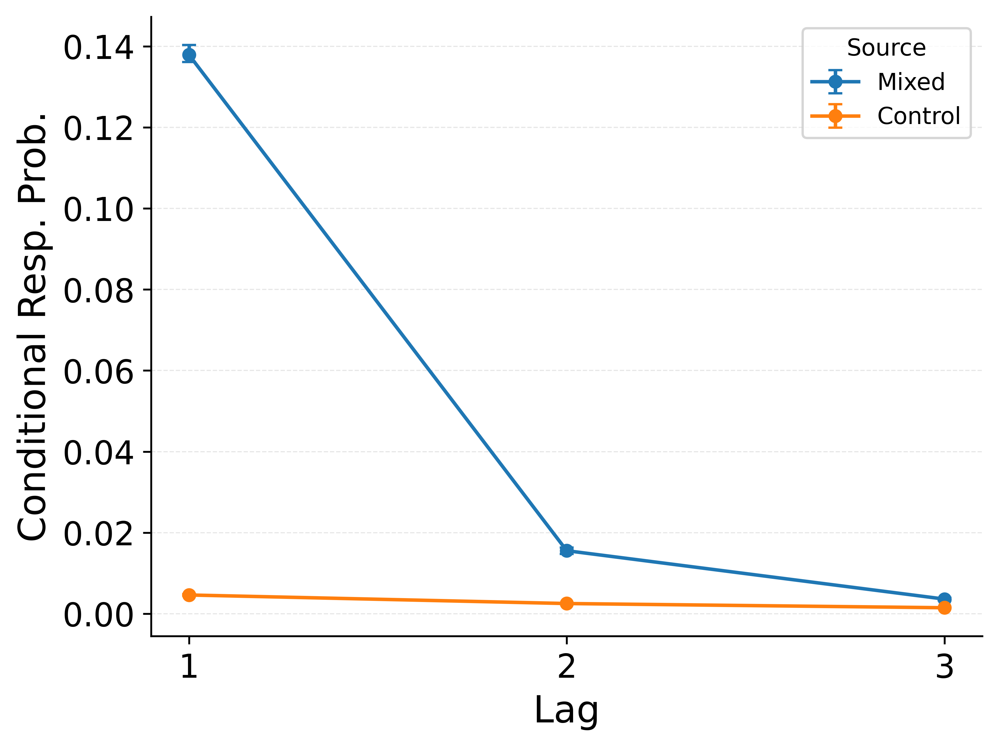

**Cross-occurrence forward errors in serial recall (two datasets).** Left: @logan2021serial. Right: @kahana2000interresponse. **Top row (data):** For items studied at positions $i$ and $j$, each panel plots the conditional probability— after correct report through the first occurrence at position $i$ -- of an erroneous transition to the *second* occurrence’s forward neighbors ($i\!\rightarrow\!j{+}1$ and $i\!\rightarrow\!j{+}2$), contrasting mixed lists with their position-matched, symmetric baseline. **Bottom row (CMR):** standard CMR simulations fitted separately to each dataset and scored with the identical baseline procedure. In both datasets, data show no elevation of $i\!\rightarrow\!j{+}1/j{+}2$ errors relative to baseline (non-interference), whereas CMR predicts a clear error elevation (associative interference). 
:::

## Summary: Noninterference Across Tasks

Across three diagnostics and two tasks, the same pattern recurs. When we remove list-composition artifacts with a matched, symmetric baseline, free recall does not show elevated cross-occurrence neighbor transitions, and the repeated item does not balance access to the two neighborhoods; instead, access is preferentially routed to the first occurrence's neighbors. In serial recall, the first occurrence's forward chain remains intact, with no detectable attraction to the second occurrence's neighbors. Standard CMR fits the classic benchmarks and the spacing function, but its item-based reinstatement produces a robust associative-interference signature that the data do not support.

This motivates the mechanistic analysis that follows, which alters how contextual features are reinstated at study and at test—first by removing study-phase reinstatement (CMR-NoSPR), then by allowing occurrence-specific reinstatement at retrieval (Instance-CMR), and finally by rehabilitating study-phase retrieval as a mechanism that enacts trace-strengthening rather than blending (ICMR-Reinf) to reconcile retrieved-context theory with the observed non-interference.

# Ablation Analysis: CMR without Study Phase Retrieval

Here, we introduce a variant of CMR we will label CMR-NoSPR that preserves all core mechanisms but omits study-phase retrieval to isolate the contribution of associative blending at study to the interference effects observed above. 
By removing study-phase retrieval, we eliminate the mechanism by which repeated items pull together their occurrence contexts during encoding, thereby reducing cross-occurrence associative interference. 
In contrast to Instance-CMR, however, CMR-NoSPR retains standard item-based context reinstatement at retrieval, meaning that when a repeated item is recalled, the model still routes through a composite of its occurrence contexts.
Similarly, retrieval competition in CMR-NoSPR remains item-based, so that composite representations of their occurrence contexts are activated by cues to drive competition for recall.
This manipulation thus targets the first route to blending described above (knitting at study) while preserving the second (aggregation at retrieval). The section assesses two questions: (i) does eliminating study-phase reinstatement harm fits to standard free-recall benchmarks or the spacing function; and (ii) does it resolve the associative-interference signatures (cross-occurrence neighbor elevation; balanced access to the two neighborhoods after a repeater)?

MR-NoSPR reproduces serial-position, lag-CRP, and first-recall profiles under the same scoring as before (@fig-cmr_nospr_benchmarks). As with standard CMR, it predicts minimal differences between mixed and position-matched control lists once the symmetric baseline is applied. Thus removing study-phase reinstatement does not degrade fits to core free-recall benchmarks.

::: {#fig-cmr_nospr_benchmarks layout="[[1,1],[1]]"}
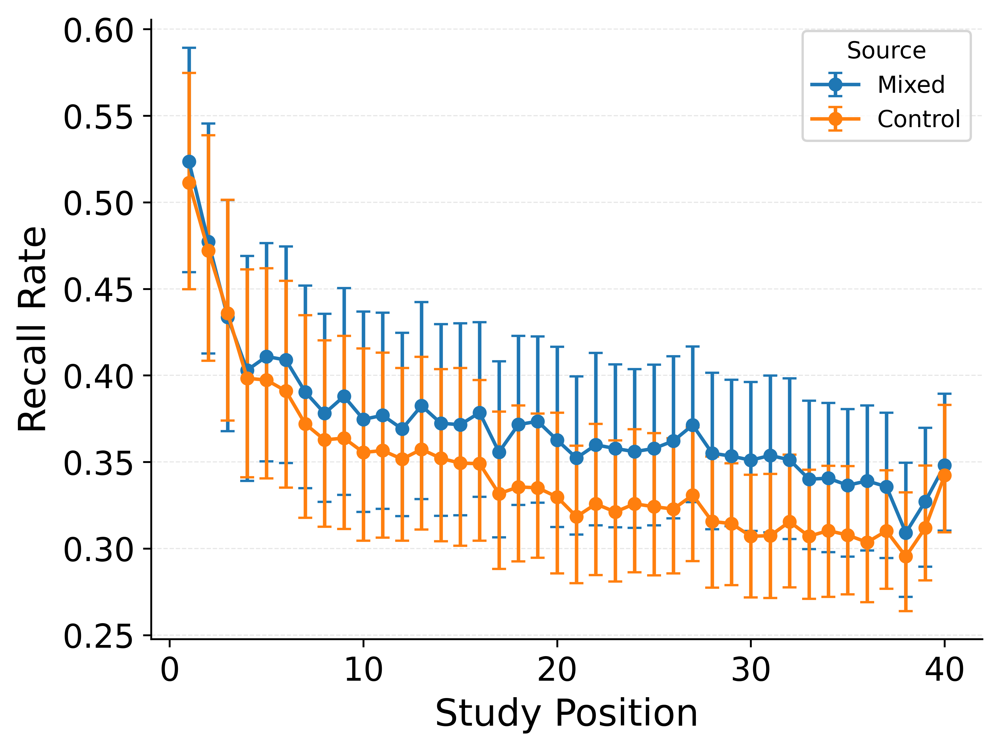

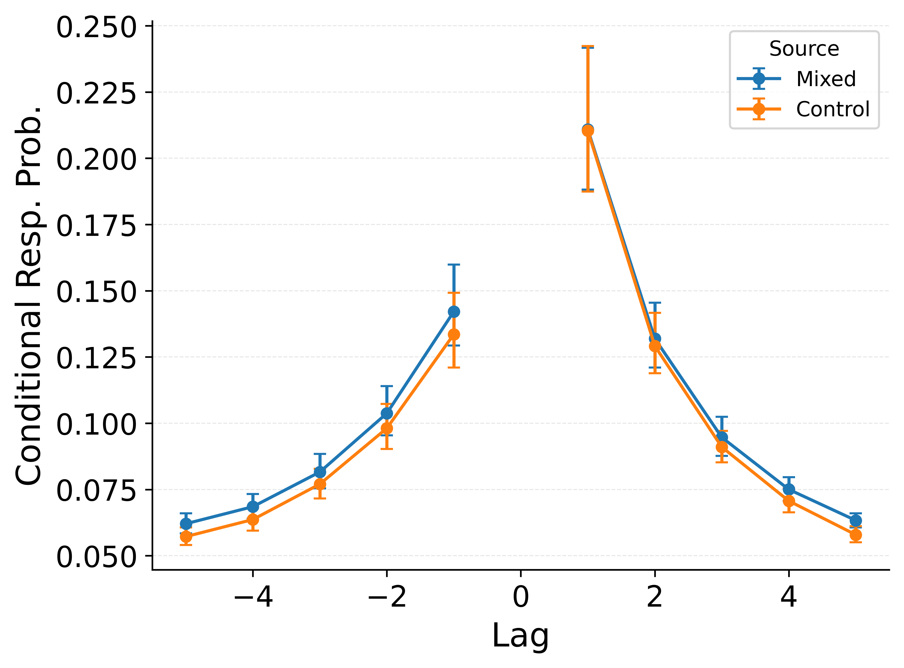

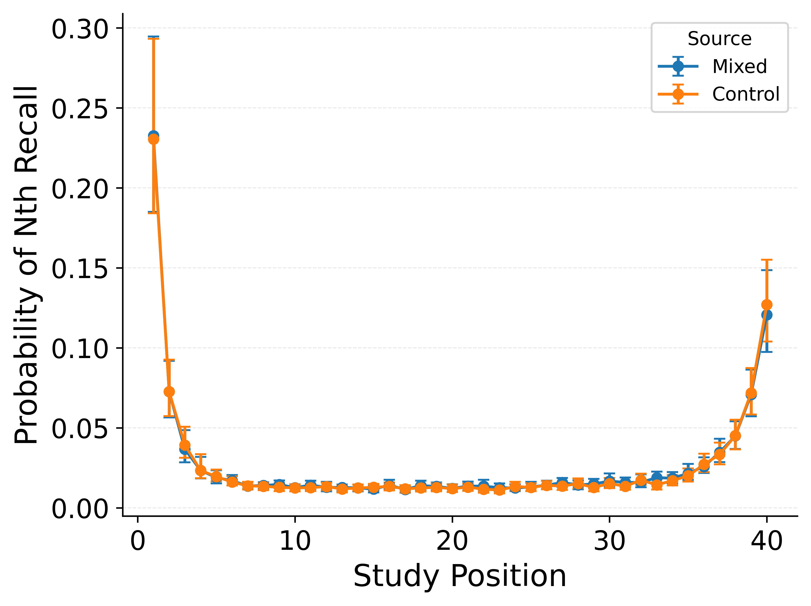

CMR-NoSPR benchmarks (free recall). Simulated serial-position curves (SPC; top left), lag-CRP (top right), and probability of first/next recall (bottom) for mixed vs matched-control lists from @lohnas2014retrieved, scored with the symmetric baseline. Eliminating study-phase reinstatement leaves benchmark fits intact.
:::

Critically, removing study-phase reinstatement does not weaken the spacing function relative to standard CMR fits (cf. @fig-spacing). 
This indicates that, in these list-learning paradigms, contextual variability plus test-phase reinstatement is sufficient to generate the spacing effect at least to the extent realized by the model; the particular form of study-phase reinstatement implemented in standard CMR is not required.

::: {#fig-nospr_spacing layout="[[1, 1]]"}
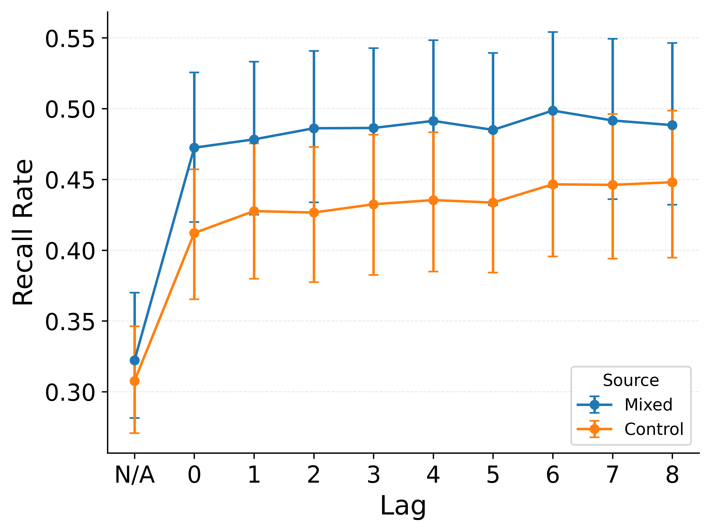

CMR-NoSPR spacing function. Simulated spacing curves for mixed vs matched-control lists from @lohnas2014retrieved. The spacing advantage is preserved without study-phase reinstatement.
:::

Next we turn to cross-occurrence neighbor contiguity. Here CMR-NoSPR achieves the data’s non-elevation. Because occurrences now encode to distinct contextual states, the neighborhoods around the two presentations are not knitted together at study through association to overlapping contexts. 
In the centered neighbor-contiguity tests (triggers from one neighborhood, lags centered on the other), mixed–minus–baseline curves sit at baseline in both directions relative to the other occurrence’s neighbors in both trigger directions, eliminating the cross-occurrence neighbor peaks predicted by standard CMR (@fig-nospr_neighbor_contiguity). This shows the original neighbor-contiguity elevation is a signature of study-phase knitting.

::: {#fig-nospr_neighbor_contiguity layout="[[1,1]]"}

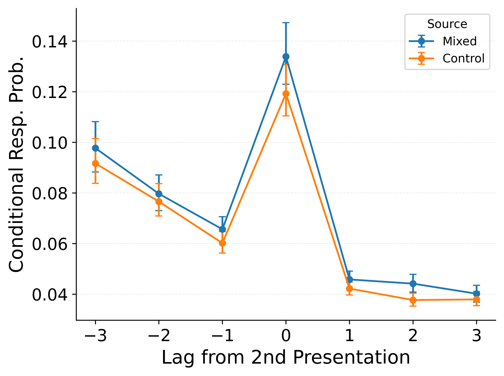

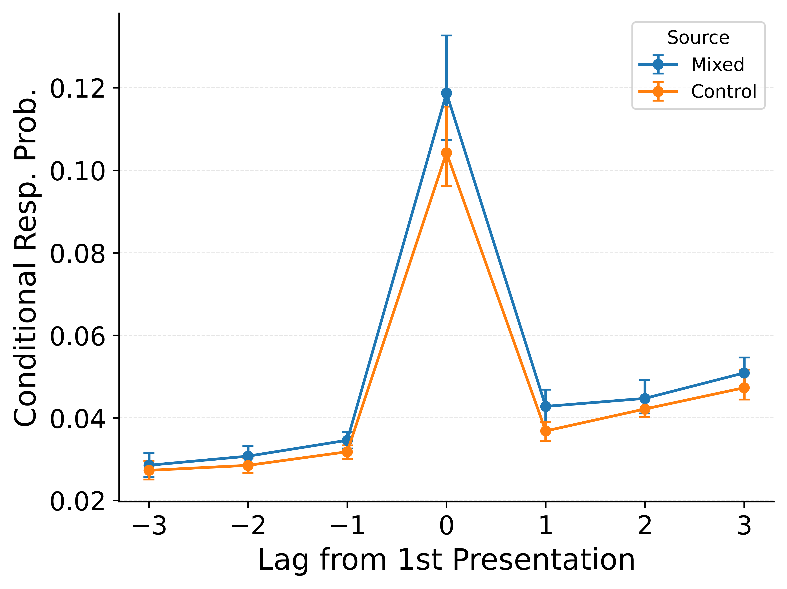

CMR-NoSPR: cross-occurrence neighbor transitions (centered lag-CRPs). Left: triggers from forward neighbors of the first presentation and lags centered on the second. Right: triggers from forward neighbors of the second and lags centered on the first. Curves plot mixed–minus–matched-control probabilities with symmetric scoring. With distinctive encoding contexts, cross-occurrence neighbor bins lie at baseline in both directions—neighbor knitting is abolished.
:::

On the other hand, the outgoing repetition lag-CRP still shows the balanced-access signature of associative interference: transitions from a recalled repeater distribute more evenly to the two neighborhoods than in the matched baseline (@fig-nospr_rep_lag_crp).
Eliminating study-phase reinstatement therefore does not restore the first-over-second advantage seen in the data (cf. @fig-repetition_lag_crp); the repeater still reinstates a composite cue that contacts both occurrence contexts.

::: {#fig-nospr_rep_lag_crp layout="[[1,1]]"}

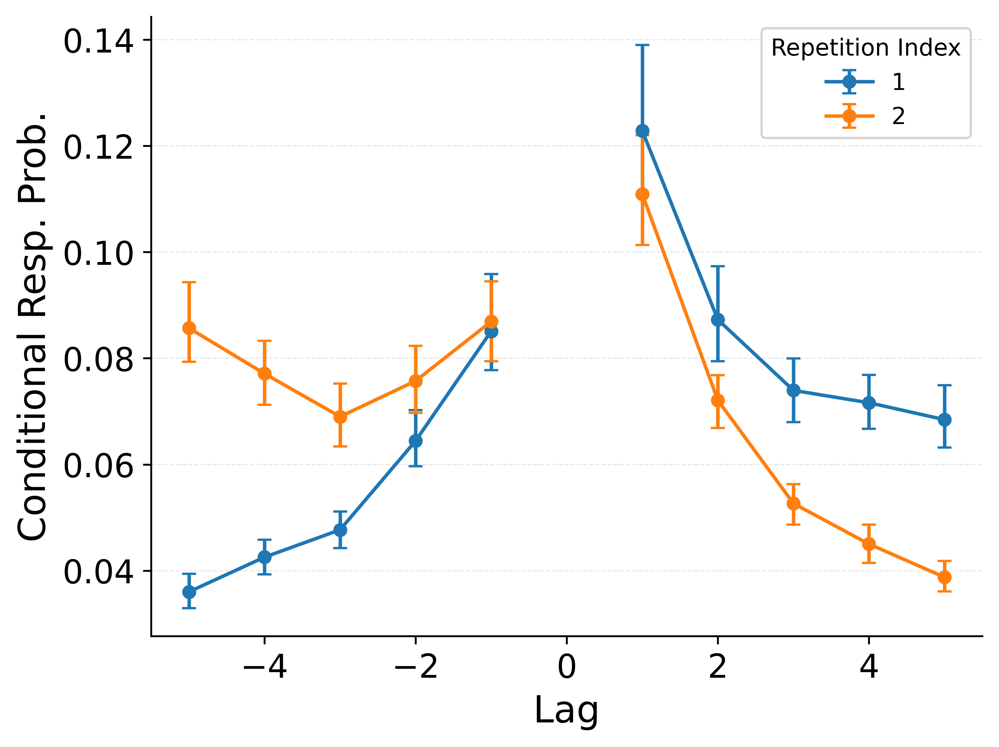

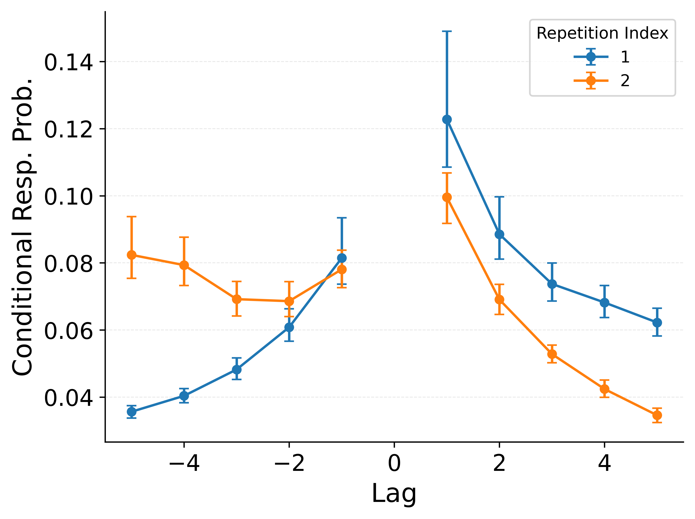

CMR-NoSPR: repetition lag-CRP (outgoing). Mixed lists (left) and matched-control baseline (right) from simulations. First- vs second-centered curves are more balanced than in baseline, consistent with lingering cross-occurrence blending at retrieval.
:::

CMR-NoSPR demonstrates that study-phase reinstatement is not necessary for the spacing effect or for core free-recall benchmarks, and it eliminates the cross-occurrence neighbor knitting seen in standard CMR—aligning with the data on that diagnostic. However, it fails to resolve the interference observed when the repeater itself is the cue: the outgoing repetition lag-CRP still shows balanced access across the two neighborhoods. This isolates the remaining source of the problem to blending at retrieval, motivating the next step—an occurrence-specific reinstatement scheme (Instance-CMR) that lets traces compete so recall can route through one occurrence without contacting the other.

# Instance-CMR: Eliminating Associative Interference at Encoding and Retrieval

Instance-CMR goes beyond CMR-NoSPR by separating occurrences at both stages. As in CMR-NoSPR, each repetition event encodes to a non-overlapping contextual state (no knitting at study). At retrieval, however, Instance-CMR uses the instance architecture to let occurrence traces compete: when a repeated item is recalled, the model selectively reinstates the context of a single occurrence rather than a fixed composite over occurrences. Selection pressure is governed by the same trace-sensitivity parameter used in the recall competition (no new degrees of freedom). This change targets the remaining source of interference isolated in the last section—blending at test—while keeping temporal-context dynamics and other task mechanisms identical to the base model. The questions are whether this variant (i) retains benchmark free-recall behavior and the spacing function, (ii) eliminates cross-occurrence neighbor knitting (as CMR-NoSPR already did), (iii) removes the balanced-access signature in the outgoing repetition lag-CRP, and (iv) avoids cross-occurrence forward errors in serial recall.

Instance-CMR maintains good agreement with serial-position, lag-CRP, and first-recall profiles under the same matched, symmetric scoring used throughout. As with the previous models, mixed versus control differences are minimal once the baseline is applied (@fig-icmr_os_benchmarks). Thus, introducing occurrence-specific reinstatement at test does not degrade core free-recall benchmarks.

::: {#fig-icmr_os_benchmarks layout="[[1,1],[1]]"}

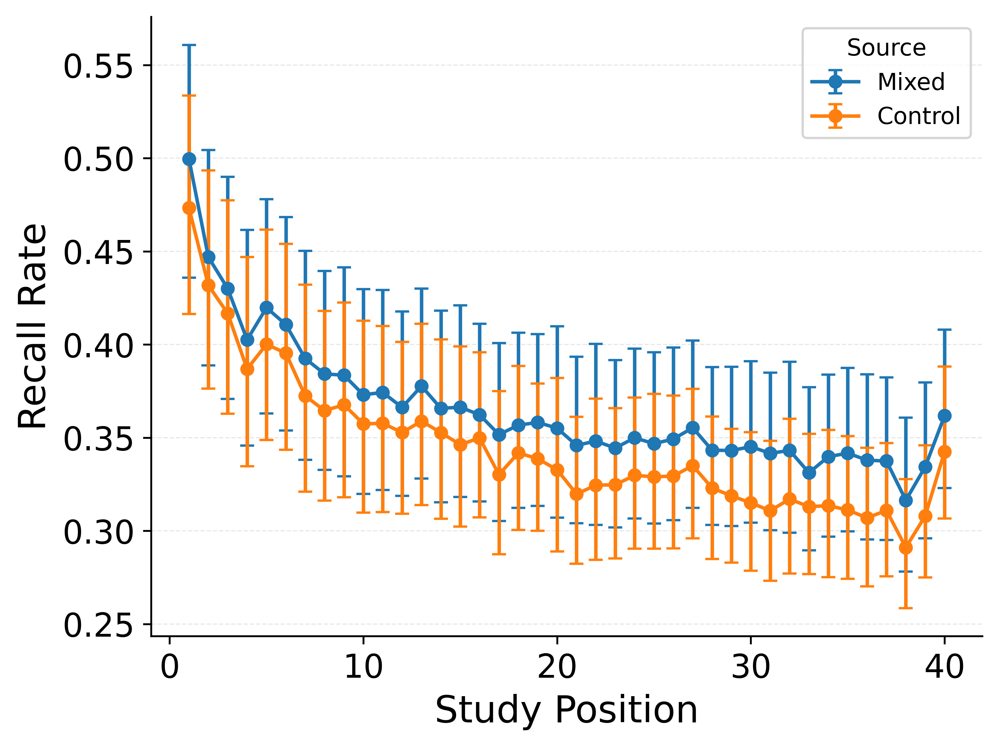

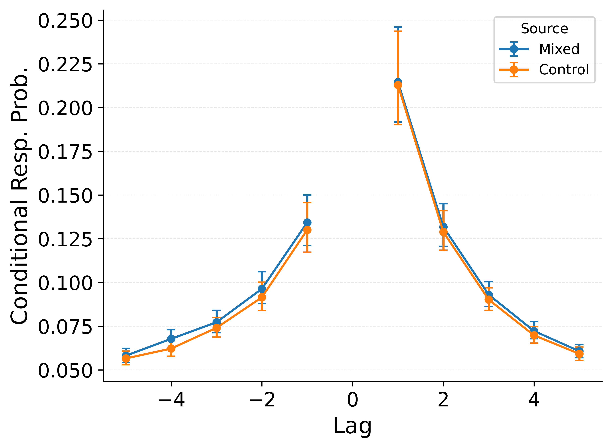

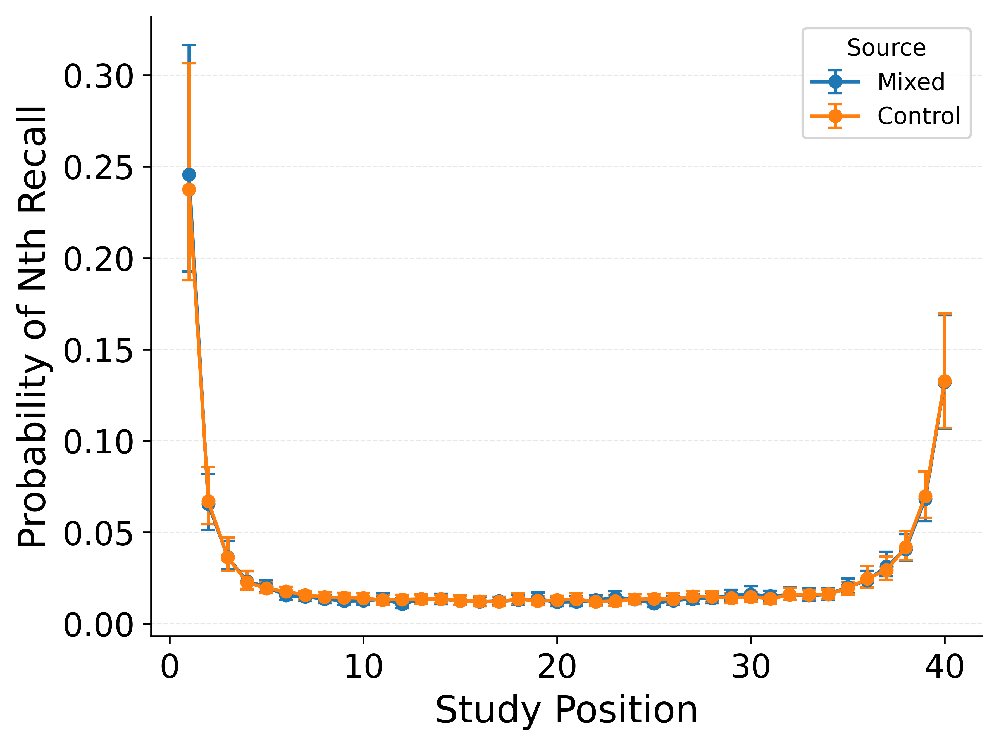

Instance-CMR benchmarks (free recall). Simulated serial-position curves (SPC; top left), lag-CRP (top right), and probability of first/next recall (bottom) for mixed vs matched-control lists from @lohnas2014retrieved under symmetric scoring. Occurrence-specific reinstatement at test preserves benchmark fits.
:::

Like standard CMR and CMR-NoSPR, Instance-CMR reproduces a robust, monotonic spacing advantage (@fig-icmr_os_spacing). As before, removing study-phase knitting and adding occurrence-specific reinstatement does not blunt the spacing function, indicating that contextual variability plus test-phase reinstatement suffices for this benchmark in these paradigms.

::: {#fig-icmr_os_spacing layout="[[1]]"}
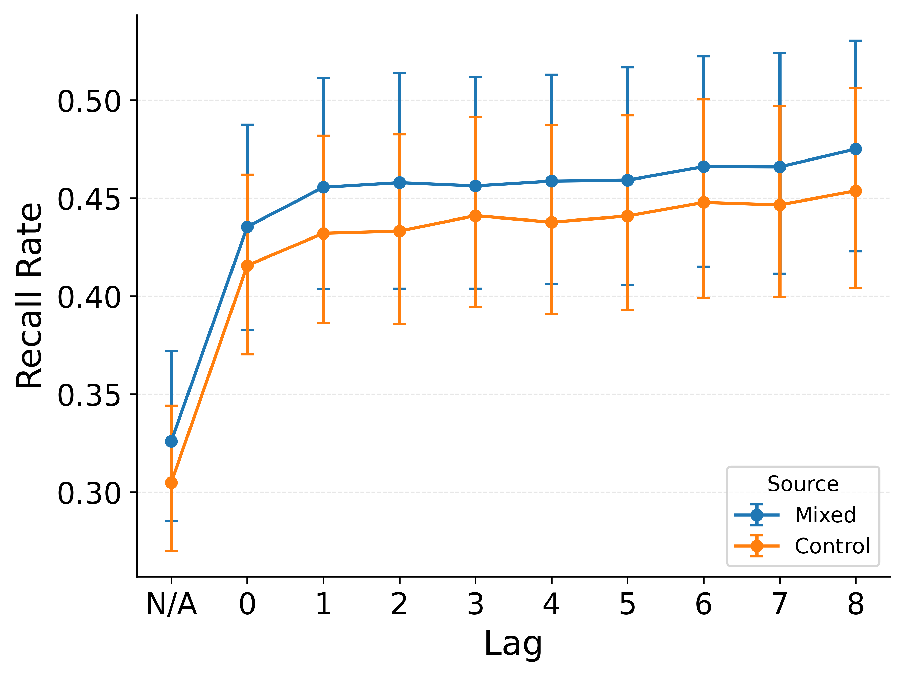

**Instance-CMR spacing function.** Simulated spacing curves for mixed vs matched-control lists from @lohnas2014retrieved. The spacing advantage is preserved without blending at test; the model does not reproduce the apparent steeper slope for mixed lists in the data (cf. @fig-spacing).
:::

Next we consider cross-occurrence neighbor contiguity. Because Instance-CMR keeps occurrence contexts distinct at study (as in CMR-NoSPR) and selective at test (no blending when the repeater is later recalled), the model predicts no elevation of cross-occurrence neighbor transitions. In the centered neighbor-contiguity tests, mixed–minus–baseline curves remain near zero in both directions (Figure @fig-os_neighbor_contiguity), matching the data’s non-elevation and improving on standard CMR’s incorrect peaks.

::: {#fig-os_neighbor_contiguity layout="[[1,1]]"}

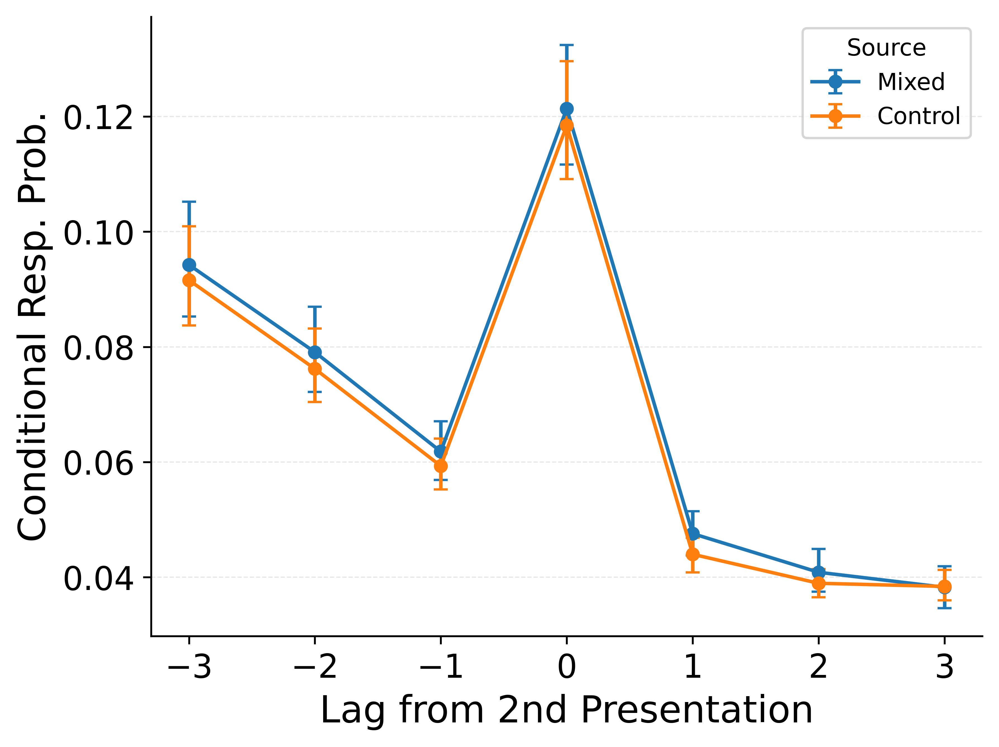

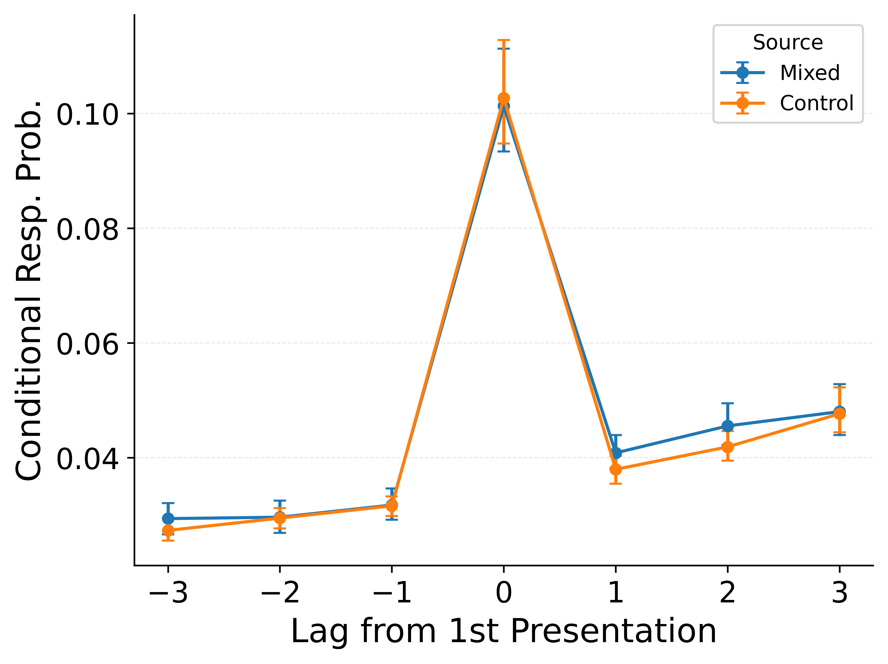

Instance-CMR: cross-occurrence neighbor transitions (centered lag-CRPs). Left: triggers from forward neighbors of the *first* presentation ($i{+}1,i{+}2$), lags centered on the *second* ($\ell=\text{next}-j$). Right: symmetric variant (triggers $j{+}1,j{+}2$; lags centered on $i$). Mixed–minus–baseline curves sit at baseline in both directions, consistent with no knitting across neighborhoods.
:::

Next we consider the outgoing Repetition Lag-CRP where the critical change appears when the repeater itself is recalled. By routing reinstatement through a single occurrence, Instance-CMR removes the balanced-access signature that arises from blending in standard CMR and persists in CMR-NoSPR. Consequently, the model preserves the first-over-second preference seen in controls rather than washing it out (@fig-os_rep_lag_crp). However, Instance-CMR does not generate the extra first-over-second separation evident in the data’s mixed-minus-baseline contrast; the model’s separation is essentially equal to baseline, not boosted. This resolves the associative-interference prediction but leaves a positive, repetition-specific asymmetry unexplained.

In the incoming/backward Repetition Lag-CRP (not displayed), selective reinstatement at test does little to the incoming variant, which reflects how the search state approached the repeater. Instance-CMR therefore predicts a modest first-over-second preference on arrivals, comparable to CMR-NoSPR and still weaker than in the data. This reinforces our earlier conclusion that the outgoing mixed–minus–baseline contrast is the cleaner probe of repetition-specific reinstatement.

::: {#fig-os_rep_lag_crp layout="[[1,1],[1,1]]"}

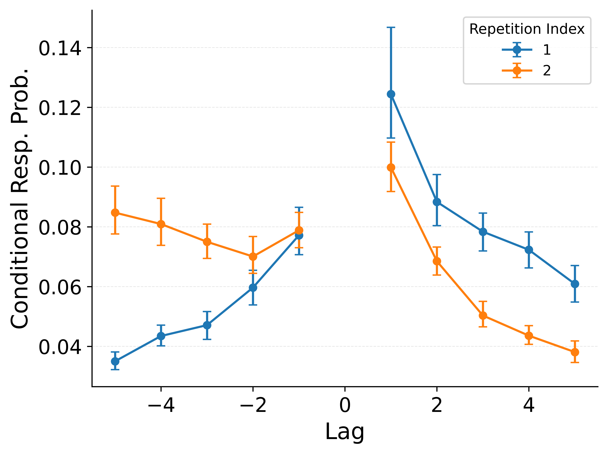

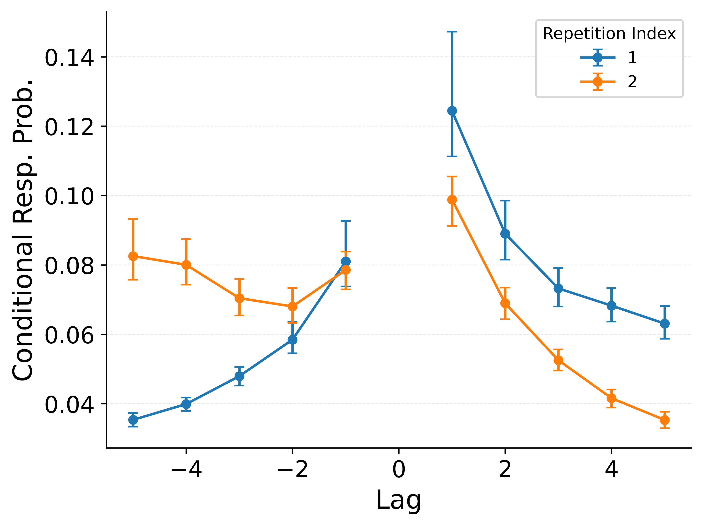

**Repetition lag-CRP (outgoing): data vs Instance-CMR.** Top row: mixed lists (left) and matched-control baseline (right) from @lohnas2014retrieved. Bottom row: Instance-CMR simulations scored identically. First- vs second-centered curves remain separated (no blending). Unlike the data (top-left), the mixed-minus-baseline separation is not substantially enlarged in Instance-CMR, fixing interference but not the boosted first-over-second advantage.
:::

Finally, we consider the the serial recall variant of this analysis to examine forward chaining in lists with item repetitions. The occurrence-specific test-phase reinstatement directly targets cross-occurrence competition in serial report. After correct report through the first occurrence at $i$, Instance-CMR maintains strong continuations to $i{+}1$ and does not elevate erroneous continuations to the competitor $j{+}1$ relative to baseline (Figure @fig-os_serial_rep_crp, bottom row)—matching the non-interference seen in both serial datasets (cf. top row of @fig-serial_rep_crp). In other words, when the task demands a specific next item, routing through a single occurrence avoids the cross-occurrence forward error predicted by blended reinstatement.

::: {#fig-os_serial_rep_crp layout="[[1,1],[1,1]]"}

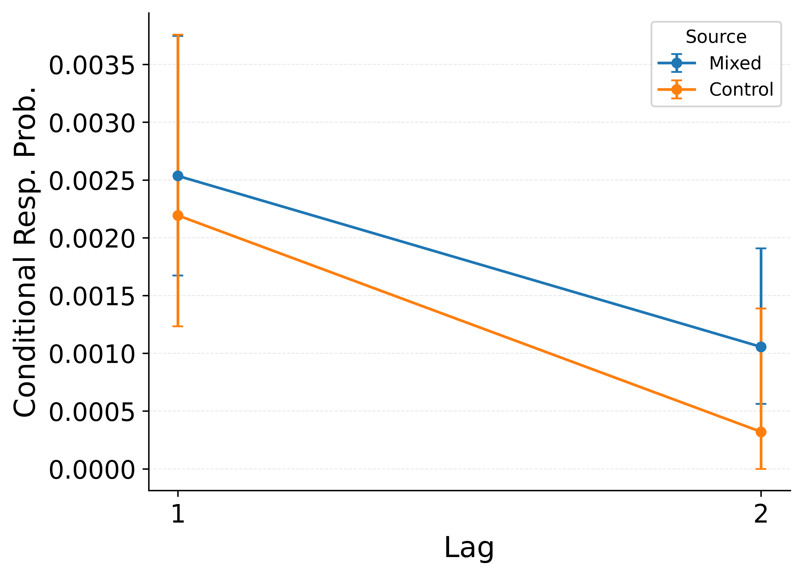

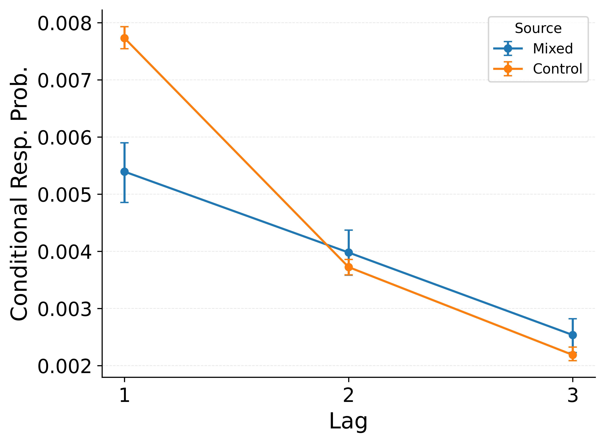

**Cross-occurrence forward errors in serial recall (data vs Instance-CMR).** Left: @logan2021serial. Right: @kahana2000interresponse. **Top row (data):** For items studied at positions $i$ and $j$, each panel plots the conditional probability— after correct report through the first occurrence at position $i$ -- of an erroneous transition to the *second* occurrence’s forward neighbors ($i\!\rightarrow\!j{+}1$ and $i\!\rightarrow\!j{+}2$), contrasting mixed lists with their position-matched, symmetric baseline. **Bottom row (CMR-OS):** Occurrence-Specific CMR simulations fitted separately to each dataset and scored with the identical baseline procedure. 
:::

Instance-CMR reconciles retrieved-context theory with the absence of associative interference: it keeps occurrences separate at study and allows retrieval to select a single occurrence’s context at test. It preserves benchmark fits, removes cross-neighbor linkage, restores first-over-second separation in the outgoing repetition lag-CRP, and eliminates cross-occurrence forward errors in serial recall. What it does not capture are the systematic boosts for the first occurrence evident in (i) the selective lag-0 elevation in the neighbor-contiguity test (first-neighborhood triggers), (ii) the larger first-over-second asymmetry on the incoming repetition lag-CRP, and (iii) the boosted separation on the outgoing repetition lag-CRP beyond baseline (cf. @fig-neighbor_contiguity, @fig-backward_rep_lag_crp, @fig-repetition_lag_crp). These residual asymmetries motivate an additional mechanism that preferentially strengthens the first-occurrence trace *without* knitting contexts together—developed next in the ICMR-Reinf variant.

# Exploring Reinforcement without Associative Blending at Study

ICMR-Reinf addresses the residual asymmetries by reconceptualizing study-phase retrieval as reinforcement rather than reinstatement. At the second presentation, the model strengthens the first-occurrence trace but does not reinstate its contextual features; the two occurrences therefore remain contextually distinct at encoding, exactly as in CMR-NoSPR and Instance-CMR. At test, ICMR-Reinf retains Instance-CMR’s occurrence-specific reinstatement: when a repeated item is recalled, a single occurrence’s context is selectively reinstated (governed by the same trace-sensitivity used in the recall competition; no new degrees of freedom there). The only added degree of freedom in this variant is a single reinforcement factor bounded between "no strengthening" and "match the original trace’s strength." The questions are whether ICMR-Reinf (i) preserves benchmark free-recall behavior and the spacing function, (ii) maintains the elimination of cross-occurrence neighbor knitting, (iii) not only removes balanced access in the outgoing repetition lag-CRP but boosts the first-over-second separation in mixed lists beyond baseline (as in the data), and (iv) preserves the non-interference pattern in serial recall. 

ICMR-Reinf maintains good agreement with serial-position, lag-CRP, and first-recall profiles under the same matched, symmetric scoring used throughout. As with prior variants, mixed–control differences are minimal once the baseline is applied (@fig-icmr_reinf_benchmarks). Thus, adding reinforcement at study does not degrade core free-recall benchmarks.

::: {#fig-icmr_reinf_benchmarks layout="[[1,1],[1]]"}

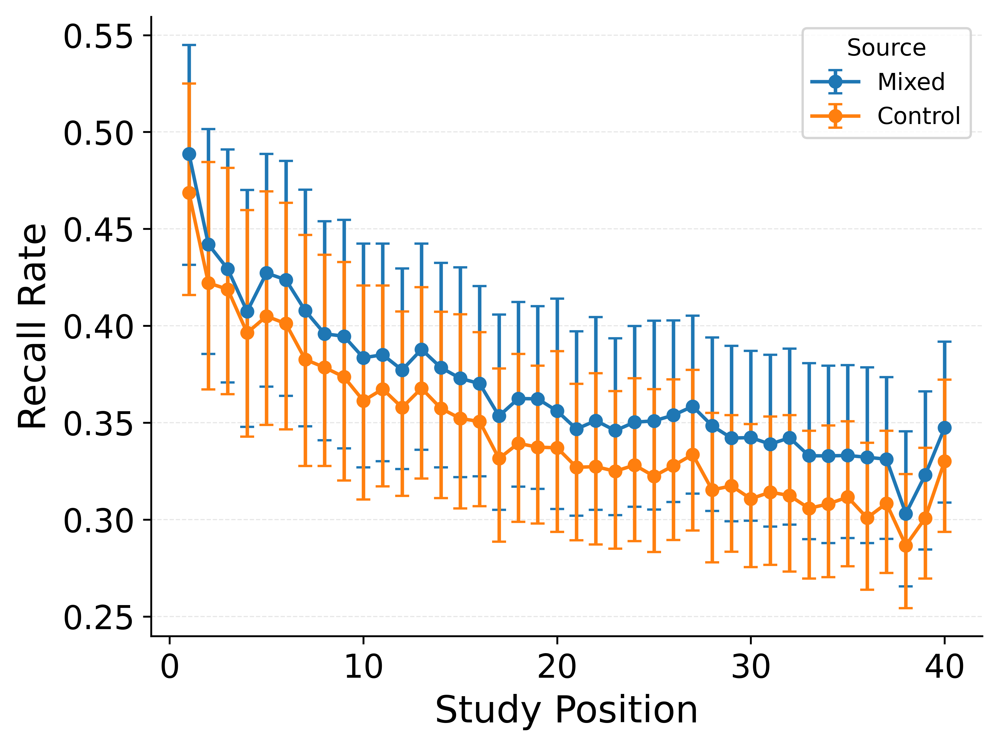

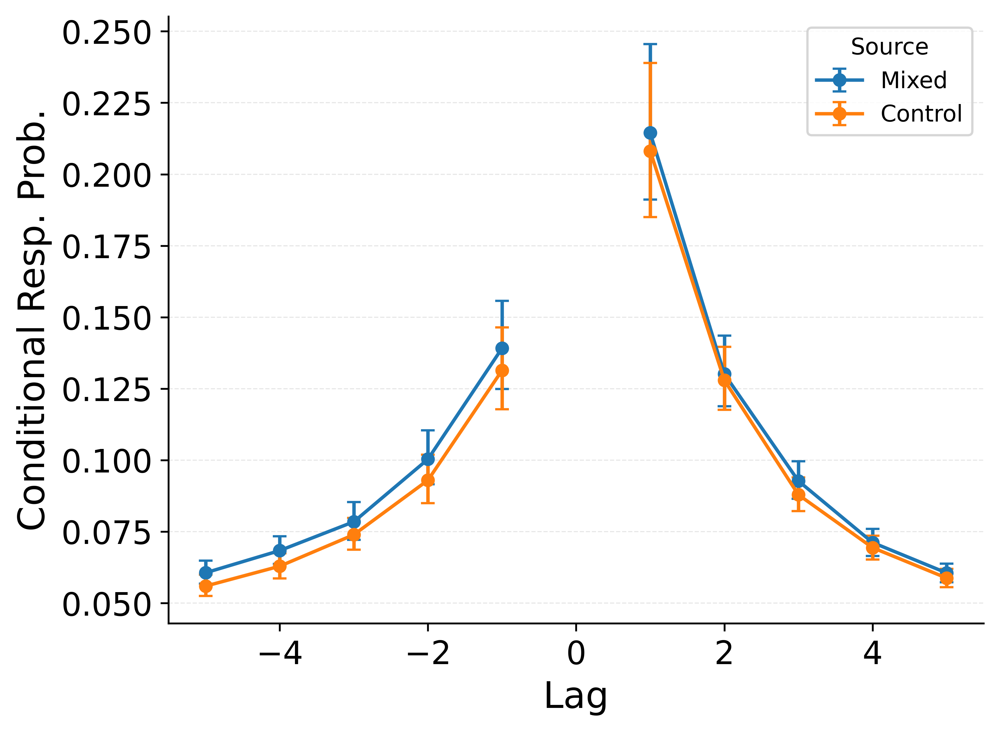

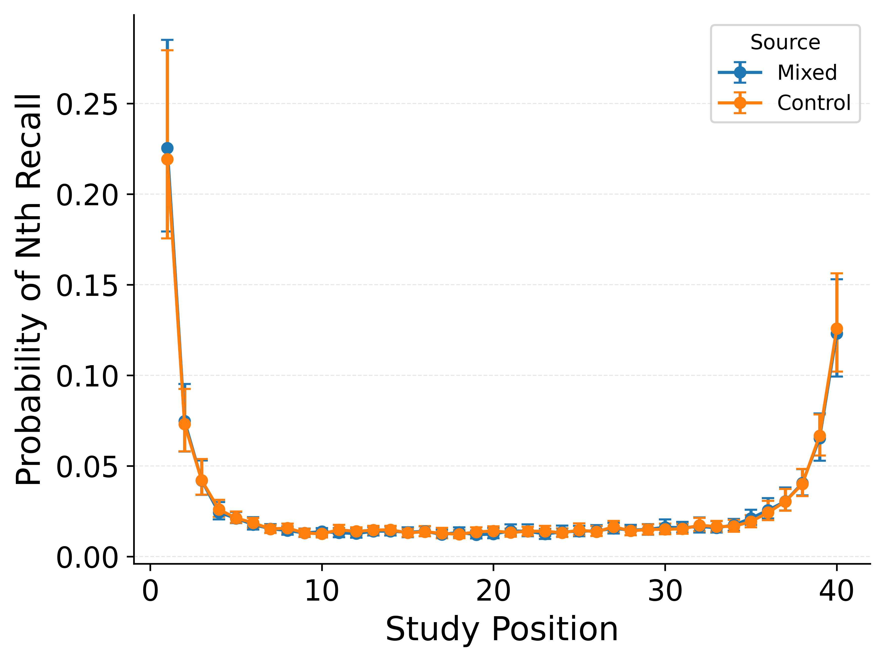

ICMR-Reinf benchmarks (free recall). Simulated serial-position curves (SPC; top left), lag-CRP (top right), and probability of first/next recall (bottom) for mixed vs matched-control lists from @lohnas2014retrieved under symmetric scoring. Reinforcement at study preserves benchmark fits.
:::

Like the other variants, ICMR-Reinf reproduces a robust, monotonic spacing advantage (@fig-icmr_reinf_spacing). Reinforcement does not blunt spacing; the basic lag-dependent memorability gain remains intact. (As with Instance-CMR, the model does not by itself reproduce the steeper mixed-list slope observed in the data; cf. @fig-spacing.)

::: {#fig-icmr_reinf_spacing layout="[[1]]"}

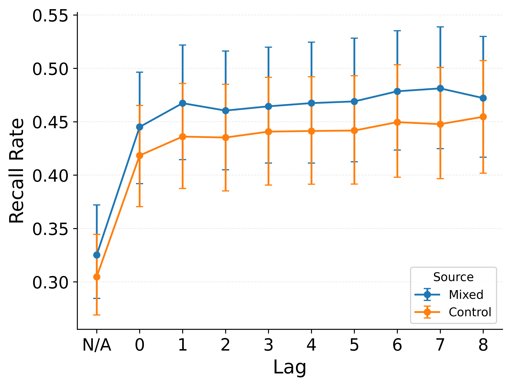

ICMR-Reinf spacing function. Simulated spacing curves for mixed vs matched-control lists from @lohnas2014retrieved. The spacing advantage is preserved; the model does not, by itself, produce the additional steepening seen in mixed lists (cf. @fig-spacing).
:::

However, ICMR-Reinf potentially boosts recall rates for items studied at mid-list positions and for repeated items compared to control list items in the spacing curve, reflecting the consequences of reinforcement on the first-occurrence trace. A more refined model could -- instead of boosting memory for repeated items according to a reinforcement mechanism -- use a more complex balancing of trace strengths across occurrences to account for enhanced access to first-occurrence contexts during retrieval.

Turning to cross-occurrence neighbor contiguity, ICMR-Reinf inherits two ingredients that prevent knitting across neighborhoods: distinctive contexts at encoding and occurrence-specific reinstatement at test. As a result, the centered neighbor-contiguity analyses remain flat at the other occurrence’s neighbors (no above-baseline peaks), matching the data and improving on standard CMR’s incorrect elevations. At the same time, reinforcement selectively boosts lag = 0 in the first→second variant (triggering from neighbors of the first presentation), reflecting easier access to the repeated item itself—an asymmetric feature visible in the data (cf. @fig-neighbor_contiguity).

::: {#fig-reinf_neighbor_contiguity layout="[[1,1]]"}

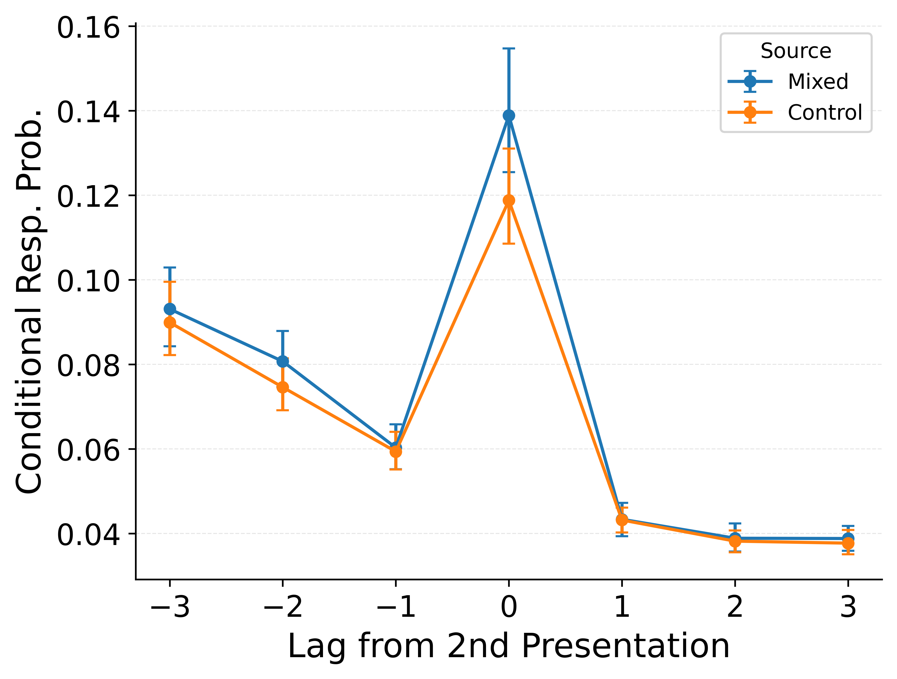

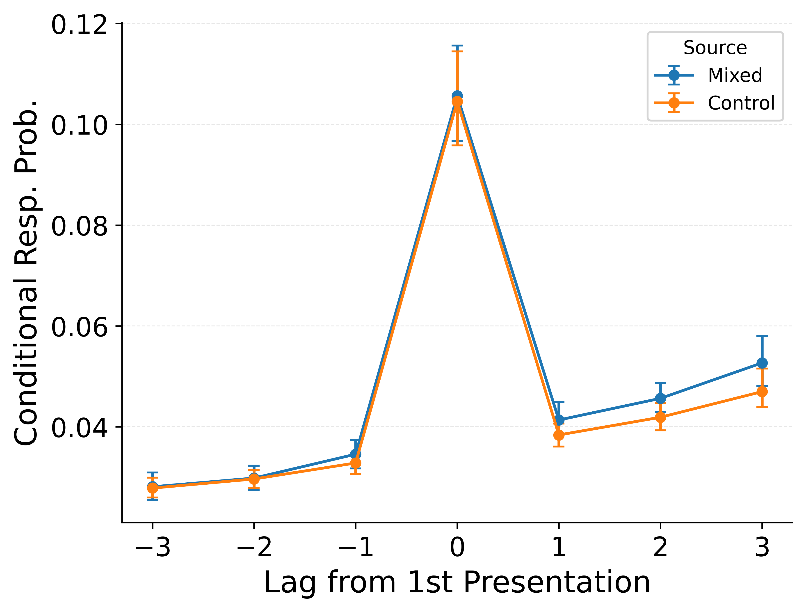

ICMR-Reinf: cross-occurrence neighbor transitions (centered lag-CRPs). Left: triggers from forward neighbors of the first presentation ($i{+}1,i{+}2$), lags centered on the second ($\ell=text{next}-j$). Right: symmetric variant (triggers $j{+}1,j{+}2$; lags centered on $i$). Mixed–minus–baseline curves remain flat at the other occurrence’s neighbors (no knitting). A selective lag = 0 elevation emerges in the first→second variant, consistent with boosted access to the repeated item itself.
:::

The decisive change also appears in the outgoing repetition lag-CRP. By routing reinstatement through a single occurrence and preferentially strengthening the first-occurrence trace, ICMR-Reinf not only avoids balanced access but also amplifies the first-over-second separation in mixed lists relative to the matched baseline—capturing the positive, repetition-specific asymmetry in the data. The 2×2 comparison in @fig-reinf_rep_lag_crp shows that where Instance-CMR preserved only baseline-level separation, ICMR-Reinf produces the boosted separation observed empirically.

::: {#fig-reinf_rep_lag_crp layout="[[1,1],[1,1]]"}

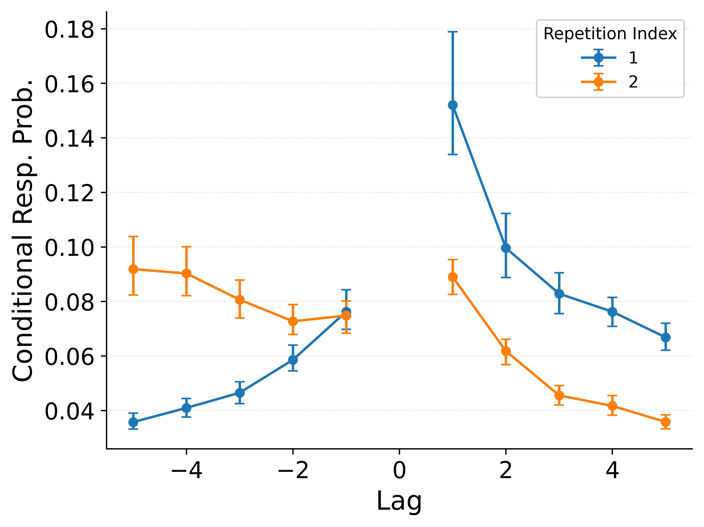

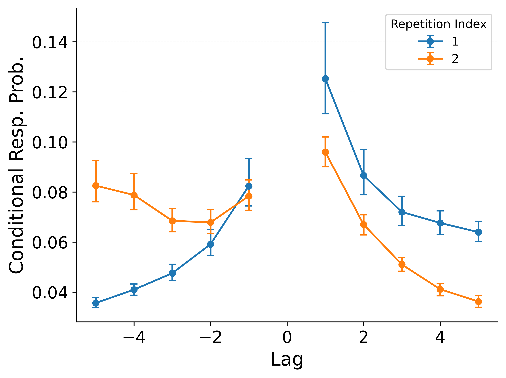

Repetition lag-CRP (outgoing): data vs ICMR-Reinf. Top: mixed lists (left) and matched-control baseline (right) from @lohnas2014retrieved. Bottom: ICMR-Reinf simulations scored identically. In mixed lists, the +1 bin and nearby lags show a larger first-over-second separation than in baseline—matching the data’s boosted separation. Balanced-access (blending) is absent.
:::

For the incoming/backward repetition lag-CRP (@fig-reinf_back_rep_crp), reinforcement increases arrivals from the first occurrence’s backward neighbor relative to the second, strengthening the first-over-second preference beyond Instance-CMR and moving the model toward the empirical pattern. Because this variant largely reflects how the search state approached the repeater, the outgoing mixed–minus–baseline contrast remains the cleanest probe of repetition-specific reinstatement, and that is where ICMR-Reinf shows its clearest advantage.

::: {#fig-reinf_back_rep_crp layout="[[1,1],[1,1]]"}

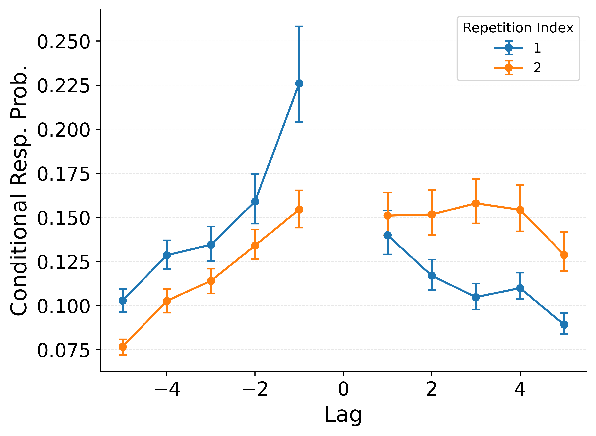

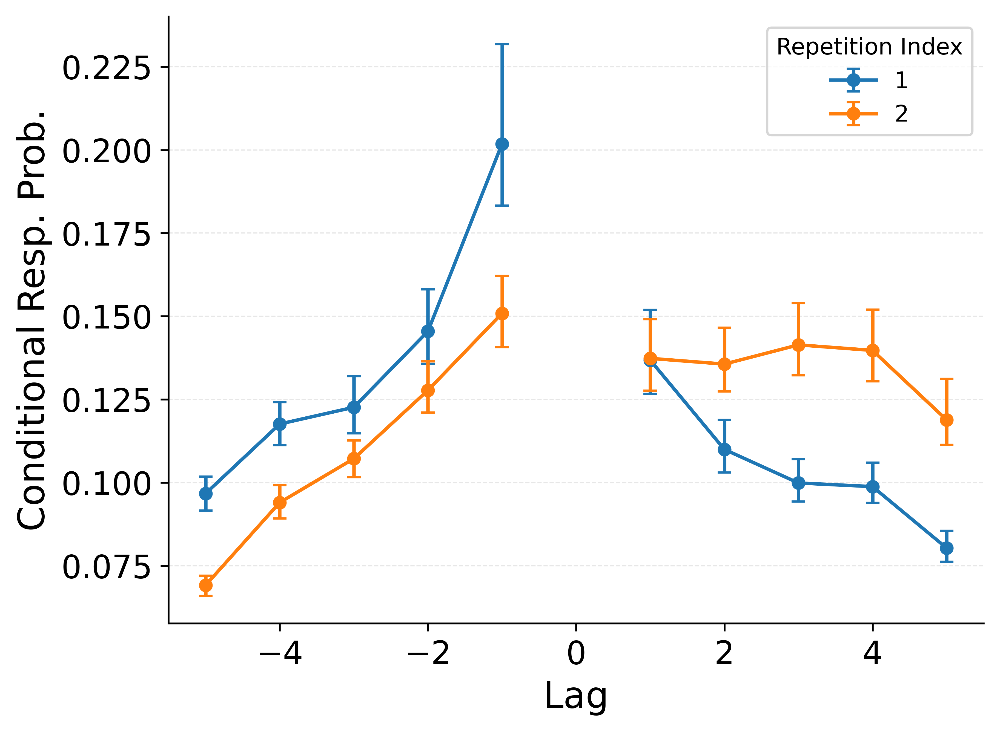

Repetition lag-CRP (incoming/backward). Top: mixed lists (left) and matched-control baseline (right) from @lohnas2014retrieved. Bottom: ICMR-Reinf simulations scored identically. In mixed lists, the +1 bin and nearby lags show a larger first-over-second separation than in baseline—matching the data’s boosted separation. Balanced-access (blending) is absent.
:::

Finally, in serial recall, the same combination—distinct contexts at study plus occurrence-specific reinstatement at test, with reinforcement of the first occurrence—maintains strong continuations to $i{+}1$ and keeps cross-occurrence forward errors at baseline levels. The 2×2 comparison in @fig-reinf_serial_rep_crp uses @logan2021serial (top: data; bottom: simulations) and shows that ICMR-Reinf mirrors the empirically negligible elevation of $i\!\rightarrow\!j{+}1/j{+}2$ errors while preserving correct forward chaining.

::: {#fig-reinf_serial_rep_crp layout="[[1,1],[1,1]]"}

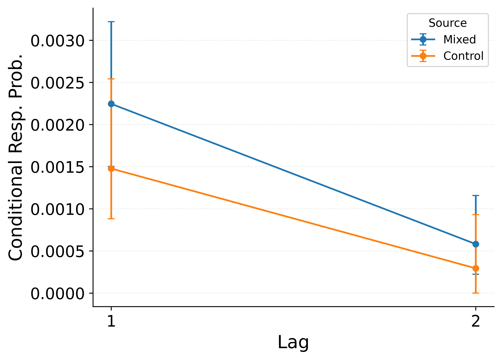

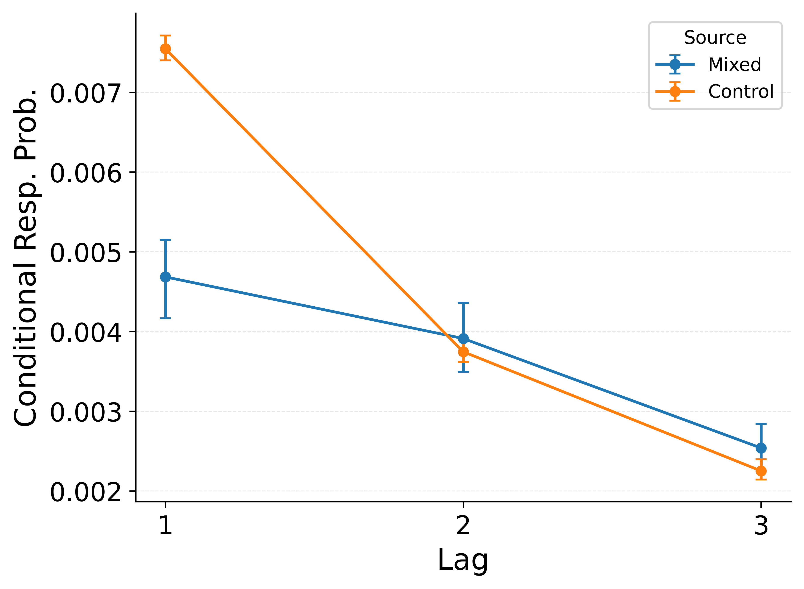

Cross-occurrence forward errors in serial recall (data vs ICMR-Reinf; @logan2021serial; @kahana2000interresponse). Top: data; bottom: ICMR-Reinf simulations. Panels plot, for items studied at $i$ and $j$, the conditional probability—after correct report through $i$—of erroneous transitions to the second occurrence’s forward neighbors ($i\!\rightarrow\!j{+}1$ and $i\!\rightarrow\!j{+}2$), contrasted with matched pseudo-repeater baselines. ICMR-Reinf reproduces the data’s non-elevation.
:::

ICMR-Reinf keeps occurrences separate at study and allows retrieval to select a single occurrence at test, while preferentially reinforcing the first occurrence’s trace.
It preserves core benchmarks and the spacing function; it maintains the absence of cross-neighbor knitting; it resolves the outgoing lag-CRP blending and captures the boosted first-over-second separation in mixed lists; and it mirrors the non-interference pattern in serial recall.
The price is a single reinforcement parameter.
The payoff is a coherent account in which a rehabilitated, non-associative study-phase mechanism contributes to repetition effects without reintroducing associative interference.

## Formal Comparison Across Datasets

We compared four variants under a common fitting and scoring pipeline (Methods): Standard CMR , ICMR-NoSPR , Instance-CMR, and ICMR-Reinf. ICMR-Reinf introduces one additional reinforcement parameter; all other pairwise comparisons are parameter-matched. Fit quality is reported as mean negative log-likelihood (−log L) across participants with bootstrapped 95% CIs over subjects. Where informative, we also report AIC model weights (AICw), which penalize parameter count.

Across datasets, three patterns emerge.
First, Instance-CMR substantially improves fit relative to Standard CMR in all datasets, with especially large gains in the serial-recall tasks [@logan2021serial; @kahana2000interresponse].
Second, adding study-phase reinforcement without contextual knitting (ICMR-Reinf) yields a further, reliable improvement in free recall (@lohnas2014retrieved; @broitman2024neural) despite its extra parameter, but brings no advantage over OS in serial recall.
Third, ICMR-NoSPR improves over Standard CMR in free recall but is not sufficient on its own—consistent with the results sections above.

| Model variant | @lohnas2014retrieved | @broitman2024neural |
| --- | ---: | ---: |
| Standard CMR | 1668.19 ± 146.93 | 1268.71 ± 279.66 |
| ICMR‑NoSPR   | 1661.98 ± 146.77 | 1263.46 ± 277.99 |
| ICMR‑OS      | 1661.01 ± 147.02 | 1260.15 ± 278.41 |
| ICMR‑Reinf   | **1658.99 ± 146.97** | **1259.17 ± 278.37** |

: **Free‑recall model fits (−log L; lower is better).** Values are participant means ± bootstrapped 95% CIs (subjects). {#tbl-fit-fr tbl-colwidths="[0.30,0.35,0.35]" tbl-cap-location="top"}

| Model variant | @logan2021serial | @kahana2000interresponse |
| --- | ---: | ---: |
| Standard CMR | 770.66 ± 59.75 | 3852.12 ± 530.13 |
| ICMR‑OS      | **729.19 ± 60.18** | **3759.75 ± 516.93** |
| ICMR‑Reinf   | 730.08 ± 60.47 | 3761.08 ± 516.74 |

: **Serial‑recall model fits (−log L; lower is better).** ICMR‑NoSPR was not evaluated for the serial‑recall datasets. Values are participant means ± bootstrapped 95% CIs (subjects). {#tbl-fit-sr tbl-colwidths="[0.30,0.35,0.35]" tbl-cap-location="top"}

As compact deltas relative to Standard CMR: Lohnas −log L improves by **−6.21** (NoSPR), **−7.18** (OS), **−9.20** (Reinf); Broitman by **−5.25**, **−8.56**, **−9.54**; Logan (serial) by **−41.47** (OS) and **−40.58** (Reinf); Kahana & Jacobs (serial) by **−92.37** (OS) and **−91.04** (Reinf).

To separate parameter-count effects from fit, we report AICw in two steps. First, a **pairwise** comparison between **Instance-CMR** and **Standard CMR** (parameter-matched) across all datasets; second, a **three-way** comparison in free recall that **includes ICMR-Reinf** (adds one parameter).

| Dataset                      | AICw (Standard) | AICw (Instance-CMR) |
| ---------------------------- | --------------: | -------------: |
| @lohnas2014retrieved   |   3.25 × 10⁻¹¹⁰ |       **1.00** |
| @broitman2024neural |   8.24 × 10⁻¹²⁴ |       **1.00** |
| @logan2021serial     |               0 |       **1.00** |
| @kahana2000interresponse  |               0 |       **1.00** |

: **Pairwise AIC weights (Instance-CMR vs Standard CMR).** OS is preferred in every dataset. {#tbl-aic-os-vs-cmr}

| Free-recall dataset          | AICw (Standard) | AICw (Instance-CMR) | AICw (ICMR-Reinf) |
| --------------------------------- | ----------: | ----------: | ----------: |
| @lohnas2014retrieved   |   1.91 × 10⁻¹⁴⁰ |   5.87 × 10⁻³¹ |          **1.00** |
| @broitman2024neural |   1.95 × 10⁻¹³⁷ |   2.37 × 10⁻¹⁴ |          **1.00** |

: **Three-way AIC weights in free recall.** After penalization, ICMR-Reinf is preferred; OS is second; Standard CMR is not competitive. {#tbl-aic-fr}

As a complementary, model-agnostic summary, we report the fraction of participants whose individual fit favored one model over another (lower −log L). These "win rates" mirror the AIC results: **Instance-CMR** beats Standard CMR for most or all participants in every dataset (Lohnas **80%**, Broitman **79%**, Logan **100%**, Kahana & Jacobs **100%**). In **free recall**, **ICMR-Reinf** beats Instance-CMR for a majority of participants (Lohnas **63%**, Broitman **64%**), whereas in **serial recall** the two are roughly tied (Logan **46%** for Reinf; Kahana & Jacobs **53%** for OS).

Taken together with the diagnostic analyses, the model-comparison results support a simple division of labor.
Occurrence-specific reinstatement at test (Instance-CMR) is necessary to eliminate the cross-occurrence interference predicted by Standard CMR and dominates in serial recall.
Study-phase reinforcement without contextual knitting (ICMR-Reinf) adds a small but reliable advantage in free recall by capturing the boosted access to first-occurrence context, while preserving the non-interference profile.
ICMR-NoSPR establishes that CMR’s original study-phase reinstatement is not required for overall spacing or benchmark fits, but by itself it does not resolve the interference signature.
Across datasets, standard CMR is consistently least favored under penalized fit.

# General Discussion

Human episodic search is strikingly organized by temporal contiguity: recalling one experience tends to cue retrieval of experiences that occurred nearby in time [@kahana1996associative; @healey2019contiguity].
This work asked how that organizing principle manifests when the same item has multiple study positions within a list (e.g., "canoe" at positions *i* and *j*).
Do repetitions knit their occurrence‑specific neighborhoods together, or do they remain separable such that retrieval can route through one occurrence without contacting the other?
We addressed this question in free and serial recall by comparing performance in lists with item repetitions to a position‑matched, symmetric baseline.
This procedure removes list-composition artifacts and isolates the consequences of being a repetition rather than a novel token in those positions [@lohnas2014retrieved;  @tulving1972inhibition; @ratcliff1990list].

Retrieved‑context models explain contiguity and related regularities by coupling items to a slowly drifting temporal context and using that context as both a storage address and a retrieval cue [@howard2002distributed; @polyn2009context; @healey2019contiguity].
During study, presenting an item reinstates contextual features associated with it into the ongoing context state, and the item binds to that updated state. 
Because the context drifts, different occurrences of the same item couple to different temporal states. 
During retrieval, the current context preferentially cues items encoded in similar contexts. Recalling an item then reinstates its associated contextual features into the cue again, which pulls subsequent transitions toward items studied nearby in time.

Under this framework, context evolution is item-driven.
Presenting or recalling an item retrieves its associated context features and pulls the ongoing temporal context toward those item-specific features.
This commitment explains how memory search can be guided by successive retrieval events, and also provides a cohesive account of how item repetition impacts memory retrieval dynamics [@howard2002distributed; @lohnas2014retrieved].
First, each occurrence of the same item binds its to different temporal contexts; with increased spacing, these contexts become more distinct, producing a spacing advantage through encoding variability [@glenberg1979component; @cepeda2006distributed].
Second, each occurrence triggers a form of study-phase retrieval: it partially reinstates prior occurrences' contexts into the ongoing state, making the contexts across occurrences more similar to each other [@@hintzman1975spacing; @delaney2010spacing].
Finally, at test, recalling a repeated item reinstates a composite over its occurrence-specific contexts, priming recall transitions toward neighbors of all occurrences [@polyn2009context; @logan2021serial; @sederberg2008context].

Here, we showed that this framework predicts patterns of cross-occurrence associative interference in free and serial recall. 
Item-driven context reinstatement knits occurrence-specific neighborhoods together at encoding and test, producing three signatures of blended support across occurrences.
Together these imply that cues to one occurrence should also cue the other, predicting that (i) recalling a neighbor of one occurrence should cue neighbors of the other occurrence (cross-occurrence neighbor transitions), (ii) recalling the repeated item itself should produce balanced access to both occurrences' neighborhoods, and (iii) in serial recall, correct chaining through one occurrence should increase erroneous continuations to the other occurrence's forward neighbors.
But across multiple datasets, our results contradict those predictions once the matched, symmetric baseline is applied.

First, we found that cross-occurrence neighbor transitions sit at baseline, indicating no knitting.
Prior work [@lohnas2014retrieved] reported boosted cross-occurrence neighbor transitions in free recall, finding that for repeated items with study positions $i$ and $j$, participants exhibited boosted chances of transitioning from neighbors of $i$ (e.g., $i{+}1,i{+}2$) to neighbors of $j$ (e.g., $j{+}1,j{+}2$) and vice versa compared to a control.
We generalized this analysis by reformulating it as a lag-CRP centered on the other occurrence's neighbors and applying a matched, symmetric baseline to control for list-composition effects.
Despite a similar reported methodology, our results observed no boost once the baseline was applied, suggesting a potential confound in the original analysis.
Instead, what repetition effects we did observe were not predicted by retrieved-context theory: a boosted chance of transitioning from neighbors of the first occurrence to the repeated item itself (lag = 0) when it had not yet been recalled.
Using a version of CMR that integrates unique features into ongoing context whether study events are new or repeated presentations keeps cross-occurrence neighbor transitions at baseline but does not reproduce the lag = 0 boost.
A further variant that preferentially strengthens the first occurrence's trace upon item repetition captures this effect, suggesting a non-associative mechanism that enhances access to the first occurrence without knitting contexts together.
These results challenge an associative study-phase retrieval account of repetition's consequences for memory search at study.

Second, we found that recalling the repeated item itself produced a reliable preference for the first occurrence's neighbors over the second's, contradicting the balanced-access prediction.
Furthermore, when considering incoming transitions to repeated items, arrivals from the first occurrence's backward neighbor were more likely than from the second's, again contradicting balanced access.
These patterns have been initially explored in other contemporaneous work.
@broitman2024neural focused on transitions from repeated items in free recall, finding that they exhibit similar biases toward the first occurrence's context and even observing in spectral EEG analyses that neural activity patterns prior to these recall events were most similar to patterns observed during the first occurrence's study event.
Similarly, @lohnas2025temporal examined incoming transitions to repeated items, finding that arrivals from the first occurrence's backward neighbor were more likely than from the second's.

Our results replicate and extend these findings, showing that they persist across multiple datasets and are not artifacts of list composition and clarifying them against a position-matched, symmetric baseline.
We found that these patterns are not fully accounted for by standard CMR when considered in combination with outcomes of analyses on a position-matched, symmetric baseline.
Whereas CMR predicts more balanced transitions from the repeated item to each occurrence's neighbors compared to position-matched controls, our results show a reliable preference for the first occurrence's neighbors that exceeds baseline expectation.
Using a version of CMR that both keeps occurrence contexts separate at study and allows retrieval to select a single occurrence's context at test is able eliminate CMR's prediction of balanced access.
However, the variant still does not capture the boosted first-over-second separation in mixed lists relative to baseline.
Our variant that preferentially strengthens the first occurrence's trace upon item repetition is able to additionally capture this preference, suggesting that a non-associative mechanism enhances access to the first occurrence without knitting contexts together.
These results echo the interpretation of similar patterns observed by @lohnas2025temporal, who argued that the first occurrence may be privileged because retrieval of item information from its first presentation upon its second presentation may strengthens its trace.
However, by contrast to @lohnas2025temporal, we find that retrieved-context theory requires modification in order to instantiate this mechanism without reintroducing associative interference.

Finally, we considered transitions from recall of repeated items in the context of serial recall. 
In serial recall of sequences with item repetitions, if recall proceeds accurately up through a repeated item’s first presentation, we asked how often participants erroneously transition to the +1 neighbor of the item’s *second* presentation.
Because CMR predicts that recalling the repeated item reinstates a composite over both occurrences’ contexts, it predicts that correct chaining through the first occurrence should increase erroneous continuations to the second occurrence’s forward neighbors.
In contrast, we found that such cross-occurrence forward errors were not elevated above a position-matched, symmetric baseline in two independent serial-recall datasets.
This type of error receives extensive attention in the serial-recall literature and has been central to critiques of chaining models of serial order memory positing that each item cues the next [@henson1996unchained; @kahana2000interresponse].
These results extend the same critique to retrieved-context models using an item-based context reinstatement rule.
Because they knit occurrence-specific contexts together at study and test, they predict that correct chaining through one occurrence should increase erroneous continuations to the other occurrence's forward neighbors.

These findings provide a measured challenge to the standard retrieved-context account of memory search.
Retrieved-context theory posits that context evolves by retrieving prior contextual states as opposed to contemporaneous accounts that instead proposed that context drifts randomly [@howard2002distributed].
Here, items are the drivers of context evolution, evoking features from their prior presentations to update the ongoing context state and guide retrieval.
This framework was embraced as a more parsimonious way to account for recency and contiguity effects in memory using a single mechanism.
But these data show that this mechanism, however parsimonious, predicts associative interference that is not observed empirically.
They raise the question: what then becomes of retrieved-context theory?

Our modeling results identify narrow changes to a retrieved-context model that reconcile it with these findings.
Removing associative study-phase retrieval (CMR‑NoSPR) abolishes cross‑occurrence neighbor linkage yet preserves serial‑position, CRP, and spacing benchmarks, showing that classic free‑recall successes do not depend on item-driven context evolution as originally implemented. 
Allowing occurrence‑specific reinstatement at test (ICMR‑OS) then eliminates balanced access from the repeater and preserves forward chaining in serial recall.
It sidesteps the associative‑interference prediction while keeping the temporal‑context machinery intact. 
These changes are effectively a variant of CMR that replaces item-based context and retrieval dynamics with an occurrence-specific alternative that can be variously interpreted as using a position-, event-, instance- or timeline-based code.
Here, item identities are only relevant when reporting the recalled item; they do not associate study events during encoding or memory search.
The resulting variant is still a retrieved-context model because it still posits that context evolves by retrieving prior contextual states, but treats each study episode as a unique event that can be separately cued and retrieved at test.

The serial‑recall literature has long emphasized positional or timeline codes and competitive selection to explain transposition gradients and the sparing of strict chaining, particularly in lists with within‑list repetitions [@henson1996unchained; @brown2000oscillator]. 
Our serial‑recall analyses align with this perspective: after correct report through the first occurrence, continuations to *i + 1* were preserved and erroneous continuations to the competing neighbor *j + 1* were not elevated relative to position‑matched controls -- exactly the pattern positional accounts anticipate and that strict item‑to‑item chaining (or blended item‑based reinstatement) would struggle to accommodate. 
In other words, the absence of cross‑occurrence forward errors in our data is not merely compatible with positional coding; it is diagnostic of the kind of competition over position‑like cues those models posit.
Traditionally, accounts of free recall have de-emphasized the role of positional information, with performance thought to rely predominantly on temporal coding and semantic organization [@polyn2009context; @lohnas2015expanding; @sederberg2008context].
However, recent efforts to show that retrieved-context models can address serial as well as free recall [@lohnas2024retrieved; @logan2021serial] have highlighted the viability of an integrated framework that encompasses both types of recall.
These results help advance an integrated view of serial and free recall where a common set of constraints from both literatures inform theory development.
The resulting model retains the core principles of retrieved-context theory while incorporating insights from positional coding approaches: it allows for the use of position-like information to guide retrieval while maintaining the evolving context representation as the primary search scaffold.

It is nonetheless challenging to reconcile these findings with prior demonstrations that item features can influence organization in free and serial recall. 
Free recall is classically subject to semantic organization, a tendency for similar items to cluster during retrieval [@bousfield1953occurrence; @glanzer1969distance; @howard2002does; @romney1993predicting].
Similarly, serial-recall performance is influenced by item-level properties such as phonological similarity [@baddeley1966influence; @osth2023item].
This consistency of these classic benchmarks establishes all but incontrovertibly that item features fundamentally influence the organization of memory search, instead of just defining what is reported when a trace is retrieved.
Furthermore, patterns of prior-list intrusions (PLIs) across free and serial recall suggest that items can cue retrieval across list boundaries, which is difficult to reconcile with a purely temporal or positional code.
For example, transitions from items in the prior list to their neighbors in the current list are elevated relative to a matched baseline, suggesting that item features can cue retrieval across list boundaries [@lohnas2015expanding].
At the same time though, positional codes have been shown to influence PLIs in serial recall, with intrusions tending to come from the same serial position in the prior list as the current recall position [e.g., @osth2023item].
Together, a wealth of evidence persistently shows that item features influence organization in both free and serial recall.

@logan2021serial demonstrated item-dependent and position-dependent contexts can be accommodated simultaneously in a retrieved-context model to simultaneously address these and other constraints.
Similarly, CMR and its variants has traditionally included multiple layers of context that encode different kinds of similarity relationships across study events, such as a semantic layer that captures item similarity or a source layer that captures stimulus modality [@polyn2009context].
Given these successes, it is likely that ICMR-OS could similarly be extended to include item-level features alongside the occurrence-specific features it applies to avoid associative interference.
An additional parameter that weights the contribution of an item-dependent contextual layer relative to a occurrence-specific contextual layer could allow the model to flexibly capture the influence of item features on organization while avoiding associative interference across occurrences.

That said, the lack of any cross‑occurrence interference in our free‑ and serial‑recall datasets weighs against even a "small" but pervasive role for item‑based knitting in the organization of search under standard list‑learning conditions.
These results instead tentatively endorse a model that completely excludes item-level features from driving context evolution during encoding or retrieval.
Two caveats temper these conclusions. 
First, we did not systematically analyze individual differences in cross‑occurrence interference; if a minority of participants show blending, population‑level averages could mask it.
Second, we did not report evaluation of mixture models that combine explicit position/timeline codes with limited item‑based inputs under a single architecture.
Either extension could clarify when item‑based features influence organization -- e.g., under deliberate integration instructions, at very short lags with rehearsal, or when semantic scaffolds promote cross‑episode binding.
A program of research that evaluates proposed models across a broader range of conditions and datasets and addresses phenomena like PLIs and semantic clustering could similarly clarify when item-level features influence organization.
These limitations set the stage for future work.

Along with its consequences for retrieved-context accounts of memory search, these results also challenge classic understanding of factors underlying the spacing effect.
The spacing effect is classically understood as a repetition effect, and has been a central focus of research on memory for repeated experience [@cepeda2006distributed]
However, it applies even to pairs of distinct items, not just repeated items.
By measuring the probability of retrieving either of two study items during a free recall trial -- an analysis termed the "OR score" -- research consistently finds that pairs of spaced items were more likely to be recalled than pairs of massed items [@lohnas2011contextual].
Notably, in a phenomenon called "superadditivity", the mnenomic benefit of spacing tends to be more pronounced for repeated items than for distinct items .
The probability of recalling an item repeated in a spaced fashion is frequently reported as higher than the probability of recalling one of two distinct but similarly spaced items, violating statistical independence [@benjamin2010distributed].
This has been interpreted as evidence that additional mechanisms are at play when items are repeated, beyond those that govern the spacing effect for distinct items.
Our results did not directly test for a superadditive spacing effect, but nonetheless provide insight into its possible mechanisms.

The study-phase retrieval hypothesis is one among several prominent accounts of where such a superadditive spacing advantage might come from.
By this account, presenting an item again after a lag reinstates the context associated with its prior presentation, in some way strengthening access to the item's representation in memory [@hintzman1975spacing; @delaney2010spacing].
Retrieved-context theory combines a specific instantiation of this idea with a contextual variability mechanism to explain the spacing effect for repeated items [@howard2002distributed; @lohnas2014retrieved].
In retrieved-context models, study-phase retrieval during repetition reinstates makes the contexts across occurrence neighborhoods more similar to each other, producing the patterns of associative interference described above.
This mechanism has been proposed to help address spacing effects in free recall [@lohnas2014retrieved] as well as a potential basis for the benefits of retrieval practice [@karpicke2011retrieval; @whiffen2017episodic].
But while confirming and evaluating CMR's predictions of associative interference because of this mechanism, we also showed that study-phase retrieval in CMR does not contribute to the spacing effect itself: removing the mechanism (in CMR-SPR) preserves the spacing advantage for repeated items and keeps contexts reinstated upon each occurrence distinct.
In CMR, the primary consequence of study-phase retrieval is to knit occurrence-specific contexts together; characterizations of the mechanism as providing a repetition-specific strengthening of retrieved representations are not clearly supported by the current findings [@lohnas2025temporal; @lohnas2014retrieved].

To match this characterization, we proposed a modified version of ICMR-OS (ICMR-Reinf) that explicitly incorporates study-phase retrieval as a mechanism for strengthening representations during repetition.
When an item is repeated, it preferentially strengthens the trace of the first occurrence without knitting contexts together, using an additional parameter to control the degree of strengthening.
This mechanism accounts for three patterns identified in our analyses. 
First, it captures the boosted access to the first occurrence's neighbors upon recalling the repeated item itself in free recall.
Second, it captures the boosted probability of transition to repeated items from the -1 neighbor of the first occurrence relative to the second.
Third, it captures the boosted tendency after retrieving the +1 neighbor of an item's first occurrence to transition to the repeated item itself when it has not yet been recalled.
All these patterns can be accounted for in terms of strengthened context-to-item associations for the first occurrence of any repeatedly studied items without cross-occurrence knitting.
Still, model fits are not substantially improved over ICMR-OS by this variant, suggesting that further development is needed to interpret these patterns and their mechanistic basis.
Instead, ICMR-Reinf represents an example of how study-phase retrieval might be rehabilitated within retrieved-context models to capture repetition-specific effects without reintroducing associative interference.

<!-- This whole paragraph is out of date. Talks about a thesis. Refers to an analysis/example I removed. Has a vague and uninspiring message about how memory search manages integration and specificity that I now know how to clear up. -->
This work opened by asking how memory links related episodes without collapsing their distinctive details.
In an example scenario, we described two visits to a bakery: one where you inhale warm cinnamon and buy a fresh loaf, and another where you are greeted by the aroma of espresso and a new cashier.
How is it that a friend speaking of "the bakery down the street" can remind you of both visits, yet you still know which purchase happened when?
The standard retrieved-context account of memory search posits that this is a task fraught with interference, because such a cue can retrieve a blend of contextual details across both visits.
In contrast, our results suggest that memory search in tasks like free and serial recall succeeds by sidestepping this challenge.
Instead of using item features to remember associated contextual details, memory search may rely on a positional or event-based contextual code that can separately index each occurrence of an item during encoding and later retrieve individual occurrences stored as distinct traces at test.
A later mention of "the bakery down the street" can cue either visit, but it need not blend them.
Memory search can route through one episode at a time, preserving what happened when, allowing repeated experience to strengthen access without sacrificing specificity.

# References

::: {#refs}
:::