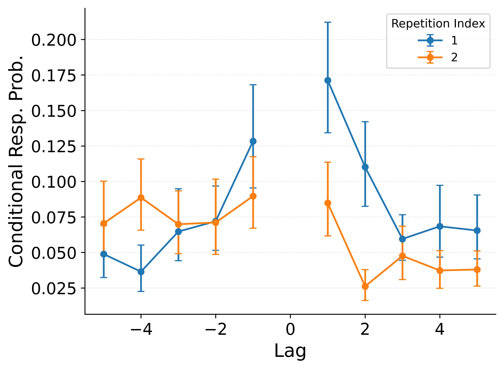
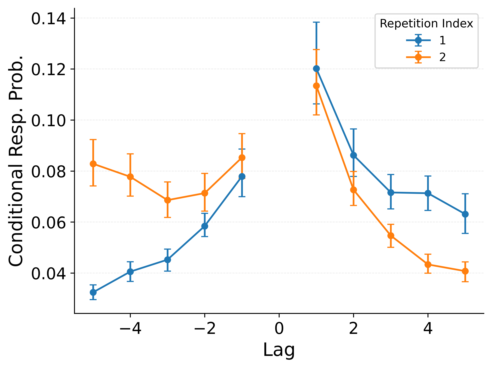
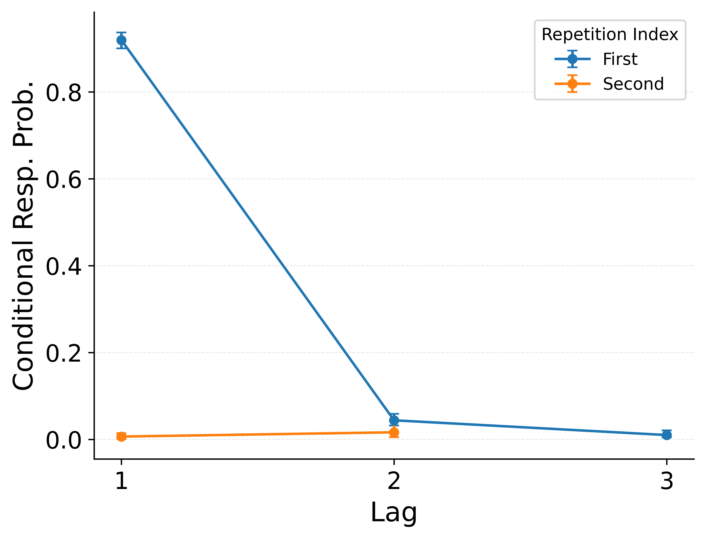
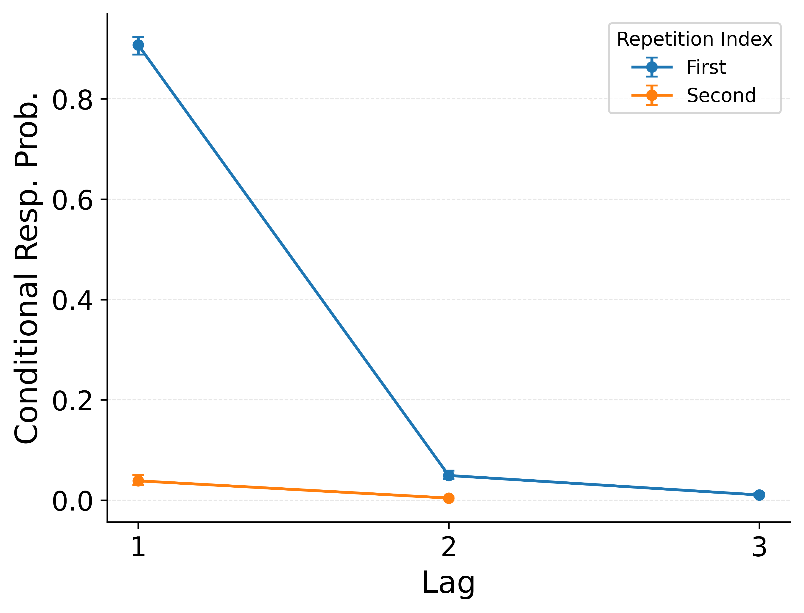

## {.center}

::: {.notes}
Thank you for the introduction. Today I want to talk about a problem that arises when memory encounters the same thing more than once.
:::

## The Challenge of Repeated Experience

Episodic memory faces two competing demands:

. . .

**Integration** --- Partial cues in the present should retrieve relevant details from the past

. . .

**Differentiation** --- Details from one moment should not be confused with those of another

. . .

Consider the word *canoe* appearing at position 5 and again at position 15 in a study list.
Each occurrence has different temporal neighbors. Can memory keep them apart?

::: {.notes}
Memory must do two things at once. It must connect related experiences so a partial cue can retrieve useful information. But it must also keep those experiences distinct so you don't confuse what happened when. This is especially challenging when the same item appears more than once. If canoe shows up twice in a study list, each occurrence has different neighbors --- different context. The question is whether memory keeps those two canoe episodes apart or blurs them together.
:::

## Free and Serial Recall as a Window

{fig-align="center" height="750"}

::: {.notes}
We study this in two classic paradigms. In the top panel, participants study a list of words and then recall them in any order --- free recall. We know from decades of work that recall is temporally organized: recalling A tends to lead to recalling B, its neighbor. In the bottom panel, we add item repetitions --- the same item, C, appears at two positions. Now when you recall C, where does memory take you? To the first occurrence's neighbors? The second's? Both? That's the diagnostic question. Participants do both mixed lists, which contain repeated items, and control lists with all unique items at matched positions. We also test this in serial recall, where participants must output items in study order.
:::

## Retrieved-Context Theory

{fig-align="center" height="650"}

The dominant account of temporal organization in episodic memory search.

::: {.notes}
The leading theory for explaining these temporal organization patterns is retrieved-context theory, implemented in models like the Context Maintenance and Retrieval model, or CMR. The core idea: studied items get associated with a continuously drifting temporal context. At recall, retrieving an item reinstates its study context, and that reinstated context guides what comes to mind next. This cycle of context cueing items, and items reinstating context, explains why recall is temporally organized. It also accounts for spacing effects, serial order memory, and other benchmark phenomena.
:::

## The Lag-CRP

{fig-align="center" height="750"}

::: {.notes}
Here is the signature prediction of retrieved-context theory: the lag-CRP. On the x-axis is lag --- the distance between successive recalls in terms of their original study positions. On the y-axis is the conditional probability of making that transition. The peak at plus-one means that after recalling an item, you are most likely to recall the item that immediately followed it during study. The forward asymmetry --- plus-one being higher than minus-one --- reflects the forward drift of context during encoding. This pattern is robust and well-explained by context reinstatement.
:::

## {.center}

RCT explains these patterns beautifully for unique items.

**But what happens when an item repeats?**

. . .

The theory predicts that repeated occurrences get **blended** together in memory.

. . .

Today I will show you:

::: {.incremental}
1. What that prediction looks like
2. That the data **contradict** it across free and serial recall
3. A targeted fix that keeps what works
:::

::: {.notes}
So RCT handles unique items very well. But what does it predict when the same item appears twice? Because each occurrence of canoe updates and reinstates the same item representation, the theory predicts that the two episodes get blended together --- their contexts overlap, and retrieving canoe reinstates a composite of both contexts. Today I will lay out what that blending prediction looks like in detail, show you across multiple datasets and two recall tasks that the data contradict it, and then propose a targeted reformulation called Instance-CMR that fixes the problem while preserving everything that works.
:::

## What Happens When an Item Repeats?

:::: {.columns}

::: {.column width="100%"}
{fig-align="center" height="650"}
:::

::::

::: {.fragment}
In standard CMR, item identity drives context evolution at **both stages**:

- **At study**: Re-encountering canoe reinstates its prior context, pulling the two occurrence contexts toward each other
- **At retrieval**: Recalling canoe reinstates a composite blend of both contexts
:::

::: {.notes}
Focus on the left side of this figure. In standard CMR, item identity is the key that drives context evolution. At study, when canoe appears the second time, the model reinstates context from the first occurrence --- this is study-phase retrieval. It pulls the two occurrence contexts toward each other, making them overlap. At retrieval, recalling canoe reinstates a composite of all the contexts associated with that item. Both mechanisms predict that cuing one occurrence also substantially cues the other. The contexts get knit together.
:::

## Three Testable Predictions

{fig-align="center" height="350"}

::: {.fragment}
**1. Neighbor knitting**: Recalling a neighbor of one occurrence should elevate transitions to neighbors of the other occurrence
:::

::: {.fragment}
**2. Balanced access**: After recalling a repeated item, transitions should be equally split between both occurrences' neighborhoods
:::

::: {.fragment}
**3. Forward chaining errors**: In serial recall, correctly outputting one occurrence should sometimes propel recall to the other occurrence's neighbor
:::

::: {.notes}
We derive three testable predictions from item-based context reinstatement. First, neighbor knitting: if recalling E activates the first D's context, and that context overlaps with the second D's context, then E should also transition to K and L --- the second D's neighbors. The neighborhoods get linked. Second, balanced access: after recalling D itself, the reinstated composite context should cue both neighborhoods roughly equally, rather than favoring one occurrence. Third, in serial recall: after correctly producing the item at one position, the model predicts errors to the other occurrence's forward neighbor. If any of these patterns show up above a proper baseline, it supports blending. If they don't, the theory has a problem.
:::

## No Neighbor Knitting {.smaller}

::: {.fragment}
We compare **mixed lists** (blue, containing repeats) to **position-matched control lists** (orange, all unique items). Any elevation of blue above orange isolates the repetition effect.
:::

:::: {.columns}

::: {.column width="50%"}
::: {.fragment}
### Data
{height="550"}

No elevation at the other occurrence's neighbors.
:::
:::

::: {.column width="50%"}
::: {.fragment}
### CMR Prediction
{height="550"}

CMR falsely predicts elevated transitions.
:::
:::

::::

::: {.notes}
Here is the first diagnostic. We compare mixed lists, which contain repeated items, to position-matched control lists where all items are unique. This is a between-trial comparison that isolates the specific contribution of repetition. The x-axis shows lag from the second occurrence --- so lag zero is the repeated item itself, and the surrounding positions are its neighbors. On the left, the data. Blue is mixed, orange is control. The two lines overlay almost perfectly at the neighboring positions. There is no knitting. The only notable feature is an elevation at lag zero itself in the first-to-second direction, suggesting heightened access to the repeated item without linking the neighborhoods. On the right, CMR predicts the blue line should sit well above orange --- it predicts knitting that we do not observe.
:::

## How to Read the Repetition Lag-CRP

{fig-align="center" height="550"}

After recalling a repeated item, we plot transitions **centered separately on each occurrence**:

- **Blue** = centered on the 1st occurrence
- **Orange** = centered on the 2nd occurrence
- If blending occurs, the two lines should **converge**

::: {.notes}
Before showing the key result, let me explain how to read the repetition lag-CRP. After recalling a repeated item like C, we ask: where does the next recall go? We compute a lag-CRP centered on each occurrence separately. The blue line is centered on the first occurrence. So lag plus-one on the blue line means the item that followed the first C during study. The orange line is centered on the second occurrence. If the model reinstates a composite context that contacts both occurrences equally, the blue and orange lines should converge --- balanced access. If memory is episode-specific, the lines should separate, with one occurrence dominating.
:::

## First-Over-Second, Not Balanced Access {.smaller}

:::: {.columns}

::: {.column width="50%"}
### Data
{height="650"}
:::

::: {.column width="50%"}
### CMR Prediction
{height="650"}
:::

::::

::: {.fragment}
Data show strong **first-over-second** asymmetry. CMR predicts **convergence**.
:::

::: {.notes}
This is the key result. On the left, the data. After recalling a repeated item, transitions at lag plus-one strongly favor the first occurrence --- blue is well above orange. Memory preferentially returns to the first occurrence's neighborhood. On the right, CMR. The two lines nearly converge at plus-one --- the model predicts balanced access. This is the opposite of the data. The model reinstates a composite context that contacts both occurrences, but people route through one episode --- specifically, the first one. This pattern replicates across additional datasets.
:::

## Forward Chaining Preserved in Serial Recall {.smaller}

::: {.fragment}
In serial recall, you must output items in study order. If blending occurs, after producing *canoe* at position *i*, the system should sometimes jump to position *j+1* --- the neighbor after the **other** occurrence.
:::

:::: {.columns}

::: {.column width="50%"}
::: {.fragment}
### Data
{height="550"}

Correct forward chaining intact. No cross-occurrence errors.
:::
:::

::: {.column width="50%"}
::: {.fragment}
### CMR Prediction
{height="550"}

CMR predicts elevated errors to the other occurrence's neighbor.
:::
:::

::::

::: {.notes}
Serial recall sharpens the prediction further. Here, participants must output items in study order. After correctly producing canoe at its first position, the next response should be the item that followed it --- position i plus one. If blending occurs, the model predicts the system should sometimes jump to the other occurrence's forward neighbor --- position j plus one. On the left, the data: the first occurrence line dominates, correct forward chaining is intact, and cross-occurrence errors are at floor. On the right, CMR predicts elevated j-plus-one errors that simply do not occur. This extends a constraint that has been clear in serial recall for decades but has not been carried over to evaluations of retrieved-context theory.
:::

## Noninterference Across Tasks

Three predictions derived from item-based context reinstatement.

Three failures.

. . .

| Prediction | Free Recall | Serial Recall |
|:-----------|:-----------:|:-------------:|
| Neighbor knitting | Not observed | --- |
| Balanced access | Not observed | Not observed |
| Forward chaining errors | --- | Not observed |

. . .

Replicated across **6 datasets**. Occurrences stay separate.

::: {.notes}
To summarize: all three predictions derived from item-based context reinstatement are contradicted by the data. No neighbor knitting, no balanced access, no forward chaining errors. This holds across six published datasets spanning both free and serial recall. The message is clear: occurrences stay separate in memory. The question now is how to fix the theory.
:::

## Where Does Blending Come From?

The blending prediction has **two sources** in CMR --- each needs a separate fix:

. . .

:::: {.columns}

::: {.column width="50%"}
### At Study
Item identity drives context evolution.
Restudying *canoe* reinstates context from its first occurrence, pulling the two contexts toward each other.

**Fix**: Drive context with item-independent position codes. Each occurrence gets a fresh, non-overlapping context.
:::

::: {.column width="50%"}
### At Retrieval
Recalling *canoe* reinstates a composite context blending all occurrences.

**Fix**: Let occurrence traces compete. The winning trace reinstates its own context --- not a blend.
:::

::::

::: {.notes}
Where exactly does blending come from in CMR? There are two sources and each needs its own fix. At study, item identity drives context evolution. When canoe appears the second time, the model reinstates context from the first canoe, pulling the two occurrence contexts toward each other. The fix is to drive context with item-independent position codes, so each occurrence encodes into a fresh, non-overlapping context. At retrieval, recalling canoe reinstates a composite that blends all occurrences. The fix is to let occurrence traces compete for retrieval, so the winning trace reinstates its own specific context rather than a blend. Together, these two changes yield Instance-CMR.
:::

## CMR vs. Instance-CMR

{fig-align="center" height="800"}

::: {.notes}
Here is the full comparison. On the left, standard CMR: item C drives context evolution at both study and recall. Restudy produces overlapping context. Retrieval reinstates an item-level composite. The two contexts get knit together. On the right, Instance-CMR: context evolves independently of item identity. Each occurrence of C encodes into a fresh, distinct context. At retrieval, occurrence traces compete, and only the winner's context is reinstated. The contexts are kept distinct and separate. Instance-CMR is still a retrieved-context model --- context cues retrieval, and retrieved memories reinstate context. The difference is that these dynamics are organized around study events rather than item-level aggregates.
:::

## Instance-CMR Eliminates Blending {.smaller}

:::: {.columns}

::: {.column width="50%"}
### Data
{height="650"}
:::

::: {.column width="50%"}
### Instance-CMR
{height="650"}
:::

::::

::: {.fragment}
Balanced access eliminated. First-over-second restored.

But the data show the first occurrence is ***even more*** dominant than the baseline predicts. Something beyond non-interference is at work.
:::

::: {.notes}
Here is the same repetition lag-CRP, now with Instance-CMR on the right. Compare this to the CMR prediction we saw earlier where the lines converged. Instance-CMR now shows clear first-over-second separation. Balanced access is gone. But notice something: the data on the left show an even larger separation than the model produces. The first occurrence is more dominant than what mere non-interference would predict. Something is actively boosting the first occurrence. This motivates one more refinement.
:::

## Reinforcement Without Blending {.smaller}

:::: {.columns}

::: {.column width="50%"}
### Data
{height="650"}
:::

::: {.column width="50%"}
### Instance-CMR + Reinforcement
{height="650"}
:::

::::

::: {.fragment}
When the item repeats, **strengthen the first-occurrence trace** without reinstating its context. Study-phase retrieval reconceived as reinforcement rather than associative knitting. One added parameter.
:::

::: {.notes}
The final refinement: Instance-CMR with reinforcement. When canoe appears the second time, instead of reinstating the first occurrence's context and blending, we simply strengthen the first-occurrence trace in memory. This boosts its competitive advantage at retrieval without knitting the contexts together. Study-phase retrieval is reconceived as reinforcement rather than associative knitting. The result, on the right, now captures the amplified first-over-second asymmetry we see in the data. This adds one parameter to the model. The key insight is that repetition can strengthen access to a prior episode without blurring its contextual specificity.
:::

## Does Fixing Repetition Break What Works? {.smaller}

:::: {.columns}

::: {.column width="50%"}
### Serial Position Curve
{height="550"}
:::

::: {.column width="50%"}
### Lag-CRP
{height="550"}
:::

::::

::: {.fragment}
All standard benchmarks preserved: primacy, recency, contiguity, forward asymmetry. The spacing effect is likewise maintained --- contextual variability is sufficient without study-phase retrieval.
:::

::: {.notes}
A natural worry: if you change the model to fix repetition, do you break the phenomena that made CMR successful in the first place? No. On the left, the serial position curve is preserved --- primacy and recency are intact. On the right, the lag-CRP is preserved --- the contiguity effect and forward asymmetry are fully maintained. We also verified that the spacing effect is preserved. Contextual variability --- encoding in more distinct contexts with wider spacing --- is sufficient to produce spacing benefits without study-phase retrieval. Removing study-phase retrieval primarily removed knitting, not the spacing effect.
:::

## Model Comparison {.smaller}

| Model | Free Recall | Free Recall | Serial Recall | Serial Recall |
|:------|:-----------:|:-----------:|:-------------:|:-------------:|
|       | Lohnas 2014 | Broitman 2024 | Gordon 2021 | Kahana 2000 |
| CMR | 0.00 | 0.00 | 0.00 | 0.00 |
| CMR-NoSPR | 0.00 | 0.00 | 0.00 | 0.00 |
| ICMR-OS | 0.00 | 0.00 | **1.00** | **1.00** |
| ICMR-Reinf | **1.00** | **1.00** | 1.00 | 1.00 |

: AIC weights across four datasets. {.striped}

. . .

Removing study-phase retrieval alone fixes knitting but not balanced access --- you need both changes.

ICMR dominates CMR for **80--100%** of individual participants.

::: {.notes}
Here is the formal model comparison using AIC weights across four datasets. Standard CMR never wins. Removing study-phase retrieval alone, CMR-NoSPR, improves fits but is insufficient --- it fixes neighbor knitting but not balanced access. Instance-CMR with occurrence-specific reinstatement dominates in serial recall. Adding reinforcement provides a further edge in free recall. These are not marginal differences --- AIC weights are essentially one versus zero. Instance-CMR is preferred for 80 to 100 percent of individual participants across datasets.
:::

## What This Means for Retrieved-Context Theory

Retrieved-context theory is **not wrong** --- context reinstatement remains the core mechanism.

. . .

But the **unit of reinstatement** must be the episode, not the item.

. . .

Context must evolve **independently of item identity** to preserve access to occurrence-specific detail.

. . .

*Retrieved-context theory, refined for episodes.*

::: {.notes}
What does this mean for the theory? We are not abandoning retrieved-context theory. Context reinstatement remains the core mechanism driving memory search. But the unit of reinstatement must change. It must be the specific study event --- the episode --- not the item category. And temporal context must evolve independently of item identity so that the contexts associated with repeated occurrences remain distinct. This is a narrower change than it might sound. Everything else about the theory stays the same. It is retrieved-context theory, refined for episodes.
:::

## Connections and Future Directions

- **Positional codes in serial recall**: The serial recall literature has long emphasized position-based representations. Instance-CMR imports that insight into free recall within a formal retrieved-context framework.

. . .

- **Instance-based traditions**: Connects to MINERVA, Logan's instance theory, and exemplar models --- approaches that have been underrepresented in retrieved-context modeling.

. . .

- **Open questions**: Individual differences (does a subset of participants show blending?), richer repeated-event paradigms, semantic organization of repeated items.

::: {.notes}
This work connects to several broader themes. The serial recall literature has emphasized positional and timeline codes for decades --- our results import that insight into free recall and formalize it within the retrieved-context framework. It also connects to instance-based traditions in memory and categorization --- Hintzman's MINERVA, Logan's instance theory --- that have been surprisingly underrepresented in retrieved-context modeling despite natural compatibility. Looking forward, there are open questions about individual differences --- do some participants show blending even though the group does not? --- and about extending these tests to richer paradigms with meaningful repeated events, semantic structure, and source memory demands.
:::

## {.center}

Repeated experience **strengthens access** without sacrificing **specificity**.

. . .

Not through contextual blending, but through **differentiated competition**.

. . .

{fig-align="center" height="500"}

::: {.notes}
To close: the challenge we opened with was how memory balances integration and differentiation for repeated experience. The answer is not contextual blending --- it is differentiated competition. Each occurrence maintains its own distinct context. At retrieval, traces compete, and the winner reinstates its own episode-specific context. Memory can strengthen access to repeated items without sacrificing the specificity of individual episodes. Thank you.
:::

## {.center}

### Thank You

Jordan B Gunn --- University of Cambridge

Sean M Polyn --- Vanderbilt University

::: {.notes}
Thank you. I'm happy to take questions.
:::
