## Today's Focus {.smaller}

**Current goal:**

Use retrieved-context models (CMR/eCMR) to account for the selective interference effect in trauma-film paradigms.

**Previously:**

Presented the context-binding theoretical framework and agreed to develop a simulation-focused paper.

**Today's focus:**

Show CMR-relevant dynamics in the expt1 VRT dataset.

Walk through the simulation plan and progress so far.

Introduce an expanded scope: using the framework to examine design features of the VIT paradigm — particularly reminder cues at test — and connecting simulations to expt1 data.

## Key Questions {.smaller}

Do the expt1 data show CMR dynamics (temporal contiguity, serial position effects, cue-driven recall) that justify a retrieved-context modelling approach?

Given those dynamics, does the VIT's use of film-related cues during recall plausibly suppress voluntary/involuntary differences — and does this match your experience with the paradigm?

How far should the paper go: simulation-only, or include expt1 data analyses and model fits?

Which remaining simulation direction is most valuable: arousal (eCMR), cue effects, or recognition dissociation?

# Expt1 Data: CMR Dynamics in the VRT {.section}

## Serial Position Curve — Task

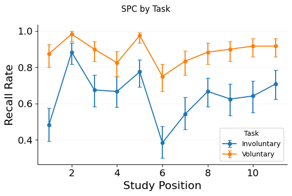{.r-stretch fig-align="center"}

::: notes
SPC from expt1 VRT data (240 participants, 11 film clips).
Involuntary vs voluntary recall.
Classic serial position effects are present — primacy and recency.
This is the kind of data CMR is built to explain.
:::

## Serial Position Curve — Condition

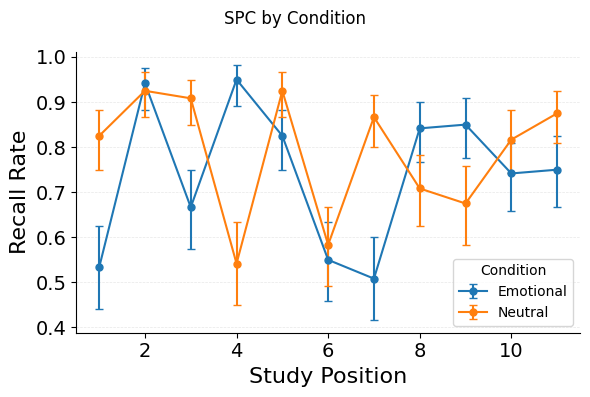{.r-stretch fig-align="center"}

::: notes
Emotional vs neutral film.
Neutral clips recalled more than emotional — consistent across analyses.
:::

## Lag-CRP: Temporal Contiguity

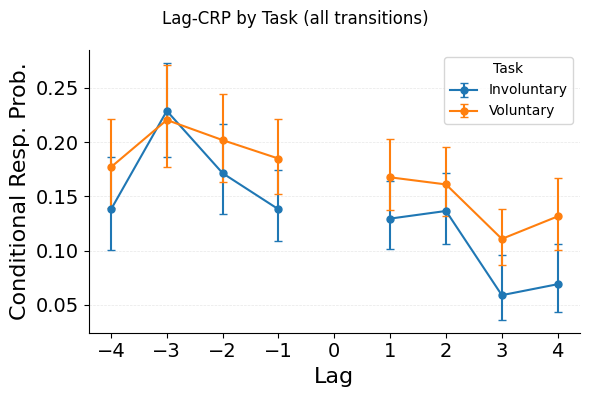{.r-stretch fig-align="center"}

::: notes
THE signature CMR dynamic.
Forward asymmetry and contiguity gradient — participants tend to recall clips studied near the previously recalled clip, with a forward bias.
This is present in the VRT data, confirming that retrieved-context dynamics operate in this paradigm.
:::

## Probability of Nth Recall

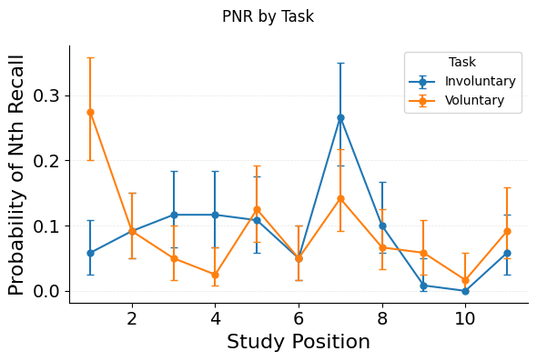{.r-stretch fig-align="center"}

::: notes
PNR by task type.
Key question: does voluntary recall show primacy bias at early output positions?
That would indicate start-of-list reinstatement, which is the retrieval-control mechanism modeled in Sim 3.
:::

## Cue Effectiveness — Task

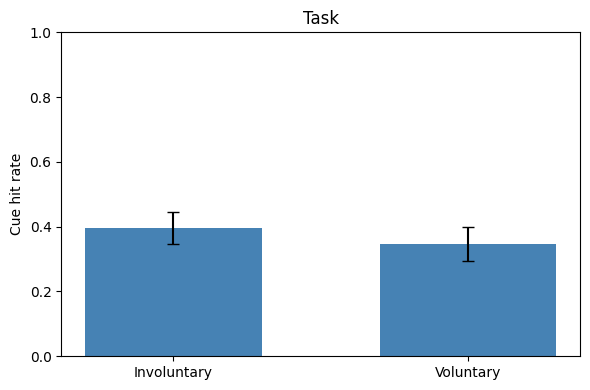{.r-stretch fig-align="center"}

::: notes
How often do film cues trigger recall of the matching clip?
Involuntary vs voluntary.
Fixed denominator: hits / 22 cue presentations.
:::

## Cue Effectiveness — Condition

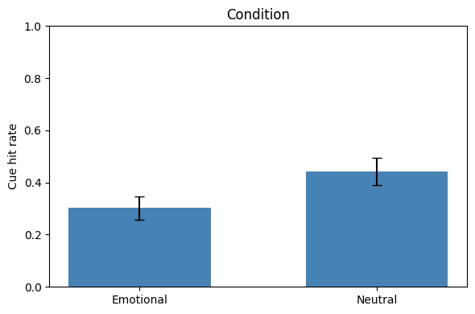{.r-stretch fig-align="center"}

::: notes
Emotional vs neutral.
Neutral clips have higher cue-driven recall.
This is the corrected direction — the opposite of the original buggy analysis.
:::

## The Denominator Issue {.smaller}

**How you measure cue effectiveness matters**

-   Original metric: `matches / total_memories` (variable denominator)
    -   Includes foil-attributed events that *can never match*
    -   If foil counts vary by condition, the denominator is confounded

. . .

-   Fixed metric: `cue hits / 22 cue presentations`
    -   Denominator is constant across conditions

. . .

**Concrete impact:**

|                       | Variable denom.      | Fixed denom.                |
|-----------------------|----------------------|-----------------------------|
| Intentionality effect | F = 13.99, p = .0002 | F = 1.82, p = .18           |
| Emotion direction     | Neg \> Neu (18.8%)   | Neu \> Neg (44.2% vs 30.2%) |

::: notes
The variable denominator inflates the intentionality effect and, in the original buggy analysis, reversed the emotion direction entirely.
With a fixed denominator, intentionality is non-significant and neutral \> emotional consistently.
Worth discussing: implications for how they've been interpreting the VRT results.
:::

# Simulations {.section}

## Simulation Plan {.smaller}

Five simulations building a context-binding account of selective interference:

| Sim | Question | Status |
|------------------|------------------------------|------------------------|
| Calibration | Paradigm setup and validation | Done |
| 1\. Interference intensifiers | What encoding factors worsen interference? | Done |
| 2\. Arousal (eCMR) | Does emotional context create independent interference? | Planned |
| 3\. Retrieval control | How do voluntary/involuntary mechanisms differ? | Done |
| 4\. Cues at test | Do reminder cues suppress the vol/invol distinction? | Planned |
| 5\. Mode dissociation | Is recognition immune to interference? | Planned |

## The Paradigm {.smaller}

How a trauma-film selective interference experiment maps to CMR:

**Film** (16 items) $\rightarrow$ **Break** $\rightarrow$ **Reminder** $\rightarrow$ **Interference** $\rightarrow$ **Fillers** $\rightarrow$ **Recall**

-   Parameters fitted to HealeyKahana2014 free recall data (80 subjects)
-   Calibrated: break count (retention interval), filler count, pre-interference context state
-   Each simulation sweeps a parameter and measures the effect on film recall

. . .

**Two core plots recur throughout:**

1.  Zoned SPC — recall probability with film / break / interference zones marked
2.  Film recalled rate — DV as a function of swept parameter, with 95% CI

## Baseline SPC

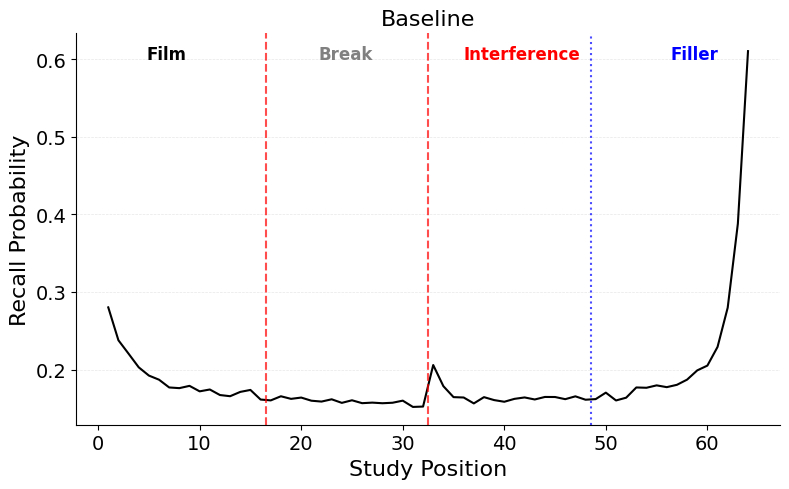{.r-stretch fig-align="center"}

::: notes
The paradigm works.
Film items are recalled with realistic serial position effects.
Interference items compete and are recalled too.
The zoned boundaries (red dashes) separate film, break, and interference regions.
This is the reference condition for all subsequent sweeps.
:::

## Sim 1: MCF Binding Strength

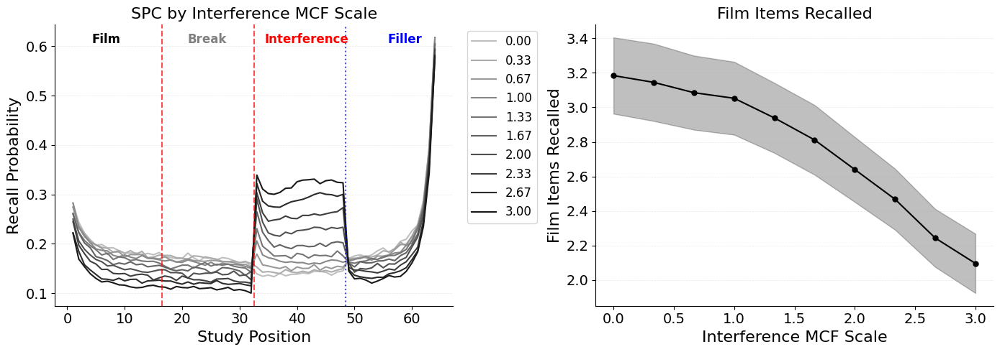{.r-stretch fig-align="center"}

::: notes
Sweeping the MCF learning rate scale for interference items.
Stronger competitor encoding = more competition at retrieval = lower film recall.
The effect is graded and monotonic.
:::

## Sim 1: Encoding Drift Rate

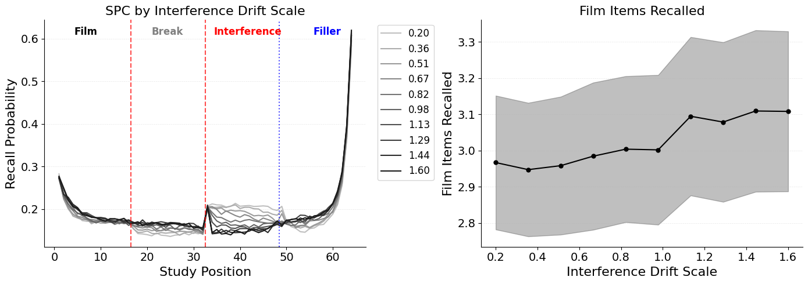{.r-stretch fig-align="center"}

::: notes
Sweeping encoding drift rate during interference.
Faster drift = competitors land closer to film context = more interference.
:::

## Sim 1: Competitor Count

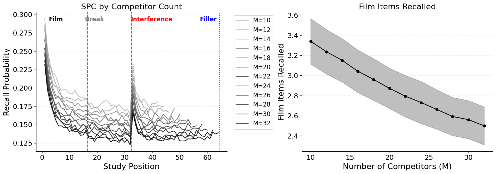{.r-stretch fig-align="center"}

::: notes
Sweeping the number of interference items.
More competitors = more competition.
Monotonic degradation of film recall.
Together with MCF and drift, these three encoding-side factors show that interference intensity is graded and mechanistically decomposable.
:::

## Sim 3: Retrieval Control {.smaller}

**Two retrieval-side protection mechanisms:**

-   **Start-of-list reinstatement** — drift context back toward film-start before retrieving
-   **Choice sensitivity (tau)** — sharpen the Luce choice rule to discriminate film from competitors

. . .

These map onto the voluntary/involuntary distinction: voluntary recall = high control (strong reinstatement + sharp discrimination), involuntary = low control.

## Sim 3: Interaction

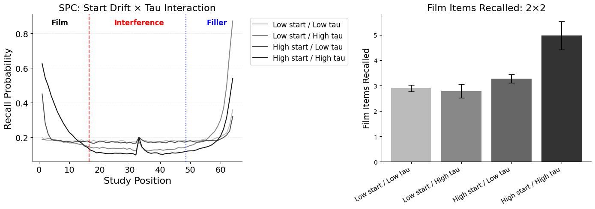{.r-stretch fig-align="center"}

::: notes
2D sweep: start-drift scale x tau scale.
Synergistic protection — both mechanisms together provide more protection than either alone.
This is the retrieval-side complement to the encoding-side factors in Sim 1.
Links back to the PNR data: primacy bias in voluntary recall = start-of-list reinstatement in action.
:::

# Expanding Scope {.section}

## From Interpretation to Design {.smaller}

**Original scope:** demonstrate context-binding as a framework for interpreting selective interference

. . .

**Expanded scope:** use the framework to examine existing paradigm designs and work toward improved ones

. . .

**The architectural insight:**

-   **Context** $\rightarrow$ item retrieval (free recall) is vulnerable to interference — competitors add entries to the Luce choice rule
-   **Item** $\rightarrow$ context retrieval (recognition) is structurally immune — probing $M_{FC}$ returns the same context regardless of competitors

$\Rightarrow$ Understanding these architectural constraints can guide the design of paradigms that isolate the intervention's true effect

## Examining the VIT's Cue Design {.smaller}

The VIT presents **film-related reminder cues** during the recall phase

. . .

In CMR terms:

-   Cues reinstate film context via item $\rightarrow$ context associations
-   This overrides whatever context the participant would have retrieved on their own
-   Both voluntary and involuntary conditions end up in film-adjacent context

. . .

**Prediction:** cues *suppress* the voluntary/involuntary distinction

-   Could explain why some interventions fail to produce selective interference
-   Consistent with the non-significant intentionality effect in the fixed-denominator analysis

::: notes
Key question for Rick/Emily: does this track with what they see in the VIT data and literature?
Do they see the vol/invol distinction being suppressed in cue-heavy paradigms?
If so, this motivates simulating cue effects and devising designs that avoid the issue.
:::

## Proposed Work {.smaller}

Three next steps:

1.  **Simulate cue effects** (Sim 4)
    -   Sweep cue probability and cue drift rate
    -   Quantify cue interaction with retrieval control
2.  **Validate with expt1 data**
    -   Fit model to VRT dataset (240 participants)
    -   Compare simulation predictions against recall-analysis suite
3.  **Devise improved experiment designs**
    -   Use simulations to explore paradigm modifications inspired by the theoretical framework
    -   Goal: designs/interventions that produce more reliable selective interference for clinical translation

## Discussion

-   Does the analysis of VIT cue design track with your experience?

-   Which simulation direction is most valuable next?

-   How far should the paper go — simulation-only, or include expt1 data?

-   What would a simulation-informed experiment design look like, and what would be most impactful?