# Introduction

## Durability vs Selectivity {.smaller}

Memory should retain highly consequential episodes so critical details stay accessible long into the future.

. . .

At the same time, adaptive retrieval is selective: what comes to mind should depend on current cues, goals, and safety.

. . .

**Intrusive memories after trauma** suggest that durable encoding can outpace regulatory control — the event returns repeatedly and indiscriminately, despite the demands of the present.

::: notes
This is the motivating tension for the entire paper.
Durability is adaptive — you want to remember dangerous situations.
Selectivity is also adaptive — you want retrieval to be context-appropriate.
Intrusions represent a failure of selectivity despite successful durability.
The question is how a single memory system could produce both outcomes.
:::

## The Trauma-Film Paradigm {.smaller}

::: {layout-ncol="1"}
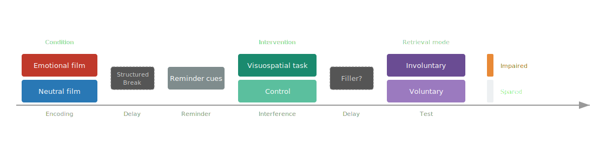{.r-stretch fig-align="center"}
:::

- Participants watch a distressing film depicting injury or threat
- Intrusive memories emerge over following days in diary measures
- **Voluntary memory** for the same material can be relatively preserved
- The same encoded episode supports both uncontrolled and controlled access — and these modes dissociate

::: notes
The trauma-film paradigm is the standard lab model.
Participants watch a distressing film, then keep intrusion diaries.
When asked to deliberately recall or recognize the same material, voluntary memory is often relatively intact.
The dissociation is the key empirical anchor: same episode, two modes of access, and they come apart.
:::

## The Selective Interference Effect {.smaller}

A brief visuospatial task after the film or a later film reminder reduces subsequent intrusions while leaving voluntary memory largely intact.

. . .

- Tetris or similar tasks → fewer intrusive memories over following days
- Voluntary memory shows little measurable impact, even when retrieval conditions are matched
- Effective even after reinstatement of real-life traumatic memories (motor vehicle accidents, traumatic childbirth, war-related trauma)

. . .

A post-encoding manipulation appears to alter one mode of retrieval more than the other, even when both draw on the same recent experience.

::: notes
This is the selective interference effect — the phenomenon the paper explains.
Across studies, playing Tetris after a film or after a reminder of real-life trauma reduces intrusions.
Voluntary memory — recognition, intentional recall — is generally spared.
The effect works in the lab and in clinical settings with real trauma.
The puzzle: how can a post-encoding manipulation selectively affect one retrieval mode and not the other?
:::

## The Dual Representation Account {.smaller}

::: {layout-ncol="1"}
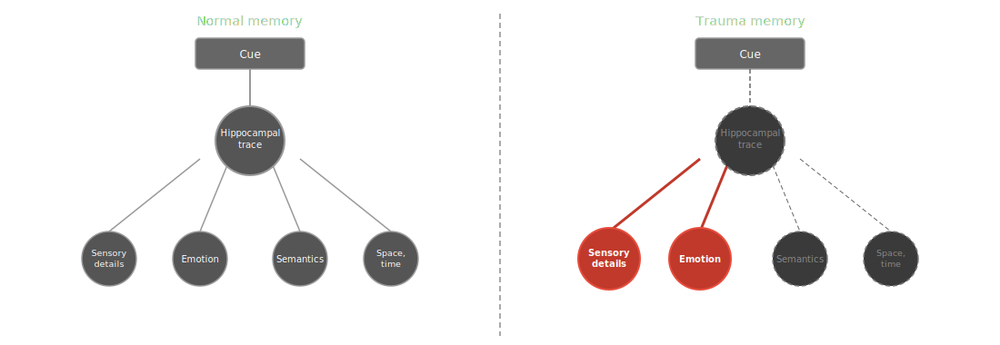
:::

A prominent interpretation attributes selectivity to separable memory representations:

- Traumatic experience produces distinct **sensory** and **contextual** traces
- Visuospatial task competes for perceptual resources needed to consolidate the sensory trace
- At longer delays: reminder reactivates the sensory trace, task disrupts **reconsolidation**

::: notes
The dual representation account is the standard explanation.
Two separate traces: an S-rep (sensory-perceptual, cue-driven) and a C-rep (abstract, contextual, voluntary).
A visuospatial task competes for the perceptual processing resources needed to consolidate the S-rep.
For delayed effects, the account invokes reconsolidation: the reminder reactivates the S-rep, making it labile during a time-limited window.
This explanation requires three commitments that we'll challenge.
:::

## A Unitary Alternative {.smaller}

We develop an alternative within a unitary retrieved-context framework:

. . .

- Items are bound to continuously evolving **temporal context** that later serves as the retrieval cue
- A visuospatial task encodes **competitors** in context that overlaps with the film's contextual neighborhood
- **Retrieval control** mechanisms available during deliberate recall can preserve the target's advantage

. . .

**Three commitments replaced:**

| DRA requires | RCT provides |
|---|---|
| Separate sensory and contextual traces | Two retrieval pathways on shared associations |
| Modality-specific disruption | Context overlap and competitor encoding strength |
| Reconsolidation window | Context reinstatement (continuous, not time-limited) |

::: notes
Our alternative holds that items are bound to a continuously evolving context.
The interference task encodes competitors in context that overlaps with the film.
When context later revisits the film region, competitors dilute each film item's retrieval probability.
Retrieval control — reinstating the film's starting context, sharpening competition — can partially offset this.
We replace all three DRA commitments: separate traces become two pathways on shared associations; modality-specific disruption becomes context overlap; reconsolidation becomes continuous context reinstatement.
:::

# Architecture and Setup

## eCMR Architecture {.smaller}

::: {layout-ncol="1"}
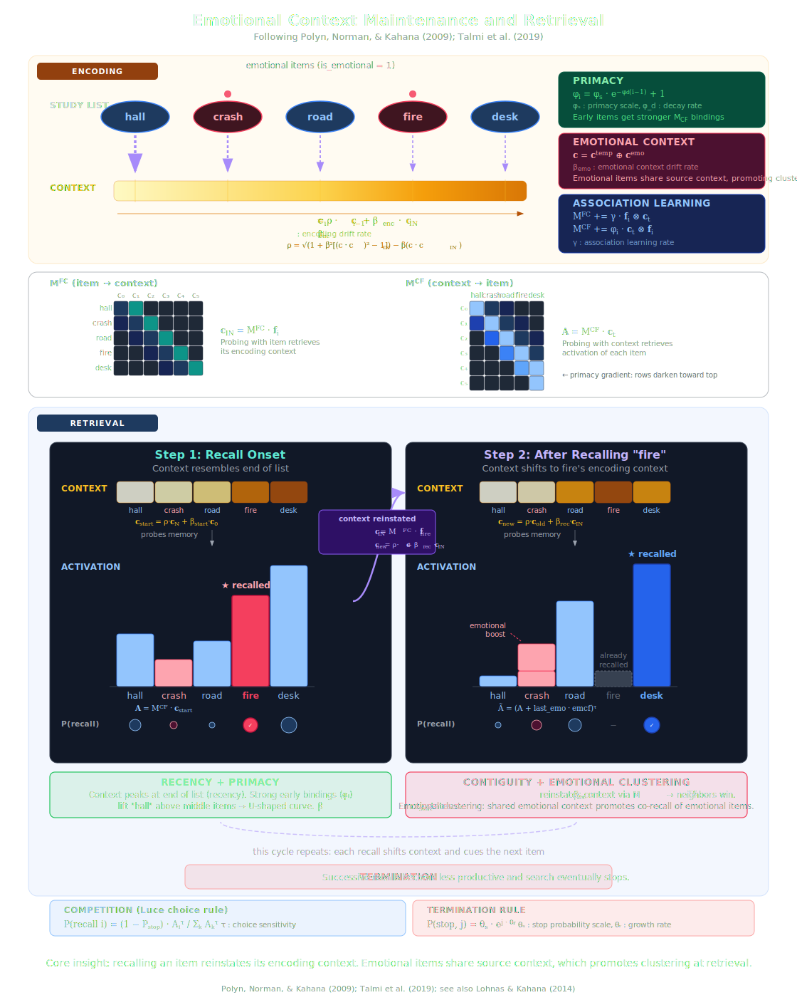{.r-stretch fig-align="center"}
:::

- **Temporal context** $c^T$: unit-length vector that drifts toward each encoded item — a recency-weighted trace of recent experience
- **Emotional context** $c^E$: 2-D vector (neutral pole, arousal pole) — drifts toward arousal for emotional items
- **Two pathways**: context-to-item ($M^{CF}$, competitive retrieval) and item-to-context ($M^{FC}$, reinstatement)

::: notes
The model has two context representations.
Temporal context drifts toward each newly encoded item.
Emotional context has a neutral pole and an arousal pole — emotional items shift it toward arousal.
Four association matrices connect items and contexts.
Context-to-item associations support competitive retrieval — probe with context, get back all items encoded nearby.
Item-to-context associations support reinstatement — probe with an item, get back the context it was encoded in.
:::

## Competitive Retrieval {.smaller}

Context-to-item retrieval is governed by a **Luce choice rule**:

$$
P(i \mid \text{recall}) = \frac{A_i^{\tau}}{\sum_k A_k^{\tau}}
$$

. . .

- All recallable items contribute to the **denominator** — encoding competitors dilutes each film item's share
- This is the mechanism behind every interference result that follows
- $\tau$ (choice sensitivity) controls how sharply the competition favors strongly activated items

::: notes
This is the single most important equation in the talk.
Each item's activation is raised to the power tau, then divided by the sum over all items.
The denominator is key: adding competitors to the retrieval pool dilutes each film item's share of retrieval probability.
This is how interference works in our account — not modality-specific disruption, but competitive dilution.
Every simulation figure you'll see traces back to this equation.
:::

## Paradigm Geometry {.smaller}

| Component | Items | Role |
|---|---|---|
| Film | 16 | Targets |
| Break | 16 | Retention interval |
| Reminder | film items | Context reinstatement (no new learning) |
| Interference | 16 | Competitors |
| Filler | 16 | Suppress interference recency |

. . .

- Base parameters fitted per-subject to Healey & Kahana (2014) free-recall data (126 subjects)
- **Scale factors are not fitted** — set to theoretically motivated values or swept in simulations
- 100 replications per subject

::: notes
The paradigm mirrors trauma-film experiments.
Sixteen film items are encoded, then a break, then a reminder reinstates film context, then interference items encode as competitors, then filler items suppress interference recency.
Base parameters come from fitting to Healey and Kahana 2014 free-recall data.
Scale factors multiply base parameters to implement phase-specific conditions.
They are never fitted — they are either set to motivated values or systematically varied.
:::

## Calibration {.smaller}

::: {layout-ncol="1"}
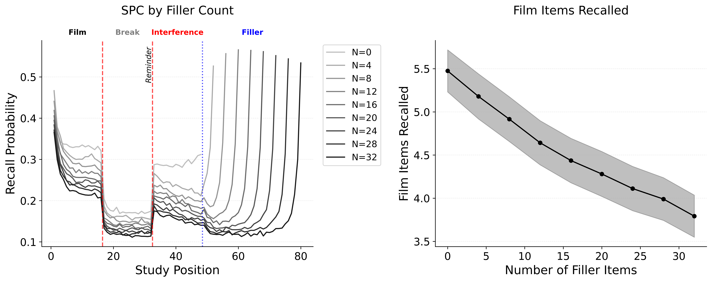

## Calibration {.smaller}

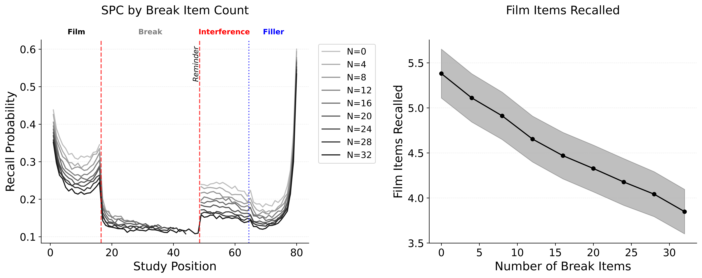
:::

# The Selective Interference Effect

## The Core Prediction {.smaller}

Competitors encoded in overlapping context → dilution via the Luce denominator → film recall impaired

. . .

| Retrieval mode | Protection mechanism | Vulnerability |
|---|---|---|
| **Involuntary recall** | None (post-interference context) | Full |
| **Voluntary recall** | Start-drift + $\tau$ (same pathway, control engaged) | Partial — graded by control strength |
| **Recognition** | Architectural immunity ($M^{FC}$ pathway) | None |

. . .

The DRA predicts a **binary** dissociation (intact vs. disrupted store). We predict **graded** vulnerability — a gradient the DRA cannot produce.

::: notes
This is the centerpiece prediction.
Involuntary recall is fully vulnerable because retrieval begins from post-interference context.
Voluntary recall is partially protected because control mechanisms can offset competition.
Recognition is completely spared because it uses a structurally immune pathway.
The DRA says voluntary memory draws on an intact store — no mechanism for partial impairment.
Our account predicts a gradient that falls out of the architecture.
:::

## The Selective Interference Effect

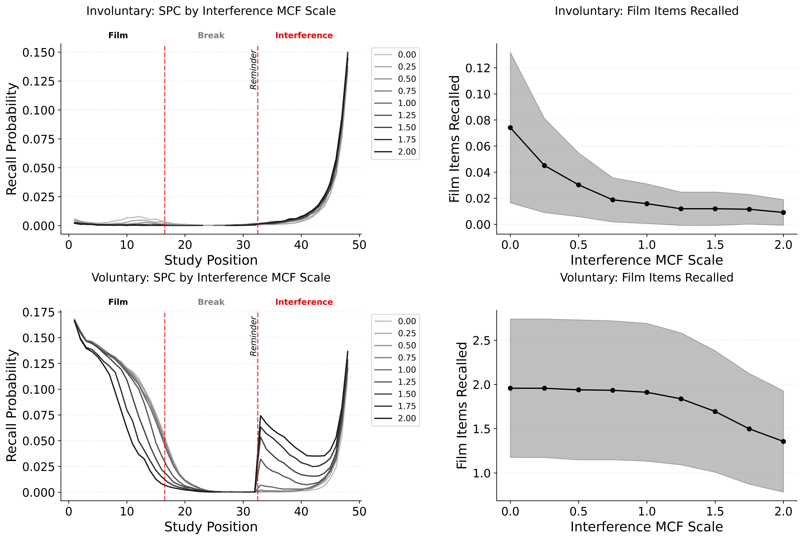{.r-stretch fig-align="center"}

Interference $\times$ retrieval mode:

- **Involuntary recall** (no retrieval control): fully impaired by competition
- **Voluntary recall** (reinstated context + sharpened competition): substantially protected
- **Recognition**: completely spared — different pathway ($M^{FC}$), structurally immune

::: notes
This is the central result — or it will be once rendered.
The factorial crosses interference present versus absent with three retrieval modes.
The gradient — not the binary dissociation the DRA predicts — is the headline.
:::

# What Protects Voluntary Recall

## Start-Drift and Choice Sensitivity {.smaller}

Voluntary recall uses the **same context-to-item pathway** as intrusions but engages two control mechanisms:

- **Start-drift** ($s^{\beta}_\text{start} \cdot \beta_{start}$): reinstates film's starting context → biases retrieval toward film region, away from interference neighborhood
- **Choice sensitivity** ($s^{\tau} \cdot \tau$): sharpens Luce competition → amplifies the advantage start-drift creates

Same pathway as intrusions, different operating point.

::: notes
Voluntary recall is not architecturally immune — it uses the same context-to-item pathway as intrusions.
But two control mechanisms partially offset the vulnerability.
Start-drift repositions context at the beginning of retrieval, pulling it back toward the film state.
Tau sharpens the Luce choice rule, so even a modest activation advantage becomes large.
This is what differentiates directed from unguided recall — same architecture, different operating point.
:::

## Start-Drift and Tau: Synergistic Protection {.smaller}

::: {layout-ncol="2"}
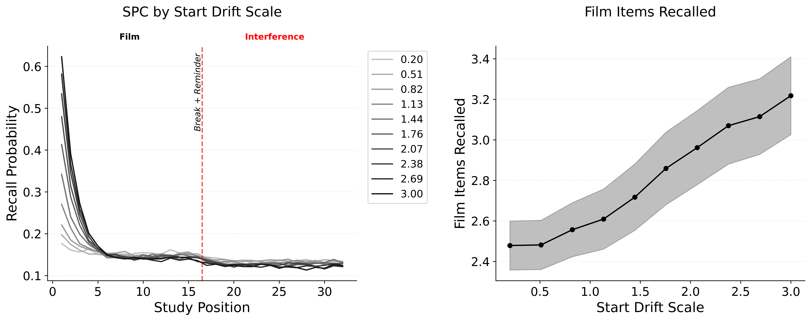

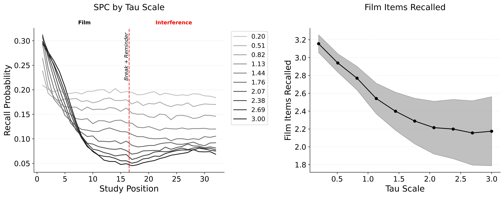
:::

- **Start-drift** repositions context toward the film → reduces overlap with interference region
- $\tau$ sharpens competition → amplifies the advantage start-drift creates
- **Synergistic**: start-drift alone gives small advantage; $\tau$ alone has nothing to amplify

::: notes
Two mechanisms work synergistically.
Start-drift gives film items a competitive advantage by repositioning context.
Tau amplifies that advantage through sharper competition.
Together they provide robust protection.
The DRA says voluntary recall draws on a separate, intact store.
We say it draws on the same system with retrieval control engaged.
:::

# What Makes Interference Stronger

## Context Overlap {.smaller}

The encoding **drift scale** ($s^{\beta}_\text{int}$) controls how much temporal context drifts during interference encoding. Lower drift → competitors closer to film context → more overlap → stronger interference.

::: {layout-ncol="1"}
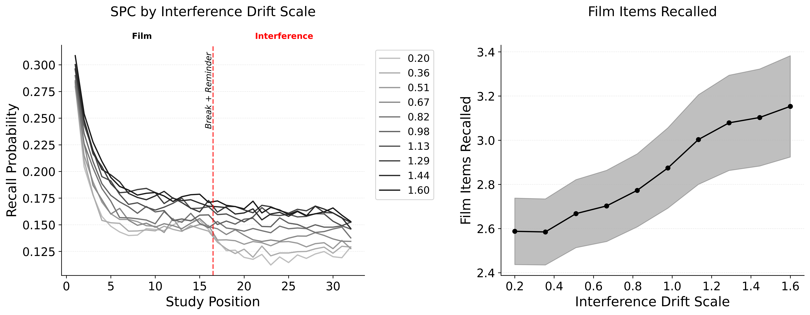
:::

- Interference is **graded by context proximity**, not binary
- Tasks that maintain context proximity to the film should interfere regardless of modality

::: notes
This sweeps the drift rate during interference encoding.
At low drift, competitors encode into context that heavily overlaps with the film state, producing strong competition.
As drift increases, competitors land further from the film in context space, and film recall recovers.
The key prediction: interference depends on context overlap, not modality.
:::

## Binding Strength and Competitor Count {.smaller}

The **MCF scale** ($s^{\phi}_\text{int}$) controls how strongly competitors are encoded in $M^{CF}$. **Competitor count** controls how many items enter the denominator.

::: {layout-ncol="2"}
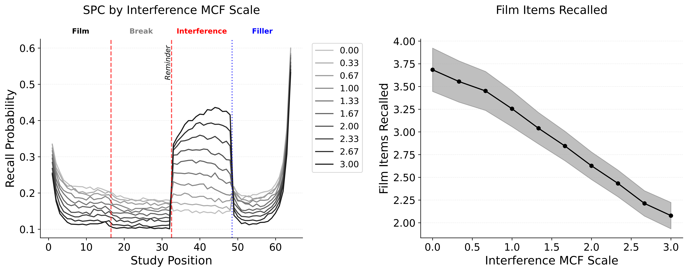

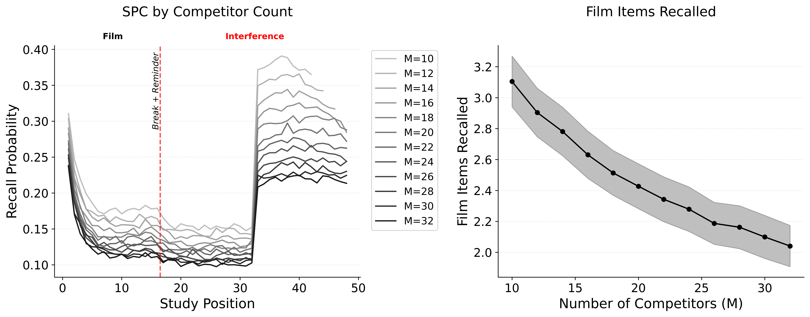
:::

- Stronger binding → more effective competition; more competitors → more dilution
- **Diminishing returns** with count: later competitors drift further from film context

::: notes
MCF binding strength: stronger associations mean competitors compete more effectively at retrieval.
Competitor count: more competitors means more dilution, but with diminishing returns.
Later competitors drift further from film context, so each additional one contributes less.
This connects to the clinical finding that longer interference tasks don't produce proportionally stronger effects.
All three interference factors — drift, binding, count — operate through context overlap.
:::

## Arousal Broadens Interference {.smaller}

**Emotional context** ($c^E$) is a 2-D vector with a neutral pole and an arousal pole. Emotional items shift $c^E$ toward arousal during encoding, creating a **second channel of overlap** beyond temporal proximity.

::: {layout-ncol="2"}
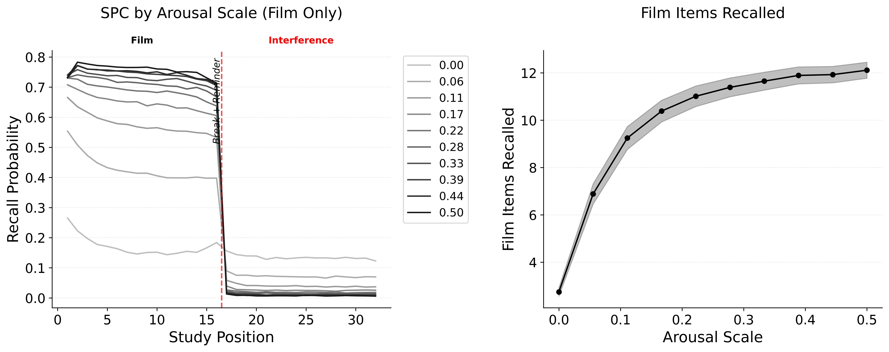

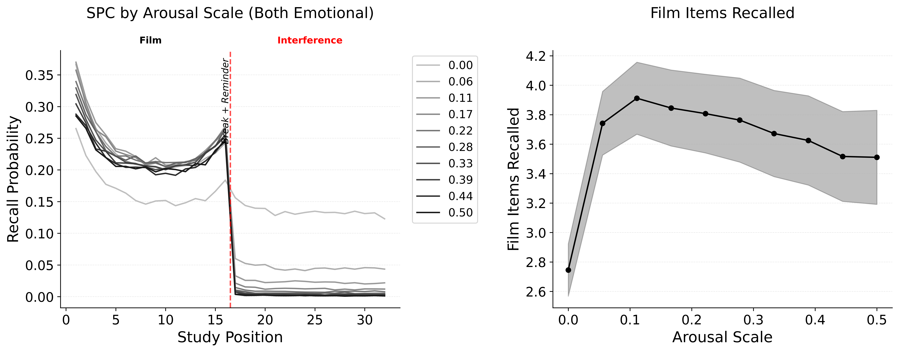
:::

- Shared arousal maintains competition even when temporal context has drifted
- **Distinguishing prediction**: arousal-matched interference preferentially suppresses emotional film content

::: notes
In standard CMR, interference depends entirely on temporal context overlap.
In eCMR, emotional context provides a second channel.
When film items and competitors share arousal, they overlap in emotional context space even if temporal context has drifted.
This broadens the effective window of interference.
The DRA handles this through modality-specific resource competition; our account handles it through shared arousal context.
Both predict engagement matters, but ours predicts it should interact with film valence.
:::

# Context Reinstatement

## The Reminder Mechanism {.smaller}

The reminder reinstates film context in two steps:

**Step 1**: Context drifts toward the start-of-list state

$$
c^T_\text{rem} = \rho \, c^T + \beta_\text{rem,start} \, c^T_0
$$

**Step 2**: Each reminder item reinstates its specific encoding context

$$
c^T \leftarrow \rho \, c^T + \beta_\text{rem} \, c^{IN}_\text{cue}
$$

. . .

- Reminders reinstate context **without forming new associations** — no trace is modified
- This pulls context back into the film neighborhood, so interference items encoded afterward **share temporal context** with the film

::: notes
The reminder mechanism has two steps.
First, context drifts toward the start-of-list state — a partial reinstatement.
Second, each reminder item reinstates its specific encoding context through item-to-context retrieval.
Critically, no new associations are formed — reactivation without modification.
The consequence: interference items encoded right after the reminder share temporal context with the film.
Stronger reinstatement produces more overlap and hence more competition.
:::

## Context Reinstatement and Delayed Interference {.smaller}

**[PLACEHOLDER — reinstatement conditions figure]**

Three conditions: reminder + competitors, no-reminder + competitors, reminder only

- Only **reminder + competitors** produces interference
- Without reminder, competitors land in distant context — no overlap
- Reminder alone reinstates context but creates no competing traces

. . .

Interference is a **continuous function of reinstatement strength**, not a time-limited window

::: notes
Three conditions at delay: reminder plus competitors, no-reminder plus competitors, reminder only.
Only the first produces interference.
Without a reminder, competitors encode into context that has drifted away from the film — no overlap.
A reminder alone reinstates film context temporarily but creates no competing traces.
This replaces the reconsolidation account: no labile trace, no time-limited window.
:::

# Recognition Immunity

## Architectural Immunity {.smaller}

**[PLACEHOLDER — recognition vs recall under interference figure]**

Recognition uses **item-to-context** retrieval ($M^{FC}$): probe with a film item → retrieve its encoding context

- Items are **orthogonal** → competitors modify only their own rows → film item's signal untouched
- This is **architectural** immunity, not control-based protection
- A qualitatively different kind of sparing than voluntary recall enjoys

. . .

The DRA attributes both recognition sparing and voluntary recall sparing to "the voluntary memory store is intact" — it **cannot distinguish the two mechanisms** or predict the gradient.

::: notes
Recognition uses a fundamentally different retrieval pathway.
It probes item-to-context associations, retrieving the context a film item was encoded in.
Competitor encoding only modifies competitor rows because items are orthogonal.
Recognition is structurally immune — not protected by control, but architecturally untouched.
The DRA says both recognition and voluntary recall are spared because the voluntary store is intact.
Our account predicts they should dissociate: weaken retrieval control and free recall becomes more vulnerable, while recognition remains completely immune.
:::

# Test-Phase Cues

## Cue-at-Test Hypothesis {.smaller}

**[PLACEHOLDER — cue-at-test simulation]**

When film cues are presented during retrieval:

- Cues reinstate film context via $M^{FC}$ (item-to-context pathway)
- This **does what start-drift does** — both retrieval modes begin from reinstated film context
- The voluntary/involuntary gap **collapses**

. . .

**Prediction**: cue-at-test equalizes the retrieval starting point, eliminating the selective interference effect

This explains heterogeneity across cued vs uncued paradigms

::: notes
Film cues presented at test reinstate film context via item-to-context retrieval.
When the cue has already reinstated film context, start-drift is redundant.
Both voluntary and involuntary conditions start from the same place, and the selective interference effect disappears.
This explains why the effect is not always observed — paradigms that present film cues during retrieval may be insensitive to the effect.
The prediction: removing cues at test should recover the selective interference effect.
:::

# General Discussion

## Summary and Key Predictions {.smaller}

**Three commitments replaced:**

| DRA commitment | RCT replacement |
|---|---|
| Separate traces | Two retrieval pathways on shared associations |
| Modality-specific disruption | Context overlap + competitor encoding strength |
| Reconsolidation window | Context reinstatement (continuous) |

. . .

**Distinguishing predictions:**

- Voluntary recall is **partially** protected, not fully immune — graded by control strength
- **Context proximity**, not modality match, determines interference effectiveness
- Arousal-matched interference preferentially suppresses **emotional** film content
- Removing **cues at test** should recover the selective interference effect

::: notes
The framework replaces each of the DRA's three commitments with a mechanism grounded in standard episodic memory principles.
The distinguishing predictions are:
First, graded vulnerability — voluntary recall is partially protected, not fully immune.
Second, context proximity matters more than modality.
Third, arousal matching should interact with film valence.
Fourth, removing cues at test should recover the selective interference effect — directly testable.
:::

## Open Questions {.smaller}

1. **Core factorial and recognition simulations** are still unrendered — do the predicted gradients emerge cleanly?
2. **Cue-at-test simulation** needed to formalize the paradigm heterogeneity explanation
3. **Context reinstatement conditions** — how does reinstatement strength interact with delay?
4. Should we run **Experiment 2** (cued vs uncued retrieval) before submitting?
5. What **additional paradigm variations** would sharpen the DRA contrast?

::: notes
These are the open items for discussion.
The core factorial is the headline result — we need it rendered to confirm the gradient emerges cleanly.
The cue-at-test simulation is critical for interpreting paradigm heterogeneity.
Context reinstatement conditions test whether the delayed effect depends on reinstatement strength as predicted.
Experiment 2 — cued versus uncued retrieval — is the cleanest test of our framework versus the DRA.
:::
