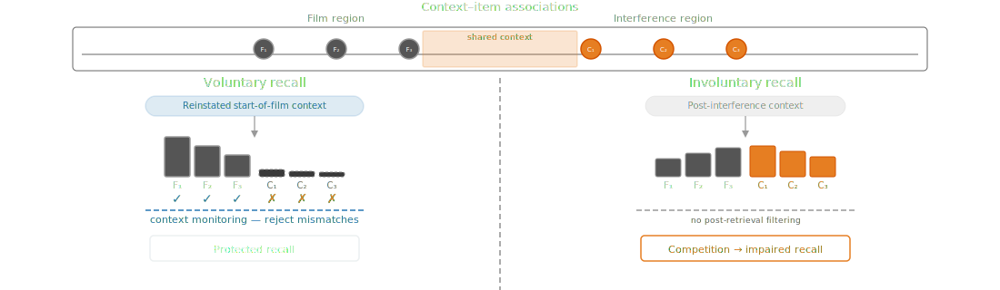
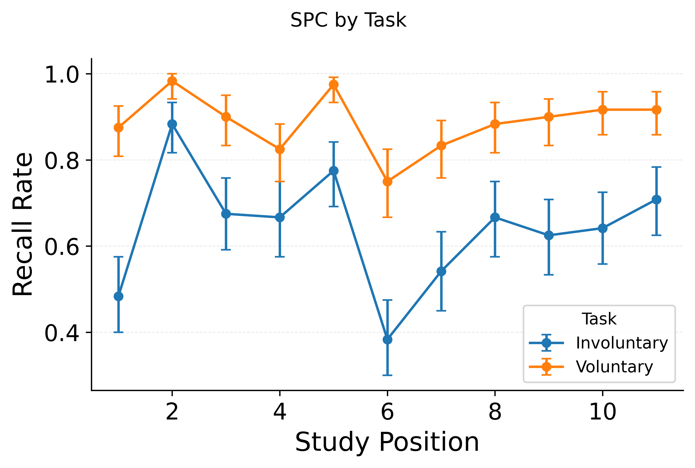
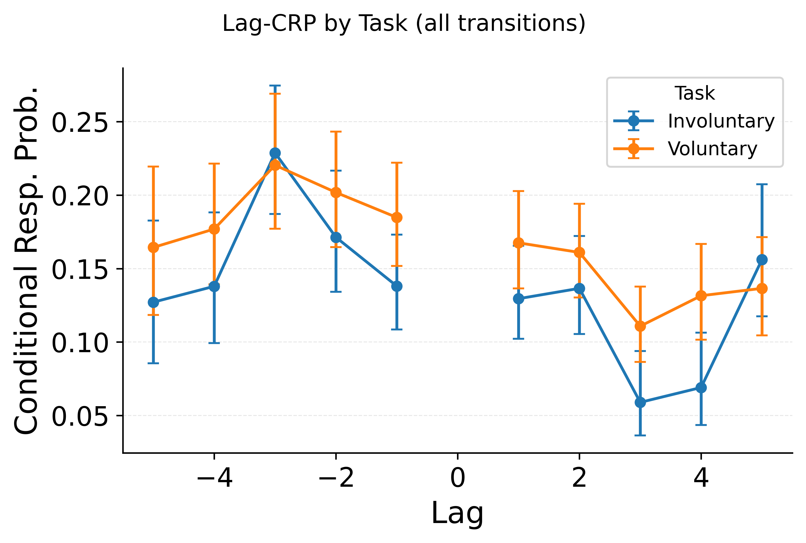
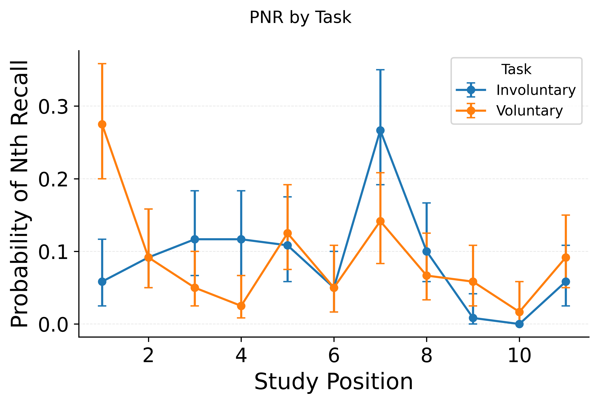
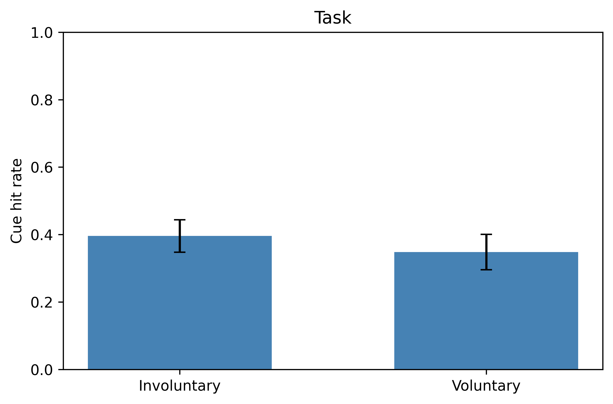

# Setup

## The Paradigm

{.r-stretch fig-align="center"}

**The selective interference effect**: visuospatial interference task impairs involuntary recall but spares voluntary recall

## eCMR Architecture {.smaller}

{.r-stretch fig-align="center"}

::: notes
This is the full eCMR architecture — the model we simulate.
Quick orientation for anyone who needs it.
Top: encoding.
Items are experienced sequentially, each updating context via drift.
Primacy gives early items stronger M-C-F bindings.
The emotional extension adds a second channel: emotional items accumulate additional MCF strength scaled by arousal.
Middle: the two association matrices.
M-F-C maps items to context — probe with an item, get back its encoding context.
M-C-F maps context to items — probe with current context, get activations.
Bottom: retrieval.
Context probes M-C-F for activations, Luce choice rule selects an item, the recalled item reinstates its context via M-F-C, and the cycle repeats.
Emotional clustering boosts co-emotional items when the last recall was emotional.
The entire selective interference story plays out through the asymmetry between these two matrices.
:::

## The Dual Representation Account (Brewin, 2014) {.smaller}

{.r-stretch fig-align="center"}

**Two components of a trauma memory:**

-   **S-rep:** sensory-perceptual + affective; cue-driven.
-   **C-rep:** abstract structural; spatial + personal context.

**Key claims:**

-   **High arousal:** strengthens S-rep.
-   **High arousal:** weakens C-rep and/or the S\<-\>C link.
-   **Selective interference (early):** visuospatial tasks compete with S-rep resources during encoding/consolidation (fewer later intrusions); verbal competition with C-rep processing may increase intrusions.

::: notes
Key quote from:

Brewin, C. R., & Burgess, N.
(2014).
Contextualisation in the revised dual representation theory of PTSD: A response to Pearson and colleagues.
Journal of behavior therapy and experimental psychiatry, 45(1), 217-219.

Aims to clarify distinction between S-rep and C-rep to focus less on sensory vs verbal distinction than extracted structural representations (?).

> The DRT assumes that two different types of memory representation are encoded at the time of the traumatic event.
> One type of representation includes sensory details and affective/emotional state experienced during the traumatic event (sensory-bound representation or S-rep for short).
> The other includes a subset of the sensory input, recoded into an abstract structural description, along with the spatial and personal context of the person experiencing the event (contextual representation or C-rep for short).
> Thus, S-reps and C-reps are not primarily distinguished by the type of input (e.g. sensory versus verbal) but represent different aspects of the input that are derived from it by different types of processing.
> In healthy memory the S-rep and C-rep are tightly associated, such that an S-rep is generally retrieved via the associated C-rep.
> Access to C-reps is under voluntary control but may also occur involuntarily.
> According to the DRT, direct involuntary activation and re-experiencing of S-reps occurs when the S-rep is very strongly encoded, due to the extreme affective salience of the traumatic event, and the C-rep is either encoded weakly or without the usual tight association to the S-rep.
> This might be due to stress-induced down-regulation of the hippocampal memory system (Jacobs & Nadel, 1985), and/or due to a dissociative response to the traumatic event.
:::

## A Unitary Retrieved-Context Alternative {.center}

{.r-stretch fig-align="center"}

**Two components of a trace:**

-   **Context state (C):** temporal+emotional context; retrieval cue.
-   **Item traces (M):** items bound to C; cued by C.

**Key claims:**

-   **High arousal:** strengthens C-\>item binding for trauma vs neutral experiences.
-   **Intrusions:** cues reinstate trauma C; trauma often wins.
-   **Interference:** reactivate trauma C while encoding content -\> competitors under that C, fewer distressing intrusions.

## Selective Interference in a Unitary Model {.smaller}

{.r-stretch fig-align="center"}

**Two retrieval regimes (same memory system):**

-   **Involuntary:** cue-driven; weak cues, minimal goal context.
-   **Voluntary:** goal context reinstated when retrieval begins; stronger monitoring rejects mismatches.

Interference is possible in both modes, but goal reinstatement and monitoring can still target trauma items during voluntary recall!

## Three questions to tackle with this framework

1.  How does **interference** arise from competitor encoding in shared context?
2.  What **protects voluntary recall** from the same interference that impairs involuntary recall?
3.  Why does the effect **appear in some paradigms** but not others, and what does that imply for intervention design?
4.  What novel predictions does this framework make that others don't?

# The Model

## Simulation Setup {.smaller}

::: {layout-ncol="2"}
**Paradigm geometry:**

| Phase        | Items          | Drift            | MCF scale   |
|--------------|----------------|------------------|-------------|
| Film         | 16 targets     | base rate        | 1.0         |
| Break        | 0 (default)    | —                | —           |
| Reminder     | film items     | 0.3$\times$ base | no learning |
| Interference | 16 competitors | swept            | swept       |
| Filler       | 16 distractors | base rate        | 1.0         |

**Calibration:**

-   Base rates fitted to **Healey & Kahana 2014** (126 subjects)
-   Reminder: start-drift = 4$\times$ base (strong reinstatement), drift = 0.3$\times$ base
-   Sweeps multiply base rates by scale factors
:::

::: notes
Here's how the paradigm maps to simulation specifics.
Sixteen film items are encoded at the fitted base drift rate.
No break items by default — we vary this in calibration.
The reminder phase has two steps: first, context drifts strongly toward the initial state at four times the base start-drift rate, then each film item's context is reinstated via M-F-C probing without new associative learning.
This is how we implement context reinstatement without reconsolidation — no trace is modified.
Sixteen interference items encode at swept rates, and sixteen filler items suppress interference recency.
All base rates come from fitting to Healey and Kahana 2014 free recall data across 126 subjects.
The swept parameters are scale factors that multiply these base rates.
:::

## Simulation IVs {.smaller}

| Scale factor | What it multiplies | Tests |
|------------------------|------------------------|------------------------|
| **interference_drift_scale** | Encoding drift during interference | Context overlap $\rightarrow$ competition strength |
| **interference_mcf_scale** | MCF learning during interference | Binding strength $\rightarrow$ competition strength |
| **n_interference** | Number of competitor items | Count $\rightarrow$ diminishing returns |
| **start_drift_scale** | Start-drift at recall onset | Voluntary reinstatement strength |
| **tau_scale** | Choice sensitivity ($\tau$) | Competition sharpness |
| **emotion_scale** | Emotional MCF contribution | Arousal $\rightarrow$ broadened interference |

. . .

**Interference** factors (rows 1–3) and **control** factors (rows 4–5) are swept independently; **arousal** (row 6) bridges both

::: notes
These are the actual scale factors we sweep in the simulations.
Each multiplies a base rate fitted to Healey and Kahana data.
The interference factors — drift scale, MCF scale, and item count — control how strongly competitors impair film recall.
The control factors — start-drift scale and tau scale — control how much voluntary retrieval resists that interference.
Emotion scale controls the emotional context channel, which bridges interference and control: it broadens interference for emotional film items and interacts with retrieval control.
Each sweep holds all other factors at their defaults and varies one parameter across a range, producing the figures you'll see in the results sections.
:::

# The Selective Interference Effect

## The Selective Interference Effect in CMR

**\[PLACEHOLDER — core factorial figure\]**

Interference $\times$ retrieval mode:

-   **Involuntary recall** (no retrieval control): fully impaired by competition
-   **Voluntary recall** (reinstated context + monitoring): substantially protected

Recognition is completely spared — different pathway ($M_{FC}$), structurally immune

::: notes
This is the central result of the paper — or it will be, once the simulation is rendered.
The factorial crosses interference present versus absent with voluntary and involuntary retrieval.
The predicted pattern: involuntary recall is fully impaired by competitor encoding because retrieval begins from post-interference context, which overlaps heavily with competitors.
Voluntary recall is substantially protected because goal-directed reinstatement repositions context to the film start, and monitoring rejects mismatched candidates.
Both operate on the same memory — the dissociation arises from retrieval configuration, not separate stores.
Recognition adds an architectural floor: the item-to-context pathway is structurally immune to competitor encoding.
This is our Simulation 1, and it anchors the entire argument.
The figure is still being generated, but the logic is clean — we've confirmed the component results in the sweeps I'll show next.
:::

## Why "Selective"? — The Key Prediction {.smaller}

Voluntary recall is **partially** protected, not fully immune — a gradient the DRA cannot produce

. . .

| Retrieval mode | Protection mechanism | Predicted vulnerability |
|------------------------|------------------------|------------------------|
| **Involuntary recall** | None (post-interference context) | Full |
| **Voluntary recall** | Reinstatement + monitoring | Partial — graded by control strength |
| **Recognition** | Architectural immunity ($M_{FC}$) | None |

. . .

The DRA predicts a **binary** dissociation (intact store vs. disrupted store); we predict **graded** vulnerability within voluntary recall itself

::: notes
The core prediction is that voluntary recall is partially protected, not fully immune.
This is a gradient the DRA cannot produce — in their account, voluntary memory draws on an intact store, so it's either spared or it isn't.
There's no mechanism for partial impairment.
But the literature does show partial impairment — Lau-Zhu et al. 2019 found intentional free recall was sometimes affected.
Our account handles this naturally: voluntary and involuntary recall use the same context-to-item pathway; they differ only in retrieval control.
Weaken that control — reduce executive resources, add secondary load at test — and voluntary recall becomes more vulnerable, approaching the involuntary profile.
The gradient within context-to-item retrieval is the distinguishing prediction.
Recognition adds an architectural floor: the item-to-context pathway is structurally immune to competitor encoding, a qualitatively different kind of protection.
But the headline contrast is the gradient, not the floor.
:::

# Context Reinstatement

## Context Reinstatement Replaces Reconsolidation

**\[PLACEHOLDER — reinstatement factorial figure\]**

Three conditions: reminder + competitors, no-reminder + competitors, reminder only

-   Only **reminder + competitors** produces interference
-   Without reminder, competitors land in distant context — no overlap
-   Reminder alone reinstates context but creates no competing traces

. . .

Interference is a continuous function of **reinstatement strength**, not a time-limited window

::: notes
This is the second core result.
Three conditions at delay: reminder plus competitors, no-reminder plus competitors, and reminder only.
Only the first produces interference.
Without a reminder, competitors encode into context that has drifted away from the film — no overlap, no competition.
A reminder alone reinstates film context temporarily but creates no competing traces.
The critical variable is reinstatement strength — how strongly the reminder pulls context back to the film region — not timing.
This replaces the reconsolidation account: there is no labile trace, no time-limited window.
There is a context reinstatement mechanism that creates the conditions for competition.
The reinstatement strength sweep shows this is continuous — stronger reinstatement means more context overlap between competitors and film items, means more interference.
This simulation is not yet rendered.
:::

# What Protects Voluntary Recall

## What Protects Voluntary Recall

::: {layout-ncol="2"}

:::

-   **Start-drift** repositions context toward the film $\rightarrow$ reduces overlap with interference region
-   $\tau$ sharpens competition $\rightarrow$ amplifies the advantage start-drift creates

::: notes
On the protection side, two mechanisms work synergistically.
Start-drift repositions context at the beginning of retrieval, pulling it back toward the film state and away from the interference region.
This gives film items a competitive advantage — their context vectors align better with the reinstated context.
Tau sharpens the softmax competition, so even a modest activation advantage becomes a large retrieval probability advantage.
Critically, these are synergistic.
Start-drift alone gives a small advantage that competitors can overcome; tau alone has nothing to amplify if context doesn't favor film items.
Together, they provide robust protection.
This is what differentiates directed from unguided recall in our account — same pathway, same architecture, different operating point.
The DRA says voluntary recall draws on a separate, intact store.
We say it draws on the same system with retrieval control engaged.
:::

# What Makes Interference Stronger

## What Drives Interference — Context Overlap

{.r-stretch fig-align="center"}

::: notes
What drives interference?
Context overlap.
This figure sweeps the drift rate during interference encoding.
At low drift, competitors encode into context that heavily overlaps with the film state, producing strong competition and substantial recall impairment.
As drift increases, competitors land further from the film in context space, overlap decreases, and film recall recovers.
The key prediction: interference is graded by context proximity, not binary.
Competitors don't just need to exist — they need to share context with targets.
This constrains what kinds of interference tasks should be effective: tasks that occur in the same mental context as the film, not just tasks that are visuospatial.
That's a departure from the DRA, which ties interference to modality.
:::

## What Drives Interference — Binding + Count {.smaller}

::: {layout-ncol="2"}

:::

-   **MCF strength**: stronger $M_{CF}$ binding $\rightarrow$ more effective competition
-   **Count**: more competitors $\rightarrow$ more dilution, but with **diminishing returns** due to context drift

::: notes
Two more interference factors, both operating through context overlap.
MCF binding strength: when competitors form stronger associations in the context-to-item matrix, they compete more effectively at retrieval.
This is continuous — no threshold.
Competitor count: more competitors means more dilution of film item activations, but with diminishing returns.
Later competitors drift further from film context, so each additional competitor contributes less.
This connects to the clinical finding that longer interference tasks don't produce proportionally stronger effects.
The mechanism is context drift during sequential encoding — the twentieth competitor is much further from the film than the first.
All three interference factors — drift, binding, count — work through the same underlying mechanism: the degree of context overlap between competitors and targets.
:::

## Arousal Broadens Interference

**\[PLACEHOLDER — eCMR arousal sweep figure\]**

-   Emotional context creates an **additional channel** of overlap
-   Shared arousal maintains competition even when temporal context has drifted

::: notes
Here's where the emotional extension matters.
In standard CMR, interference depends entirely on temporal context overlap.
In eCMR, emotional context provides a second channel.
When film items and competitors share arousal, they overlap in emotional context space even if temporal context has drifted.
This broadens the effective window of interference — an arousing task maintains competition across a larger temporal gap.
This connects to the clinical observation that engaging interference tasks are more effective than passive ones.
The DRA handles this through modality-specific resource competition; our account handles it through shared arousal context.
Both predict engagement matters, but ours predicts it should interact with film valence — arousal-matched interference should preferentially suppress recall of emotional film content.
That's a distinguishing prediction.
This simulation is in progress.
:::

# Paradigm Variations

## Recognition Immunity {.smaller}

**\[PLACEHOLDER — recognition vs recall under interference figure\]**

Recognition uses a different pathway: item $\rightarrow$ context ($M_{FC}$)

-   Film items have **orthogonal** item vectors — probing a film item returns the same context regardless of competitors
-   This is **architectural** immunity, not control-based protection
-   A qualitatively different kind of sparing than voluntary recall enjoys

::: notes
Recognition uses a fundamentally different retrieval pathway from free recall and intrusions.
It probes item-to-context associations — M-F-C — retrieving the context a film item was encoded in and comparing it to current context.
Competitor encoding only modifies competitor rows of M-F-C because items are orthogonal, so probing with a film item returns the same context vector regardless of how many competitors were encoded.
Recognition is structurally immune — not protected by control, but architecturally untouched.
This is a different kind of protection than free recall enjoys.
Free recall is partially protected by retrieval control — same pathway as intrusions, different operating point.
Recognition is completely spared by architecture — different pathway entirely.
The DRA attributes both to "the voluntary memory store is intact" and cannot distinguish the two mechanisms or predict the gradient.
Our account predicts they should dissociate: weaken retrieval control and free recall becomes more vulnerable, while recognition remains completely immune regardless.
:::

## The VRT Experiment {.smaller}

-   **2 × 2 × 2 design**: Task (voluntary / involuntary) × Condition (emotional / neutral) × Intervention (Tetris / podcast)
-   **11 film clips** per participant, each followed by delay → intervention → recall
-   **22 cues** presented at test (still frames from the film)

. . .

**Key finding: NO selective interference effect**

Tetris did not selectively reduce involuntary recall relative to voluntary recall

::: notes
Now let me connect this to our data.
The VRT — Visuospatial Interference and Recall Task — is a 2-by-2-by-2 design crossing task, condition, and intervention.
Participants watched eleven film clips, each followed by a delay, the intervention, and then a cued recall test with twenty-two film stills as cues.
The critical finding — and the reason the model is useful here — is that we did not find a selective interference effect.
Tetris did not selectively impair involuntary recall.
On its face, this looks bad for the hypothesis.
But the model gives us a principled explanation for why the paradigm might not have been sensitive to the effect.
:::

## CMR Signatures in VRT Data

::: {layout-ncol="3"}

:::

::: notes
First — the VRT data does show CMR signatures, confirming the framework is appropriate.
The SPC shows primacy and recency.
The lag-CRP shows temporal contiguity with forward asymmetry.
And the PNR shows the critical task difference: in voluntary recall, early outputs come from early serial positions — consistent with start-drift repositioning context to the beginning.
In involuntary recall, that pattern is weaker.
These signatures confirm that a retrieved-context process is operating over the film sequence.
The question isn't whether CMR applies — it's why the selective interference effect didn't emerge.
:::

## Why No Selective Interference? {.smaller}

The VRT presents **film cues** during retrieval

. . .

-   Cues reinstate film context via $M_{FC}$ (item $\rightarrow$ context pathway)
-   This **bypasses start-drift** — both retrieval modes begin from reinstated film context
-   The voluntary/involuntary gap **collapses**

. . .

**Hypothesis**: cue-at-test equalizes the retrieval starting point, eliminating the selective interference effect

This is a model prediction — not yet simulated — but the data are consistent

::: notes
Here's the hypothesis.
The VRT presents film stills as cues during retrieval.
In our model, those cues reinstate film context via the item-to-context pathway — M-F-C.
When you see a film still, it directly activates its associated context, pulling your mental state back to the film regardless of whether you're in the voluntary or involuntary condition.
The consequence is that the cue does what start-drift does.
Normally, start-drift differentiates the two conditions — voluntary recall repositions context, involuntary doesn't.
But if the cue has already reinstated film context, start-drift is redundant and the gap collapses.
Both conditions start from the same place, and the selective interference effect disappears.
This is a model prediction we haven't simulated yet — it's on the gap list.
But I want your read on whether this explanation is sufficient or whether we need additional mechanisms.
That's my first open question.
:::

## Evidence: Cue Effectiveness {.smaller}

{.r-stretch fig-align="center"}

-   Cue-match rates **higher in involuntary** than voluntary — cues provide more marginal benefit when no strategic repositioning is underway
-   **No intervention or condition effect** on cue-match rate — item $\rightarrow$ context pathway is immune to competitor encoding

::: notes
Supporting evidence.
Cue effectiveness — the rate at which participants recall the item matching the presented cue — is higher in involuntary than voluntary recall.
Under our account, this makes sense: in involuntary recall, there's no start-drift doing the work, so the cue provides a larger marginal benefit.
In voluntary recall, participants are already repositioning context, so the cue adds less.
And critically, cue-match rates show no intervention or condition effects.
Tetris doesn't impair the ability to use a cue — the item-to-context pathway is immune to competitor encoding, exactly as the model predicts.
This is consistent with the cue-at-test hypothesis, but it's not a direct test.
The direct test would be a cue-at-test simulation showing the collapsed dissociation, or an experiment comparing cued versus uncued retrieval.
:::

# Wrap-Up

## Proposed Structure {.smaller}

| Section | Content | Status |
|------------------------|------------------------|------------------------|
| **Introduction** | DRA critique, unitary alternative | Drafted |
| **Model specification** | eCMR architecture, paradigm mapping, calibration | Calibration complete |
| **Core: selective interference** | Interference $\times$ control factorial; graded prediction | **\[Simulation needed\]** |
| **Core: context reinstatement** | Reminder + competitors; reinstatement strength | **\[Simulation needed\]** |
| **Decompose control** | Start-drift, tau, interaction | Rendered |
| **Decompose interference** | Drift, MCF, count, arousal | Partially rendered |
| **Paradigm variations** | Recognition, cue-at-test, design implications | **\[Simulation needed\]** |
| **VRT data** | CMR signatures, cue hypothesis | Analyses partially complete |
| **Discussion** | Predictions, Experiment 2, DRA contrast | — |

::: notes
Here's the proposed paper structure.
The argument builds from the core factorial result through the decomposition sections to paradigm variations and data.
The status column is what I want your attention on.
We have rendered simulations for the interference and control decompositions, and the calibration is done.
But the core factorial, context reinstatement, and paradigm variations — including the cue-at-test simulation that explains our VRT null — are still unimplemented.
The VRT analyses are partially complete.
So the question is prioritization: which of these gaps are critical for the paper's argument versus things that strengthen it but aren't essential?
:::

## Simulation Gaps {.smaller}

| Simulation | What it demonstrates | Priority |
|------------------------|------------------------|------------------------|
| **Core factorial** | The selective interference effect — paper's headline | Critical |
| **Context reinstatement** | Reminder + competitors mechanism; replaces reconsolidation | Critical |
| **eCMR arousal sweep** | Emotional context broadens interference | Important |
| **Cue-at-test** | Explains VRT null, predicts collapsed dissociation | Critical for data section |
| **Recognition** | Architectural immunity — supports graded prediction | Important |

. . .

**Your input**: which of the "important" items become critical if we want a strong DRA contrast?

::: notes
Breaking the simulation gaps down.
Three are clearly critical: the core factorial is the headline result, context reinstatement is a core paper goal, and cue-at-test is necessary to interpret the VRT data.
The arousal sweep and recognition simulation are important — arousal connects to the emotional valence IV, recognition sharpens the graded immunity prediction.
My question is whether these "important" items become critical given our goals.
If we want a strong contrast with the DRA — which is a grant aim — the arousal sweep might be essential because it's where our predictions diverge most sharply.
The DRA says modality-specific competition; we say arousal context overlap.
Similarly, the recognition simulation might be essential because it demonstrates a qualitatively different kind of protection than directed recall, which the DRA conflates under "intact voluntary trace."
:::

## Analysis Gaps {.smaller}

| VRT analysis | Mirrors simulation | Status |
|------------------------|------------------------|------------------------|
| SPC by task and condition | Calibration, interference effects | Done |
| Lag-CRP by task | Temporal contiguity | Done |
| PNR by task | Start-drift signatures | Done |
| Cue effectiveness by task/condition | Cue-at-test prediction | Done |
| Intervention effects on recall | Core factorial | **\[Needed\]** |
| Intervention × task × condition | Full factorial | **\[Needed\]** |
| Recall-by-serial-position under interference | Recency gradient prediction | **\[Needed\]** |

::: notes
On the analysis side, the CMR signature analyses are done — SPC, lag-CRP, PNR, cue effectiveness.
What's missing are the analyses that directly mirror the simulation sections: the main intervention effects on recall, the full three-way interaction, and serial-position-level analyses that could test the recency gradient prediction.
The recency gradient is a cross-cutting prediction from the simulation plan — interference should disproportionately suppress late film items because they share more temporal context with competitors.
That's testable in our data and would be a nice model-data alignment point.
But it depends on having the core factorial simulation rendered first, so we know what pattern to look for.
:::

## Open Questions

Returning to the questions from the top:

. . .

1.  **Is the cue-at-test hypothesis sufficient** to explain the VRT null, or do we need additional mechanisms?

. . .

2.  **Which simulation gaps are critical** for the paper vs. nice-to-have?

. . .

3.  **Should we run Experiment 2** (cued vs. uncued retrieval) before submitting?

::: notes
Let me return to the three questions.
First — is the cue-at-test hypothesis sufficient?
It's parsimonious and consistent with the cue effectiveness data, but it's one hypothesis and we haven't simulated it.
Are there alternative explanations we should consider or rule out?
Second — prioritization.
I've flagged what I think is critical versus important, but I want your judgment, especially on the arousal sweep and recognition simulations.
If we're going to claim a strong DRA contrast, we may need both.
Third — Experiment 2.
The model predicts that removing cues at test should recover the selective interference effect.
That's a clean, pre-registered test.
But it adds timeline.
The alternative is to make the cue-at-test argument purely on the basis of the simulation plus the cue effectiveness analysis, and propose Experiment 2 as future work.
What's the right call for the submission?
I'm genuinely uncertain here and want your input.
:::