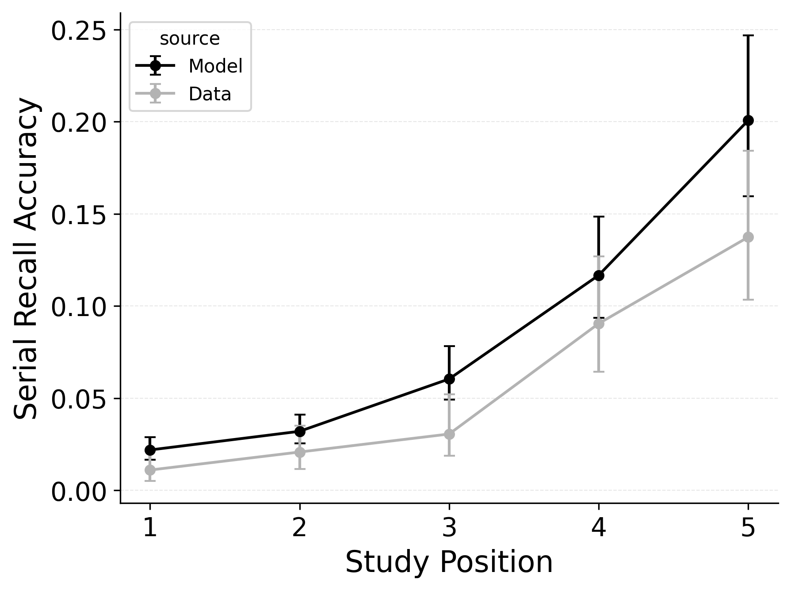
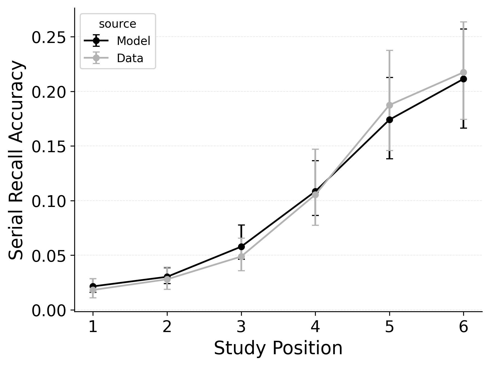
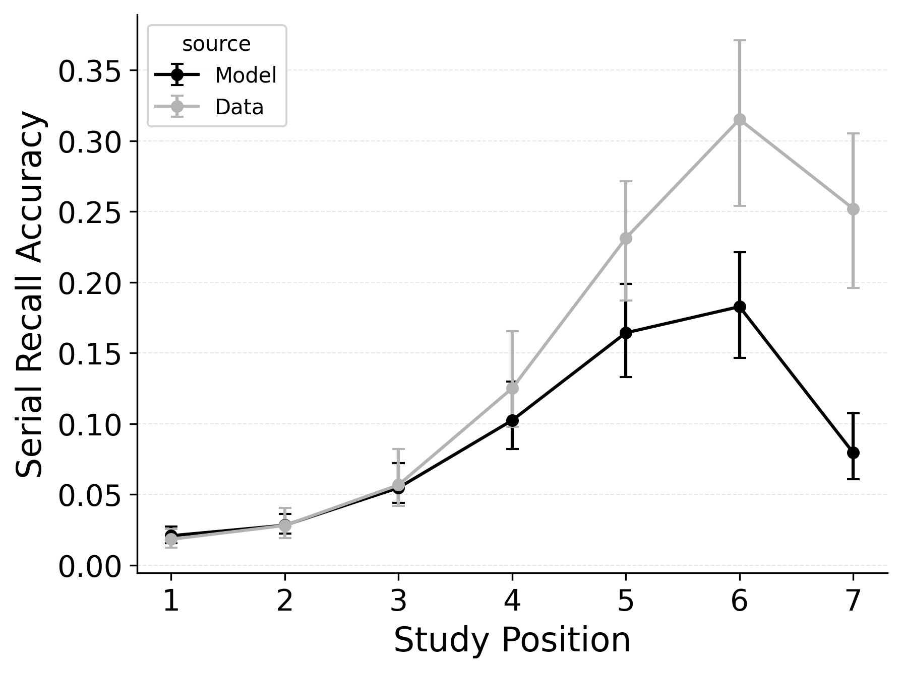
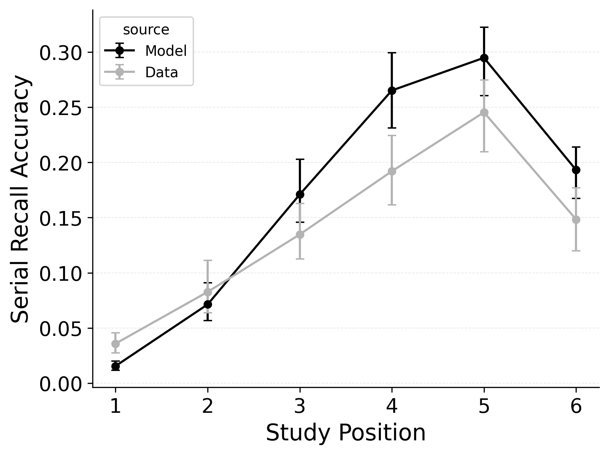
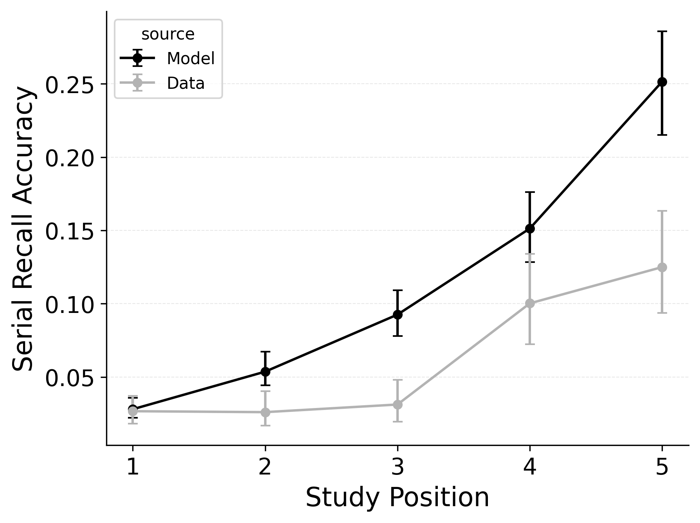
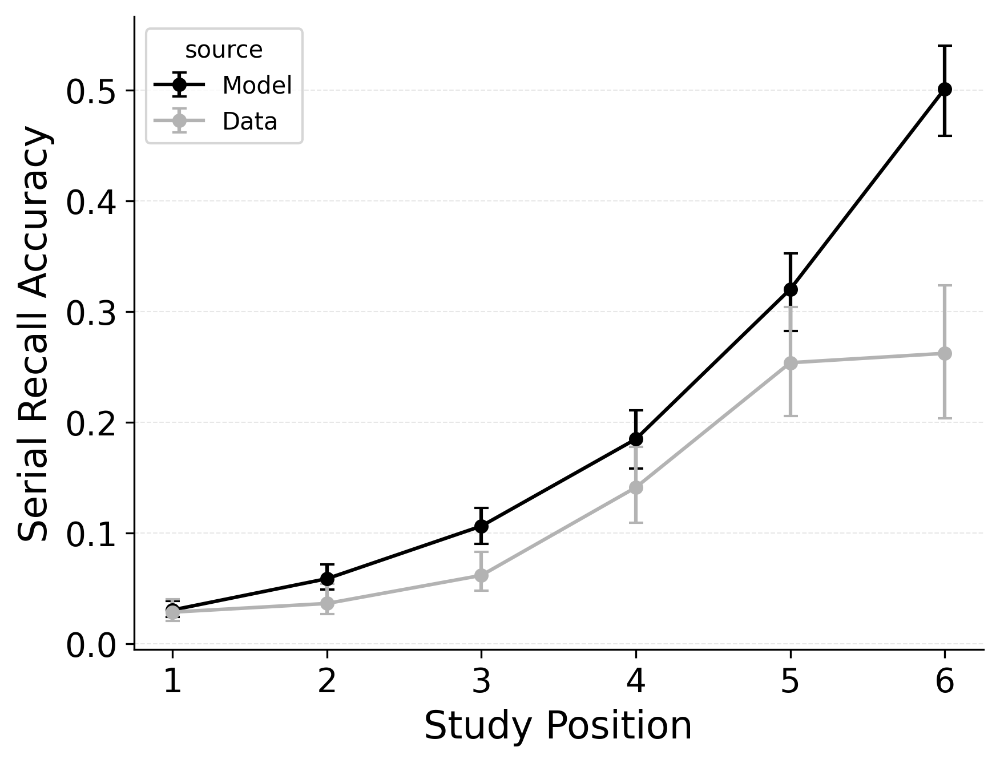
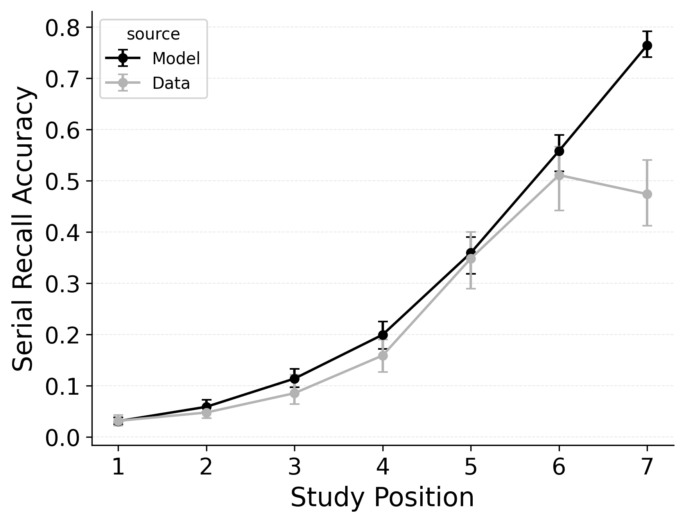

---
format:
  pdf:
    header-includes:
    - |
        \setcounter{figure}{7}
    bibliography: references.bib
    suppress-bibliography: true
    geometry: [margin=0.2in, centering, vcentering]
    pagestyle: empty
---

::: {#fig-best-serial-errors layout-ncol="3"}

Intrusion, order, and omission error rates (top, middle, and bottom rows respectively) by serial position for list lengths 5, 6, and 7 (left, center, and right columns), in @logan2021serial serial recall data.
Lines compare observed error rates with predicted error rates from best performing CRU variant with free pre-experimental context-to-feature memory ($\alpha$, $\delta$) and CMR-specific primacy gradient  ($\phi_\text{s}$, $\phi_\text{d}$) parameters.
:::

<!-- **Alt Text**.
Nine mini-plots arranged in a 3 by 3 grid. Rows represent error type during serial recall of letters. Top row – Intrusion errors: recalling a letter that was not on the study list. Middle row – Order errors: recalling a studied letter but in the wrong serial position. Bottom row – Omission errors: failing to supply any letter for a position. Columns represent list length: 5-item lists (left), 6-item lists (centre), 7-item lists (right). Within each panel, grey points/lines plot observed error rates by study position; black points/lines plot predicted rates from the best-fitting CRU + CMR hybrid model (which adds pre-experimental context-to-item associations and a primacy gradient). Error bars show ±1 SE. The model tracks the upward error trend across later positions and captures the different magnitudes for intrusion, order and omission errors across list lengths. -->
