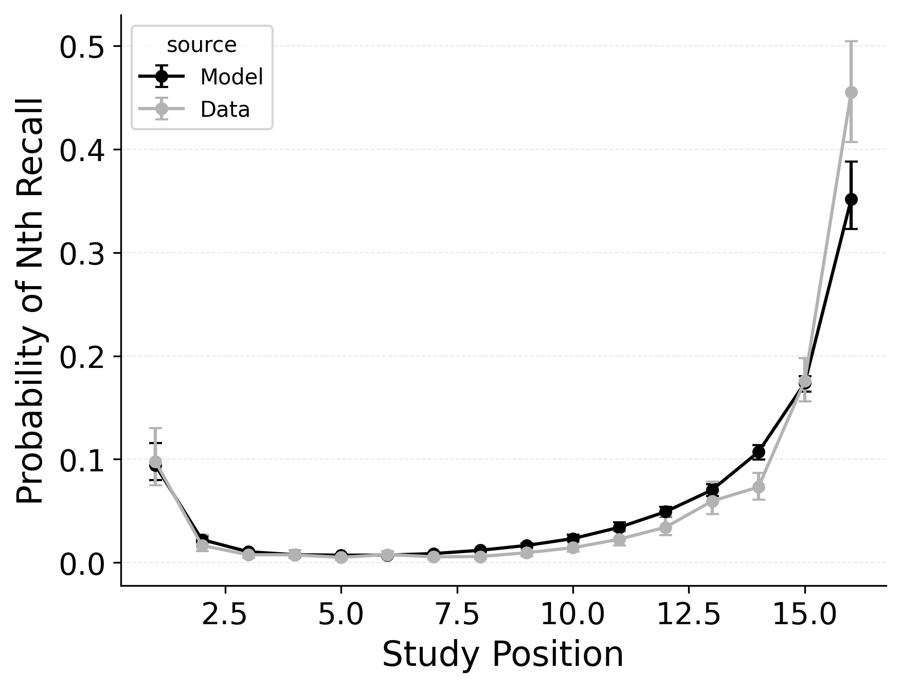
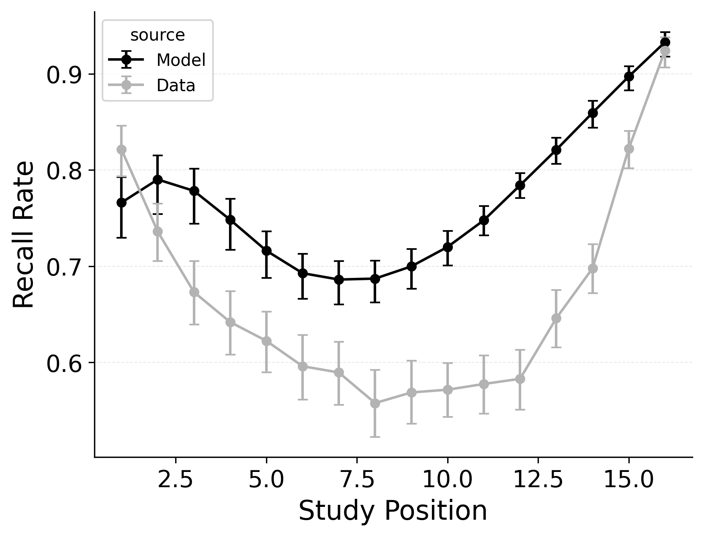

---
format:
  pdf:
    header-includes:
    - |
        \setcounter{figure}{5}
    bibliography: references.bib
    suppress-bibliography: true
    geometry: [landscape, margin=0.1in]   # page setup
    pagestyle: empty                      # no headers/footers
    include-before-body:
      text: |
        \vspace*{\fill}                   % elastic space at top
    include-after-body:
      text: |
        \vspace*{\fill}                   % elastic space at bottom
---

::: {#fig-freetermination layout-ncol="3"}

Summary statistic fits of CMR with CRU's context-based recall termination mechanism to @healey2014memory.
**Left**: probability of starting recall by serial position.
**Middle**: conditional response probability as a function of lag.
**Right**: recall probability by serial position.
:::

<!-- **Alt Text**.
Three side-by-side line plots compare a CMR model that uses CRU's context-based stopping rule (black) with empirical free-recall data from @healey2014memory (gray). Left panel: probability that each study position is produced as the N-th recall; both model and data rise steeply at the end of the list, though the model sits slightly higher at the final positions. Middle panel: lag-conditional response probability, showing a forward-skewed peak at +1; the model captures the overall shape but undershoots the sharpness of the +1 jump. Right panel: overall recall rate by study position; both traces form a shallow "U", but the model overestimates mid-list recall and underestimates the depth of the primacy dip. -->
