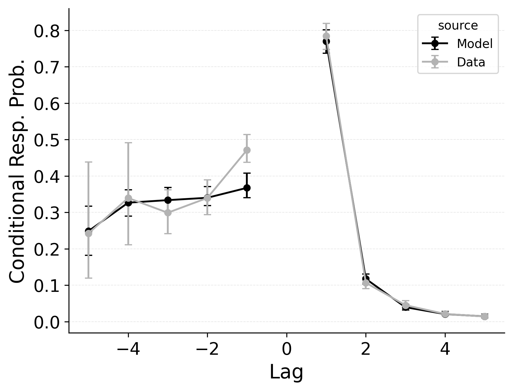

---
format:
  pdf:
    header-includes:
    - |
        \setcounter{figure}{8}
    bibliography: references.bib
    suppress-bibliography: true
    geometry: [margin=0.2in, centering, vcentering]
    pagestyle: empty
---

::: {#fig-serial-crp layout-ncol="3"}

Lag-conditional response probability (lag-CRP) fits of baseline CRU (**Top**); best performing CRU variant with free pre-experimental context-to-feature memory ($\alpha$, $\delta$) and CMR-specific primacy gradient  ($\phi_\text{s}$, $\phi_\text{d}$) parameters (**Middle**); and CMR with its default position-based recall termination mechanism and CRU's item identification confusability mechanism (**Bottom**) to @logan2021serial serial recall data.
Lines compare observed lag-CRP with predicted lag-CRP for the applicable model variant.
:::

<!-- **Alt Text**.
Lag-conditional response probability (lag-CRP) curves for serial-recall lists of length 5, 6, and 7 (columns). Within each column, three rows show: (1) baseline CRU; (2) the hybrid CRU that adds primacy and pre-experimental support; (3) CMR with position-based stopping. Observed data (grey lines ± SE) and model predictions (black lines) are plotted for lags −4 to +5. All variants fit the dominant +1 forward transition, but only the hybrid CRU (row 2) closely tracks the small yet reliable −1 "fill-in" backward transition, while baseline CRU underestimates and CMR overestimates backward-lag probabilities beyond −1. -->
