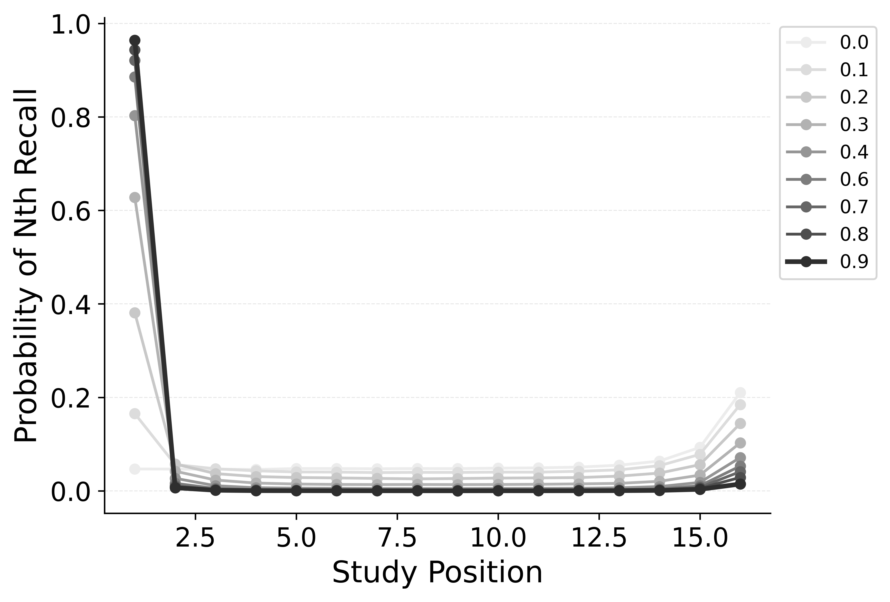

---
format:
  pdf:
    header-includes:
    - |
        \setcounter{figure}{2}
    bibliography: references.bib
    suppress-bibliography: true
    geometry: [landscape, margin=0.2in]   # page setup
    pagestyle: empty                      # no headers/footers
    include-before-body:
      text: |
        \vspace*{\fill}                   % elastic space at top
    include-after-body:
      text: |
        \vspace*{\fill}                   % elastic space at bottom
---

::: {#fig-shiftstart layout-nrow="1"}

Simulation of the impact of shifting the start context integration rate parameter $\beta_\text{start}$ on the probability of starting recall by serial position (**Left**) and the recall probability by serial position (**Right**) for CMR.
Using parameters fit to PEERS free recall data, $\beta_\text{start}$ is shifted from 0 to 1 in increments of 0.1, with the color of the lines indicating the value of the parameter.
:::

<!-- **Alt Text**.
Two side-by-side line charts (using a shared color legend with values 0.0 -- 0.9) illustrate how gradually increasing the start-of-list context-integration parameter $\beta_\text{start}$ reshapes simulated recall behavior in CMR. Left panel -- "Probability of N-th Recall": For 16 study  positions on the x-axis, each colored line shows the chance that the first item recalled (i.e., recall initiation) comes from that position. Lower $\beta_\text{start}$ values (light gray) yield a steep recency peak at the final position, whereas higher values (dark gray/black) progressively shift initiation toward the first item, producing a strong primacy peak. Right panel -- "Recall Rate": The same color-coded lines plot overall recall probability for every serial position. As $\beta_\text{start}$ increases, the recency advantage at the end of the list diminishes while recall of early positions improves, creating the classic U-shaped primacy--recency curve. Together the panels show that $\beta_\text{start}$ governs how strongly the end-of-list context is blended back toward the start: small values favor recency-driven cueing, large values favor primacy-driven cueing, and intermediate values balance the two. -->